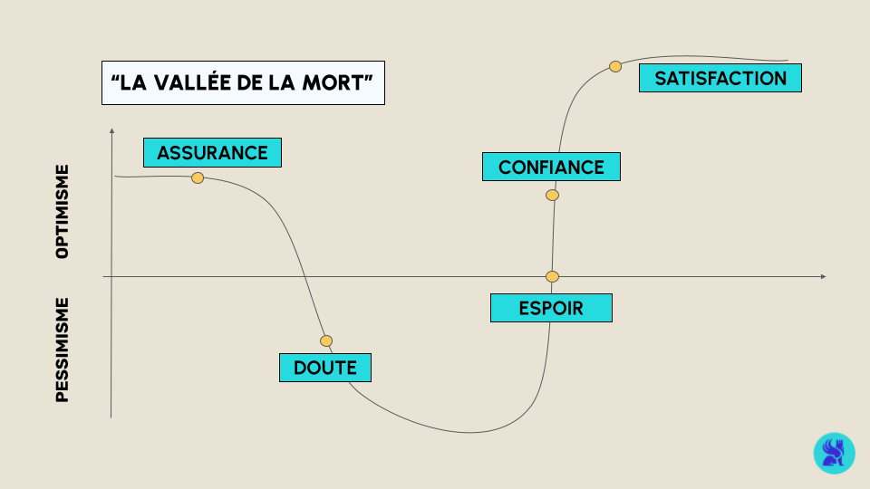
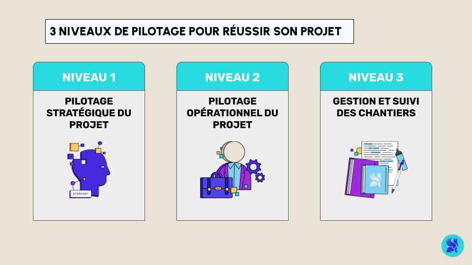
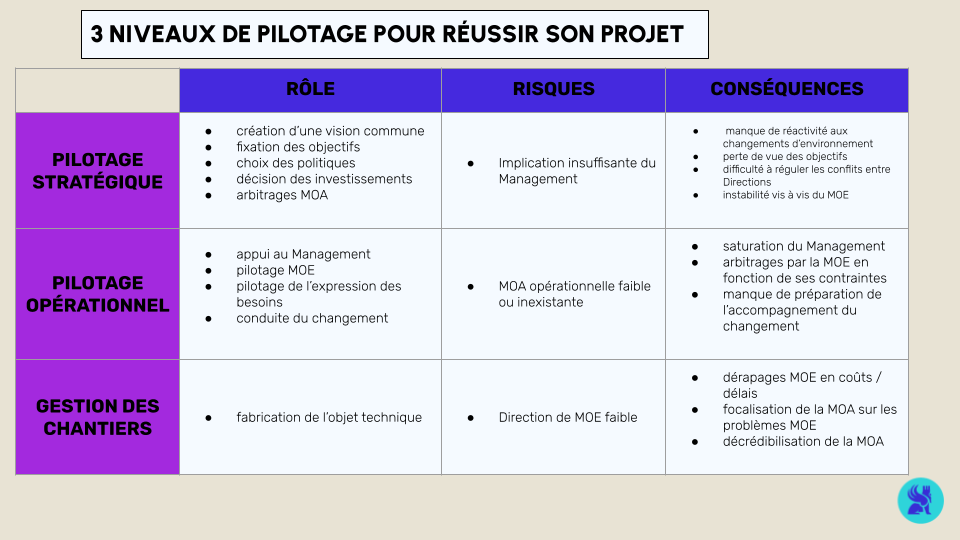
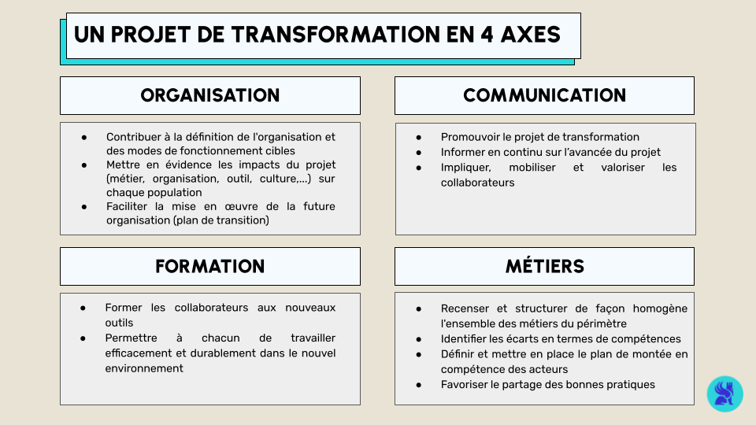
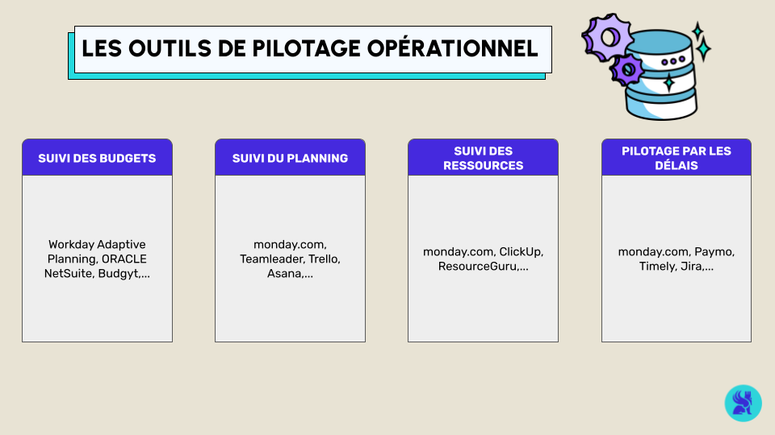

## GESTION DE PROJET DATA 
# La Conduite du Changement 
Dans les précédents notebooks, nous avons exploré les méthodologies de gestion de projet (Waterfall, Agile, DevOps, Hybride) et le rôle fondamental du chef de projet, articulé autour de l’organisation, de la gestion humaine, des ressources, et de l’expertise technique.

Mais un projet ne se limite pas à des plans bien exécutés : il implique aussi de transformer durablement les pratiques et les mentalités au sein des organisations.

Ce dernier chapitre est dédié à la conduite du changement, un processus essentiel pour garantir que les transformations apportées par un projet s’intègrent durablement dans l’entreprise. Nous verrons :

Le cycle émotionnel du changement, un outil pour comprendre les réactions face aux transformations.
Les trois niveaux de pilotage, pour structurer efficacement une transformation.
Les outils de pilotage opérationnel, qui soutiennent le chef de projet au quotidien.
L’importance du RGPD, afin de garantir une conformité légale dès les premières étapes.
Nous n’illustrerons pas nécessairement ces concepts par notre exemple, mais resterons plutôt dans une approche théorique pour permettre une meilleure compréhension générale.

# Le cycle émotionnel du changement 
Lorsqu’une organisation entreprend un projet de transformation, ses collaborateurs traversent souvent des phases émotionnelles qui peuvent influencer directement le succès ou l’échec de cette initiative. Comprendre et anticiper ces réactions permet de mieux accompagner les parties prenantes et d’assurer une transition en douceur.

Le cycle émotionnel du changement, décrit par Don Kelley et Daryl Conner, identifie cinq phases majeures que traversent les individus lorsqu’ils sont confrontés à un changement :

1. ASSURANCE: Optimisme non fondé

Enthousiasme initial face à des idées séduisantes sur le papier. Cependant, cet optimisme repose sur une vision idéalisée, sans intégrer pleinement les obstacles potentiels.

2. DOUTE: Pessimisme fondé

L’apparition de problèmes rend les solutions moins évidentes. Le moral baisse, des résistances émergent, et les parties prenantes remettent en question la réussite du projet.

3. ESPOIR: Réalisme positif

Après des ajustements, un sentiment de progrès réaliste apparaît. Bien que des défis subsistent, les équipes entrevoient des solutions concrètes, renforçant leur engagement.

4. CONFIANCE: Optimisme fondé

Les solutions mises en œuvre produisent des résultats mesurables. Les équipes gagnent en assurance, et le changement semble maîtrisé.

5. SATISFACTION: Atteinte des objectifs

Les objectifs initiaux sont atteints ou dépassés. Les résultats sont intégrés dans la culture organisationnelle, et le changement devient une nouvelle norme.

# Le pilotage d’un projet: les 3 niveaux de pilotage 
Un projet de transformation repose sur des éléments clés tels que le planning, les étapes, le budget, la gouvernance et le périmètre. Ces aspects doivent être coordonnés par les équipes à trois niveaux interdépendants : stratégique, opérationnel et terrain.

Pilotage Stratégique

Définit la vision et les objectifs à long terme.
Garantit la mise en œuvre de la stratégie globale à travers des actions spécifiques.
Exemple : Une entreprise décide de construire une usine, un investissement à long terme difficilement réversible mais crucial pour sa croissance.

Pilotage Opérationnel

Supervise la gestion courante des activités, en veillant à la performance et à l’atteinte des objectifs à court terme.
Exemple : Un manager organise les tâches et s’assure des approvisionnements, influençant directement le fonctionnement quotidien.

Pilotage Terrain

Traduit les décisions stratégiques et opérationnelles en actions concrètes sur le terrain.
Exemple : Les équipes sur site mettent en œuvre les processus décidés, comme l’exécution d’un chantier ou la mise en application d’un logiciel.

Ces trois niveaux sont essentiels et interdépendants : un bon pilotage stratégique ne suffit pas sans un pilotage opérationnel rigoureux et un suivi au niveau terrain pour garantir la réussite du projet. Le tableau ci-dessous montre quels seraient les risques et les conséquences de ne se restreindre qu’à un type de management:

# Un projet de transformation en 4 axes 

Tout projet de transformation repose sur quatre axes clés qui garantissent que la transformation se déroule de manière fluide et cohérente à tous les niveaux de l'organisation:

En essence, conduire un projet de transformation, c’est :

Faire travailler autrement …

En mettant en œuvre la stratégie du début à la fin.
En identifiant et partageant les meilleures pratiques.
En pérennisant les savoir-faire.
… les collaborateurs …

En les impliquant pour qu’ils deviennent acteurs du changement.
En développant leurs compétences par la formation.
En accompagnant les collaborateurs dans le changement.
… autour de règles communes …

En garantissant la cohérence des processus.
En assurant la fiabilité des pratiques.
… avec de nouveaux outils

En alignant les systèmes d’information à la stratégie.
En intégrant et optimisant les nouvelles technologies.

# Les outils de pilotage opérationnel 
Le chef de projet, quel que soit son niveau hiérarchique, n’a pas besoin d’une multitude d’outils techniques pour réussir, mais plutôt d’outils simples et efficaces. Principalement, il s’appuie sur des logiciels pour faciliter son organisation quotidienne, surveiller les budgets, gérer les plannings, suivre les ressources et fixer des délais.

# Piloter son projet en adéquation avec le RGPD 
Le RGPD établit un cadre unique de règles pour protéger les données personnelles des entreprises opérant au sein de l'Union européenne, garantissant une harmonisation entre les États membres. Chaque projet doit intégrer les principes du RGPD dès sa conception, plutôt que d’y répondre de manière réactive en aval.

# Conclusion 
À travers ce module, nous avons exploré les principaux concepts de la gestion de projet :

Les modèles de gestion adaptés aux projets complexes.
Le rôle stratégique et polyvalent du chef de projet.
Les enjeux liés à la conduite du changement.
Dans un monde où les transformations numériques sont omniprésentes, maîtriser ces aspects est essentiel pour garantir le succès et la pérennité des projets.