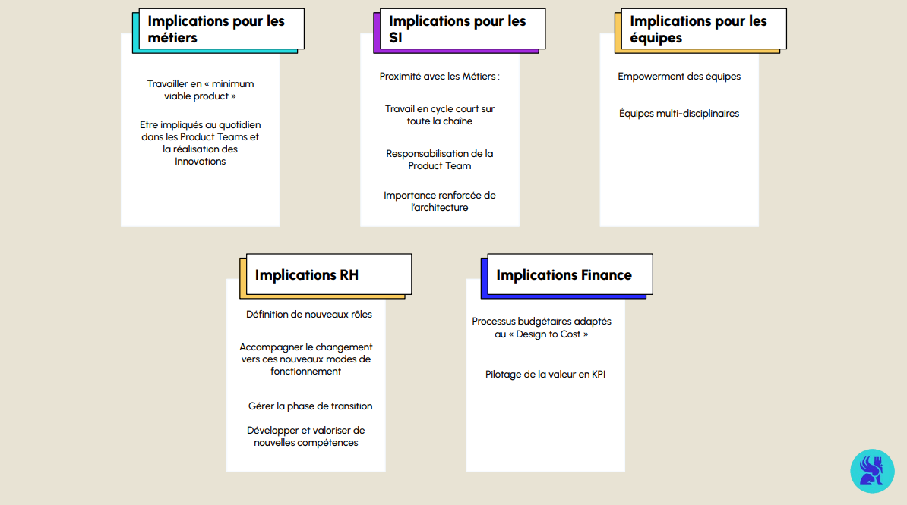

## AGILITÉ

# du point de vue Organisationnel et Humain

Dans les modules précédents, nous avons exploré les aspects méthodologiques de l’agilité : outils, pratiques comme DevOps et DataOps, et concepts clés tels que le MVP et la Product Team. Cependant, ces approches ne peuvent pleinement porter leurs fruits sans une transformation organisationnelle et humaine.

L’adoption des principes agiles dépasse les processus techniques. Elle exige un changement d’état d’esprit à tous les niveaux de l’entreprise, avec une reconfiguration des rôles, des responsabilités et des modes de collaboration. Cette transition impacte l’ensemble des équipes et services, notamment les ressources humaines, les finances et la gestion des produits.

Pour structurer cette transformation, nous examinerons trois piliers fondamentaux : Purpose (But), Alignment (Alignement) et Contexte.

# L'impact sur les équipes et les métiers

L’agilité transforme en profondeur les modes de travail. Chaque service – technique, métier ou transverse – voit ses rôles évoluer pour favoriser une collaboration autour d’objectifs partagés. Le schéma ci-dessous illustre les principaux impacts de la transition agile sur les différentes équipes et fonctions de l’entreprise:

Les impacts peuvent varier selon les équipes :

Équipes techniques : Mise en place de pratiques telles que l’intégration continue et le déploiement rapide (CI/CD).
Exemple : Les développeurs automatisent les tests pour garantir que chaque nouvelle version puisse être déployée sans interruption.

Équipes métiers : Participation active aux décisions, définition des priorités et validation des fonctionnalités.
Exemple : Les équipes logistiques demandent des alertes pour les stocks critiques et valident ensuite les solutions développées.

Fonctions support (RH, Finances) : Accompagnement de la montée en compétences et gestion du changement organisationnel.
Exemple : Le service RH propose des formations pour mieux comprendre et intégrer les principes agiles.

# Les Trois Piliers de l’Agilité Organisationnelle

Pour réussir la transition agile, il est essentiel de s'appuyer sur trois piliers structurants qui guident les équipes : Purpose, Alignment et Contexte.

Purpose (But)
Les équipes doivent poursuivre un objectif commun qui donne du sens à leur travail. Cet objectif permet de maintenir l'inspiration, la motivation et la mesure des progrès au fil des cycles.

Dans notre exemple, l’équipe s’accorde sur l’objectif d’améliorer la gestion des stocks critiques, avec comme indicateur clé la réduction des ruptures de stock.

Alignment (Alignement)
L’alignement repose sur la confiance, l’engagement et des valeurs communes. Il garantit que les équipes avancent dans la même direction, ce qui favorise une collaboration efficace.

Dans notre exemple, les équipes techniques et logistiques définissent et suivent les mêmes indicateurs de performance, assurant ainsi une coordination fluide.

Contexte
Une compréhension approfondie du contexte organisationnel est indispensable pour travailler efficacement. Chaque équipe doit cerner son rôle, ses interactions avec les autres et les risques liés au projet.

Dans notre exemple, les développeurs comprennent les enjeux métiers des équipes logistiques, ce qui leur permet d’adapter les algorithmes en conséquence.

Les étapes d’une transition vers l’agilité
Évaluation initiale : Analyse de l’état actuel de l’entreprise pour identifier les besoins et opportunités.
Sensibilisation : Informer et former les équipes sur les concepts de l’agilité et leurs implications.
Mise en place pilote : Lancer un projet agile à petite échelle pour tester et ajuster les pratiques.
Élargissement : Étendre les pratiques agiles à d'autres équipes et services de l’entreprise.
Amélioration continue : Collecter régulièrement des retours pour optimiser les processus.
La vidéo ci-dessous présente les effets concrets de cette transformation vers l’agilité et les bonnes pratiques pour en maximiser les bénéfices :

# Conclusion

L’adoption de l’agilité entraîne une réorganisation des rôles, une meilleure collaboration et un accompagnement des équipes autour de trois piliers fondamentaux : Purpose, Alignment et Contexte. Ces changements permettent aux équipes d’être plus autonomes, créatives et capables de s’adapter en continu aux besoins des projets.

Ce module conclut notre exploration des méthodes agiles. Vous avez découvert les concepts clés – comme le MVP, la Product Team et le Scaling Agile – ainsi que les pratiques méthodologiques (DevOps, DataOps). En comprenant également l’importance de la transformation humaine et organisationnelle, vous êtes désormais mieux préparé à piloter des projets dans des environnements complexes.
