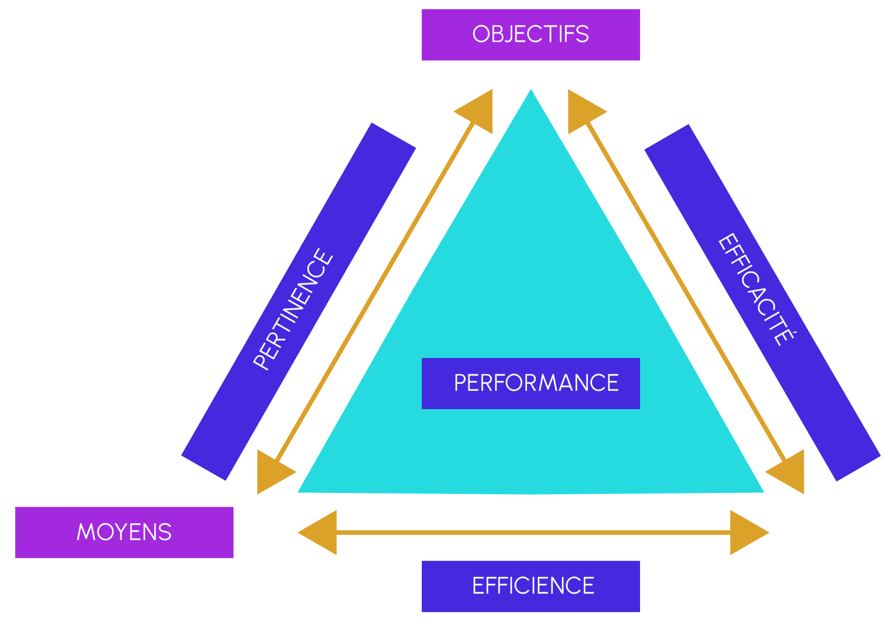
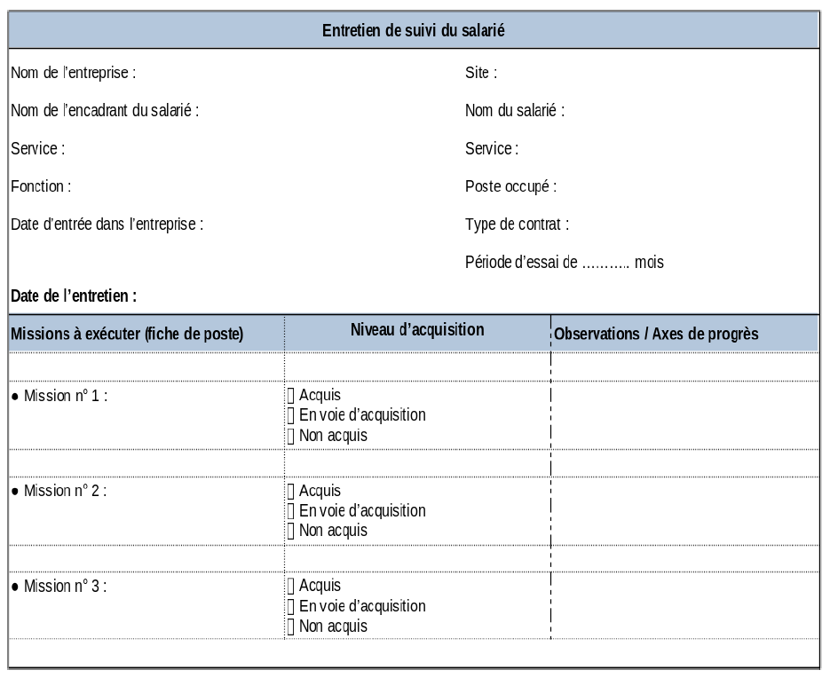
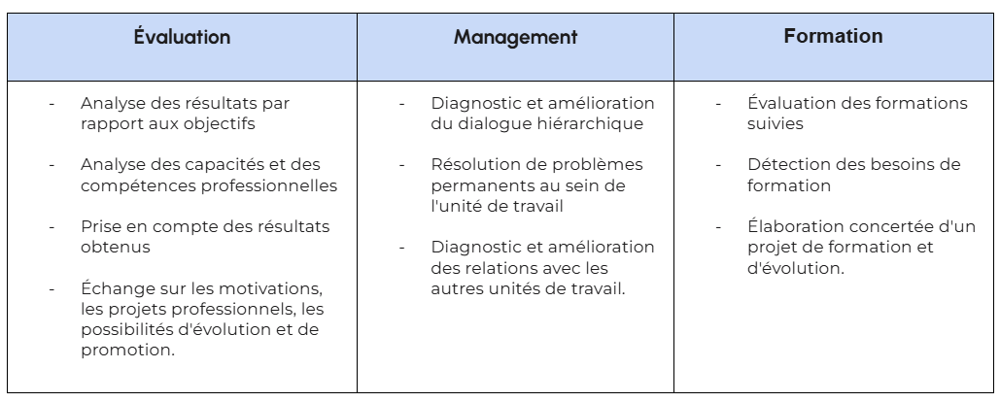

## Accompagnement et Suivi des Collaborateurs

Dans le document précédent, nous avons examiné les enjeux du recrutement dans le contexte data, en mettant en avant les bonnes pratiques et les protocoles à suivre pour attirer et sélectionner les meilleurs talents.

Dans ce document, nous allons nous concentrer sur l'accompagnement des collaborateurs après leur intégration, en détaillant les stratégies pour suivre leurs performances, favoriser leur évolution professionnelle et leur épanouissement individuel ainsi qu'en équipe.

# L'Importance du suivi de la performance

Pour suivre et faire évoluer un collaborateur, il est essentiel de mesurer sa performance. Cela nécessite de définir clairement ce qu’est la performance et de la décliner à différents niveaux : celui de l’entreprise, de l’équipe et du collaborateur lui-même. Une vision partagée permet d’aligner les objectifs individuels avec les ambitions collectives.

Étymologiquement, le terme performance renvoie à l'idée de réalisation – en ancien français, performer signifiait « exécuter ». La notion est donc intrinsèquement liée à celle de résultat. Aujourd’hui, ce concept revêt des significations variées selon le contexte.

En entreprise, la performance est souvent associée aux résultats économiques, tandis que dans le cadre d’un projet, elle se définit par le degré d’atteinte des objectifs fixés au départ.

Définition
La performance est une notion essentielle qui permet d'évaluer le rapport entre les résultats attendus et une réalité mesurable, c’est-à-dire le « niveau de réalisation des objectifs ».

Pour définir la performance, nous introduisons le concept du triangle de performance.
En 1980, Gilbert formalise la performance par un triangle dont les 3 sommets sont :

- Les objectifs à atteindre (définis par la stratégie de l'entreprise ou la description du projet)
- Les moyens mobilisés (ressources humaines, données nécessaires, infrastructures de calcul, etc.)
- Les résultats attendus (application digitale fonctionnelle, amélioration de l'expérience utilisateur, chatbot performant, etc.)

La performance résulte des interactions entre ces 3 sommets et s’évalue sur trois axes : la pertinence, l'efficience et l'efficacité.

Nous pouvons illustrer cela avec l'image suivante :

La pertinence évalue si les moyens mis à disposition sont adaptés aux objectifs du projet.

Exemple
Si l'objectif est de développer un chatbot intelligent capable de répondre précisément aux questions des utilisateurs, il est pertinent de choisir un LLM performant et de disposer d'un jeu de données adéquat pour l'entraîner. De même, il faut s'assurer de disposer des compétences en data science et en ingénierie logicielle. Par exemple, vouloir implémenter un modèle de dernière génération sans expert en NLP serait inadapté.

L'efficience mesure la relation entre l'utilisation des moyens et le résultat obtenu. Elle cherche à optimiser les ressources pour atteindre l'objectif fixé.

Exemple
Dans le développement d'un chatbot, l'efficience pourrait être évaluée par le rapport entre le coût de calcul pour entraîner le modèle et la qualité des réponses fournies. Par exemple, un modèle très complexe et coûteux pour répondre à des questions simples serait inefficace, alors qu’un modèle optimisé offrirait des performances similaires avec moins de ressources. Des réunions trop fréquentes ou non ciblées peuvent également nuire à l’efficience en augmentant le temps passé sur des tâches non productives.

L'efficacité mesure la relation entre les résultats obtenus et l'atteinte des objectifs initiaux. Une équipe peut être efficace en atteignant ses objectifs, même si elle n’est pas particulièrement efficiente dans l’usage des ressources.

Exemple
Si un data scientist travaille tard pour entraîner un modèle LLM complexe afin de respecter les délais et que le chatbot fonctionne comme prévu, l’objectif est atteint – l'efficacité est là. Si un autre membre de l'équipe atteint le même résultat en utilisant un modèle plus léger et en optimisant son code, il est à la fois efficace et efficient.

Pour être performants, un projet, une organisation ou une équipe doivent trouver le meilleur équilibre entre ces 3 dimensions : pertinence, efficience et efficacité. L'objectif est de mettre en place les moyens adaptés pour produire les résultats escomptés.

# Niveaux de Performance : Entreprise, Équipe et Individuelle

La performance peut se définir à différents niveaux et présente des caractéristiques spécifiques à chacun.

1. Performance d'une entreprise
   Dans la plupart des cas, une entreprise performante est jugée sur sa capacité à générer de la valeur, se traduisant par de bons résultats financiers et une croissance soutenue, rendue possible par la mise en œuvre de stratégies efficaces. Cependant, la performance ne se limite plus uniquement aux aspects financiers : aujourd'hui, les impacts environnementaux et sociétaux de l'entreprise sont également pris en compte.

Exemple
Dans le cadre du développement d'un chatbot utilisant un LLM, la performance de l'entreprise peut être mesurée par le nombre d'utilisateurs, les revenus générés par un meilleur service client, et également par son impact environnemental, par exemple via l'utilisation d'infrastructures cloud alimentées par des énergies renouvelables.

2. Performance d'une équipe
   Une entreprise ne peut fonctionner sans ses collaborateurs, et l'activité s'organise généralement en équipes qui œuvrent ensemble pour atteindre des objectifs stratégiques communs. Ces équipes peuvent être des divisions ou services (ventes, fidélisation, IT, etc.), des équipes de production (développeurs, data scientists, ingénieurs ML, etc.), des entités géographiques (bureaux locaux, implantations) ou des équipes interdisciplinaires pour des projets spécifiques. La performance de chaque équipe se mesure par sa capacité à réaliser les objectifs partagés par tous ses membres.

Exemple
Dans le développement d'un chatbot, l'équipe de data science peut avoir pour objectifs une précision du modèle LLM supérieure à 90%, un temps de réponse inférieur à 2 secondes, et une satisfaction client supérieure à 4 sur 5. La collaboration avec l'équipe produit est essentielle pour s'assurer que le chatbot répond aux besoins métier.

3. Performance individuelle
   La performance individuelle se base sur des objectifs définis par le manager et la capacité du collaborateur à les atteindre, en prenant en compte à la fois la réalisation des tâches et les comportements professionnels.

L’évaluation individuelle s’appuie sur les trois axes du triangle de la performance :

- Pertinence : Objectifs clairement définis et compris
- Efficience : Utilisation optimale des moyens
- Efficacité : Atteinte des résultats attendus

Exemple
Un data engineer chargé d’optimiser un pipeline de données pour un chatbot LLM pourrait avoir pour objectif de réduire le temps de traitement de 30%. S'il utilise des outils adaptés (pertinence), réduit le temps de traitement tout en limitant l’usage des ressources (efficience) et permet ainsi au data scientist de réentraîner le modèle plus rapidement (efficacité), sa performance individuelle sera jugée satisfaisante.

# Accompagnement continu et suivi du salarié

Après avoir défini la performance, nous allons détailler comment suivre et accompagner nos collaborateurs. L'intégration d'un salarié ne s'arrête pas à l'accueil initial : un accompagnement continu est indispensable pour qu'il devienne rapidement opérationnel et pleinement impliqué dans l'entreprise. Cet accompagnement repose sur la bonne compréhension par le salarié de l'ensemble des attentes liées à son poste (missions, compétences, interactions, résultats, etc.) et sur la mise en place d'un suivi régulier, d'échanges et d'évaluations, soutenus par des outils adaptés. Il s'agira ainsi de :

1. Accompagner et évaluer la prise de poste
2. Suivre le collaborateur en poste pour garantir une intégration réussie et un épanouissement durable

Clés d'une prise de poste réussie
L'intégration débute par des étapes clés, telles que les entretiens d'arrivée et de suivi, qui permettent d'établir une communication claire, d'ajuster les attentes et d'évaluer l'intégration.

- Entretien d'arrivée : Ce premier point de contact entre le collaborateur et l'entreprise permet de clarifier les attentes et de poser les bases d'une relation de travail harmonieuse. Il est crucial pour que le salarié comprenne pleinement son rôle et ses responsabilités.
- Entretien de suivi : Réalisé après quelques semaines ou mois, il permet de faire le point sur l'intégration du collaborateur, son bien-être et ses premiers retours sur son poste. Cet entretien offre l'opportunité de réajuster les missions si nécessaire et de renforcer le lien avec l'équipe.
  La grille proposée ci-dessous peut servir d'outil pour structurer ces entretiens.

# Suivi régulier pour une intégration durable

Le suivi du collaborateur ne s'arrête pas à son intégration initiale, mais se poursuit à travers des entretiens réguliers pour évaluer son développement et ses besoins.

- Entretien d'évaluation : Ce moment clé permet de discuter des performances et des réussites du collaborateur, tout en identifiant les axes d'amélioration. Pour structurer cet entretien, nous proposons une grille qui aborde les différents aspects essentiels de l'évaluation :

Les dimensions à aborder avec le collaborateur sont les suivantes :

- Évaluation : Analyser en profondeur les résultats obtenus par rapport aux objectifs fixés, tout en évaluant les capacités et compétences professionnelles du collaborateur.
- Management : Examiner le dialogue hiérarchique, identifier les problèmes récurrents au sein de l’équipe et proposer des améliorations pour renforcer la communication et la gestion.
- Formation : Évaluer les formations déjà suivies, détecter les besoins en formation et élaborer, en collaboration avec le salarié, un plan de développement professionnel et d'évolution de carrière.

ℹ️ Précision
Bien que la tenue d'un entretien d'évaluation ne soit pas légalement imposée, une étude de 2015 (Dares) montre que les salariés qui n’en bénéficient pas sont plus exposés aux risques psychosociaux.

- Entretien professionnel : Obligatoire tous les deux ans pour les salariés ayant au moins deux ans d'ancienneté. Il vise à accompagner le salarié dans ses perspectives d'évolution (changement de poste, promotion, etc.) et à identifier ses besoins de formation. Tous les six ans, un état des lieux récapitulatif doit être réalisé pour formaliser le parcours professionnel du salarié.

# Conclusion

En conclusion, l'accompagnement des collaborateurs après leur intégration est essentiel pour garantir leur réussite et leur épanouissement.
Grâce à des stratégies de suivi de la performance claires et adaptées, il est possible de mesurer les résultats obtenus et de créer un environnement propice à l'évolution professionnelle.
Le triangle de la performance (pertinence, efficience et efficacité) offre un cadre structuré pour évaluer et ajuster les actions à différents niveaux (entreprise, équipe, individu).
En adoptant une approche proactive d'accompagnement et d'évaluation régulière, l'entreprise renforce son capital humain et maximise ses chances d'atteindre ses objectifs à long terme tout en assurant un développement continu et satisfaisant pour ses collaborateurs.
