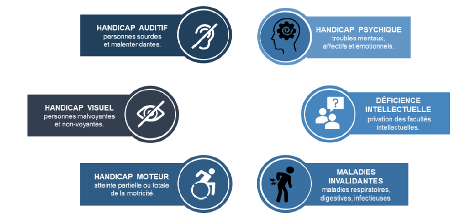
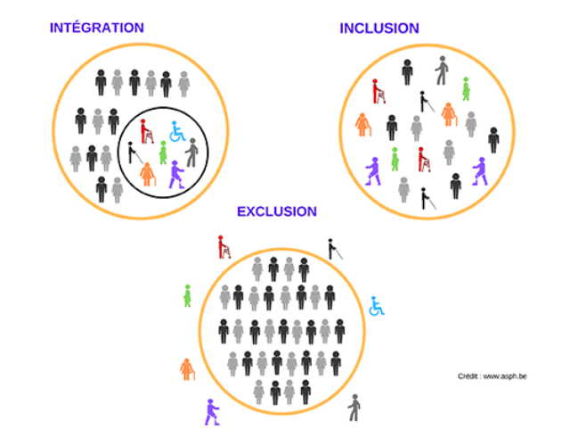

### Adaptation du cadre de travail aux besoins d'un salarié en situation de handicap

Dans les documents précédents, nous avons exploré comment recruter et accompagner un collaborateur de manière efficace et bienveillante. Dans ce document, nous nous concentrons sur l'adaptation du cadre de travail afin de répondre aux besoins spécifiques des salariés en situation de handicap. Nous verrons pourquoi leur intégration est essentielle pour favoriser la diversité, dynamiser les équipes et créer un environnement professionnel inclusif qui profite à tous.

## Les enjeux de l'insertion des salariés en situation de sandicap

Intégrer des salariés en situation de handicap dans le milieu professionnel est crucial pour promouvoir l'égalité des chances et renforcer la diversité au sein des équipes. Cette démarche valorise les compétences de chacun, favorise un environnement de travail inclusif et bienveillant, et enrichit les perspectives collectives en apportant des approches variées et innovantes.

# Définir le handicap

Pour aborder ce sujet, nous commencerons par définir ce qu’est le handicap en nous appuyant sur deux définitions complémentaires :

1. Selon l'Organisation Mondiale de la Santé (OMS) : « est handicapée toute personne dont l'intégrité physique ou mentale est temporairement ou définitivement diminuée, que ce soit de manière congénitale, liée à l'âge ou à la suite d'un accident, au point que son autonomie, son aptitude à suivre une scolarité ou à occuper un emploi, soit compromise ».

2. Selon la loi française du 11 février 2005 sur l'égalité des droits et des chances, la participation et la citoyenneté des personnes handicapées : « constitue un handicap, au sens de la présente loi, toute limitation d'activité ou restriction de participation à la vie en société subie dans son environnement par une personne en raison d'une altération substantielle, durable ou définitive d'une ou plusieurs fonctions (physique, sensorielle, mentale, cognitive ou psychique), d'un polyhandicap ou d'un trouble de santé invalidant ».

En tant que Data Product Managers, il est essentiel de savoir identifier ces situations afin de créer un environnement de travail inclusif qui permette à chacun de s'épanouir et de contribuer pleinement aux projets.

Il existe 6 catégories de handicap, regroupant de nombreuses sous-catégories nécessitant des aménagements spécifiques. L'infographie ci-dessous présente les principales formes de handicap :

Les situations de handicap sont diverses et concernent une part importante de la population. En France, 1 personne sur 10 est en situation de handicap, soit environ 9,5 millions de personnes âgées de 15 à 64 ans (source : INSEE). Parmi elles :

- Plus de 4 millions présentent un handicap auditif, dont 300 000 malentendants profonds à sourdes.
- 1,7 million ont un handicap visuel, dont plus de 300 000 sont malvoyantes profondes à aveugles.
- Environ 850 000 souffrent d’un handicap moteur (soit 1,5 % de la population adulte), avec 45 % utilisant un fauteuil roulant et 50 % nécessitant de l’aide pour les actes essentiels de la vie quotidienne.
- 650 000 vivent en situation de handicap mental (source : Unapei).
  Par ailleurs, le nombre de travailleurs handicapés augmente avec l'âge et varie selon les régions et les secteurs d'activité, certaines professions étant plus exposées aux accidents de travail nécessitant un accompagnement spécifique.

# Cadre légal et dispositifs d'insertion

L'insertion professionnelle des personnes en situation de handicap est encadrée par plusieurs lois majeures :

- La loi d'orientation du 30 juin 1975 a permis la création des Commissions techniques d'orientation et de reclassement professionnel (Cotorep), aujourd'hui intégrées aux Maisons Départementales des Personnes Handicapées (MDPH). Cette loi soutient l'accompagnement des personnes handicapées vers des structures d'aide à l'insertion professionnelle, regroupées sous des labels tels que Cap Emploi, en collaboration avec divers organismes spécialisés.

- La loi n° 87-517 du 10 juillet 1987 en faveur de l'emploi des personnes handicapées instaure l'Obligation d'Emploi des Travailleurs Handicapés (OETH), imposant aux entreprises un quota de 6 % de salariés handicapés. Elle définit également les catégories de personnes pouvant bénéficier du statut (par exemple, ceux disposant d'une Reconnaissance de la Qualité de Travailleur Handicapé ou d'un handicap à vie).

- La loi n° 2005-102 du 11 février 2005 pour l'égalité des droits, des chances, la participation et la citoyenneté des personnes handicapées renforce l'accessibilité en fixant des délais précis pour sa mise en œuvre, tout en accentuant l'obligation d'emploi et en luttant contre la discrimination à l'accès à l'emploi.

Ces lois visent à favoriser l'inclusion des personnes en situation de handicap dans le monde professionnel et à garantir que leur intégration se fasse dans le respect de l'égalité des chances.

Définition d'Inclusion
L'inclusion désigne un processus par lequel tous les individus, quels que soient leur handicap, leur origine ou leurs différences, sont activement intégrés dans l'ensemble de la société ou dans leur environnement professionnel. Cela implique d'adapter les structures et les pratiques pour garantir une participation équitable, valoriser la diversité et offrir à chacun les mêmes opportunités de contribution.

Définition d'Intégration
L'intégration consiste à insérer une personne, souvent issue d'un groupe marginalisé ou en situation de handicap, dans un environnement ou un système déjà existant. Contrairement à l'inclusion, l'intégration ne nécessite pas toujours une adaptation complète de l'environnement ; il s'agit plutôt de permettre à la personne de participer en l'acceptant dans l'état actuel des choses, sans modifier systématiquement les pratiques ou structures en place.

# Sanctions et Conséquences du non-respect des obligations d'insertion

Pour favoriser l'inclusion des personnes en situation de handicap, l'État a instauré des exigences et des sanctions. Chaque année, les entreprises, qu'elles soient privées ou publiques – y compris celles de moins de 20 salariés – doivent déclarer le nombre d'emplois occupés par des personnes handicapées. Cette déclaration doit préciser le nombre de personnes employées ainsi que le pourcentage en Équivalent Temps Plein (ETP), et inclut également les stagiaires, étudiants de l'enseignement supérieur et les emplois en intérim ou en CDD.

Exemple 1
Pour une entreprise de 38 salariés, le quota de 6 % correspond à 38 x 6 % = 2,28, arrondi à 2 travailleurs handicapés. De nombreuses entreprises, soit par méconnaissance, soit par choix, ne remplissent pas ces obligations et se voient ainsi obligées de verser une contribution annuelle à l'Agefiph (pour le secteur privé) ou à la FIPHFP (pour le secteur public), calculée en fonction de la taille de l'entreprise et du nombre de bénéficiaires qu'elle aurait pu employer.

Exemple 2
La sanction financière est calculée de la manière suivante : - 400 fois le Smic horaire pour les entreprises de 20 à 199 salariés, - 500 fois pour celles de 200 à 749 salariés, - 600 fois pour les entreprises de 750 salariés et plus. Si, après 3 ans, l'employeur ne se conforme pas en recrutant directement des personnes répondant aux obligations d'emploi ou en faisant appel à une entreprise adaptée ou un ESAT, il devra verser une contribution majorée de 15 225 €, quel que soit l'effectif.

## Adaptation et Formation : clés d'une intégration réussie

Pour conclure, nous présentons les leviers d’action essentiels pour intégrer des salariés en situation de handicap. Ces leviers garantissent une inclusion réussie et se déclinent en plusieurs étapes :

A. Appréhender l'environnement de travail : Définir un environnement accessible et adapté aux besoins des personnes handicapées. Cela inclut l’aménagement des espaces de travail (bureaux adaptés, mobilier ergonomique, etc.). Par exemple, une responsable RH dans une entreprise de data pourrait prévoir l'installation de logiciels de lecture d'écran pour un collaborateur malvoyant.

B. Intégrer le handicap dans le processus de recrutement : Le recrutement doit être inclusif, avec une évaluation des compétences dénuée de discrimination. Dans une entreprise de data, la RH pourrait adapter les tests techniques en permettant, par exemple, l'utilisation d'outils d'assistance pour un candidat présentant des troubles cognitifs.

C. Sensibiliser et informer les équipes : La sensibilisation est primordiale pour instaurer un environnement inclusif. Une RH peut organiser des ateliers sur la diversité afin d'expliquer les enjeux de l'intégration des personnes en situation de handicap et de combattre les préjugés, favorisant ainsi l'empathie au sein des équipes techniques.

D. Intégrer et aménager le poste de travail : Personnaliser les postes de travail pour qu'ils soient accessibles et fonctionnels pour chaque salarié en situation de handicap. Par exemple, dans une entreprise de data, cela peut consister à ajuster les horaires de travail ou à fournir des outils spécifiques pour une personne ayant des troubles musculo-squelettiques, tels qu’un siège ergonomique ou un clavier adapté.

E. Accompagnement : Mettre en place un suivi personnalisé et durable est indispensable. Une RH peut instaurer un programme de mentorat où un collègue expérimenté guide la personne handicapée dans son quotidien professionnel, en offrant soutien psychologique et conseils pratiques pour la gestion des tâches spécifiques au secteur de la data.

## Conclusion

L'adaptation du poste de travail pour les salariés en situation de handicap constitue une démarche essentielle pour promouvoir l'inclusion et renforcer la diversité au sein des équipes. En intégrant ces collaborateurs, l'entreprise non seulement se conforme à ses obligations légales, mais enrichit également son environnement de travail avec des perspectives variées. Cette intégration repose sur des actions concrètes, telles que l'aménagement des espaces, l'adaptation des processus de recrutement et de formation. En offrant un cadre inclusif et bienveillant, l'entreprise permet à chaque individu, quel que soit son handicap, de s'épanouir et de contribuer pleinement aux objectifs collectifs.
