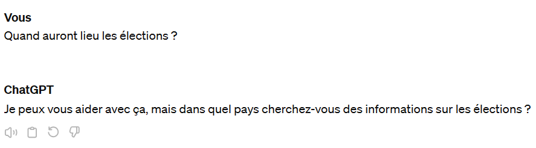
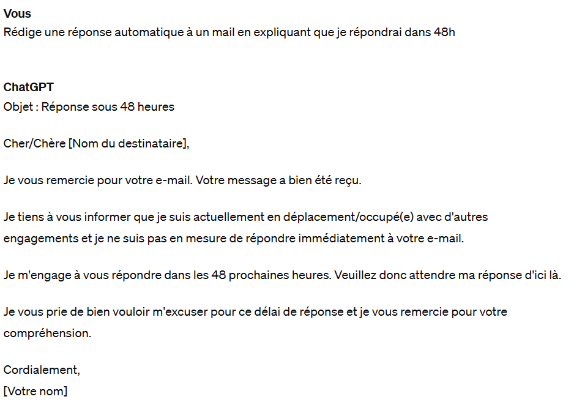
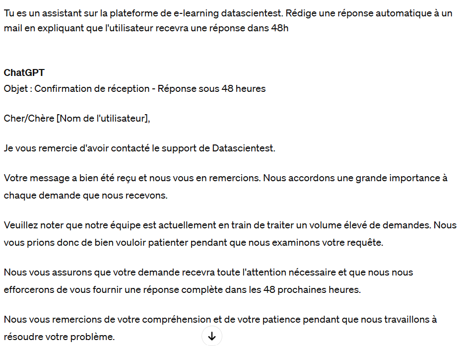
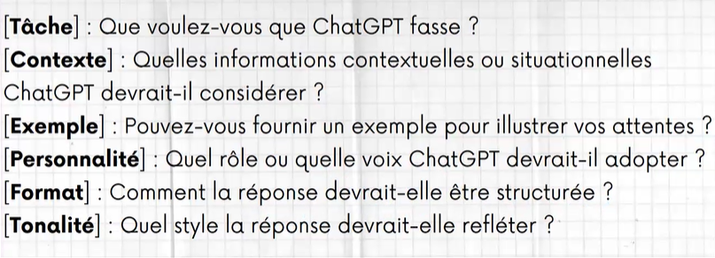

## Bonnes pratiques

# 1. Définition

Le Prompt Engineering est le processus de création, de raffinement et d'optimisation des prompts de manière méthodique. L'apport humain est essentiel dans ce processus, car les individus construisent soigneusement des prompts pour guider les modèles d'IA dans la production de résultats souhaités. L'objectif du Prompt Engineering est d'améliorer les interactions entre les humains et l'IA en affinant les prompts pour atteindre le plus haut niveau de performance et de précision.

Le Prompt Engineer a un rôle crucial. Il est responsable non seulement de la création de prompts, mais également de la surveillance continue de leur efficacité au fil du temps. À mesure que la technologie de l'IA évolue, le Prompt Engineer adapte les prompts pour garantir qu'ils restent pertinents et efficaces. De plus, les ingénieurs des prompts maintiennent une bibliothèque de prompts à jour, qui sert de référentiel de prompts pour diverses tâches et scénarios.

Une bibliothèque de prompts est une collection organisée de phrases, d'instructions ou d'exemples utilisés pour guider les modèles de langage dans le traitement automatique du langage naturel. Cette bibliothèque contient généralement une variété de prompts conçus pour différentes tâches ou applications, et elle est régulièrement mise à jour pour refléter les besoins changeants des utilisateurs et les progrès de l'IA.

Il existe déjà de nombreuses bibliothèques de prompts. L’une des plus connues est PromptHero, sur laquelle vous trouverez des prompts pour ChatGPT, MidJourney ou encore StableDiffusion. Il s’agit principalement de prompts conçus pour les générateurs d’images. Les utilisateurs partagent également le nombre d’étapes, les méthodes de sampling et différentes informations sur le processus ayant permis d’obtenir le résultat partagé.

De son côté, PromptBase permet de vendre et d’acheter des prompts pour les principaux modèles IA tels que DALL-E, GPT, Stable Diffusion ou MidJourney.

Citons aussi la plateforme FlowGPT, une bibliothèque de prompts développée par OpenAI. Elle offre une variété de prompts pré-établis et optimisés pour des tâches spécifiques telles que la génération de texte, la traduction, la réponse à des questions, etc. FlowGPT est conçu pour faciliter l'entraînement et l'utilisation de modèles GPT dans divers scénarios d'application. Il est possible de tester les prompts directement sur le site web pour vérifier le résultat produit. Une large partie du catalogue est proposée gratuitement.

# 2. Bonnes Pratiques

i. Instructions claires

Les prompts doivent être accompagnés d'instructions claires et précises sur la tâche à effectuer par le modèle. Cela garantit que le modèle comprend parfaitement ce qui est attendu de lui. Prenons le prompt suivant comme exemple : Quand auront lieu les élections ? Voici la réponse fournie par ChatGPT :

La question posée manque de précisions. Alors certes nous pouvons fournir plus de détails par la suite, mais dans un contexte où les prompts sont facturés il peut-être plus judicieux de fournir un seul prompt optimal à notre LLM pour éviter de consommer trop de tokens. Voici donc un exemple de prompt plus adapté :

Ce prompt fournit des instructions claires sur la tâche à effectuer (demander la date des prochaines élections présidentielles), en spécifiant le contexte (dans quel pays).

ii. Adopter une personnalité

En choisissant une personnalité spécifique dans le prompt, vous pouvez adapter le ton et le style de la réponse générée par le modèle pour correspondre à un contexte donné. Par exemple, une personnalité formelle peut être appropriée pour des interactions professionnelles, tandis qu'une personnalité décontractée peut être plus adaptée à des conversations informelles. Prenons l'exemple suivant : nous souhaitons rédiger une réponse automatique à un mail réceptionné. Voici un exemple de Prompt :

ChatGPT, sans détails supplémentaires, va inventer une raison à notre délai de réponse qui peut sembler déplacée selon le contexte, ce pourquoi il faut lui donner une personnalité. Voici un exemple :

iii. Spécifier le format

Les prompts doivent spécifier le format attendu de la réponse générée par le modèle. Par exemple, s'agit-il d'un texte brut, d'une liste, d'un résumé, d'un poème ? Quelle doit être la limite de mot de la réponse générée par le modèle ? Spécifier le format de la réponse dans un prompt permet de clarifier les attentes, d'adapter la sortie du modèle aux besoins de l'utilisateur.

iv. Fournir des exemples concrets

Inclure des exemples concrets dans les prompts peut aider le modèle à mieux comprendre la tâche et à générer des résultats plus précis. Les exemples fournissent des indications sur ce que l'utilisateur attend du modèle, qui saura imiter le style. Par exemple, si vous souhaitez rédiger un article, vous pouvez tout à faire lui fournir d’anciens articles que vous avez rédigé, en lui demandant d’adopter la même façon de faire, sur un sujet que vous précisez.

v. Concevoir des prompts itératifs

En utilisant ChatGPT, vous n’obtiendrez probablement pas le résultat que vous attendez dès le premier essai. Les prompts itératifs sont une stratégie où vous ajustez progressivement votre prompt en fonction des réponses générées par le modèle. L'intérêt principal réside dans l'amélioration de la qualité des réponses générées. En révisant et en affinant le prompt à plusieurs reprises, vous guidez efficacement le modèle vers la production de résultats plus précis et pertinents.

Pour résumer, voici un template à suivre lorsque vous rédigez un prompt :

# 3. Techniques de prompting

1. Le Zero-Shot Prompting

Le Zero-Shot Prompting fait référence à la capacité d'un modèle de langage à générer une réponse correcte à une tâche donnée sans avoir été explicitement entraîné sur cette tâche. En d'autres termes, le modèle est capable de répondre à une question ou de résoudre un problème pour lequel il n'a pas été spécifiquement programmé. Cette capacité est rendue possible grâce à l'utilisation de prompts, c'est-à-dire des instructions ou des exemples donnés au modèle pour orienter sa génération de texte. Un exemple de zero-shot prompting serait : “Générer 10 noms possibles pour mon nouveau chien.” La stratégie "zero-shot" implique que le LLM génère une réponse sans exemple ni contexte. Fondamentalement, cette technique tire parti du fait que les grands modèles de langage possèdent des connaissances approfondies. Vous pouvez utiliser cette technique pour des tâches simples en espérant que le modèle connaisse la réponse.

2. Le One-Shot Prompting

La stratégie One-shot implique que le LLM génère une réponse sur la base d'un élément de contexte fourni par l'utilisateur. Elle permet de guider la réponse de ChatGPT et de s'assurer qu'elle correspond à l'intention de l'utilisateur. L'idée ici est qu'un seul exemple fournit plus d'indications au modèle qu'aucun. Par exemple : “Générer 10 noms possibles pour mon nouveau chien. Un nom de chien que j'aime bien est Banane.”

3. Le Few-Shot Prompting

Le Few-Shot Prompting, quant à lui, va un peu plus loin que le zero-shot prompting. Avec le few-shot prompting, le modèle est exposé à quelques exemples (généralement moins d'une dizaine) d'une tâche spécifique lors de son entraînement. Ces exemples servent de guide au modèle, lui permettant d'acquérir une compréhension de base de la tâche en question. Lorsqu'il est confronté à une nouvelle tâche similaire, le modèle peut utiliser ces quelques exemples pour générer une réponse appropriée, même s'il n'a pas été explicitement entraîné sur cette tâche spécifique. Par exemple :

Générer 10 noms possibles pour mon nouveau chien. Les noms de chiens que j'aime sont les suivants :

- Pomme
- Kiwi
- Ananas
- Noix de coco

Les exemples offrent au modèle une certaine marge d'apprentissage et le guident vers le résultat idéal. Cela réduit dans une certaine mesure le caractère aléatoire de la génération des résultats.

4. Chain of Thought (CoT)

La méthode CoT est une technique utilisée en intelligence artificielle, en particulier dans le traitement du langage naturel, pour améliorer les capacités de raisonnement des modèles de langage. L'idée est de guider le modèle à travers une série d'étapes logiques ou de pensées intermédiaires qui mènent à la réponse ou à la solution finale. Cette méthode aide à décomposer les problèmes complexes en parties gérables, facilitant ainsi le traitement et la génération de réponses plus précises par le modèle.

Exemple :

“Q : Joe a 20 œufs. Il achète 2 cartons d'œufs supplémentaires. Chaque carton contient 12 œufs. Combien d'œufs Joe a-t-il maintenant ? Réfléchissons étape par étape.

R : Joe a commencé avec 20 œufs. 2 cartons de 12 œufs représentent 24 œufs. 20 + 24 = 44. Joe a donc 44 œufs, et la réponse est 44.

Q : Le fermier John avait 93 poulets. S'il en a vendu 20 au fermier Bill et qu'il en a acheté deux fois plus, combien de poulets ont été vendus ? De plus, combien de poulets le fermier John a-t-il maintenant ? Réfléchissons étape par étape.”

5. Auto-Critique

La stratégie d'autocritique consiste à demander au LLM d'évaluer ses résultats afin d’améliorer sa réponse. Cette stratégie permet de s'assurer que les informations fournies par ChatGPT sont aussi précises que possible. Elle peut aider les utilisateurs à déboguer leurs messages-guides et à déterminer pourquoi ils n'obtiennent pas les résultats escomptés. Exemple :

“Relire la réponse précédente. Vois-tu des problèmes ou des erreurs dans ta réponse ? Si c'est le cas, identifie ces problèmes ou ces erreurs et apporte les modifications nécessaires en les expliquant.”

6.Prompt automatique

Cette technique est une méthode où le modèle génère ses propres sous-prompts pour résoudre un problème complexe de manière autonome. Exemple :

“ Comment résoudre ce problème de logique complexe ?

1. Divise le problème en sous-problèmes.

2. Résous chaque sous-problème un par un.

3. Combine les solutions des sous-problèmes pour obtenir la solution finale.”

# Conclusion

Pour maximiser l'efficacité des prompts, il est essentiel de suivre certaines bonnes pratiques. Celles-ci incluent la formulation d'instructions claires, l'adoption d'une personnalité adaptée, la spécification du format attendu, la fourniture d'exemples concrets, et la conception de prompts itératifs pour affiner les résultats. Ces stratégies permettent de guider les modèles de manière plus précise et de répondre aux attentes spécifiques des utilisateurs.

Enfin, diverses techniques de prompting, telles que le Zero-Shot, One-Shot, Few-Shot, Chain of Thought (CoT), Auto-Critique, et Prompt automatique, offrent des approches variées pour tirer parti des capacités des modèles de langage. Chacune de ces techniques apporte une valeur ajoutée distincte en fonction de la complexité des tâches et des besoins spécifiques, permettant ainsi une exploitation plus efficace et précise des capacités des modèles d'IA.
