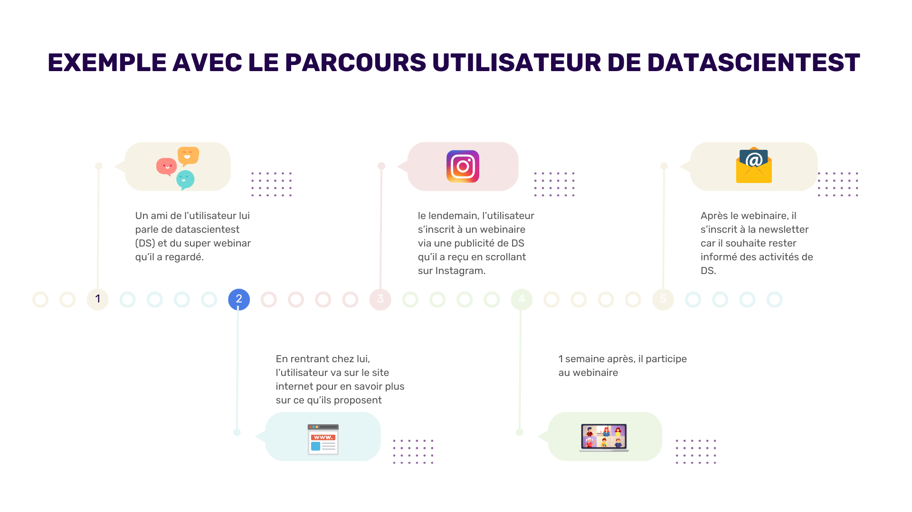
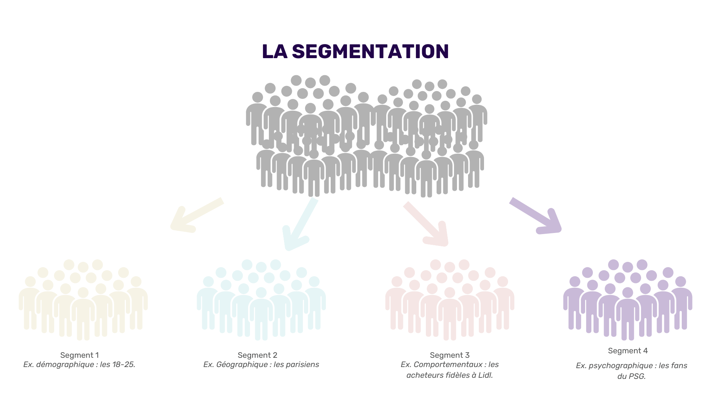
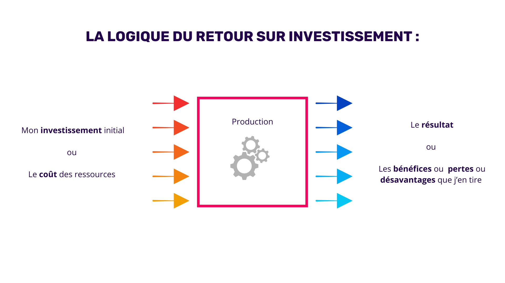
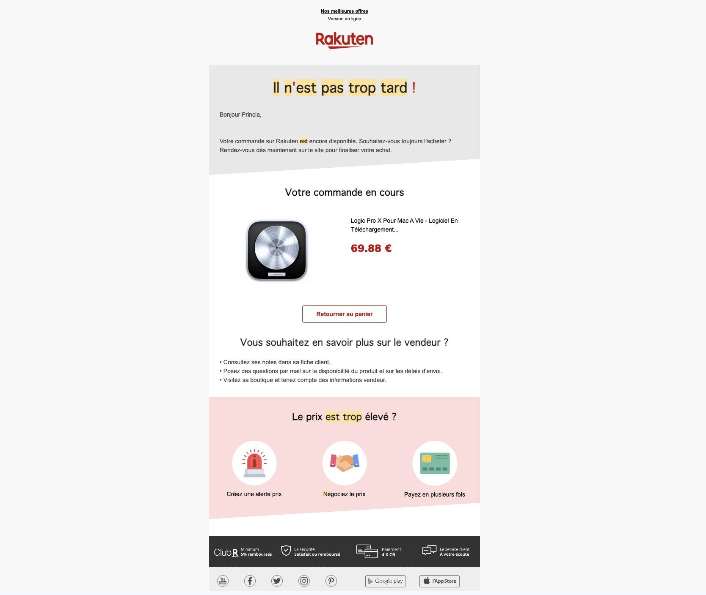
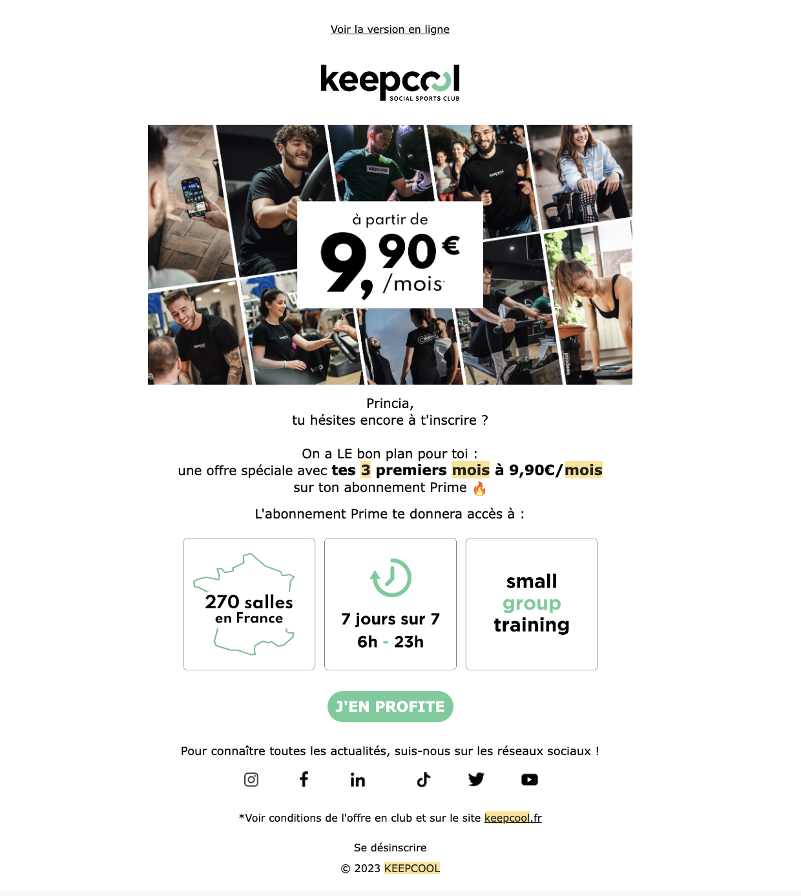
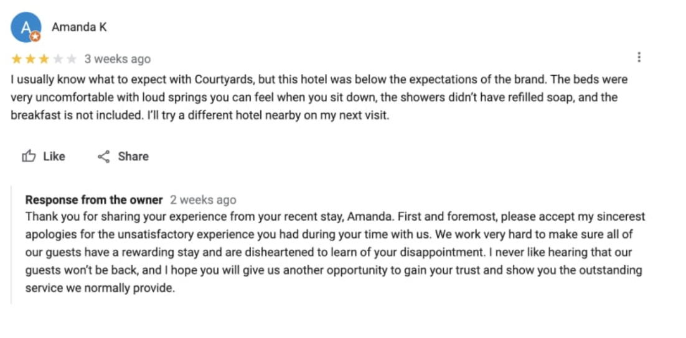
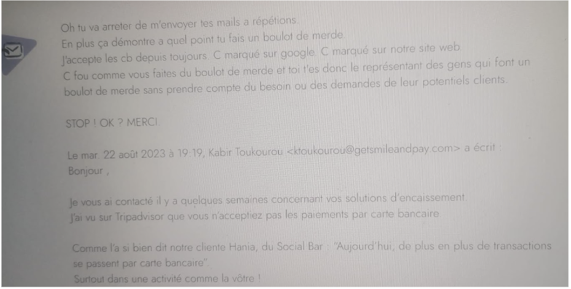

## Introduction au Marketing Automation & CRM

# Découvrir le Marketing Automation

Vous avez très certainement entendu parler de Marketing Automation sans vraiment comprendre ce que ça englobait. Commençons par expliquer le concept avant de rentrer dans les outils.

En français, l’automatisation marketing désigne les méthodes et outils utilisés pour automatiser des tâches marketing partiellement ou totalement. Il a pour but de simplifier la gestion et l’implémentation de campagnes marketing.

En effet, certaines tâches courantes peuvent être chronophages mais n'apportent pas beaucoup de valeur.

Il peut s'agir par exemple de l'envoi de courriels de prospection en vue d’obtenir des rendez-vous commerciaux, la recherche d'articles sur Internet dans le cadre d'une veille, ou encore la création de tâches pour chaque collègue après une interaction client.

Face à cette diversité de tâches chronophages, on comprend rapidement la pertinence de mettre en place des automatisations.

# Comprendre les enjeux d’un parcours client fragmenté :

Par ailleurs, avec le temps, le parcours client s'est complexifié.

Les consommateurs ont désormais de multiples points de contact avec une marque.

Aujourd’hui, vous pouvez avoir une interaction avec une marque via : _ son site web ; _ son application ; _ sa newsletter ; _ sa boutique physique ; _ une vidéo d'un influenceur la mentionnant ; _ et bien plus encore.

Les points de contact dont on parle ici sont aussi appelés “touchpoints”. Un "touchpoint" désigne une interaction spécifique entre le client et la marque lors de son parcours d'achat. Cette interaction peut laisser une impression positive ou négative sur le client, faisant de ces touchpoints des instants cruciaux à optimiser.

Par exemple, avant de s’inscrire à notre cours, vous avez peut-être déjà vu une publicité de DataScientest sur les réseaux sociaux. Notre publicité a peut-être suscité votre intérêt et a implicitement laissé un avis positif sur nous. Cette interaction constitue un touchpoint !

Tout cela signifie que les entreprises doivent multiplier les interactions avec les consommateurs pour rester pertinentes.

Et, face à cette réalité, qui pousse les entreprises à marquer leur présence à chaque étape. Le nombre de tâches et d'actions à gérer simultanément s'est donc accru avec le temps.

On s’est vite retrouvé à devoir gérer la production, la publication de contenu sur les réseaux sociaux, puis l’emailing, puis le site web et en même temps les publicités, et tout ça pour plusieurs cibles en même temps…

En effet, les entreprises ne se contentent plus d'un seul moyen pour atteindre leurs clients. Elles font tout pour étendre leur portée et utilisent simultanément plusieurs canaux de communication.

C’est ce que l’on appelle une “stratégie omnicanale”. Au lieu de considérer chaque canal de manière isolée, la stratégie omnicanale se concentre sur la création d'une expérience intégrée pour le client. Cela signifie que chaque point de contact, qu'il soit en ligne ou hors ligne, est connecté et harmonisé.

Stratégie omnicanale
Ce changement s'explique aussi par les bouleversements majeurs du marketing ces dernières années :

- Les réseaux sociaux ont pris une place énorme, modifiant fondamentalement les interactions entre les marques et leurs consommateurs.

- Avec l'arrivée d'outils toujours plus sophistiqués, l'analyse de données et le ciblage des clients sont devenus plus précis, optimisant ainsi les retours sur investissement.

- De nouveaux canaux de communication, comme les chatbots et les plateformes de streaming, offrent des opportunités inédites pour engager le client.

Mais comment gérer efficacement tous ces canaux et actions sans disposer d'une équipe immense travaillant 24/7 ? Nous verrons par la suite que l’automatisation marketing peut répondre en bonne partie à cette question.

# Quelle est sa valeur dans ce contexte ?

C’est donc dans ce contexte actuel complexe que le marketing automation est devenu un élément essentiel :

- C’est un essentiel dans un contexte complexe : Avec un parcours client en constante évolution et l'explosion des points de contact, le défi est grand pour les entreprises. Être présent n’est plus suffisant, il faut aussi assurer une présence de qualité, pertinente et adaptée à chaque interaction. Dans cette dynamique, pour rester compétitif, le marketing automation se révèle être un allié inestimable.

- Pour économiser le précieux facteur “temps” : En libérant les entreprises de nombreuses tâches répétitives, cela leur permet de se concentrer sur des tâches plus stratégiques.

- Avec l'avènement d'outils plus avancés, la collecte de données est devenue plus riche et précise. Cette précision accrue permet une meilleure segmentation. En exploitant cette segmentation approfondie, on peut ainsi personnaliser de manière plus ciblée nos campagnes marketing, et ce à grande échelle.

La segmentation est le processus de classification en groupes plus petits selon des caractéristiques ou des besoins similaires.

Segmentation
Tous ces avantages convergent vers un objectif principal : l'amélioration des performances des campagnes marketing.

Un meilleur ciblage, une plus grande personnalisation et une interaction pertinente à chaque point de contact renforcent la relation client et, par conséquent, les résultats des campagnes.

// Dans un contexte où la complexité et les interactions multiples sont devenues la norme, le marketing automation n’est plus qu’une solution, mais devient une nécessité pour toute entreprise souhaitant rester compétitive.

# Adopter une approche ROISTE :

Pour évaluer l'efficacité d'une automatisation, comme toute campagne ou stratégie, adopter une approche ROISTE est fondamental.

Le terme ROISTE renvoie à la notion de 'Retour sur Investissement' ou 'ROI'. Il s'agit d'un indicateur clé qui permet aux entreprises d'évaluer l'efficacité de leurs dépenses par rapport aux gains générés.

Très simplement, on peut le visualiser de cette manière:

Terme ROISTE
Alors, comment évaluer la pertinence de l'implémentation d'une automatisation ?

- Il est essentiel de commencer par définir les ressources qui seront investies.
- Puis, la prochaine étape consiste à évaluer ce que l'automatisation apportera à court, moyen et long termes.

Pour déterminer si l'automatisation est justifiée, on peut se poser les questions suivantes :

- La tâche que je souhaite automatiser est-elle répétitive et chronophage ?
- Quelle est la véritable valeur ajoutée de cette tâche pour mon entreprise ?
- Le coût de l'automatisation est-il justifié par les avantages et les économies qu'elle procurera ?
- Comment l'automatisation influencera-t-elle la satisfaction des clients ou des utilisateurs ?
- Y a-t-il des risques associés à l'automatisation de cette tâche ?
- L'automatisation améliorera-t-elle la cohérence et la qualité de la tâche en question ?
- Est-ce que l'automatisation offre des possibilités de modifications pour l'avenir ?
- L'automatisation nécessitera-t-elle des formations supplémentaires pour mon équipe ?
- Comment l'automatisation s'intègre-t-elle dans mon écosystème technologique actuel ?

Les réponses à ces questions vous permettront de mieux juger si l'automatisation est adaptée à votre projet et à son contexte.

À la lumière de ces questions, il devient clair que l'automatisation n'est pas toujours la solution optimale. Si ses avantages sont indéniables, quels en sont les risques en marketing ?

Il est primordial non seulement de saisir quand recourir à l'automatisation, mais aussi quand l'éviter. La prochaine partie abordera des exemples précis d'utilisation et de non-utilisation pour approfondir cette réflexion.

# Exemple concret d'automatisation du marketing

Comme tout outil, l’efficacité de l’automatisation dépend de la manière dont il est utilisé. Dans certaines situations, il peut générer des résultats impressionnants.

Dans d'autres, l'utiliser de manière inappropriée peut donner une impression d'impersonnalité ou même nuire à votre réputation.

Explorons ensemble quelques situations typiques où l’automatisation marketing brille, et d'autres où il est préférable de faire preuve de prudence.

# Quelques situations où l’automatisation fait sens

Réduire le taux de panier abandonné :
Un exemple très courant est celui du panier abandonné. Lorsque vous visitez un site et ajoutez un produit à votre panier sans finaliser l'achat, il est possible de recevoir un e-mail de rappel quelques heures ou jours plus tard vous rappelant votre panier. Il offrira généralement un code promo ou la livraison gratuite pour vous inciter à finaliser l'achat.

Taux de panier abandonné

# Augmenter le taux de rétention :

Imaginez avoir testé une séance gratuite dans une salle de sport. Une semaine après votre essai, sans inscription de votre part, la salle de sport vous envoie un email automatisé, mettant en avant les avantages d'un abonnement et vous proposant une offre exclusive pour les 3 premiers mois. Si vous ne répondez pas à cet incitatif, un SMS vous parvient quelques jours plus tard avec une dernière proposition attrayante. Ici, l'automatisation permet à la salle de sport d’augmenter ses chances de vous transformer en client.

Taux de rétention

# Les situations où il faut éviter l’automatisation

Pour répondre à des avis clients négatifs :
Suite à son séjour, un client insatisfait poste un avis critique sur la page Google de votre hôtel, y ajoutant une photo, où il pointe du doigt le manque de confort des chambres et l'absence de petit déjeuner inclus.

Face à cet avis, l'automatisation déclenche une réponse prédéfinie :

Automatisation
Cette réponse standard, bien que positive, ne répond pas du tout aux préoccupations du client. Elle pourrait amplifier son mécontentement, donnant l'impression que ses retours ne sont pas pris en considération. Une réponse automatique de ce genre risque d'écorner l'image de l'hôtel aux yeux des potentiels clients parcourant les avis en ligne.

Lors de campagnes de prospections avec une segmentation non adéquate :
Lors d'une campagne automatisée, une entreprise envoie des mails de prospection à une liste de prospection mal segmentée.

Campagne prospection
Certains destinataires, n'étant pas du tout concernés par le sujet, pourraient s'agacer, surtout s'ils reçoivent des relances malgré leur désintérêt.

Une telle automatisation mal adaptée peut ternir la réputation de l'entreprise et accroître la probabilité que les mails soient marqués comme spam; ce qui impactera négativement les performances de l’entreprise. Cette automatisation s’avèrera donc contre-productive.

L'automatisation marketing est un outil à double tranchant. Bien maîtrisé, il renforce l'efficacité et l'engagement. Mais une mauvaise utilisation peut entraîner des frustrations inattendues. Il est donc essentiel de l'approcher avec discernement et prudence pour éviter tout retour de flamme.

# Présentation du CRM HubSpot

Qu'est ce qu’un CRM ?
Un CRM, (Customer Relationship Management), est un outil indispensable pour les entreprises souhaitant maintenir et améliorer leurs relations avec leurs clients.

Il s'agit d'un outil conçu pour collecter, stocker et analyser toutes les informations concernant les clients, telles que leurs coordonnées (nom, prénom, email, téléphone…), leurs historiques d'achat, leurs interactions précédentes avec l'entreprise et leurs préférences.

Le principal objectif d'un CRM est de permettre à une entreprise de mieux comprendre ses clients, de personnaliser ses communications avec eux et d'optimiser ses stratégies de vente et de marketing.

Les avantages d'un CRM sont nombreux. Il permet d'automatiser de nombreuses tâches liées à la gestion des clients, ce qui dégage du temps aux équipes de vente et de marketing afin de se concentrer sur des activités plus stratégiques. De plus, il facilite la segmentation des clients en fonction de leurs besoins et de leur comportement, ce qui permet de cibler efficacement les campagnes marketing.

Et enfin, un CRM fournit des données précieuses pour évaluer les performances de l'entreprise, identifier les opportunités et prévoir les tendances futures.

Présentation du CRM HubSpot
Hubspot est un CRM axé Inbound Marketing et disponible exclusivement en ligne. Le logiciel propose une suite complète de logiciels de marketing, de vente, de service clientèle et de gestion de contenu.

Hubspot se démarque des autres CRM par sa simplicité d’utilisation (user friendly). De plus, sa version d’essai gratuite est sans limite de temps ou de contacts.

L'utilisation de HubSpot permet une courbe d'apprentissage très rapide. En quelques heures seulement, vous maîtriserez les fonctionnalités essentielles du CRM, grâce à une interface intuitive.

HubSpot propose plusieurs "Hubs" qui sont des solutions logicielles spécifiques conçues pour répondre à différents besoins.

Voici les cinq principaux Hubs de HubSpot et leurs fonctionnalités principales :

CRM Hub _ Gérer la Relation Client (CRM) : le CRM de HubSpot vous permet de gérer vos contacts, vos entreprises et vos transactions en un seul endroit. _ Suivre les interactions avec les clients, visualiser l'historique des communications et organiser les données des clients.

Marketing Hub _ Créer des formulaires, des pages de destination et des calls to action pour attirer les prospects. _ Automatiser les campagnes emailing, personnaliser les emails, suivre les performances et segmenter les contacts pour un meilleur ciblage. \* Analyse et rapports : obtenir des données sur les performances des campagnes marketing afin de prendre des décisions basées sur les données.

Sales Hub _ Suivre les transactions, gérer les pipelines de vente, automatiser les tâches de vente pour améliorer la productivité. _ Envoyer des emails de suivi, suivre les ouvertures et les clics, et obtenir des notifications en temps réel lorsque les prospects interagissent avec vos emails.

Service Hub _ Gérer les demandes d'assistance, le service clientèle, les tickets d'assistance et créer une base de connaissances pour aider les clients. _ Offrir un support en temps réel avec un chat en direct intégré à votre site Web.

CMS Hub _ Créer et gérer facilement du contenu sur le site Web de l’entreprise sans nécessiter de compétences techniques avancées. _ Utiliser les outils intégrés pour améliorer le référencement de votre site Web sur les moteurs de recherche (SEO). Sécurité et hébergement : HubSpot propose un hébergement sécurisé pour votre site Web, ainsi que des fonctionnalités de sécurité avancées.

Chacun de ces Hubs est conçu pour répondre à des besoins spécifiques dans les domaines de la gestion, de la relation client, du marketing, des ventes, du service clientèle et de la gestion de contenu. En les utilisant, vous pouvez créer une expérience client cohérente et efficace à chaque étape de leur parcours.

De plus, HubSpot a mis l'accent sur l'intégration de l'intelligence artificielle dans l'ensemble de ses hubs afin d'améliorer la productivité et l'expérience client. De nouvelles fonctionnalités alimentées par l'IA, comme les chatbots 24/7, les recommandations en temps réel et l'automatisation des workflows, permettent aux équipes de marketing, de vente et de service de gagner en efficacité tout en offrant un service plus personnalisé et réactif.

# Conclusion

Maintenant que vous avez une vue d'ensemble du marketing automation et des fonctionnalités de HubSpot, vous êtes prêt à aller plus loin. Lors du prochain cours, nous verrons ensemble comment créer un compte développeur sur HubSpot et nous ferons nos premiers pas sur la plateforme.
