## Création du compte développeur et premiers pas sur Hubspot

Compte développeur Hubspot
Vous aurez besoin de créer un compte développeur pour suivre l’intégralité du cours qui va suivre.

- Rendez-vous sur le site https://developers.hubspot.fr/ puis cliquez sur le bouton “Créer un compte développeur”.
- Trois options sont disponibles, sélectionnez : “Créez un compte développeur d’applications”:

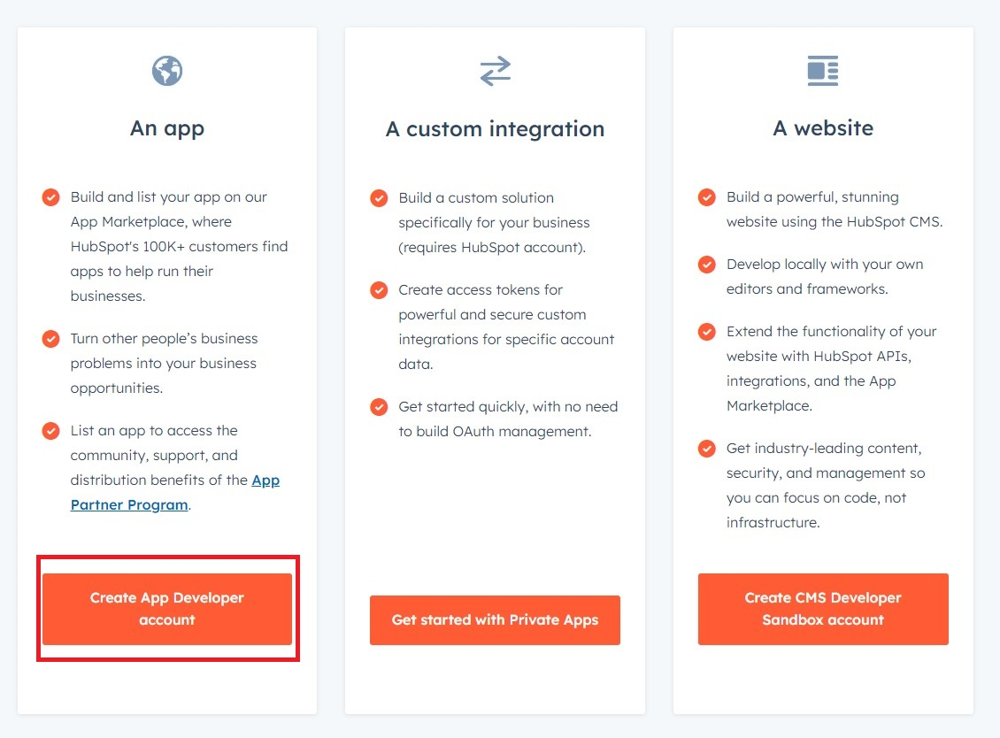

- Suivez les étapes demandées par Hubspot
- Puis, vous vous retrouverez sur une page d'accueil Hubspot un peu différente de celle des autres types de comptes.

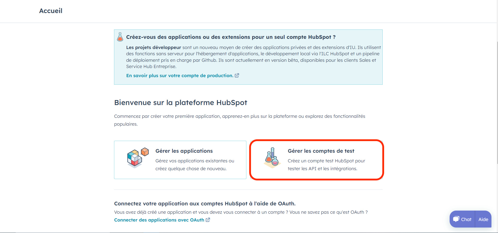

- Cliquez sur “Gérer les comptes de test”
- Puis cliquez sur le bouton Orange “Créer un compte de test pour développeur”
- Donnez-lui un nom et cliquez sur Créer

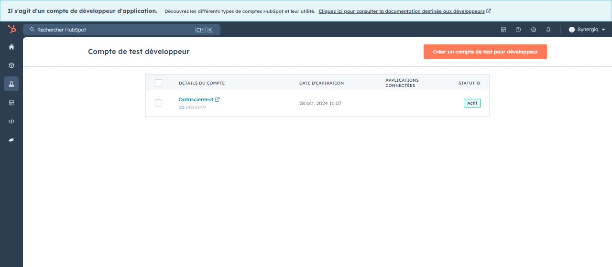

Désormais vous avez un compte Hubspot de test sans aucune limite en termes de fonctionnalités. C’est sur ce compte que vous suivrez les prochaines étapes du cours.

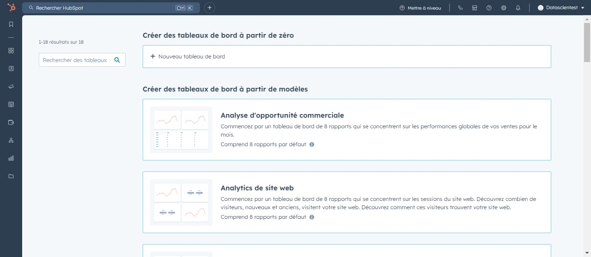

# Importation et gestion des contacts

Le CRM HubSpot, c'est un peu comme une grande boîte où une entreprise peut ranger toutes les informations importantes sur ses clients et ses prospects. Cette boîte contient différents compartiments pour différents types d'informations, comme les noms et coordonnées des clients, ce qu'ils ont acheté, comment ils ont été en contact avec l'entreprise, et bien plus encore. Les informations stockées dans cette boîte sont très utiles pour améliorer les relations avec les clients, personnaliser les communications, suivre les ventes, et automatiser certaines tâches. En gros, c'est un outil essentiel pour gérer les relations avec les clients et faire en sorte que tout se passe au mieux pour l'entreprise et ses clients.

Allez dans l’onglet “CRM” puis cliquez sur “Contacts”.

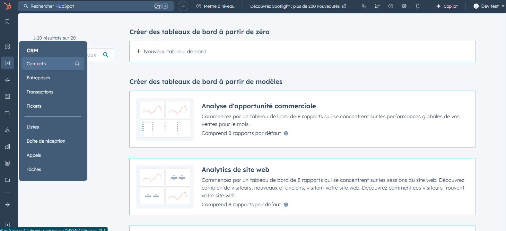

Dans cette fenêtre se trouve la liste de tous les contacts avec lesquels votre entreprise va interagir, que ce soit des leads provenant de votre site web, des prospects, des anciens clients et même des contacts obtenus lors d’un salon.

Cette fenêtre se présente sous la forme d’une feuille excel où nous avons ajouté la liste de nos contacts. Chaque ligne représente un contact et chaque colonne représente une propriété de ce contact (nom, prénom, email, ville, etc…).

Lorsque plusieurs collaborateurs sont amenés à utiliser le CRM, il arrive parfois que nous ayons besoin d’afficher uniquement les contacts qui nous appartiennent, ou les contacts qui sont entrés dans le CRM à une date précise lors d’un webinar par exemple.

Les “Filtres avancés” permettent de segmenter les contacts en fonction de critères que nous avons définis en amont.

Nous pouvons segmenter nos contacts par propriétaire du contact, date de création, statut du lead (si le contact est un client ou non) et autant de filtre que nous le souhaitons.

En cliquant sur un contact, une nouvelle fenêtre s’affiche et nous arrivons sur la “fiche d’informations”. Elle contient toutes les informations que l’entreprise a recueilli sur cette personne.

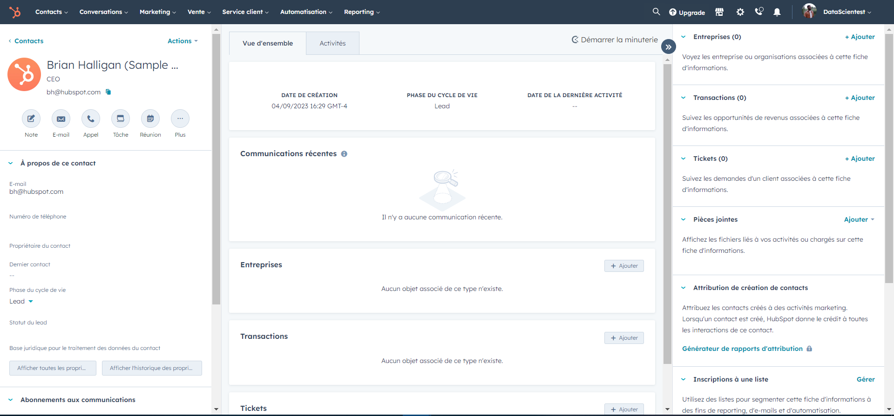

À gauche Nous retrouvons les mêmes informations du contact (nom, prénom, email, téléphone,...) avec des pictogrammes en plus représentant une action que nous souhaitons faire avec ce contact (prendre un note sur ce contact, l’appeler, lui envoyer un email,...)

Au centre Nous avons l’onglet vue d’ensemble qui est un résumé des actions et communications récentes faites avec ce contact comme les emails échangés et les appels réalisés.

L’onglet Activités représente les mêmes fonctionnalités mais sous forme de liste

À droite Nous avons les associations qui nous permettent de savoir à quelle entreprise ce contact est rattaché, si une proposition commerciale est actuellement en cours, A-t-il des tickets (outils de suivi et de gestion des demandes et des problèmes des clients) en cours ?

Maintenant que nous savons ce qu’est un contact, nous allons importer les nôtres dans Hubspot afin de pouvoir effectuer nos futures actions marketing.

Pour importer des contacts dans Hubspot, nous avons deux options.

La première est utilisée pour des contacts ponctuels que nous entrons en “dur” dans le CRM.

En haut à droite de l’onglet “Contacts”, cliquez sur ”Créer un contact”.

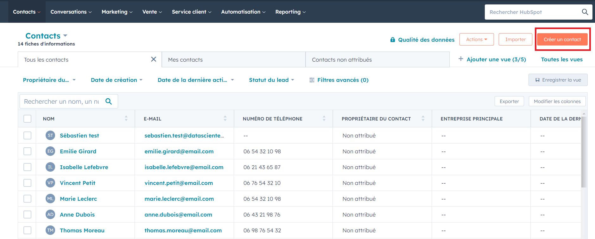

Puis dans le volet de droite qui s’affiche, nous entrons comme email “test@datascientest.com”, “Votre prénom”, “Votre Nom”.

Puis, cliquez sur “Créer”.

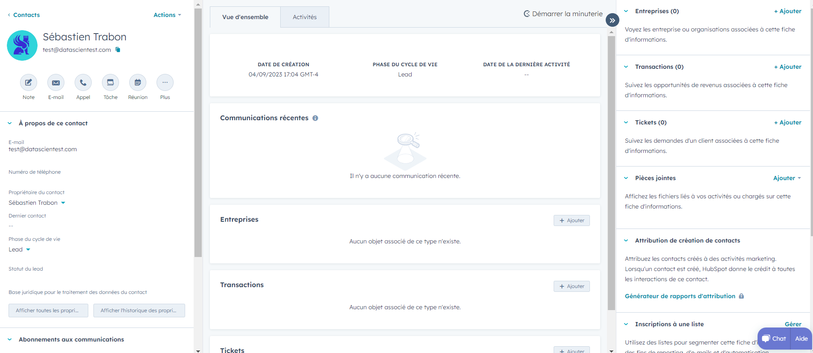

Puis nous arrivons directement sur la fiche d’information du contact. Efficace mais si nous souhaitons importer des centaines de contacts dans notre CRM, cela nous prendra des heures donc ce n’est pas la bonne méthode.

La seconde méthode est l’importation de contacts depuis une feuille Excel ou Google Sheet par exemple.

Dans l'onglet contacts cliquez sur "Import", choisissez l'option pour importer un fichier, continuez pour commencer l'import.

Cliquez sur "Contacts", puis sur "Suivant" pour pouvoir importer le fichier avec les contacts.

# Application pratique

Vous trouverez la liste des contacts à télécharger ci-dessous : <a href="./Import Datascientest.xlsx">Import Datascientest</a>

Importez ces contacts dans le CRM en veillant à conserver les informations suivantes : nom, prénom, e-mail et numéro de téléphone.

Créez une liste de contacts à partir de cet import:

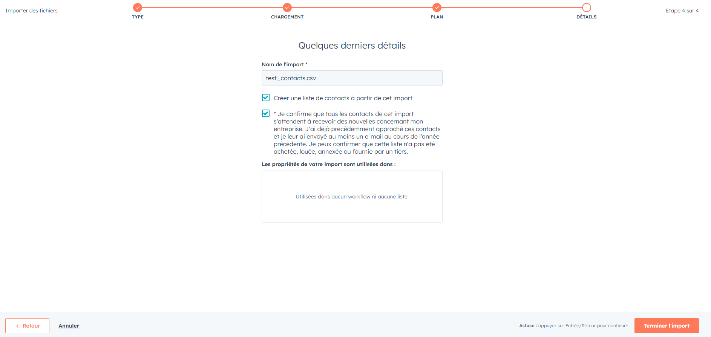

À la fin de l’exercice, vous devriez retrouver dans votre CRM vos contacts importés.

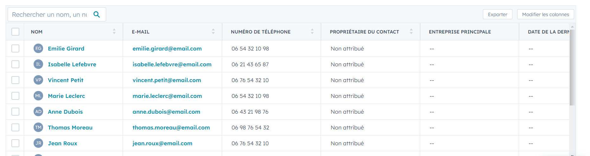

# Utilisation des listes et segmentation des contacts

Utiliser un CRM permet de segmenter nos contacts de la façon la plus précise et la plus complète possible. La segmentation est l'acte de diviser vos contacts en de plus petits groupes, ou segments, sur la base d'informations ou de caractéristiques en commun (nom, ville, marque automobile, etc…). Si vous possédez différents publics avec lesquels vous souhaitez communiquer, la segmentation peut vous aider à envoyer le bon message aux bonnes personnes et au bon moment.

Pour pouvoir enregistrer la segmentation de contacts dans Hubspot, nous utilisons des listes qui peuvent être par la suite utilisées pour envoyer des emails à un certain type de clients par exemple.

Dans Hubspot, nous allons créer une liste pour regrouper les contacts dont nous sommes les propriétaires.

Allez dans l’onglet "CRM" puis cliquez sur “Listes”.

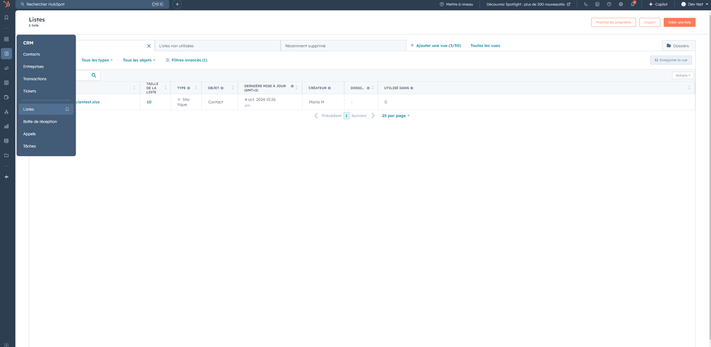

Pour le moment, notre CRM ne contient aucune liste donc nous allons cliquer sur "Créer une liste" en haut à droite, puis choisissez l'option pour créer une liste des contacts. Donner un nom à votre liste, par exemple "Contacts de Y".

Nous avons créé notre liste mais elle est actuellement vide et c’est normal car nous n’avons pas encore défini de critères (filtres) pour segmenter nos contacts:

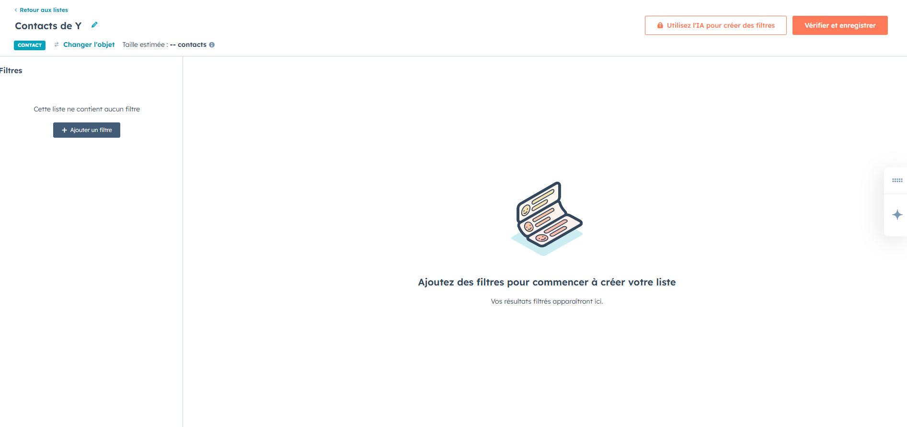

Dans le volet de gauche, cliquez sur "Ajouter un filtre" puis dans le nouvel onglet qui s’affiche, cliquez sur "Propriété Contacts".

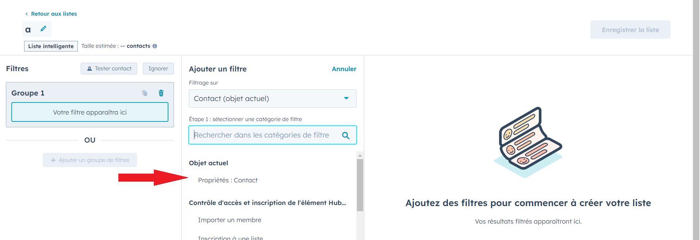

Recherchez ensuite dans la barre de recherche les mots clés suivants "Propriétaire du contact". Modifiez le filtre en choisissant "est l’un des".

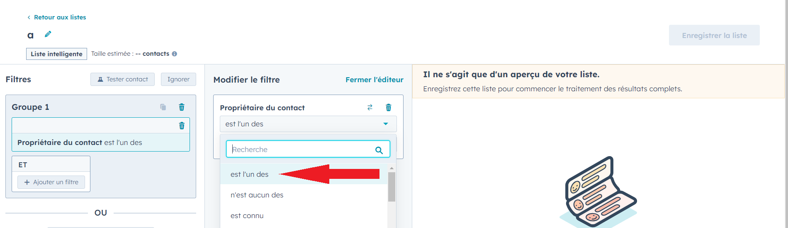

Puis cocher votre nom dans les choix de la barre juste en dessous.

Le CRM va alors chercher tous les contacts dont le propriétaire est celui que vous avez choisi et va les afficher à droite de la page.

Enregistrez votre liste pour passer à l'étape suivante.

Maintenant vous devez choisir le type de liste à créer : \* Liste active : Elles servent à créer des listes qui se mettent à jour automatiquement au fil du temps. Par exemple, si vous êtes amené à avoir davantage de contacts dans les prochains jours, mois, années, il faudrait choisir ce type de liste.

- Liste statique : Elles permettent de créer des listes à un instant T qui ne se mettra jamais à jour automatiquement. Par exemple, si vous avez fait une conférence en ligne la semaine dernière et que vous souhaitez savoir qui y était présent, il faut choisir ce type de liste.

Dans notre cas, nous allons choisir la liste active.

Maintenant nous allons voir si cette liste fonctionne correctement.

Retournez dans la liste de vos contacts en cliquant sur l’onglet "CRM" => "Contacts". Puis, pour un des contacts avec la valeur "Aucun propriétaire" dans la colonne propriétaire du contact, cliquez sur ce champ.

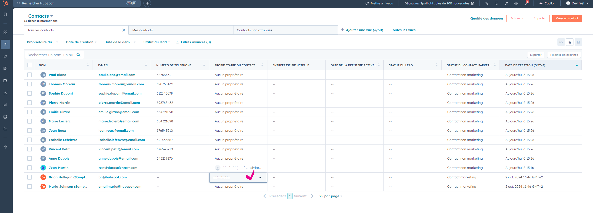

Sélectionnez votre nom et cliquez sur "Enregistrer".

Une fois fait, revenez dans "Listes".

Cliquez sur votre liste et vous devriez voir le nouveau contact ajouté. Si ce n’est pas le cas c’est que vous devez attendre quelques secondes, le temps que la liste s’actualise et le contact devrait s’afficher.

Félicitations, vous savez désormais créer une liste et donc segmenter des contacts. Cela vous servira par la suite lorsque vous souhaitez envoyer des emails automatisés. Pour rappel, vous pouvez créer une liste avec bien d’autres filtres que le propriétaire du contact.

# Conclusion

Cette introduction à Hubspot est terminée. Nous allons peu à peu rentrer dans le détail notamment avec le prochain cours sur l'implémentation d'une stratégie d'automatisation de marketing.
