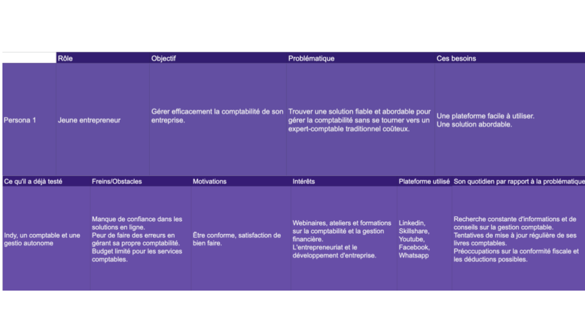
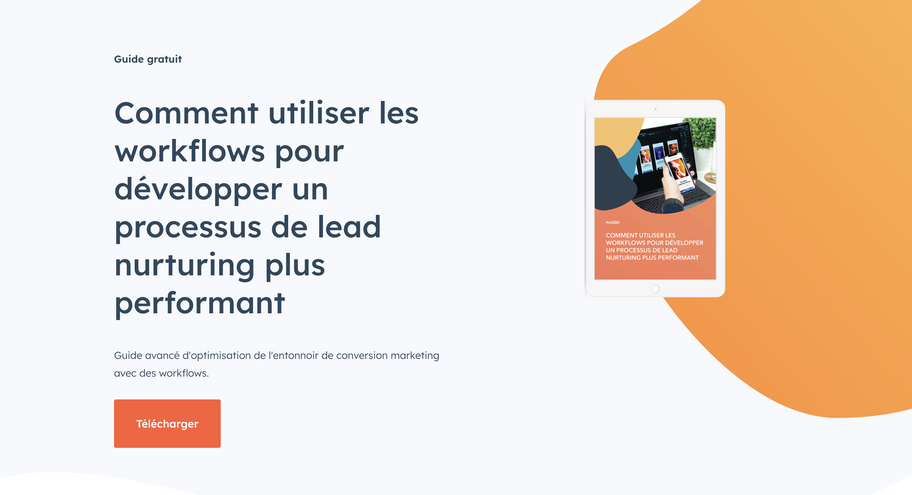
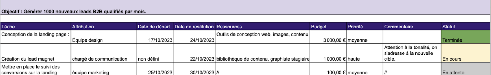
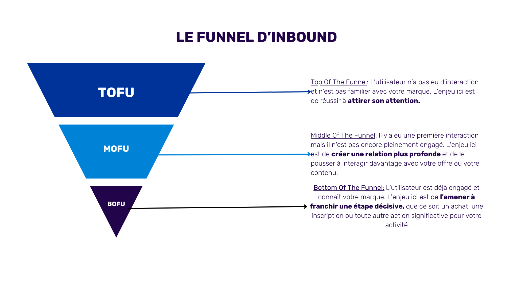
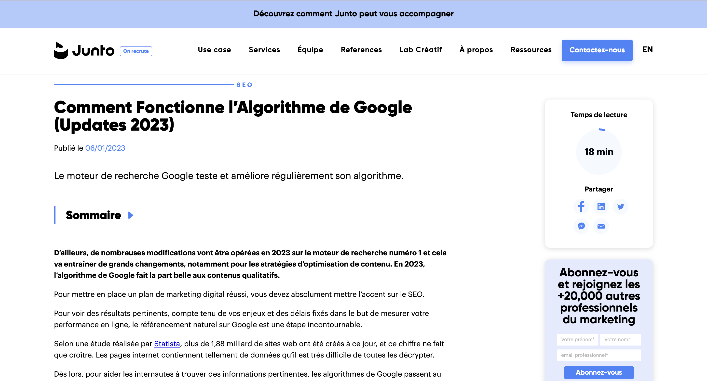
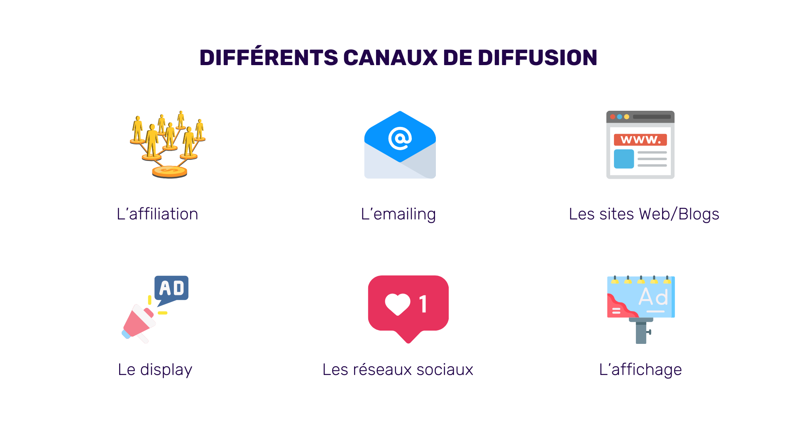
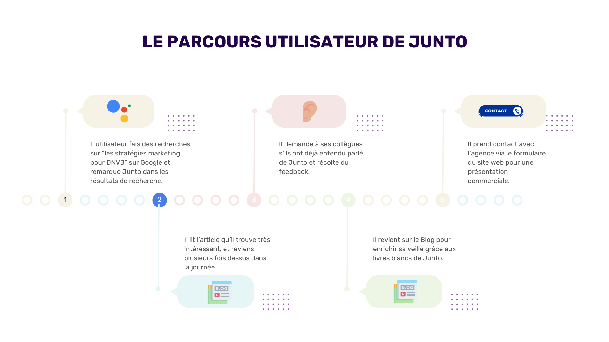
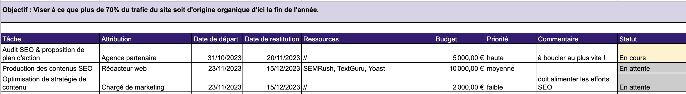

## Définir et implémenter une stratégie de marketing automation

Avant de commencer :
Avant de nous lancer dans l'action, une réflexion préliminaire est nécessaire pour établir la ligne directrice : il s'agit de la stratégie.

Une stratégie est composée de : _ un but clair ; _ des objectifs SMART ; _ des indicateurs clés de performance : ICP ou KPI en anglais ; _ une cible définie ; \* un plan d’action.

Nous allons explorer ces éléments un à un pour mieux les assimiler.

# Un but clair pour une stratégie claire

Votre but, c'est ce que vous voulez atteindre. Il vous aide derrière à définir vos objectifs et votre plan d'action.

Par exemple, des buts en automatisation marketing peuvent être :

- Améliorer la productivité des commerciaux : En automatisant la qualification et la segmentation des leads, on peut gagner du temps. Cela donne la possibilité aux commerciaux de se focaliser sur les leads les plus pertinents, ce qui peut entraîner une augmentation de la productivité et une hausse du taux de conversion.

- Augmenter les ventes : En exploitant l'automatisation pour adapter les interactions avec les prospects, on peut stimuler les ventes. Par exemple, en déclenchant des emails contenant des offres ciblées basées sur les actions des visiteurs, on peut transformer plus efficacement ces prospects en clients, entraînant ainsi une hausse des ventes.

- Optimiser l'email marketing : Grâce à l'automatisation, on peut décupler la réussite des campagnes d'emailing. En adaptant les emails selon les informations et les actions de chaque destinataire, il est aussi possible d’augmenter les taux de lecture et d'engagement.

- Améliorer le service client : L'intégration de chatbots et de solutions automatisées permet d'assurer un service client plus réactif et pertinent. On peut donc réduire les délais de réponse et enrichir l'expérience utilisateur. De plus, en fournissant des réponses sur mesure aux demandes des clients, on améliore le parcours client dans sa globalité.

Point de vigilance : définir le bon but peut sembler simple. Mais il est important de prendre du recul et de remettre en question les besoins réels de l'entreprise.

Car une fois que vous avez clairement défini votre but, il devient le point de départ pour définir vos objectifs spécifiques. En conséquence, si le point de départ n’est pas bon, l'arrivée ne sera pas celle espérée !

# Des objectifs SMART

Les objectifs permettent de guider les actions qui vont nous permettre de réaliser votre but.

Comprendre et définir exactement ce que l’on espère accomplir avec notre stratégie va nous permettre de mettre en place un plan d’action efficace. Pour être efficace, un objectif doit être SMART :

- Spécifique: clair et bien défini.
- Mesuré: permet de suivre son progrès grâce à des indicateurs.
- Atteignable: réaliste compte tenu des ressources et compétences disponibles.
- Réaliste (pertinent): s'aligne avec la vision globale de l'entreprise.
- Temporel a une échéance claire pour encourager sa réalisation.

Exemple But : Améliorer la productivité des commerciaux. Objectifs SMART :

- Objectif 1 : Augmenter le taux de conversion des commerciaux de 15% d'ici la fin de l'année. _Cet objectif est spécifique car il cible la productivité des commerciaux. Il est mesurable avec une augmentation précise de 15%, et il est atteignable en automatisant la qualification des leads. Selon le contexte de l’entreprise, il peut être réaliste._

- Objectif 2 : Réduire le temps de traitement des leads de 25% en 6 mois grâce à une meilleure formation des commerciaux et à l'utilisation d'outils CRM plus performants. _Cet objectif est spécifique car il se concentre sur le temps de traitement des leads. Il est mesurable avec une réduction de 25%, et il est atteignable grâce à une meilleure formation et à l'utilisation d'outils CRM. Avec les bonnes ressources, cet objectif est réaliste et est défini pour être atteint en 6 mois._

# Exercice N°1

Reprenez le <a href="./Plan Marketing.xlsx">modèle suivant</a>

Voici le contexte : Vous êtes une entreprise qui offre des services de comptabilité à destination des créateurs d’entreprise qui cherchent une alternative à l’expert comptable traditionnel.

Vous cherchez à développer votre site web pour avoir plus de clients via ce canal.

Définissez un but, puis 3 objectifs. Pour évaluer l’efficacité de vos objectifs, aidez-vous des questions suivantes :

Est-il bien défini ?

- Qu’est ce que je veux accomplir concrètement ? _ Qui est impliqué dans cet objectif ? _ Quel est le chemin détaillé pour l'atteindre ?

Est-ce que je peux le mesurer ? _ Comment déterminer la réalisation de mon objectif ? _ Sur quels critères baser le succès ? \* Comment suivre les avancées et évaluer le résultat final ?

Ai-je les capacités pour le réaliser ? _ Ai-je les moyens et compétences pour y parvenir ? _ Si non, comment les obtenir ? Est-ce que ça en vaut la peine ? \* Est-ce un objectif stimulant mais encore faisable ?

Est-ce un objectif pertinent ? _ Cet objectif est-il en accord avec les objectifs à long terme ? _ Est-ce le bon moment pour m'y consacrer ? \* Est-il pertinent dans le contexte actuel ?

Il est bien défini dans le temps ? _ À quelle date exactement je souhaite atteindre cet objectif ? _ Quelles sont les différentes étapes que je dois mettre en place pour y arriver ? \* Quelles sont les dates limites que je dois absolument respecter ?

Si la réponse à ces questions est oui, il est très probable que vos objectifs soient pertinents.

Voici une idée des objectifs possibles qui répondent aux critères SMART: 1. Augmenter le trafic web de 40 % dans les 6 prochains mois en optimisant le référencement naturel (SEO) et en créant du contenu pertinent pour les créateurs d’entreprise. 2. Augmenter le taux de conversion des visiteurs du site en clients potentiels de 5 % à 8 % d’ici 9 mois en améliorant l’expérience utilisateur (UX) et en ajoutant un appel à l’action clair (CTA) sur chaque page de service. 3. Diminuer le taux de rebond de 50 % à 35 % en 6 mois en améliorant la vitesse de chargement du site et en rendant le contenu plus engageant pour les créateurs d’entreprise.

# Des indicateurs clés de performances bien définis

Si on fournit des efforts pour atteindre un but, on s’attend forcément à avoir des résultats derrière.

Mais une fois la campagne terminée, comment évaluer la nature des résultats? Comment savoir si ils sont «bons ou mauvais », suffisants ou non ? Où faut-il regarder ? Par quel angle l'aborder ? Si vous vous êtes déjà posé ces questions devant un rapport marketing post-campagne, c’est que vous avez grillé une étape. C’est une réflexion et des questions qu’il faut se poser avant de lancer la machine, avant l’implémentation du plan d’action.

En effet, une fois que le but et les objectifs sont clairs, on définit les KPIs. Ils vont nous permettre d’évaluer l’efficacité de notre campagne à ses différents stade d’avancée.

Un KPI ou ICP - indicateur clé de performance est une mesure quantifiable évaluant l'atteinte d'objectifs stratégiques. On va donc les regarder pour savoir si notre campagne est efficace ou s'il faut l’optimiser. Contrairement à une métrique lambda, un KPI va se retrouver en tête sur nos rapports. Il s’agit ici de mesurer l’impact.

Combien de KPIs définir ? Il n’y a pas vraiment de chiffre magique, ça dépendra des objectifs ou de l'envergure de la campagne. Mais il est généralement conseillé d’en avoir environ 5 à 10.

Comment les définir alors ? Leur sélection dépend des objectifs fixés par l’entreprise.

Exemple 1: Des KPI pertinents pour améliorer la productivité des commerciaux: _ taux de conversion : il évalue directement la capacité des commerciaux à transformer les prospects en clients. Une augmentation signifie que les efforts pour améliorer leur productivité portent leurs fruits. _ nombre de leads qualifiés par commercial : il donne une idée de la compétence des commerciaux à identifier et prioriser les prospects pertinents.

Exemple 2 Des KPI pour augmenter les ventes : _ chiffre d'affaires mensuel : une progression mensuelle du chiffre d'affaires montre l'efficacité des initiatives de vente et leur impact sur la croissance financière. _ panier moyen par personne : cette valeur, lorsqu'elle augmente, indique que les clients sont enclins à acheter des articles plus chers ou en plus grande quantité.

# Exercice N°2

Reprenez votre sheet, et fixez les KPIs de vos objectifs.

Une fois terminée, pour évaluer la pertinence de vos KPIs, posez-vous les questions ci-dessous :

- Y-a-t-il un lien entre le KPI et l’objectif. Est-ce en phase avec votre but ?
- Est-il quantifiable ? Comment suivre son évolution ?
- Si ce KPI change, quelles actions devez-vous entreprendre ?
- Avez-vous une date précise pour atteindre votre objectif lié à ce KPI ?
- Est-il comparable sur la durée ?
  Voici un exemple pour l'un des objectifs de l'exercice 1:

Objectif 1 : Augmenter le trafic web de 40 % dans les 6 prochains mois KPI : Trafic web total (visites mensuelles)

_Lien avec l’objectif_: Oui, le KPI mesure directement le nombre de visiteurs sur le site, qui doit augmenter de 40 % pour atteindre l’objectif.

_Quantifiable_ : Oui, le trafic peut être quantifié à l’aide d’outils comme Google Analytics, qui fournissent des données précises sur le nombre de visites.

_Actions en cas de changement_ : Si le trafic n’augmente pas comme prévu, envisagez de réévaluer les mots-clés, d’améliorer la stratégie de contenu ou de renforcer les efforts de promotion (réseaux sociaux, publicités en ligne).

_Date précise_ : Oui, l’objectif est d’atteindre 40 % d’augmentation dans les 6 mois suivant l’implémentation des actions.

_Comparabilité sur la durée_ : Oui, il est possible de comparer les données de trafic mois par mois pour évaluer les tendances.

# Un public cible défini et connu

Avant d'initier toute action marketing, il faut une connaissance suffisante de notre public cible. En effet, une vision claire de qui sont nos cibles permet de mieux orienter l'ensemble des actions. Pour affiner cette connaissance, il est essentiel de se poser des questions telles que : Qui est-il ? Quel est son besoin principal ? Quelles sont ses motivations ou freins à l'achat ?

Dans cette quête d'informations, la création d'un profil type de client s'avère être un outil précieux.

Le profil type de client, ou persona désigne le public cible, c'est-à-dire la personne ou le groupe spécifiquement visé des actions. Un persona est une représentation fictive mais basée sur des données réelles de votre client type. Il sert à affiner les stratégies en facilitant des décisions plus pertinentes concernant la tonalité, le canal, le timing, et les outils à utiliser.

Comment définir une persona ? Quel degré de connaissance avons-nous besoin de notre persona pour l'appréhender efficacement?

La profondeur de la compréhension dépendra largement du contexte et des objectifs poursuivis. Bien que la règle générale soit que plus nous en savons sur notre cible, mieux c'est, certaines informations peuvent avoir plus de poids en fonction de la situation.

Pour autant, certains éléments seront toujours nécessaires à la bonne compréhension d’une cible: _ Son objectif dans le contexte analysé _ La problématique qu'il rencontre _ Les solutions qu'il a déjà tentées et leur efficacité _ Ses besoins intrinsèques _ Ses obstacles, freins et frustrations _ Ses motivations profondes

Ces éléments clés, lorsqu'ils sont bien compris, ne se contentent pas de nous informer : ils nous permettent de nous mettre à la place de notre cible.

C'est en adoptant cette approche centrée sur l'utilisateur que nous pouvons vraiment répondre à ses besoins. De plus, les personas ne sont pas statiques. À mesure que le marché évolue, elles doivent aussi évoluer, nécessitant des mises à jour régulières pour rester pertinentes.

Les critères de segmentation
Objectif, problématique, besoins, obstacles, ce sont des informations que vous pouvez retrouver dans vos bases de données. On les appelle critères de segmentation.

Un critère de segmentation est un facteur ou une caractéristique que l'on utilise pour diviser un groupe en sous-groupes distincts.

Il existe 5 grandes catégories de critères : _ Sociodémographiques : l’âge, le statut social, l’emploi, etc. _ Géographiques : la géolocalisation, le lieu d’habitation/de travail, etc. _ Comportementaux : les habitudes, le profil d’acheteur, etc. _ Psychographiques : les centres d’intérêt, les valeurs, les traits de personnalité, etc. \* Technographiques : l’utilisation des appareils, réseaux sociaux etc..

Chacun de ces critères aide à peindre une image complète de votre cible, en particulier lorsqu'il s'agit d'adapter vos campagnes. Mais selon le contexte et votre besoin, certaines informations ont plus de valeurs que les autres, c’est à vous de faire le tri !

Où trouver les informations ? Comment connaître le comportement de ma cible si je ne la connais pas ?

Il y a plusieurs manières de récolter l’information sur votre cible.

Récolter de la donnée quantitative Il est possible de définir votre profil type, en vous basant sur les grandes tendances et chiffres généraux du marché.

C’est des informations que vous trouverez facilement via : - des études de marché publiées - des rapports sectoriels - des statistiques fournies par des organismes spécialisés

Récolter de la donnée qualitative Pour recueillir des données plus qualitatives, vous pouvez également vous orienter vers des sources plus "micro".

C’est des informations que vous trouverez : _ Dans les commentaires Amazon sur des livres de votre thématique _ Dans des communautés privées sur slack, discord, facebook, etc. _ Sur les réseaux sociaux _ Des feedbacks utilisateurs

Autant de sources que vous pouvez exploiter pour dresser le profil le plus complet possible.

# Exercice N°3

Reprenez votre sheet, et rendez-vous sur la feuille numéro 2 “persona”.

En se remettant dans le contexte du logiciel de comptabilité, et en reprenant votre but et vos objectifs. Définissez une persona qui serait pertinente pour le contexte.

_Rappel du contexte_ : Vous êtes une entreprise qui offre des services de comptabilité à destination des créateurs d’entreprise qui cherchent une alternative à l’expert comptable traditionnel. Vous cherchez à développer votre site web pour avoir plus de clients via ce canal.

Remplissez directement sur votre google sheet. Vous pouvez ajouter des catégories si besoin

Votre persona vous permet-elle d’avoir une meilleure vision ? Cela vous a-t-il donné des idées d’actions à mettre en place ?

Une fois terminé voici un exemple de persona :

# Construire un plan d’action détaillé

Enfin, toute stratégie n’est rien sans un plan d’action. En effet, une fois la base stratégique posée, la cible identifiée, on peut passer à l’opérationnel.

Pour le mettre en place, on peut suivre ces 5 étapes :

- Définir ou rappeler les objectifs : Ils donnent un sens clair de la direction à prendre.

- Identifier les actions nécessaires : Armés de nos objectifs, nous listons les étapes spécifiques à suivre. Il s'agit d'actions spécifiques pour concrétiser notre vision stratégique.

- Définir ou rappeler les KPIs : Ces indicateurs sont nos baromètres. Ils nous permettent de mesurer à quel point nous sommes proches de nos objectifs et d'évaluer l'efficacité de nos actions.

- Établir un calendrier : Un plan sans échéancier est comme une carte sans boussole. Le calendrier nous donne un cadre temporel, garantissant que chaque action est réalisée au bon moment.

- Surveillance et ajustement : La flexibilité est essentielle. En observant nos progrès et en étant prêts à ajuster notre plan si nécessaire, nous nous assurons d'être toujours alignés avec notre stratégie initiale.

Attention, le plan d'action n'est pas simplement une liste de tâches ; c'est le pont entre notre stratégie et les actions concrètes. Il assure que chaque effort, chaque action, s'inscrit dans la réalisation de nos objectifs globaux, renforçant ainsi la valeur et l'efficacité de notre démarche marketing. Vous pouvez trouver un template de plan d’action sur la page 3 de votre sheet.

# Marketing Automation & Lead generation

Le marketing automation permet aussi d’impacter la manière dont on peut générer et engager des leads.

Lorsque nous parlons de génération de leads, nous faisons référence à l'art d'attirer des individus intéressés et de les convertir en prospects pour votre entreprise.

À contrario de l'Inbound Marketing, qui se concentre sur l'attraction des clients en fournissant du contenu de valeur, sans les solliciter directement, la génération de leads est une démarche plus proactive pour cibler et capturer des prospects potentiels.

La génération de lead est centrée sur l'attraction et la transformation. Il s'agit de capter l'attention des bonnes personnes, de susciter leur intérêt et de les amener à vouloir en savoir plus sur ce que vous offrez, souvent grâce à des offres ou des incitations spécifiques. En d'autres termes, c'est l'art de convaincre des inconnus de montrer de l'intérêt pour votre produit ou service, en échange d'une proposition de valeur claire.

La première étape est de mettre le doigt sur la valeur que vous offrez à vos prospects. C'est ce qui va les inciter à partager leurs informations personnelles avec vous.

Prenons l'exemple de lemlist, une plateforme d'envoi d'emails automatisés qui cherche à générer des leads B2B. Leur proposition de valeur pourrait être un ebook intitulé "Les 10 meilleures stratégies d'emailing pour le B2B". Pour engager leur cible, lemlist doit mettre en avant cette proposition. Les responsables marketing de PME/TPE pourraient être intéressés par cet ebook car il répond à un besoin réel : comment améliorer ses campagnes d'emailing.

En découvrant l'ebook : - Le titre évoque clairement une valeur ajoutée, incitant à le télécharger. - L'introduction claire donne un aperçu des bénéfices, renforçant le désir de découvrir les stratégies. - Si le contenu de l'ebook est de qualité, le prospect est susceptible d'envisager une collaboration avec lemlist.

Choisir la bonne plateforme et le bon lead magnet
La génération de lead repose sur l'échange : vous offrez quelque chose de valeur en échange des informations de contact de votre prospect. Cet échange prend souvent la forme d'un lead magnet.

Ce lead magnet peut prendre plusieurs formes : _ Un ebook _ Un Modèle _ Un Webinaire _ Un article de blog \* Et bien d’autres formes.

Ce lead magnet est composé de la proposition de valeur et d’un appel à l’action.

Ici, la valeur du lead magnet se concentre sur le statut complet et avancé du guide.

C’est une raison assez forte qui pourrait inciter les utilisateurs en quête d’exhaustivité à laisser leurs informations personnelles pour le télécharger.

La stratégie de génération de lead
Une stratégie de génération de lead peut servir plusieurs buts, par exemple : _ Automatiser la collecte et la segmentation des leads _ Nourrir les leads avec du contenu adapté _ Suivre le parcours du client _ Mesurer l'efficacité des campagnes marketing _ Personnaliser la communication avec les prospects _ Optimiser le taux de conversion de la landing page \* Faciliter le passage du lead au statut de client

Exemple Reprenons le cas de lemlist. Lemlist, en tant que plateforme d'envoi d'emails automatisés, cherche à générer des leads B2B qualifiés pour sa solution. Pour cela, ils envisagent de créer une landing page dédiée à un lead magnet.

La cible : Lemlist cible principalement les équipes de vente et de marketing B2B qui cherchent des solutions pour automatiser et personnaliser leurs campagnes d'emailing.

Parcours client _ Le visiteur arrive sur la landing page grâce à diverses sources (publicité en ligne, référencement, réseaux sociaux, etc.). _ Ils sont attirés par le lead magnet proposé par lemlist - disons un guide gratuit intitulé "Les 10 meilleures stratégies d'emailing pour augmenter vos conversions B2B". _ Le visiteur voit la valeur de cet échange : ses coordonnées contre un guide qui pourrait potentiellement aider son entreprise à augmenter ses conversions. _ Après avoir fourni ses informations, le lead reçoit le guide par email et commence son parcours de découverte avec lemlist.

Définir l’objectif Avec la mise en place de cette landing page, lemlist pourrait avoir pour objectifs : 1. Générer 1000 nouveaux leads B2B qualifiés par mois. 2. Convertir 5% de ces leads en clients actifs dans les 60 jours suivant leur inscription.

Définir les KPI’S Pour l’objectif 1, des KPIs pertinents peuvent être : _ *Nombre de nouveaux leads* : Combien de personnes ont téléchargé le guide et fournissent leurs informations ? _ _Taux de conversion de la landing page_ : Parmi les visiteurs de la page, combien ont effectivement téléchargé le guide ?

Pour l’objectif 2, des KPIs pertinents peuvent être : _ *Taux de conversion des leads en clients* : Parmi les leads générés, combien sont devenus des clients actifs de lemlist ? _ _Durée entre la génération du lead et la conversion_ : Combien de temps s'écoule en moyenne entre le moment où un lead télécharge le guide et celui où il devient client ?

Définir le Plan d’action : Il s’agit de lister les actions concrètes à mener pour atteindre les objectifs. Très simplement, pour cet exemple, 3 actions pourraient être :

# Marketing Automation appliqué à l’Inbound Marketing

Appliquons de nouveau ce que nous avons appris à l'Inbound Marketing. Mais avant tout, définissons ensemble ce que c’est : Qu’est ce qui la caractérise et comment mettre en place une stratégie d'Inbound efficace ?

L'Inbound Marketing se caractérise par une approche orientée "attraction". Il s'agit de susciter l'intérêt, d'engager les prospects, et de les convertir en établissant des relations solides grâce à la création de contenu de qualité.

Les piliers de L’inbound
En marketing, on entend souvent que "le contenu est roi". En Inbound, il est même souverain, le contenu de qualité au cœur de la stratégie. Si le fondement de la démarche est d’attirer. On doit alors s’assurer que : _ L’approche choisie suscite l’attention de l’utilisateur. _ La valeur du contenu est suffisante pour que l’utilisateur le parcourt. \* Le fond l’intéresse assez pour qu’il effectue l’action que vous attendez de lui.

Il est souvent schématisée par un funnel de conversion :

Mais qu'est-ce qu'un contenu efficace ? C'est un contenu en phase avec le public cible, qui répond à ses besoins et utilise ses références.

Prenons comme exemple Junto, une agence marketing qui cible les DNVB (Digital Native Vertical Brand - une marque née en ligne qui vend directement aux consommateurs, se concentrant sur un segment de marché spécifique). Leurs prospects clés peuvent être le Head of Growth, le CTO ou le fondateur d'une marque. Pour engager ces personas, Junto doit trouver la valeur qu’il peut leur apporter.

Par exemple, en ciblant le Head of Growth. Après recherche, Junto découvre que le principal objectif de sa cible est d'améliorer les performances marketing. Elle est aussi constamment à la recherche d'informations sur son marché pour anticiper les menaces.

L’article suivant est un très bon contenu d'inbound qui pourrait intéresser notre cible :

En effet, si la cible fait de l’inbound marketing via son blog, il est essentiel pour elle de se tenir informée et de comprendre les mises à jour récentes de l'algorithme de Google. Il est donc probable qu'elle recherche cette information lors de sa veille.

En découvrant l'article : _ Le titre correspond précisément à une information éveillant sa curiosité; la cible est donc incitée à poursuivre la lecture. _ L'introduction mise en évidence suscite le désir, anticipe le contenu à venir et incite à la lecture. Elle se sent concernée par ce qui est évoqué, d'autant plus que ces "grands changements" auront un impact sur elle. \* Si la trame principale et le contenu de l'article sont de qualité, il est fort probable que la réaction escomptée se produise.

Choisir le bon canal de diffusion et le bon format
L'efficacité d'un contenu dépend aussi du canal utilisé pour le diffuser et du format choisi pour le présenter. Si vous ne touchez pas votre audience là où elle se trouve, même le meilleur contenu pourrait passer inaperçu.

Il y a une grande diversité de canaux de communications que vous pouvez utiliser. Ils peuvent être digitaux ou physiques, voici des exemples :

Pour créer une stratégie d’inbound intéressante, il vous faut maintenant définir sur quel canal se font vos interactions en inbound selon le parcours client.

En reprenant l’exemple de Junto, le parcours client de leur cible pourrait ressembler à ça :

La stratégie d’inbound
Une stratégie d’inbound peut servir plusieurs buts, par exemple : _ Obtenir plus de trafic sur le site _ Générer des leads _ Éduquer la cible sur votre thématique ou votre produit _ Convertir les visiteurs en clients satisfaits _ Mieux référencer le site web _ Avoir plus d’autorité de marque \* Renforcer le positionnement de marque

Pour notre exemple, on va choisir de mettre en place une stratégie d’inbound marketing qui a pour but d’être mieux référencé sur Google. Et pour cet exemple, on va étudier le cas de Hubspot.

Parce que le marché du CRM est très compétitif et est composé de quelques gros acteurs, puis de petits acteurs qui tentent de survivre, il est très compliqué de se faire sa place. Hubspot est bien placé mais toujours derrière des CRMs comme Salesforce, Microsoft Dynamics 365, SAP et Oracle.

La compétition est rude partout, et aussi sur internet, plus on prend de la place, plus on a de chance de capter des utilisateurs.

C’est dans ce contexte, que Hubspot aimerait être premier sur Google, afin de pouvoir concentrer le plus de clics possible. Mais payer des publicités n’est pas suffisant, il faut aussi travailler sa présence organique sur Google et donner du poids à notre site.

La cible Dans notre cas, Hubspot cible les responsables marketing de PME/TPE, qui cherchent à s’informer sans cesse sur l'évolution des stratégies digitales et des outils.

Par exemple, leurs recherches sur Google pourraient inclure des termes tels que : _ "Comment mettre en place une stratégie d’inbound marketing ?" _ "Évolutions récentes de l'algorithme de Google" \* "Étapes du social selling"

Ainsi, une étude de marché devra être entreprise pour déceler les mots-clés les plus pertinents que notre cible pourrait utiliser. Ces mots-clés seront ensuite sélectionnés en se basant sur leur volume de recherche et la difficulté pour s'y positionner.

Définir l’objectif Une fois la cible éclaircie et spécifiée, il est temps de se fixer des objectifs.

Si le but est d’améliorer notre référencement sur Google. on pourrait envisager des objectifs tels que : 1. Se positionner dans le top 3 des résultats Google pour 10 mots-clés relatifs à la thématique "réseaux sociaux" d'ici le Q2. 2. Viser à ce que plus de 70% du trafic du site soit d'origine organique d'ici la fin de l'année.

Définir les KPI’S Pour l’objectif 1, des KPIs pertinents peuvent être : _ *Classement des mots-clés* : Car le positionnement de votre site sur les moteurs de recherche indique la visibilité de votre contenu. Un meilleur classement signifie une plus grande visibilité, ce qui augmente la probabilité que les utilisateurs cliquent sur votre site. _ _Volume de trafic entrant pour ces 10 mots-clés_ : Cela vous montre combien de personnes visitent votre site après avoir recherché les mots-clés ciblés. Un volume élevé signifie que votre contenu est pertinent et attire des visiteurs. \* _Taux de clic (CTR) pour ces mots-clés_ : Cela indique l'efficacité de votre lien dans les résultats de recherche. Un CTR élevé suggère que votre titre et votre description sont attrayants et pertinents pour l'utilisateur.

Pour l’objectif 2, des KPIs pertinents peuvent être : _ *Pourcentage de trafic organique* : Cet indicateur montre la proportion de visiteurs qui arrivent sur votre site via une recherche non payante. Un pourcentage élevé suggère que votre contenu est bien optimisé et pertinent pour les recherches des utilisateurs. _ _Nombre total de sessions organiques_ : Un nombre élevé de sessions organiques indique que votre site attire régulièrement des visiteurs via les moteurs de recherche, reflétant une bonne stratégie SEO. \* _Pages par session et durée moyenne de session pour les visiteurs organiques_ : Ces chiffres montrent à quel point les visiteurs sont engagés avec votre contenu. Si les visiteurs lisent plusieurs pages et restent longtemps, cela suggère que votre contenu est intéressant et pertinent pour eux.

En comprenant pourquoi ces KPIs sont essentiels et en les surveillant régulièrement, vous pouvez ajuster votre stratégie en temps réel pour améliorer vos résultats et atteindre vos objectifs.

Selon notre modèle initial, un début de plan d’action de Hubspot pourrait ressembler à ça :

## Conclusion

Et c'est terminé pour cette partie sur l'implémentation d'une stratégie marketing. Maintenant que les bases sont posées, voyons dans le prochain cours comment utiliser Hubspot et toutes les bonnes pratiques associées.
