## Hubspot

# Des formulaires qui convertissent (in-Hubspot)

Les formulaires sur Hubspot servent à obtenir les informations concernant vos prospects (en échange d’un email) directement dans notre CRM.

Nous allons voir comment créer et implémenter des formulaires dans notre site internet afin d’obtenir des leads automatiquement.

Commençons par créer un formulaire simple afin d’obtenir les informations de nos leads :

- Cliquez sur l'onglet Marketing (dans le menu à gauche de la page)> Formulaires > Créer un formulaire.
- Choisissez l'option "Formulaire intégré" et cliquez sur "Suivant".
- Dans le volet de gauche, se trouvent les modèles qui ont des champs permettant aux prospects de saisir leurs informations pré-établis.

Exemple Si nous souhaitons créer un formulaire pour permettre aux visiteurs de notre site web de nous contacter, nous choisissons le modèle "Contact".

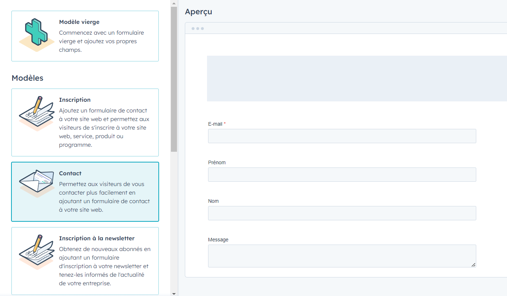

Nous allons utiliser un autre type de modèle:

- Sélectionnez le modèle vierge.
- Cliquez sur “Démarrer”.

Nous arrivons finalement dans l’éditeur de formulaires qui nous permet d’ajouter, modifier ou de supprimer des propriétés.

Les propriétés de contact stockent des informations sur vos contacts, telles que leur adresse email ou la dernière fois qu'ils ont rempli un formulaire. HubSpot crée des propriétés par défaut dans chaque compte pour stocker des informations importantes.

A gauche nous avons le volet des propriétés où nous pouvons rechercher toutes les propriétés se trouvant dans Hubspot où en créer de nouvelles.

Au centre, nous avons notre formulaire qui ne contient que pour l'instant la propriété Email que le prospect remplira par la suite.

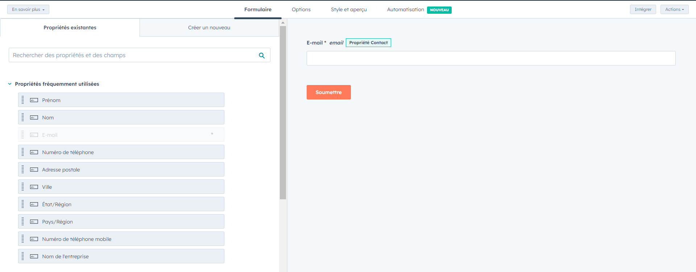

Demandons également un nom et un prénom pour enrichir les données de notre CRM.

Vous pouvez déplacer la propriété de l'onglet gauche vers le formulaire en le glissant-déposant, sinon un simple clic dessus suffit à déplacer l'élément. Faites cela pour le "Nom" et le "Prénom".

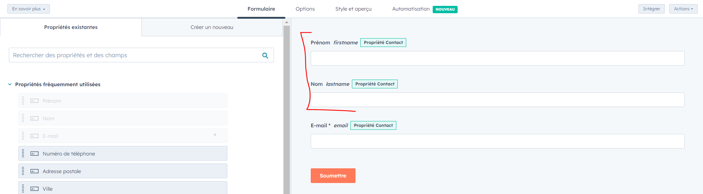

Ensuite, nous allons paramétrer notre formulaire. _ En haut, cliquez sur l’onglet Options. _ Sous la question “Que doit-il se produire si ce formulaire est soumis ?”, vous pouvez choisir entre plusieurs options (comme, par exemple, afficher un message ou rediriger vers une autre page de votre site web).

Vous pouvez remplacer le message par "Merci d’avoir rempli le formulaire, nous vous recontacterons au plus vite".

- Allez ensuite dans l’onglet Style et aperçu.
  C’est ici que vous pouvez choisir le style de votre formulaire pour par exemple changer le bouton orange par les couleurs de votre entreprise, la police des textes, etc… Par contre, la plupart des options style ne sont disponibles que pour une licence payante.

- Donnez un nom interne à votre formulaire "Formulaire de contact".

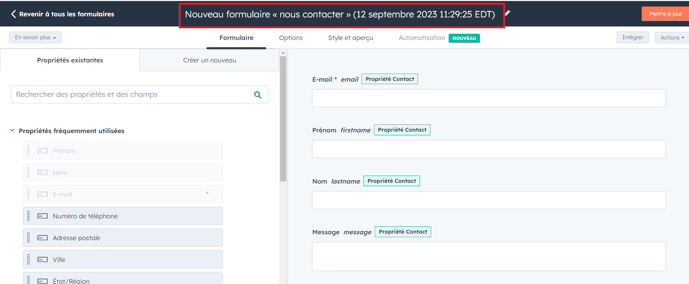

Et cliquez sur "Mettre à jour" puis "publier".

Vous obtenez un lien que vous pouvez partager à n’importe qui afin qu’il puisse remplir le formulaire dans forte CRM.

Dans l’onglet “Intégrer le code” vous obtiendrez un code que vous pourrez installer sur votre site web afin de convertir vos visiteurs en prospects.

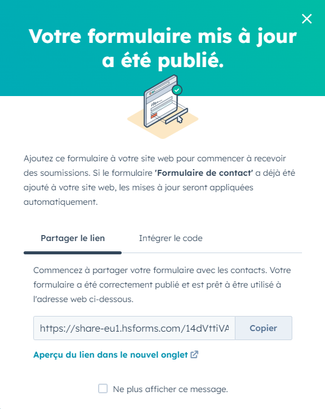

# Intégration de formulaires externes avec HubSpot

Un compte zapier doté d’un essai gratuit, un compte typeform et un compte google form sont nécessaire pour cette partie.

Il peut y avoir plusieurs raisons pour lesquelles vous voudriez créer des formulaires en dehors de HubSpot : _ L’utilisation d'une plateforme spécifique offrant des fonctionnalités distinctes. _ La facilité d’intégration d'autres outils ou systèmes dur Hubspot. \* La possibilité d’une personnalisation avancée allant au-delà des capacités de HubSpot.

Intégrer des formulaires externes constitue un challenge supplémentaire, puisqu’il faut s’assurer de la bonne synchronisation et du bon formatage des données. Pour autant ce n’est pas mission impossible, que ce soit avec des intégrations natives ou via un outil tierce, vous pouvez intégrer (presque) n’importe quel formulaire externe à hubspot.

Exemple d’intégration : Typeform et HubSpot
Dans cet exemple, vous avez décidé d'utiliser un formulaire externe, comment l'intégrer avec HubSpot ?

Lorsqu’elles bénéficient d’une intégration à Hubspot, les applications sont simples à connecter. C’est le cas de Typeform.

Suivons le processus étape par étape :

Préparer tous les éléments _ Créez-vous un compte sur Typeform. _ Créez un formulaire

Faire la connexion _ Accédez à HubSpot. _ Naviguez vers le logo "Marketplace". _ Cliquez sur marketplace des applications _ Recherchez typeform, puis cliquez sur “Installer l’application _ Connectez-vous _ Sélectionnez le formulaire désiré

Faire correspondre les données _ Activez l’intégration Hubspot _ Donnez les autorisations _ N'oubliez pas de publier votre application ... _ ...et de choisir le mapping pour votre formulaire \* Vous pouvez modifier les propriétés de la connexion si vous le souhaitez même après la validation

<a href="https://assets-datascientest.s3.eu-west-1.amazonaws.com/DMAR/HubSpot+%26+Typeform.mp4">Lien vers vidéo</a>

Et c’est terminé !

Avec ces + de 1840 intégrations, il est très probable que votre formulaire soit intégrable facilement à Hubspot. Mais certains cas font exception, comment les gérer ?

# Exemple d’intégration via un outil tierce

Plusieurs raisons peuvent vous contraindre à devoir utiliser un formulaire déjà configuré. Ça peut être un formulaire de votre site web ou d’une landing page par exemple. Si celui-ci n’a pas d’intégration avec Hubspot, il reste possible de synchroniser les données !

Il est possible de pousser vos données vers Hubspot via un webhook.

Un webhook est un outil qui permet à une application d'envoyer des notifications automatiques à une autre application dès qu'un événement spécifique se produit. Il facilite une communication instantanée entre les applications sans avoir à vérifier constamment les mises à jour.

Avant de commencer _ Lancez un essai gratuit et créez un compte sur Zapier _ Créer votre Google Form et publiez-le _ Installer cette extension qui va permettre à Google Form de créer des “Notifications” _ Activez l’extension

Faire la connexion : _ Ouvrez l’interface de Zapier et créez un nouveau "Zap" _ Sélectionnez “Webhook” comme déclencheur _ Choisissez l'événement “Catch Hook” _ Copiez le Webhook (le lien proposé) _ Retournez sur Google Form et copiez le lien dans l’extension _ Pour l’action, choisissez HubSpot _ Suivez les étapes pour connecter Google Forms et HubSpot via Zapier _ Choisissez l’évènement “ajouter à une liste” \* Testez votre ZAP !

Intégration de données
Testez votre Zap pour vous assurer que les données sont correctement transmises.

# Exercice N°1

Les formulaires font partie des éléments de base de l’Inbound Marketing dans Hubspot. Nous allons donc créer un formulaire à destination des visiteurs de notre site web afin qu’ils puissent laisser leurs informations de contacts.

En vous aidant du cours “Des formulaires qui convertissent”, créez un formulaire de contact ou vos futurs clients pourront laisser leurs informations de contacts qui sont : nom, prénom, email et numéro de téléphone.

# Personnalisation des landing pages pour optimiser l'expérience utilisateur Hubspot

Une landing page (page d'atterrissage en français) est une page web spécialement conçue pour déclencher une action précise chez l’utilisateur. L’action attendue est souvent un téléchargement, un achat ou une soumissions de formulaire.

Elle est généralement le premier point de contact entre un visiteur et une offre spécifique, qu'il s'agisse d'un produit, d'un service, d'un téléchargement ou d'une inscription.

Mais dans quoi réside sa valeur ajoutée ? Par rapport à un site web par exemple:

Dans son ciblage précis : Une landing page est conçue pour une audience et une campagne marketing spécifique. Elle permet ainsi d'adresser un message clair et pertinent à une cible bien définie. Le public a plus de chance de se sentir concerné par la landing page, donc de continuer la lecture. Sur l’exemple ci-dessous, la cible est clairement énoncée. La landing page s’adresse à des auto-entrepreneurs. En arrivant sur cette page, un auto-entrepreneur se sentira directement appelé.

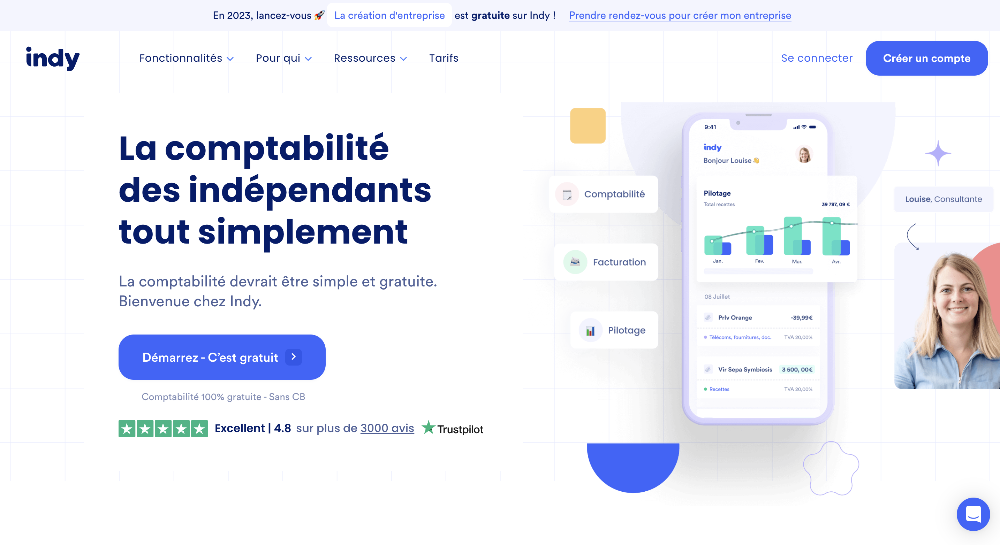

Dans son optimisation taux de conversion : En se concentrant sur une action précise (achat, inscription, téléchargement, etc.), la landing page augmente les chances de conversion. En effet, la structure, le design, tout est fait pour que l’utilisateur passe à l’action. Tous les éléments qui pourraient le distraire ou lui faire quitter la page (lien vers les réseaux sociaux, lien vers les autres pages) sont exclus. Hors de question de le perdre après tous les efforts engendrés pour le faire atterrir sur la page ! Par exemple, par sa structure, son design et son argumentation, on comprend bien que la landing page ci-dessous a été faite pour que l’utilisateur clique sur le bouton afin de laisser ses coordonnées. Rien n’est en trop, pas de menu, pas de liens externes ou de section “actualités”. Tout cela maximise les chances de déclencher l’action attendue.

Comment créer une landing page efficace ?

Pour créer une landing page efficace, en plus d’être fonctionnelle, assurez-vous d’avoir : _ Un message clair : le message/proposition de valeur de votre landing page doit être clair et direct. Évitez les formulations inutiles. _ Citer ou engager la cible pour qu’elle se reconnaisse et se sente concernée dès les 3 premières secondes. \* Un appel à l'action (CTA) visible : Vos CTA doivent être bien en évidence et inciter le visiteur à agir.

Une fois que nous avons terminé de créer nos premiers formulaires, il nous faut créer une page de destination afin d’héberger notre formulaire. Les landing pages sont souvent utilisées dans le cadre d’une stratégie d'inbound marketing. Dans notre cas, l’action est la soumission de notre formulaire par le visiteur de notre page web. Nous allons donc créer une landing page permettant aux visiteurs de remplir notre formulaire en échange d’un livre blanc sur le sujet qui l’intéresse.

Par exemple, le titre du livre blanc pourrait être "Top 5 des outils d’email marketing".

- La première étape est de se rendre dans l’onglet "Contenu" puis "Page de destination"

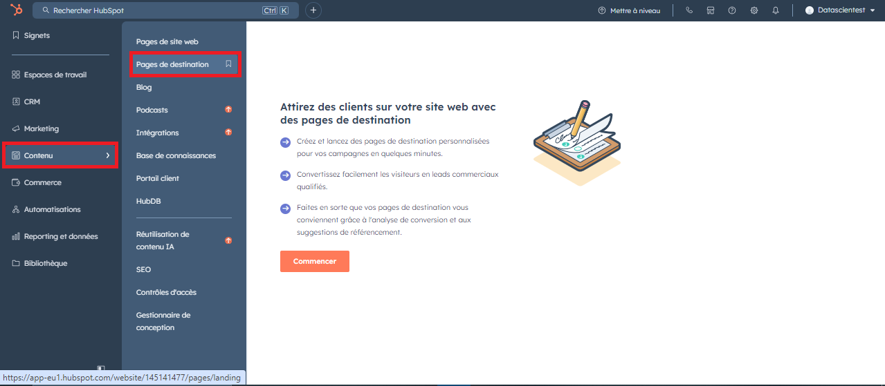

- Cliquez sur "Commencer à partir de zéro"
- Un nouvel onglet s’affiche pour vous demander de choisir un nom pour votre page

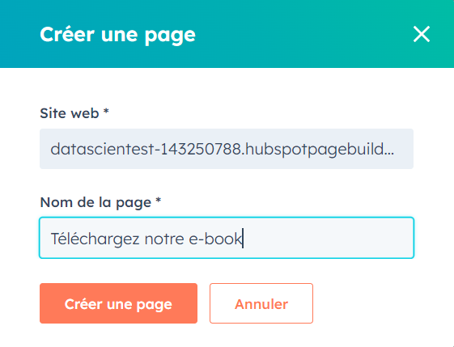

- Une fois le nom défini, cliquez sur “Créer une page”.
- Sur la nouvelle page qui s'ouvre choisissez le thème Growth comme thème actif, puis vous allez pouvoir choisir un modèle:

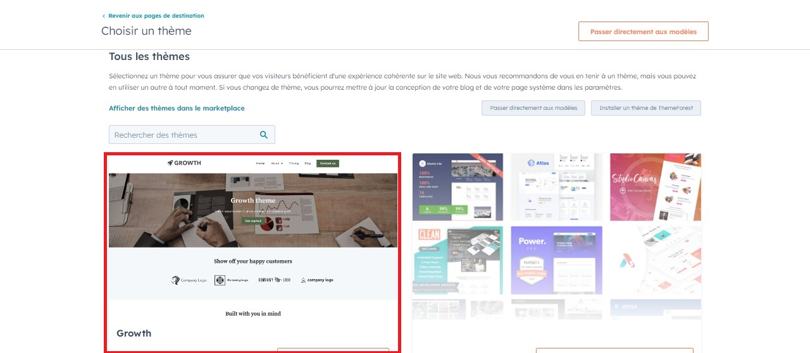

Nous vous proposons de choisir le template "Landing page - clickthrough" car il se rapproche le plus de ce que je souhaite proposer à mes visiteurs : "téléchargez mon e-book en échange de votre adresse email".

Vous pouvez cliquer sur "Prévisualiser Template" pour voir à quoi ressemblera votre future page et lorsque vous vous êtes décidés, cliquez sur "sélectionner un modèle".

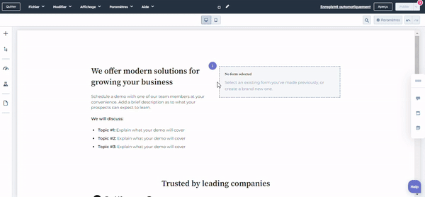

Une fois dans la page de l’éditeur, comme nous le montre le GIF ci-dessus, nous pouvons modifier notre landing page comme bon nous semble.

L’éditeur fonctionne sous le format "Drag & Drop" (glisser et déposer) qui nous permet de sélectionner un élément avec notre souris comme l’emplacement d’un texte ou d’une image puis de placer cet élément sur notre landing page.

Dans le volet de gauche, nous avons les éléments que nous pouvons ajouter à notre site web (titre, texte, image, formulaire, etc…) et au centre nous avons notre futur landing page.

N’oubliez pas d’ajouter un formulaire à votre page afin de permettre aux visiteurs de laisser leurs informations directement dans votre CRM.

Une fois réalisé, il nous suffit de cliquer sur "Publier" en haut à droite de l’écran pour mettre la landing page en ligne !

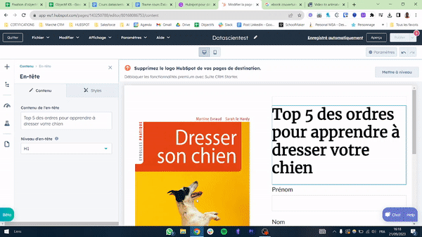

# Exercice N°2

En vous aidant du cours, recréez la landing page ci-dessous sur Hubspot qui a pour objectif de convertir les visiteurs de la page en leads avec un titre, une image et en y insérant votre formulaire que vous avez créé dans l’exercice N°1.

Voici la landing page à reproduire :

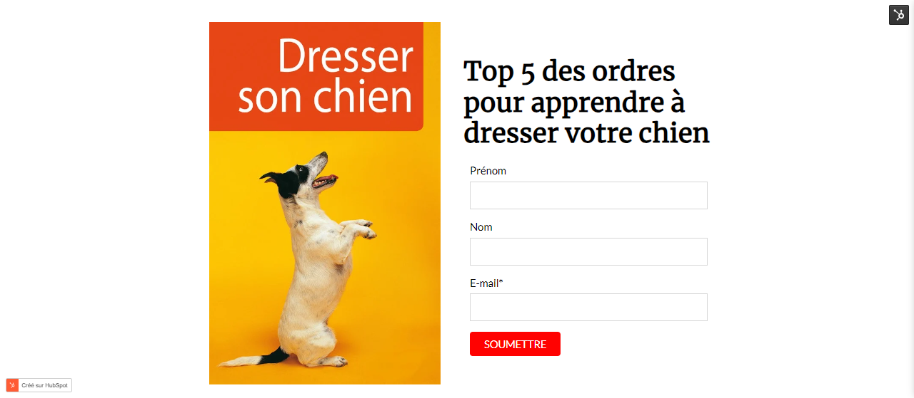

Les éléments à utiliser :

- Modèle : le modèle hubspot à sélectionner est le suivant : Landing page - clickthrough
- Titre : Top 5 des ordres pour apprendre à dresser votre chien
- Image : Téléchargez et enregistrez l'image sur votre ordinateur
- Formulaire : Ajoutez le formulaire créé précédemment.

# Téléverser des documents téléchargeables dans Hubspot

L'outil "Files" (Fichiers) dans HubSpot sert à gérer, stocker et organiser les fichiers numériques tels que des images, des documents PDF, des vidéos, des présentations et d'autres types de fichiers que vous utilisez dans le cadre de vos campagnes marketing, de vos ventes ou de vos interactions avec les clients. Dans notre cas, l’outil Fichier nous servira à importer notre ebook et à l’héberger sur Hubspot.

Pour y accéder, retournez sur la page d'accueil de hubspot puis cliquez sur "Bibliothèque", puis "Fichiers".

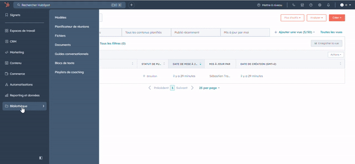

Importez ce fichier dans Hubspot.

## Conclusion

Ce cours et les premiers pas sur Hubspot s'achèvent. Continuons l'apprentissage avec des fonctionnalités avancées qui vous seront très utiles.
