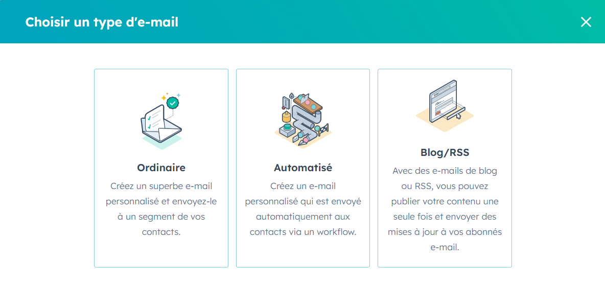
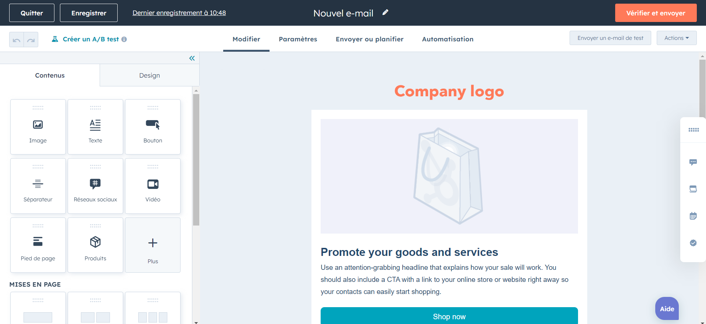
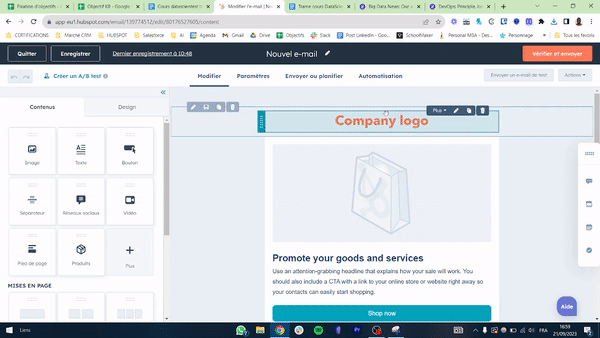
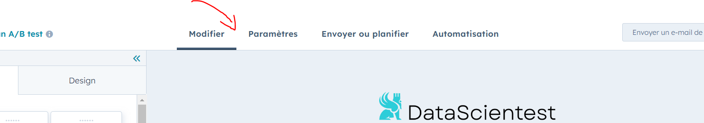
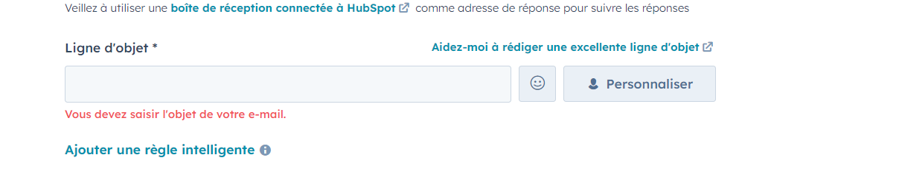
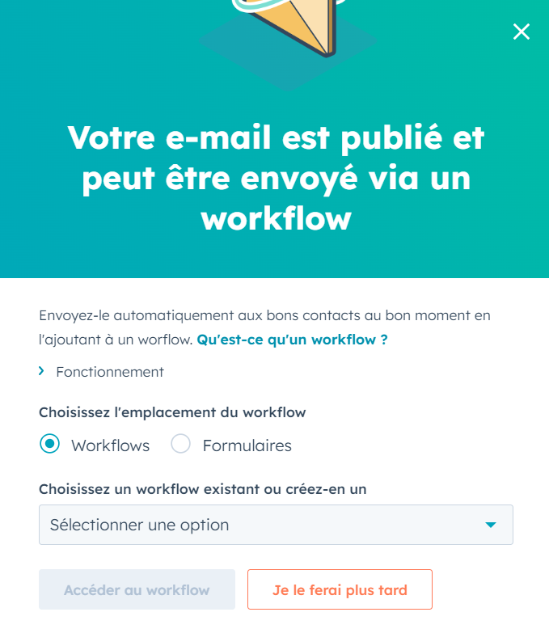
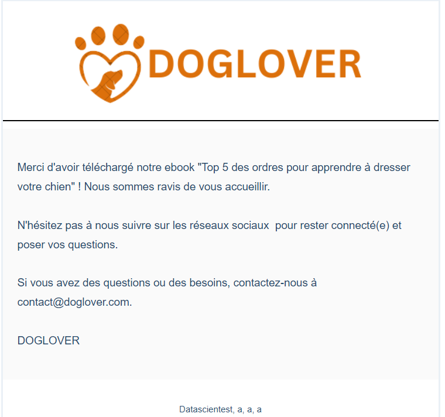

## Gérer des campagnes d'email marketing via Hubspot

# Création d'e-mails automatisés avec le CRM Hubspot

Pour réaliser ce chapitre, assurez-vous d’avoir créé un compte test développeur sur Hubspot. Si ce n’est pas le cas, référez-vous au notebook 3 "Création du compte développeur et premiers pas sur Hubspot" avant de passer au cours suivant.

En plus de pouvoir stocker nos contacts, créer des formulaires et des landing pages, Hubspot peut également envoyer des emails automatiques à nos contacts.

Cela est très utile car il nous permet par exemple de pouvoir envoyer un email de bienvenue à un lead lorsqu’il vient de télécharger notre ebook sur la landing page.

Nous allons commencer par créer notre premier email sur la plateforme: _ Dans Hubspot, rendez-vous sur "Marketing" puis "E-mails marketing" _ Cliquez sur "Créer un email"

Ici, vous pouvez choisir 3 types d’emails : _ Ordinaire : Créez et envoyez manuellement des emails personnalisés, adaptés à des occasions spécifiques comme les newsletters ou les promotions. _ Automatisé : Configurez des emails qui sont envoyés automatiquement en réponse à des actions spécifiques des contacts, pour personnaliser les communications en fonction de leur comportement. \* Blog / RSS : Automatisez l'envoi d'emails contenant les dernières publications de votre blog ou de votre flux RSS pour maintenir un engagement régulier avec votre audience.

- Choisissez “Automatisé”
- Puis sélectionnez votre modèle. De notre côté, nous avons choisi le modèle "Promotion":

Vous arriverez dans l’éditeur de l’email. C’est là où nous allons concevoir notre email de A à Z.

A gauche se trouvent les éléments de contenu qui nous permettent d’ajouter des images, du texte, un bouton etc… Oui c’est exactement le même principe que pour les landing pages.

Au centre se trouve l’aperçu de l'email. C’est ici que nous allons ajouter les éléments de contenu.

- Editez votre email en ajoutant un logo
- Ajoutez une image de couverture
- Modifiez le texte

Une fois que vous avez terminé d’éditer votre email, aux couleurs de votre entreprise, il nous faut créer l’objet de votre email.

- Cliquez sur l’onglet “Paramètres”

- Et dans la zone “Ligne d’objet”, ajoutez votre objet

- Lorsque tout est prêt, cliquez sur “Vérifier et publier” pour activer votre email automatisé

Un pop-up s’affiche pour vous confirmer que votre email est maintenant publié. Nous devons maintenant créer un Workflow pour automatiser votre email :

- Cliquez sur “Je le ferai plus tard”

# Exercice

Une fois que vous avez créé votre formulaire, et votre landing page, il est temps de créer un email de bienvenue pour souhaiter la bienvenue aux leads qui ont téléchargé votre ebook.

Vous allez réaliser l’email ci-dessous :

Les éléments à utiliser : _ Modèle : Vous utiliserez le modèle “Simple”, le premier modèle proposé par Hubspot _ Objet : Bienvenue chez Doglover \* Logo :

Corps du texte :

Merci d'avoir téléchargé notre ebook "Top 5 des ordres pour apprendre à dresser votre chien" ! Nous sommes ravis de vous accueillir. N'hésitez pas à nous suivre sur les réseaux sociaux pour rester connecté(e) et poser vos questions. Si vous avez des questions ou des besoins, contactez-nous à contact@doglover.com. DOGLOVER

# Conclusion

Voici pour les mails automatisés, le prochain chapitre abordera l'automatisation des processus.
