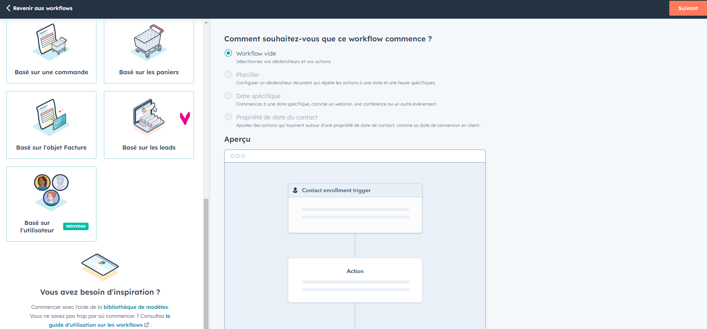
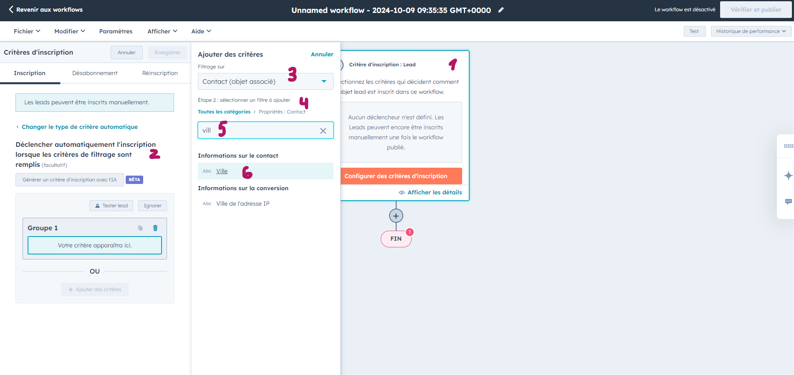
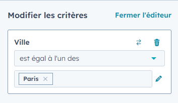
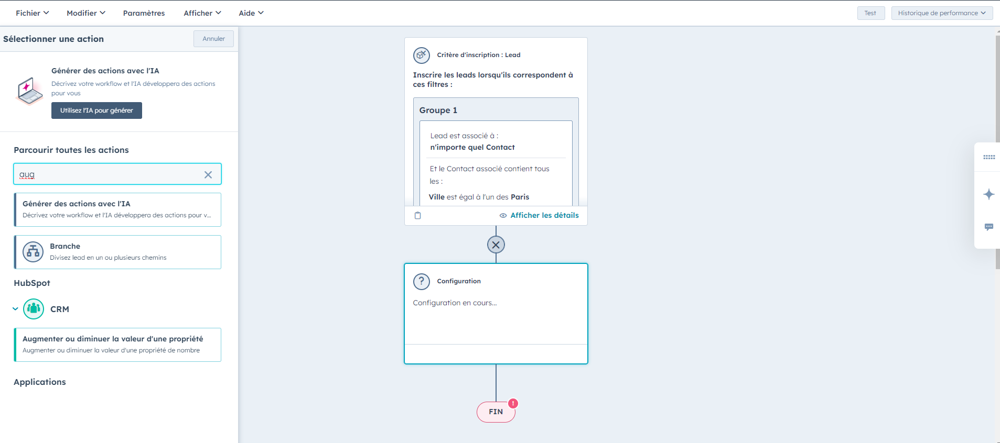
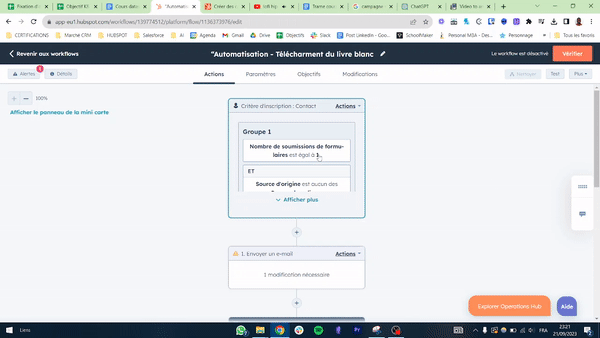

## Automatisation des processus marketing

# Définir un scénario

Kézako ?
Lorsque l'on parle d'automatisation du marketing, le concept de "scénario" est central.

Un scénario est une séquence d'actions automatisées déclenchées par un événement ou un comportement spécifique du client.

Ces actions peuvent inclure l'envoi d'emails, la mise à jour de la base de données CRM, la publication sur les réseaux sociaux, et bien d'autres activités. Le but est de guider le client ou le prospect à travers le parcours d'achat de manière fluide et pertinente.

# Les éléments clés d’un scénario

Un scénario efficace repose sur plusieurs éléments clés. Voici les éléments qui définissent la structure et la réussite d'un scénario :

- Le déclencheur : C'est l'événement initial qui lance le scénario. Il peut s'agir d'une action effectuée par un utilisateur (par exemple, s'inscrire à une newsletter, télécharger un ebook) ou d'un événement automatique (par exemple, un anniversaire ou une date d'expiration d'abonnement).

- La condition : Une fois le déclencheur activé, le scénario peut vérifier certaines conditions avant de procéder. Par exemple, un utilisateur a-t-il déjà acheté un produit spécifique ? Est-il un nouveau visiteur ou un client fidèle ?

- L’action : C'est l'étape où une activité spécifique est réalisée en réponse au déclencheur et aux conditions. Cela peut être l'envoi d'un email, la mise à jour d'un enregistrement dans une base de données ou la publication sur les réseaux sociaux.

- Délai : Dans certains scénarios, il est essentiel d'introduire un délai entre les actions. Par exemple, attendre 24 heures après l'envoi d'un email promotionnel avant de lancer une relance.

- La segmentation : Cela implique de cibler un sous-ensemble spécifique de votre audience en fonction de critères tels que le comportement, la démographie ou l'historique d'achat. La segmentation garantit que le bon message atteint le bon public.

# Exemple de scénario de retargeting pour un visiteur de Blog

Voici notre contexte pour cet exemple : Un utilisateur visite votre blog, lit quelques articles, mais ne s'inscrit pas à votre newsletter ou ne réalise aucune autre action significative. Vous souhaitez le retargeter avec des publicités pertinentes pour l'encourager à revenir sur votre site et, éventuellement, à s'engager davantage.

- Déclencheur : L'utilisateur visite votre blog.

- Condition : L'utilisateur a passé plus de 5 minutes sur le blog (indiquant un intérêt). L'utilisateur n'a pas réalisé d'action de conversion (par exemple, inscription à la newsletter, téléchargement d'un ebook, etc.).

- Action 1 : Après 24 heures, l'utilisateur est retargeté avec une publicité sur les réseaux sociaux ou via des réseaux publicitaires montrant un article populaire ou un contenu récent du blog.

- Délai : Attendre 72 heures pour observer le comportement de l'utilisateur (a-t-il cliqué sur la publicité ? Est-il revenu sur le blog ?).

- Condition (suite à l'Action 1) : Si l'utilisateur clique sur la publicité et revient sur le blog mais ne s'inscrit toujours pas à la newsletter.

- Action 2 : Retargeter l'utilisateur avec une autre publicité, cette fois en mettant en avant un avantage exclusif pour les abonnés à la newsletter (par exemple, un guide gratuit, un accès à des webinaires, des remises, etc.).

Cet exemple illustre une stratégie de retargeting courante pour re-capter l'attention d'un visiteur de blog.

# Construire un scénario, une approche méthodique :

Pour construire un scénario efficace, suivez ces étapes :

- Définissez des objectifs clairs (toujours) : qu’est ce que vous souhaitez accomplir avec votre scénario ? Souhaitez-vous augmenter les conversions, engager davantage vos clients, générer des leads ou fidéliser vos clients existants ?

- Cartographiez les étapes clés que vos clients ou prospects traversent, de la découverte à la conversion. Cela vous aidera à comprendre quand et comment interagir avec eux pour obtenir les meilleurs résultats.

- Identifiez les déclencheurs nécessaires pour votre scénario.

- Planifiez les actions : une fois le déclencheur activé, quelles actions voulez-vous que votre système effectue automatiquement ?

- Intégrez des conditions et des filtres : Parfois, vous voudrez peut-être que certaines actions ne se produisent que sous certaines conditions.

- Testez votre scénario : Avant de lancer votre scénario, testez-le en conditions réelles pour vous assurer qu'il fonctionne comme prévu. Cela vous aidera à identifier et à corriger les éventuels problèmes.

- Mesurez et optimisez : Une fois votre scénario lancé, suivez régulièrement ses performances. Utilisez les données collectées pour apporter des modifications et améliorer l'efficacité de votre scénario.

# Implémenter un scénario

# Gestion des workflows pour automatiser les actions marketing sur HubSpot

Plus tôt, on a identifié le 'scénario' comme la séquence d'actions que vous voulez que vos clients suivent. Pour mettre en œuvre cette séquence sur HubSpot, nous utilisons les 'workflows'

Scénario vs. Workflow : _ Scénario : Il décrit le parcours souhaité pour votre client ou prospect. _ Workflow : C'est l'outil technique dans HubSpot qui permet de mettre en œuvre ce parcours. C'est là que votre scénario prend vie, transformant les idées en actions automatisées.

Maintenant, plongeons dans la manière dont HubSpot vous permet d'opérationnaliser vos scénarios.

# Création d’un workflow de lead scoring

Le lead scoring est une méthode pour attribuer une valeur à chaque lead basée sur divers critères, tels que le comportement sur votre site, l'engagement avec votre contenu, et d'autres données démographiques. Cela vous permet de prioriser les leads qui sont les plus susceptibles de se convertir.

HubSpot offre des outils robustes pour automatiser ce processus grâce à la création de workflows. Voyons comment mettre en place un workflow de lead scoring.

À la fin de cette section, vous serez capable de mettre en place un workflow de lead scoring sur HubSpot pour prioriser et segmenter vos leads.

Étape 1: Définissez vos critères de scoring

- Listez les actions ou comportements qui indiquent l'intérêt d'un lead. (Par exemple : visite d'une page produit, téléchargement d'un ebook, ouverture d'un email)
- À côté de chaque action, attribuez un score.

Par exemple :

| Action | Score | | ---------------------------------- | ------- | | Habite à Paris | + 10 | | Habite hors de Paris | - 10 | | A déjà visité le site web , etc. | + 3 |

Assurez-vous d'avoir au moins 5 actions avec des scores associés.

Étape 2: Configuration du workflow dans HubSpot

- Connectez-vous à HubSpot.
- Naviguez vers l'onglet "Automatisations" puis "Workflows".
- Sélectionnez "Créer un workflow à partir de zéro" puis choisissez "Basé sur les leads" comme type dans le menu à gauche. Cliquez sur "Suivant"

Vous devriez maintenant être dans l'interface de création de workflow.

Étape 3: Définition des déclencheurs

- Sélectionnez un déclencheur en cliquant directement sur le carré "Critère d'inscription : Lead". Dans le menu à gauche choisissez "Lorsqu'un critère de filtrage est rempli". Prenez "Contact" comme objet de filtrage, puis "Propriétés : Contact".

- Ensuite vous pouvez choisir un filtre en particulier, par exemple, la ville du contact = Paris.

- En cliquant sur le bouton "+" en dessous du déclencheur, configurez l'action à faire lorsque ce déclencheur est activé. Par exemple, "Augmenter ou diminuer la valeur d'une propriété":

Testez votre déclencheur ! Lorsque ce déclencheur est activé, le score appliqué à la propriété que vous avez défini est-il correctement attribué?

Étape 4: Ajout d'actions supplémentaires

- Répétez l'étape 3 pour tous les critères de votre liste.

Étape 5: Test du workflow

- Lancez un test de votre workflow pour vous assurer que les scores sont correctement attribués.

Étape 6: Lancement

- Une fois satisfait de votre workflow, publiez-le.

# Création d’un workflow d’e-mailing

Un workflow dans Hubspot, c'est un peu comme un assistant automatique pour gérer vos relations avec les clients. Imaginez que vous avez un magasin en ligne. Chaque fois qu'une personne visite votre site, s'inscrit à votre newsletter, ou achète quelque chose, le workflow va automatiquement réagir en fonction de ce qu'elle fait.

Par exemple, si quelqu'un s'inscrit à votre newsletter, le workflow peut automatiquement lui envoyer un e-mail de bienvenue. Si cette personne achète un produit, le workflow peut lui envoyer un e-mail de confirmation de commande. Si elle visite votre site plusieurs fois, le workflow peut lui envoyer des recommandations de produits basées sur ses intérêts.

En résumé, un workflow dans Hubspot automatise les étapes que vous suivez pour interagir avec vos clients, en fonction de ce qu'ils font, pour rendre ces interactions plus efficaces et personnalisées. C'est un outil puissant pour améliorer vos relations client et votre marketing.

Nous allons donc justement en créer un ! _ Dans Hubspot vous pouvez accéder aux workflows en allant dans "Automatisations" puis "Workflows". _ Puis créez un workflow à partir d’un modèle. \* Sélectionnez le modèle "Envoyez une série d’emails quand un formulaire est soumis".

Notre objectif est que lorsqu’un visiteur télécharge notre ebook en soumettant à notre formulaire, il reçoit automatiquement un e-mail de bienvenue.

Donnez un nom à votre workflow en cliquant tout en haut comme par exemple "Automatisation - Télécharment du livre blanc".

- Puis ajoutez votre email automatisé.

- Ensuite, cliquez sur "Vérifier et publier".
- Dans la fenêtre qui s’affiche, sélectionnez : “Non, inscrire uniquement les contacts qui répondent aux critères de déclenchement après l'activation du workflow”.
- Cliquez sur "Activer le workflow" après la vérification de toutes les étapes.

# Conclusion

Avec les processus automatisés, vous voyez à quel point nous pouvons aller loin avec Hubspot. Avec la pratique vous serez en mesure de gagner en complexité. Dans le prochain chapitre, nous allons analyser les campagnes lancées.
