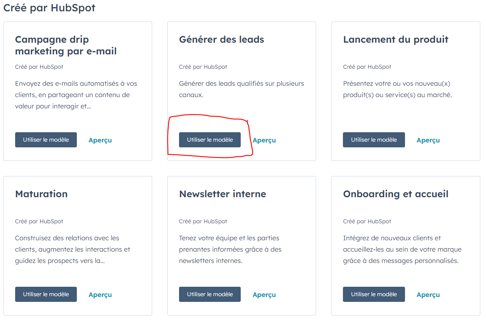
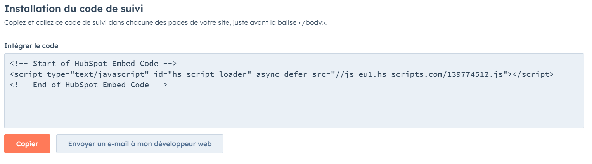

## Campagnes & Tracking

# Mesure des résultats et des performances des campagnes Hubspot

Une campagne dans Hubspot permet de centraliser toutes les actions marketing ayant le même objectif. L'outil Campagnes de Hubspot pour créer et gérer des rapports sur une seule campagne marketing avec plusieurs ressources en un seul endroit.

Par exemple, dans notre cas, notre campagne qui a pour objectif de générer de nouveaux leads par le téléchargement de notre e-book, comprendra les différentes ressources que nous avons créées : landing page, formulaire, email automatisé et workflow.

Les éléments d'une campagne dans Hubspot :

- Objectif : le but de votre campagne, tel que la vente d'un produit ou l'information des personnes sur une offre spéciale.

- Messages : les e-mails ou les messages que vous envoyez aux personnes, par exemple, un e-mail de bienvenue ou une promotion.

- Liste de contacts : la liste des personnes à qui vous envoyez vos messages, en fonction de critères comme leurs intérêts.

- Automatisation : au lieu d'envoyer manuellement chaque message, vous configurez Hubspot pour les envoyer automatiquement lorsque les personnes remplissent certaines conditions.

- Suivi : vous pouvez voir qui a ouvert vos e-mails et comment les gens réagissent à vos messages.

- Résultats : vous mesurez le succès de votre campagne en fonction de ce que vous vouliez accomplir, comme le nombre de produits vendus.

Voyons voir comment créer une campagne dans Hubspot pour générer de nouveaux leads : _ Depuis votre compte Hubspot, accédez à "Marketing" et "Campagnes". _ En haut à droite, cliquez sur “Créer une campagne” puis "Commencez à partir du modèle". \* Dans la bibliothèque de modèles, sélectionnez le modèle “Générer des leads” car c’est l’objectif que nous souhaitons réaliser.

- Dans le panneau de droite qui s’affiche, configurez votre campagne puis lorsque tout est prêt, cliquez sur "Créer".
- Nous allons ensuite ajouter toutes les ressources que nous avons créées précédemment à savoir landing page, formulaire, email automatisé et workflow.

- Une fois fait, cliquez sur “enregistrer et afficher”

Nous arrivons sur notre campagne qui est actuellement vide, il n’y a aucune session, pas de nouveaux contacts, aucun taux de conversion et c’est normal car pour le moment personne n’a encore visité notre page et téléchargé notre e-book.

Vous pouvez pour tester la campagne aller dans votre landing page et remplir le formulaire pour voir si vous recevez votre email de bienvenue.

Et en retournant sur cette campagne, vous verrez qu’une personne à souscrit à votre formulaire et un joli taux de conversion de 100%.

# Utilisation des rapports et des tableaux de bord dans le CRM Hubspot

Les tableaux de bord en marketing automation dans Hubspot sont des outils puissants qui vous permettent de surveiller, d'analyser et d'optimiser vos campagnes marketing automatisées.

Ils vous offrent une vue d'ensemble claire de la performance de vos actions, de l'engagement des contacts, et de l'efficacité de votre stratégie d'automatisation. Ici, nous allons explorer en détail comment utiliser les tableaux de bord de marketing automation pour maximiser les résultats de vos campagnes.

Voici un résumé de leurs principales caractéristiques et avantages :

Visualisation des Données : Les tableaux de bord vous offrent une vue d'ensemble claire de vos campagnes automatisées, en regroupant des informations telles que les taux d'ouverture d'emails, les taux de clics, les conversions, et bien plus encore. Cela vous permet de suivre les performances de vos campagnes en un coup d'œil.

Personnalisation : Vous avez la flexibilité de créer des tableaux de bord personnalisés en fonction de vos besoins spécifiques. Vous pouvez choisir les widgets et les rapports à inclure, ce qui vous permet de vous concentrer sur les KPI qui importent le plus pour votre entreprise.

Analyse en Profondeur : Les tableaux de bord vous permettent d'explorer en profondeur les tendances de comportement des contacts à travers votre automatisation. Vous pouvez identifier ce qui fonctionne bien et ce qui doit être amélioré.

Prise de décision : Les données fournies par les tableaux de bord vous aident à prendre des décisions éclairées pour ajuster et optimiser vos campagnes. Vous pouvez apporter des modifications en temps réel pour améliorer les performances.

Automatisation des Rapports : Hubspot offre également la possibilité d'automatiser la génération et la distribution de rapports périodiques, vous permettant ainsi de rester informé sans avoir à vérifier manuellement les données.

- Pour créer notre premier tableau de bord comprenant nos rapports, il faut se rendre sur l’onglet "Reporting" dans le menu à gauche puis "Tableaux de bord". Nous arrivons sur une page contenant différents modèles de tableaux de bord pour différents types de besoins.
- Sélectionnez le modèle “Génération de leads” et accédez à votre tableau de bord

C’est ici que vous verrez les données concernant vos contacts et les nouveaux leads entrant dans votre CRM. D’où proviennent t-ils, combien sont-ils et par quelles actions se sont inscrits dans votre CRM.

Ces rapports sont personnalisables et vous pouvez en créer de 0. N’hésitez pas à explorer les rapports pour trouver ceux qui correspondent à vos besoins en allant sur "Ajouter un rapport" en haut à gauche puis "Créer un rapport".

# Tracking

A quoi ça sert ?
Le tracking dans HubSpot, ou dans tout autre CRM, sert à surveiller et à enregistrer les interactions des visiteurs de votre site web. Il recueille des données essentielles sur ces interactions, le nombre de pages consultées, le temps de visite sur le site web, etc… Ce qui nous permet de mieux comprendre le comportement et les besoins de nos contacts.

Un bon exemple d'utilisation du tracking Hubspot est de pouvoir suivre l’engagement d’un contact. Le tracking permet de suivre quand un contact ouvre un e-mail, clique sur un lien dans un e-mail, visite votre site Web, télécharge du contenu, remplit un formulaire, etc.

# Implémentation du tag Hubspot sur un site web

- Depuis votre compte HubSpot, accédez à l'icône Paramètres en haut à gauche dans la barre de navigation principale.
- Dans le volet de gauche, cliquez sur l’onglet “Suivi et analyse”:
- Puis, cliquez sur Code de suivi dans le menu latéral gauche.
- Dans la section Intégrer le code, cliquez sur Copier.

Pour installer le code de suivi, collez le code juste avant la balise de fermeture dans le code HTML de chaque page de votre site. Et ça y est, vous avez installé le code de suivi hubspot sur votre site web. Plus plus d’informations, rendez-vous sur la page <a href="https://knowledge.hubspot.com/fr/reports/install-the-hubspot-tracking-code#installer-le-code-de-suivi-sur-votre-site-web">Knowledge de Hubspot</a>.

# Conclusion

Avec ces tableaux de bord et le tracking vous serez en mesure de suivre vos campagnes efficacement. C'est essentiel de réaliser ces analyses pour assurer de la pertinence de nos actions.

Passons à la conclusion finale et l'examen.
