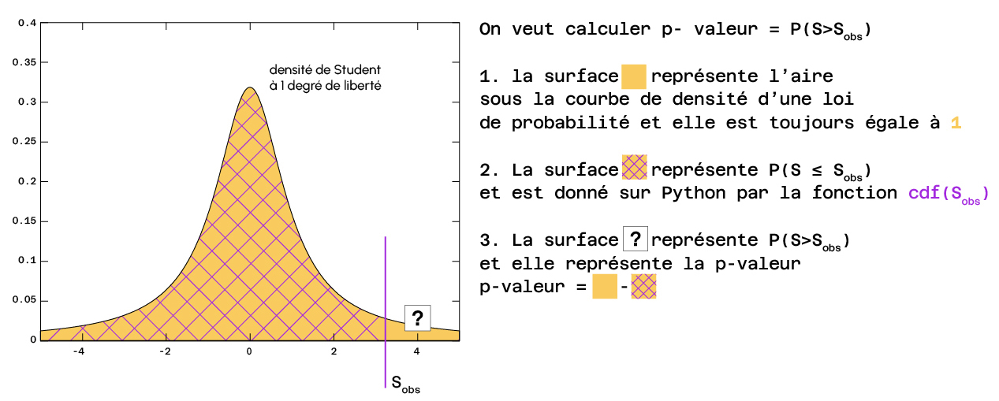

## Statistiques exploratoires - Analyse des liaisons entre les variables d'un jeu de données

# Contexte et objectifs

Pour examiner des liaisons entre des variables d'un dataset il faut distinguer trois niveaux d'analyse :

- liaisons entre les variables quantitatives,
- liaisons entre les variables qualitatives,
- liaisons entre les variables qualitatives et quantitatives.
  Pour chaque niveau d'analyse, on peut se poser cette question : y a-t-il dépendance ou indépendance entre les variables ?

Il y a dépendance entre les variables lorsque la valeur d'une variable fournit des informations sur la valeur d'une autre variable ou l'influence. À l'inverse, l'indépendance signifie que les variables ne s'influencent pas mutuellement et que la connaissance de la valeur de l'une ne permet pas de comprendre la valeur de l'autre.

L'objectif de ce module est d'arriver à déterminer s'il y a une dépendance entre des variables d'un jeu de données.

(a) Commençons par la phase d'importation des packages. Importer les packages pandas et numpy sous leur alias usuels.

​
Dans la première partie de ce notebook, nous allons apprendre comment est défini un test statistique, comment il est réalisé et comment interpréter ses résultats. Nous allons nous appuyer sur l'exemple suivant.

Le gérant d'un restaurant sait que le temps moyen qu'il lui faut pour livrer une commande est de 45 minutes.
Cependant l'équipe administrative a mis en place un nouveau système de traitement des commandes de livraison, et il se demande si le délai moyen de livraison a augmenté à cause de cela.
Pour répondre à cette question, il prend un échantillon d'ordres de livraison.

Pour répondre au questionnement du gérant, nous souhaitons savoir si le temps de traitement d'une commande a significativement changé. Pour cela, nous allons effectuer un test statistique, qui est un protocole scientifique permettant de tirer une conclusion fiable. Nous allons donc passer par toutes les étapes d'un test statistique pour comprendre comment il est réalisé.

(b) Exécuter la cellule suivante pour stocker la liste des délais répertoriées pour 20 livraisons.

# l'échantillon :

delais = [40, 39, 46, 40, 42, 46, 38, 50, 43, 62, 51, 41, 52, 40, 49, 55, 50, 48, 40, 49]
​
​​

# Étape 1. Hypothèses

Soit 𝜇 le délai moyen actuel de livraison.
Le gérant pense que le délai moyen actuel est supérieur à l'ancien délai de 45 minutes. Nous notons cette valeur 𝜇0=45 (appelée la moyenne théorique). La moyenne théorique correspond à la moyenne de la distribution supposée sous l'hypothèse 𝐻0 (une distribution normale), et elle peut s'aligner ou non sur la distribution réelle des valeurs.

Pour traiter ce problème nous posons d'abord les hypothèses suivantes :

Hypothèse nulle 𝐻0:𝜇=𝜇0 ⟺ le temps moyen reste inchangé, donc égal à la moyenne théorique 𝑚0

Hypothèse alternative 𝐻1:𝜇>𝜇0 ⟺ le délai moyen a augmenté par rapport au délai moyen théorique

L'objectif d'un test statistique est de rejeter l'hypothèse nulle 𝐻0 en faveur de l'hypothèse alternative 𝐻1
. Un test statistique n'est pas conçu pour confirmer ou pour accepter 𝐻0
. Le tableau suivant permet de mieux comprendre comment on interprète les deux hypothèses.

Hypothèse | Interprétation | Décision
𝐻0 | La différence observée n’est pas significative | Ne pas rejeter 𝐻0 n’est pas équivalent à dire que « 𝐻0 est vraie et 𝐻1 est fausse ». Cela veut dire uniquement qu'il n’y a pas d’évidence nette pour que 𝐻0 soit fausse.
𝐻1 | La différence observée est significative | La décision de rejeter 𝐻0 signifie que 𝐻1 est réalisée ou 𝐻1 est vraie.

(c) Écrire les hypothèses du test.

​​

# Étape 2. Choix du test

Une approche naïve serait de calculer la moyenne de l'échantillon delais et de vérifier si on rejette ou pas 𝐻0. Mais cela ne suffit pas comme méthode parce qu'il se peut que nous ayons eu "par chance" un échantillon qui a une moyenne supérieure à 45. Pour pouvoir conclure de manière rigoureuse, il faut utiliser une méthode statistique qui passe par un test statistique et par l'interprétation de la p-valeur.

Tout d'abord il faut choisir le test adéquat.

Le test adapté pour répondre à ce questionnement est le test de Student (ou t-test) pour un seul échantillon. Le test de Student pour un échantillon permet de vérifier si la moyenne d'échantillon est différente d'une valeur théorique.
Il faut savoir qu'en fonction des différents cas d'utilisation, on fait appel à différents tests statistiques. Dans ce Notebook, quatre tests statistiques classiques sont présentés (ANOVA, corrélation, 𝜒2, Student qui est un cas particulier du test d'ANOVA).

On choisit une valeur du seuil (appelé 𝛼). De manière classique on choisit 𝛼=5%, mais selon les différents domaines d'application, ce seuil peut être plus petit. Il nous permettra de prendre la décision avec une certaine confiance.

Le risque 𝛼 représente le risque que 𝐻0 soit rejetée alors qu'elle est en réalité vraie. Ce risque est également connu sous le nom d'erreur de type 1.

(d) Stocker le seuil de 5% dans une variable alpha.

​​

# Étape 3. Calcul de la statistique de test

Tous les tests statistiques reposent sur l'évaluation de la statistique de test, notée 𝑆, qui est donnée par une formule spécifique à chaque test. Cet outil permet de décider si on rejette ou pas l'hypothèse 𝐻0.
Sur notre échantillon, on calcule la statistique de test observée, qu'on note 𝑆𝑜𝑏𝑠 à partir de la formule de la statistique de test propre au test de Student.
Sous l'hypothèse 𝐻0 et en fonction de la taille de l'échantillon, la statistique suit une loi spécifique. Dès lors qu'on connait la loi, on peut calculer la probabilité d'observer cette statistique 𝑆𝑜𝑏𝑠.

Pour le test de Student, la statistique de test est donnée par la formule suivante :

𝑆obs=𝜇obs−𝜇0𝜎obs𝑛√ avec :

𝜇𝑜𝑏𝑠 = la moyenne de l'échantillon
𝜇0 = la moyenne théorique (ici on veut tester la valeur 45)
et où 𝜎𝑜𝑏𝑠𝑛√ est un estimateur de l'écart type de la population réelle pour lequel on a :
𝜎𝑜𝑏𝑠 = l'écart-type corrigé de l'échantillon, qui permet de réduire le biais de l'estimateur
𝜎̂ 𝑋=1𝑛−1∑𝑖=1𝑛(𝑥𝑖−𝑋̂ )2⎯⎯⎯⎯⎯⎯⎯⎯⎯⎯⎯⎯⎯⎯⎯⎯⎯⎯⎯⎯⎯⎯⎯⎯⎯⎯⎯⎯⎯⎯
𝑛 = la taille de l'échantillon

(e) En utilisant numpy, coder une fonction S(echantillon, mu0) qui permet de calculer la statistique de test en fonction de l'échantillon donné et de la moyenne théorique. Appliquer le paramètre ddof=1 à la méthode std de numpy qui retourne l'écart type corrigé.

​
(f) Créer une variable S_obs en appliquant cette fonction sur l'échantillon donné et avec la valeur de la moyenne théorique.

​

# Étape 4. Calcul de la p-valeur (p-value)

La p-value représente la probabilité d'obtenir une statistique de test au moins aussi extrême que la valeur observée 𝑆𝑜𝑏𝑠, en supposant que l'hypothèse nulle 𝐻0 est vraie.
En d'autres termes, elle quantifie la probabilité d'observer les données (ou quelque chose d'encore plus inhabituel) par pur hasard s'il n'y avait pas d'effet réel. Une valeur p très faible suggère qu'un résultat aussi extrême est improbable sous 𝐻0, fournissant ainsi une preuve contre l'hypothèse nulle.

Imaginez que vous jouiez 10 fois à pile ou face et que vous obteniez 10 fois de suite la réponse « face ». Il s'agit d'un résultat extrême. La valeur p vous indique la probabilité d'obtenir 10 fois de suite le résultat « face » par pur hasard (c'est-à-dire si la pièce est juste et qu'il n'y a pas d'effet réel). Si la valeur p est très faible (par exemple, 0,01), cela signifie qu'il est très improbable d'obtenir 10 fois le même résultat par hasard. Cela suggère qu'il pourrait y avoir autre chose et que l'hypothèse nulle (pas d'effet réel) n'est probablement pas vraie...

Comme 𝐻1 est formulé sous la forme 𝜇>𝜇0, la p-valeur=ℙ(𝑆>𝑆𝑜𝑏𝑠).
Remarque. Si on avait eu 𝐻1: 𝜇<𝜇0, on aurait eu p-valeur=ℙ(𝑆<𝑆𝑜𝑏𝑠)

Le schéma suivant permet de comprendre comment cette quantité clé est calculée.

Pour le test de Student à un seul échantillon la loi sous 𝐻0 est une loi de Student à 𝑛−1 degrés de liberté (avec 𝑛 =la taille de l'échantillon). Le nombre de degrés de liberté est un paramètre qui définit la loi.

Pour déterminer cette probabilité, il faut passer par l'utilisation de la fonction cdf() (cumulative distribution fonction) qui permet de calculer la surface jaune hachurée en violet sur l'image ci-dessus. Ainsi il faut bien spécifier dans la fonction la valeur du quantile, c'est-à-dire la frontière dans notre cas 𝑆𝑜𝑏𝑠.
Sur l'image on voit la loi de Student à 1 degré de liberté. Cette loi de probabilité ressemble beaucoup à une loi normale. Il faut savoir que si le degré de liberté change, l'allure de la loi reste plus ou moins la même (plus le degré de liberté augmente, plus le sommet se rapproche de l'ordonnée 0.4).

Pour calculer la probabilité d'observer quelque chose d'au moins aussi surprenant que 𝑆𝑜𝑏𝑠, c'est-à-dire la p-valeur, on va calculer 1−𝑐𝑑𝑓(𝑆𝑜𝑏𝑠).

(g) Importer la librairie scipy.stats qui contient un grand nombre de statistiques de test et de distributions de probabilités.
Pour utiliser la loi de Student nous importons t de scipy.stats.
Dans la fonction t.cdf() il faut préciser le quantile, spécifié dans le paramètre x , et le nombre de degrés de libertés, spécifié dans le paramètre df(degree of freedom).

(h) Calculer la p-valeur du test.

À utiliser t.cdf(x = quantile, df = nombre de degrés de liberté de la loi ou degree of freedom).

​​

# Étape 5. Prise de décision

La décision est prise suivant le schéma suivant :

Valeur | Décision
p ≥ 𝛼 | 𝐻0 n'est pas rejeté
p < 𝛼 | 𝐻0 est rejeté et on accepte 𝐻1

(i) Interpréter le résultat de la p-valeur
obtenue afin de déterminer si le nouveau système de traitement a eu un effet significatif sur le délai de livraison des commandes. Conclure.

# Insérez votre conclusion ici

​Réaliser un test statistique est un processus long et fastidieux. C'est pour cela que les tests classiques sont déjà codés en Python avec des librairies consacrées. Comme on l'a vu, le module qui permet de faire des tests statistiques en Python est scipy.stats.
Comme expliqué précedemment, nous voulons tester 𝐻0:𝜇=45 contre 𝐻1:𝜇>45.
La fonction ttest_1samp de scipy.stats permet de réaliser un test de Student à un échantillon. Elle retourne deux valeurs sous la forme d'un tuple : (la statistique du test, la p-valeur)

Le premier paramètre de cette fonction, noté a représente l'échantillon donné
Le paramètre popmean représente la valeur de la moyenne théorique
Le paramètre alternative peut être de trois types : "greater" si on a 𝐻1:𝜇>45"less" si on a 𝐻1:𝜇<45"two-sided" si on a 𝐻1:𝜇≠45
(j) Importer la fonction ttest_1samp puis réaliser le test de Student pour l'échantillon donné et retrouver les valeurs (la statistique du test et la p-valeur) que nous avons calculé auparavant "à la main".

# ​2. Exemples de tests statistiques

(k) Charger dans un dataframe nommé df les données situées dans le fichier 'heart.csv' et afficher les 5 premières lignes.

​
Cette base de données contient des données sur 918 individus et 8 caractéristiques communes liées à leur état de santé général.

Pour chaque individu nous avons accès aux données suivantes :

Variable | Description
'age' | Age de l'individu
'sex' | M = homme et F = femme
'douleur_thor' | Le type de la douleur thoracique : TA = angine typique, ATA = angine atypique, NAP = douleur non angineuse, ASY = asymptomatique
'tension' | La tension artérielle au repos (en [mmHg])
'cholesterol' | Cholestérol [mm/dl]
'glycemie' | Glycémie à jeun [1 : si valeur > 120 mg/dl, 0 : sinon]
'freq_card_max' | Fréquence cardiaque maximale atteinte [Valeur numérique comprise entre 60 et 202]
'angine_effort' | Angine induite par l'exercice [Y = Oui, N = Non]

Dans la suite nous allons réaliser trois tests statistiques classiques pour étudier les liens entre différentes variables.

# 2.1. Test de corrélation de Pearson

Ce test permet d'étudier le lien entre deux variables quantitatives.
En statistiques, il est souvent utile de connaître la relation entre deux variables. Un outil courant pour cela est le coefficient de corrélation de Pearson. Ce coefficient permet de mesurer la force et la direction d'une relation linéaire entre deux ensembles de données.

Pour le calculer, on commence par déterminer la covariance, qui indique comment deux variables varient ensemble, puis on divise cette covariance par le produit de leurs écarts-types (qui mesurent la dispersion de chaque variable). Ce rapport normalise la valeur obtenue, qui se situe toujours entre –1 et 1.

Une valeur de 1 signifie qu'il existe une relation linéaire positive parfaite : lorsque l'une des variables augmente, l'autre augmente de manière parfaitement proportionnelle.
Une valeur de –1 indique une relation linéaire négative parfaite : lorsque l'une augmente, l'autre diminue de façon parfaitement proportionnelle.
Une valeur de 0 signifie qu'il n'y a aucune relation linéaire.
Il est important de noter que le coefficient de Pearson ne mesure que les relations linéaires.

𝐻0:Les variables X et Y ne sont pas corrélées, c'est-à-dire que la corrélation est nulle ⟺𝑐𝑜𝑟𝑟(𝑋,𝑌)=0𝐻1:Les variables X et Y sont corrélées⟺𝑐𝑜𝑟𝑟(𝑋,𝑌)≠0
Question : Y a-t-il une influence linéaire entre la tension (variable quantitative) et l'âge de la personne (variable quantitative)?

Pour réaliser un test de Pearson, il faut importer la fonction pearsonr du module scipy.stats.
Il faut spécifier deux arguments x et y qui représentent les variables quantitatives (elles doivent être de même longueur).
Elle retourne 2 valeurs sous forme de tuple : (coefficient de corrélation, p-valeur du test de Pearson).

(l) Écrire les hypothèses et réaliser un test de Pearson pour tester la corrélation entre la variable tension et âge.
(m) Conclure.

​Si nous avons des éléments qui indiquent que le lien entre les deux variables n'est pas de nature linéaire, nous pouvons réaliser un test de corrélation avec la méthode Spearman.

(n) Créer deux échantillons : x = une liste de valeurs entières de 1 à 20 et y = l'exponentielle du carré de ces valeurs (en utilisant la librairie numpy).

(o) Importer la fonction spearmanr de la librairie scipy.stats et réaliser un test de correlation entre les variables x et y.

(p) Réaliser également un test de Pearson.

(q) Conclure.

# 2.2 Test ANOVA

Ce test permet d'étudier le lien entre une variable qualitative (ou catégorielle) et une variable quantitative.
En statistiques, lorsqu'on souhaite comparer les moyennes d'une variable quantitative entre plusieurs groupes, on utilise souvent <a href="https://fr.wikipedia.org/wiki/Analyse_de_la_variance">l'ANOVA (Analyse de la Variance)</a>. Plutôt que de réaliser de nombreux tests entre chaque paire de groupes, l'ANOVA permet d'effectuer un test global pour déterminer si au moins une moyenne de groupe diffère significativement des autres.

Voici comment cela fonctionne de manière simplifiée :

Décomposition de la Variabilité :

- L'ANOVA décompose la variabilité totale des données en deux parties :
  - Variabilité entre les groupes : Mesure la différence entre les moyennes de chaque groupe et la moyenne globale.
  - Variabilité à l'intérieur des groupes : Mesure la dispersion des valeurs individuelles au sein de chaque groupe.
- La Statistique F :
  En comparant ces deux sources de variabilité, l'ANOVA calcule une statistique F. Une valeur élevée de F indique que la différence entre les groupes est plus importante que ce que l'on pourrait attendre par hasard.

- La p-value :
  La p-value associée permet de juger si les différences observées sont statistiquement significatives. Si la p-value est faible (généralement inférieure à 0,05), on rejette l'hypothèse nulle qui affirme que toutes les moyennes de groupe sont égales.

Cette méthode est particulièrement utile dans les expériences ou études où il faut comparer plusieurs groupes en même temps, ce qui permet de limiter les risques liés à la multiplication des tests individuels.

{𝐻0:Il n'y a pas d'effet significatif de la variable catégorielle sur la variable continue𝐻1:Il y a un effet significatif de la variable catégorielle sur la variable continue
Question : Est-ce que le type de la douleur thoracique (variable qualitative) a un effet statistique significatif sur la fréquence cardiaque maximale (variable quantitative)?

(r) Quelles sont les modalités de la colonne "douleur_thor"?
(s) Nous voulons savoir s'il y a un lien entre le type de la douleur thoracique et la fréquence cardiaque maximale. Pour cela, posons d'abord les hypothèses pour réaliser un test d'ANOVA.

​
​(t) Pour réaliser un test ANOVA nous utilisons la méthode suivante :

# Importer la librairie

import statsmodels.api

# Réalisation du test ANOVA et affichage de résultats

result = statsmodels.formula.api.ols('Variable CONTINUE ~ Variable QUALITATIVE', data=df).fit()
statsmodels.api.stats.anova_lm(result)
Afficher les résultats, observer la p-valeur, c'est-à-dire la valeur 𝑃𝑅(>𝐹) et conclure.

​(u) Y a-t-il une influence du type de la douleur thoracique sur la tension? Écrire les hypothèses, appliquer le test d'ANOVA et conclure.

# 2.3. Test de 𝜒2

(Khi-deux) d'indépendance
Ce test permet d'étudier le lien entre deux variables qualitatives.
En statistiques, le test du <a href="https://fr.wikipedia.org/wiki/Test_du_%CF%87%C2%B2">khi-deux d’indépendance</a> permet de vérifier s’il existe une association significative entre deux variables qualitatives. Voici comment il fonctionne :

- Création d’un Tableau de Contingence :
  On commence par organiser les données dans un tableau de contingence où les lignes représentent les catégories d'une variable et les colonnes celles de l'autre variable.

- Calcul des Fréquences Attendues :
  En partant de l’hypothèse d’indépendance entre les deux variables, on calcule pour chaque case la fréquence attendue, qui est obtenue en multipliant les totaux de la ligne et de la colonne correspondante, puis en divisant par le total général.

- Calcul de la Statistique Khi-Deux :
  La statistique du test se calcule en sommant pour chaque case la valeur (𝑂−𝐸)2𝐸, où 𝑂 est la fréquence observée et 𝐸 la fréquence attendue :
  𝜒2=∑(𝑂−𝐸)2𝐸

- Interprétation du Résultat :
  Une valeur élevée de 𝜒2 indique que les fréquences observées diffèrent beaucoup des fréquences attendues sous l’hypothèse d’indépendance, ce qui conduit à une p-value faible. Si la p-value est inférieure à un seuil prédéfini (souvent 0,05), on rejette l’hypothèse nulle d’indépendance, suggérant ainsi qu’il existe une association entre les variables.

À ne pas confondre avec le test de 𝜒2 d'adéquation qui étudie la distribution de l'échantillon.

{𝐻0:La variable 𝑋 est indépendante de 𝑌𝐻1:𝑋 n'est pas indépendante de 𝑌
Question : Y a-t-il une influence entre le type de la douleur thoracique (modalités ASY/ATA/NAP/TA) et le sexe (F/M)?

(v) Pour faire un test de 𝜒2, nous devons passer par une étape intermédiaire qui permet de réaliser une table de contingence entre la variable sex et la variable douleur_thor. Cette table permet de compter les occurrences selon les deux variables qualitatives.
Pour réaliser une table de contingence nous pouvons utiliser la fonction crosstab de pandas.

​(w) Nous remarquons que le type ASY est présent chez de nombreux hommes. Pouvons-nous dire que les hommes ont plus tendance à avoir le type ASY?
​
​
Ce tableau croisé montre une dépendance apparente entre les variables, ce qui peut suggérer une relation entre les variables, mais ne confirme pas la dépendance en soi, car celle-ci peut résulter de variations aléatoires ou d'un échantillon de petite taille. Nous devons encore effectuer un test statistique formel pour valider votre conclusion.

(x) Poser les hypothèses du test statistique qui permet de répondre à cette problématique.

(y) Importer la fonction chi2_contingency du module scipy.stats. Cette fonction prend en argument un tableau de contingence et réalise le test de 𝜒2
pour les deux variables qualitatives. Comme pour le test de corrélation, le résultat retourné est un tuple : la première valeur est la statistique du test et la deuxième est la p-valeur. Réaliser le test et conclure.

​
Récapitulons dans un tableau les différents tests statistiques en fonction de chaque cas de figure :

Cas | Test/Méthode
2 variables continues | Test de Pearson ou Test de Spearman
variable catégorielle et variable continue | ANOVA
2 variables catégorielles | Test du khi2

Voici une vidéo pour conclure le module :

Enfin vous pouvez retrouver une CheatSheet Statistiques au lien suivant : https://help.datascientest.com/fr/b2c/knowledgebase/cheatsheets
