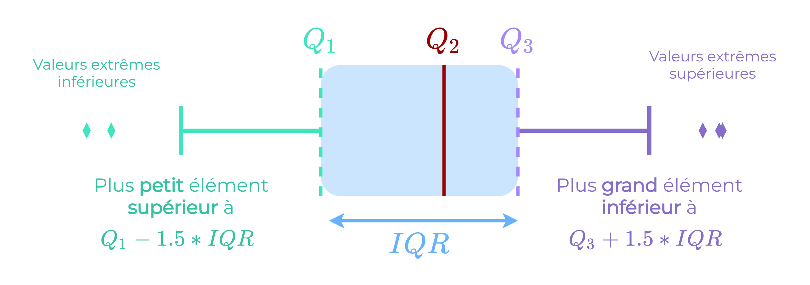

## Data Quality - Standardisation des données numériques

Les variables numériques sont le type de données dont les problèmes de qualité sont parfois les moins évidents à repérer. En effet, lors de l'assemblage de données provenant de différentes sources, il se peut que des variables similaires ne soient pas entrées à la même échelle, que les unités de mesure diffèrent ou encore que les définitions mathématiques de ces variables diffèrent d'une source à l'autre. D'autres soucis interviennent, notamment lorsque des données présentent des valeurs aberrantes (outliers) ou que des transformations mathématiques ont été mal appliquées sur certaines variables.

Le jeu de données que l'on utilisera ici est extrait d'un organisme qui met en relation des emprunteurs qui cherchent à obtenir un prêt avec des investisseurs qui cherchent à prêter de l'argent et obtenir un rendement. Chaque emprunteur remplit une demande complète, en indiquant ses antécédents financiers, la raison du prêt, etc. L'organisme évalue ensuite le score de crédit de chaque emprunteur en utilisant des données historiques et attribue un taux d'intérêt à l'emprunteur.

Certains prêts sont terminés et complètement remboursés, d'autres sont encore en cours et à jour. Une partie non négligeable des clients ont du retard dans leur calendrier de paiement, ou n'ont pas pu rembourser et font l'objet de procédures de recouvrement.

(a) Lire le fichier "loan_ex.csv" dans un DataFrame df.
(b) Afficher les premières lignes de df, ainsi que les informations sur chacune des colonnes.

## Insérez votre code ici

​
​
​
​
La variable 'loan_amnt' correspond au montant demandé par l'emprunteur et la variable 'funded_amnt' correspond au montant touché par ce même emprunteur, à ce jour. Le montant peut être différent si le prêt est toujours en cours, ou si la somme acceptée par les investisseurs est plus faible.

(c) Afficher la distribution de 'loan_amnt' à l'aide d'un boxplot.
  Exemple d'utilisation: f.boxplot("nom_colonne"). Pour plus d'informations, consultez la documentation.

## Insérez votre code ici

​
​
​
​

# Comment est tracé un boxplot ?

Un boxplot (ou boîte à moustaches) est une méthode permettant de représenter graphiquement des variables numériques à travers leurs quartiles. La boîte s'étend des valeurs des quartiles Q1 à Q3, et possède une ligne à la médiane (Q2).

Les "moustaches" s'étendent à partir des bords de la boîte pour montrer l'étendue des données. Par défaut, elles ne mesurent pas plus de 1.5×𝐼𝑄𝑅
(IQR = Q3 - Q1) à partir des bords de la boîte, et se terminent au point de données le plus éloigné dans cet intervalle.

Les valeurs aberrantes sont tracées sous forme de points séparés, au-delà de ces limites. Une valeur aberrante est une valeur qui diffère grandement de la distribution d’une variable. Il s’agit d’une observation anormale, qui s’écarte de données par ailleurs bien structurées. On peut visualiser tous ces éléments dans le schéma du boxplot :

Le boxplot de loan_amnt montre plusieurs valeurs dites "extrêmes", au-delà de la "moustache" du haut. Ces valeurs pourraient correspondre à des prêts accordés dont le montant est supérieur à la grande majorité des autres prêts. En revanche, un point unique est situé bien loin de la boîte à moustache, et correspond à un montant de 80000 dollars, quand 75% des prêts ne dépassent pas les 15000. Ce point peut être considéré comme une valeur aberrante.

(d) Afficher les informations concernant ce prêt.

## Insérez votre code ici

​
​
​
​
En observant les autres variables, notamment le montant perçu ou les remboursements effectués, on identifie facilement une erreur de saisie, avec un 0 en trop dans le montant, qui à l'origine valait probablement 8000.

(e) Corriger l'erreur, et afficher de nouveau le boxplot. Par cette observation, on renforce donc la validité de nos données.

## Insérez votre code ici

​
​
​
​
Quelques crédits ont un montant compris entre 30000 et 35000 dollars, quand plus de trois quarts des crédits ont des montants inférieurs à 15000.

(f) Afficher les informations concernant ces crédits.
(g) Afficher le revenu annuel moyen pour l'ensemble des clients, et le revenu annuel moyen pour les clients dont le montant du crédit dépasse les 30000 dollars.

## Insérez votre code ici

​
​
​
​
Le salaire annuel moyen des clients dont les crédits sont les plus élevés vaut près du double du salaire moyen global. Ce qui tend à légitimer ces valeurs comme étant réalistes, et nous amène à conclure que les clients effectuant une demande pour ces prêts ont un salaire annuel bien plus élevé que la moyenne.

La variable 'funded_amnt_inv' représente la somme engagée par les investisseurs pour chaque prêt, à ce jour. Dans une grande majorité des cas, la variable est égale à la valeur de 'funded_amnt', mais la première est de type float alors que la seconde est de type int. Cette différence de type minime peut poser des problèmes de compréhension dans le futur, mais n'est pas très grave.

En revanche, si l'on regarde les variables 'total_pymnt' et 'total_pymnt_inv' qui correspondent respectivement aux paiements reçus pour le montant total financé, et les paiements reçus pour la partie du montant total financée par les investisseurs, on s'aperçoit que l'une des variables est arrondie en général à 6 chiffres après la virgule, et l'autre à 2.

(h) Afficher les 10 premières lignes de df pour les variables 'total_pymnt' et 'total_pymnt_inv'.
(i) Calculer le nombre de prêts pour lesquels ces deux variables sont égales.

## Insérez votre code ici

​
​
​
​
Malgré le fait que ces deux variables semblent souvent correspondre au même montant, seulement 332 crédits ont des valeurs égales pour le montant des remboursements totaux et des remboursements de la part investie par les investisseurs.

(j) Arrondir la variable 'total_pymnt' à deux chiffres après la virgule, et comparer à nouveaux les crédits dont la valeur est égale pour les deux variables 'total_pymnt' et 'total_pymnt_inv'.

## Insérez votre code ici

​
​
​
​
Plus de la moitié des crédits sont à présent concernés par cette égalité. Ce qui est très différent du résultat obtenu plus tôt, simplement à cause d'une différence d'arrondi. Arrondir les valeurs de différentes colonnes qui peuvent être comparées contribue à améliorer la cohérence de nos données.

Les problèmes de mesures différentes peuvent donner lieu à de nombreuses erreurs, et les exemples de désastres liés à ce problème ne manquent pas. Comme le satellite de la NASA sur Mars, qui a coûté plusieurs millions de dollars et qui s’est écrasé parce que son logiciel de navigation était programmé en unités de mesure anglo-saxonnes et non selon le système métrique.

(k) Afficher à présent la distribution de la variable 'int_rate'.
  Exemple d'utilisation: df["nom_colonne"].plot.hist(figsize=(10, 8)). Pour plus d'informations, consultez la documentation.

## Insérez votre code ici

​
​
​
​
On remarque ici, comme on peut s'y attendre pour un taux d'intérêt, que la grande majorité des valeurs sont comprises entre 0 et 1.
Une poignée de valeurs varient de 1 à 17,5 .

(l) Afficher les crédits pour lesquels le taux d'intérêt est supérieur à 1.

## Insérez votre code ici

​
​
​
​
En observant l'indexation du tableau, on s'aperçoit que les crédits en question se suivent. Il est fort probable que ces valeurs ne soient pas des valeurs aberrantes mais plutôt que le taux d'intérêt ait été intégré ici sous forme de pourcentage.

Lors d'une jointure, ou lorsque des données sont répertoriées par des organismes ou personnes différentes, il est important de vérifier qu'une même variable est toujours entrée sous le même format.

(m) Corriger l'erreur mise en évidence pour la variable 'int_rate'.

## Insérez votre code ici

​
​
​
​
En Data Science, avant la modélisation de données, il est courant d’avoir recours à certaines transformations mathématiques, comme la normalisation des valeurs d’une variable, le passage d’une variable catégorielle à une variable continue ou indicatrice, etc.

(n) Appliquer à df un encodage des variables catégorielles en indicatrices, suivie d'une <a href="https://scikit-learn.org/stable/modules/generated/sklearn.preprocessing.MinMaxScaler.html">normalisation MinMax</a>, en exécutant la cellule suivante. Que remarquez-vous?
from sklearn.preprocessing import MinMaxScaler, StandardScaler
​
scaler = MinMaxScaler()
​
df_dummies = pd.get_dummies(df)
df_scaled = pd.DataFrame(scaler.fit_transform(df_dummies), columns=df_dummies.columns)
​
df_scaled
​
Par défaut, la variable 'id' est considérée par pandas comme une variable numérique, mais n'a plus aucun intérêt sous sa forme normalisée. Ce genre d'erreur lors d'application de transformations mathématiques est fréquente et peut s'avérer irréversible si certaines précautions ne sont pas prises, comme la sauvegarde du précédent DataFrame.

# Conclusion

Les variables numériques, comme les variables catégorielles ou textuelles ont leurs propres singularités, et prendre le temps de vérifier que les données correspondent à nos standards de qualité est une étape importante en début d'analyse à ne pas négliger. Cela vous fera gagner un temps précieux et éviter de nombreuses erreurs parfois coûteuses à réparer !

Voici un résumé des étapes de standardisation des valeurs numériques que nous avons effectué :

Identifier les valeurs aberrantes (outliers)
Arrondir à la même unité les variables qui seront susceptibles d'être comparées entre elles lors d'une étude ultérieure
Faire attention aux erreurs de placement de virgules
Faire attention de ne pas normaliser des colonnes qui ne devraient pas l'être
Un autre aspect des plus importants à vérifier est la complétude des données : Y a-t-il des valeurs manquantes ? Des cellules vides ? Valeurs nulles ? Comment ces valeurs manquantes sont-elles identifiées/gérées ? Nous verrons cela dans le notebook suivant.
