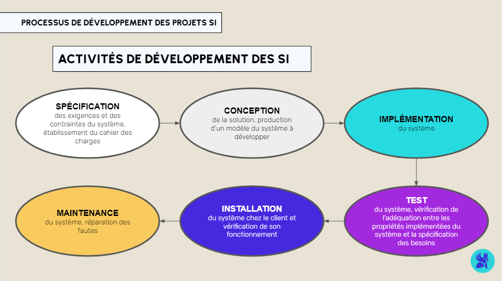

## GESTION DE PROJET DATA ET CONDUITE DU CHANGEMENT
# Projets SI : les enjeux
La gestion de projet est l'organisation et la coordination des ressources, compétences et outils pour atteindre des objectifs tout en respectant des contraintes budgétaires et temporelles.

Ce module s’appuie sur les bases abordées dans le sprint précédent sur les données en entreprise et se concentre sur la gestion de projet, un savoir-faire clé pour structurer et réussir les initiatives data.

Nous suivrons un projet concret : le développement d’un système de recommandation pour un site e-commerce. Ce projet illustre bien la convergence entre les systèmes d’information et les projets data, et nous servira de fil conducteur pour explorer la gestion de projet, la conduite du changement et l’organisation.

Le module est structuré en quatre parties principales :

Projets SI: les enjeux, où nous expliquerons ce qu'est un projet SI et son rôle dans la transformation digitale des entreprises.
Gestion de projet: les modèles, où nous introduirons les principaux modèles de gestion de projet et leur application concrète.
Chef de projet: un métier stratégique, qui détaillera les responsabilités et les évolutions de ce rôle clé.
La Conduite du changement, qui vous permettra de comprendre comment accompagner les transformations digitales, avec un focus sur des aspects comme le RGPD.

# Transformation digitale des entreprises par les technologies IT

Les technologies IT sont au cœur de la transformation des entreprises, leur permettant de relever les défis de l'économie numérique. Ces transformations se matérialisent concrètement dans les organisations par les projets SI.

# Gouvernance et pilotage d'un projet SI
Qu'est ce qu'un projet?
Un projet est un ensemble d'actions et de ressources mobilisées pour atteindre un objectif spécifique dans un cadre donné. Selon l'AFITEP (Dictionnaire de management de projet, 1996), un projet se caractérise par :

"un ensemble d'actions à réaliser pour atteindre un objectif défini dans le cadre d'une mission précise (résultat connu à l'avance), et qui comporte un début et une fin."

Qu'est-ce qu'un Système d'Information (SI)?
Un Système d'Information (SI) est un ensemble organisé de ressources, incluant des données, des technologies, des processus et des personnes, qui collaborent pour collecter, traiter, stocker et diffuser des informations.

Il s’agit du cœur du fonctionnement d'une organisation moderne, car il soutient les décisions stratégiques, les opérations courantes et les activités de planification.

Qu'est-ce qu'un projet SI?
Un projet SI est une initiative visant une évolution significative des systèmes d'information d'une organisation, que ce soit sur le plan fonctionnel (ajout de nouvelles fonctionnalités, comme un tableau de bord automatisé) ou technique (migration vers une infrastructure cloud, par exemple).

Dans le cadre de notre exemple fil rouge, la mise en place d'un système de recommandation personnalisé est un projet typique de SI. Il demande une transformation de l'architecture des données, l’intégration d’algorithmes de machine learning, et une adaptation des systèmes actuels.

Le rôle de chef de projet
Le chef de projet est responsable de la gestion globale du projet, de son initiation à sa clôture. Il guide l’équipe pour atteindre les objectifs en veillant à la bonne planification, l'exécution, le suivi et la clôture du projet. Il peut être un professionnel interne ou externe.

Ses missions incluent :

Planification et développement : Définir les objectifs, les délais, et les ressources nécessaires.
Création et direction de l’équipe : Sélectionner les membres et coordonner leurs actions.
Suivi et gestion des échéances : Assurer le respect des délais et résoudre les imprévus.
Gestion du budget et des ressources : Optimiser l'utilisation des ressources financières et humaines.
Satisfaction des parties prenantes : Veiller à répondre aux attentes des parties prenantes.
Évaluation des performances : Analyser les résultats en termes de coûts, qualité et délais, et proposer des améliorations.
Capitalisation sur l’expérience : Identifier les axes d'amélioration pour les futurs projets.
Le chef de projet fait également le lien entre la Maîtrise d’Ouvrage (MOA) et la Maîtrise d’Œuvre (MOE) représentant respectivement le client (souvent interne) et les équipes techniques.

La Maîtrise d’Ouvrage est l’entité qui initie et pilote le projet. Elle définit les besoins, les objectifs stratégiques et alloue les ressources nécessaires, en s’assurant que le résultat final respecte les attentes de l’entreprise, le budget et les délais.

Dans notre exemple, la MOA serait la direction marketing ou produit, qui définit les objectifs, tels que l’augmentation des ventes ou la personnalisation de l’expérience client.

La Maîtrise d’Œuvre est responsable de la conception, de l'organisation et de la mise en œuvre technique du projet. Elle regroupe les équipes techniques qui réalisent les actions nécessaires pour concrétiser le projet.

Dans notre exemple, la MOE comprend les data scientists, les développeurs back-end et les ingénieurs en machine learning, qui sont chargés de développer l’algorithme de recommandation, de l'intégrer dans le système existant, puis de tester et maintenir la solution avant et après son déploiement.

# Processus de développement des projets SI
Le développement des systèmes d'information suit un processus structuré pour atteindre les objectifs tout en respectant les contraintes de qualité, de coût et de délai. Ce processus est généralement divisé en plusieurs phases, qui varient selon la méthode choisie (agile, linéaire, itérative).

Le cycle de vie d’un projet SI comprend plusieurs étapes, de la définition du besoin initial jusqu'à son retrait ou remplacement. Chaque phase du cycle de vie est documentée et suit une méthodologie adaptée aux besoins du projet. Ces modèles seront explorés en détail dans la suite du cours.

Les activités du développement des SI sont orientées autour des tâches suivantes, qui peuvent être réalisées en parallèle ou successivement selon la méthode choisie :

# Conclusion
Cette introduction aux projets SI et à la gestion de projet vous a permis de comprendre les bases nécessaires pour gérer des projets data complexes, comme celui de la mise en place d’un système de recommandation. Vous avez exploré les étapes clés du processus, de la planification à la mise en œuvre technique. Dans les sections suivantes, vous approfondirez les méthodologies de gestion de projet, l’impact de la conduite du changement et leur application dans des projets data.
