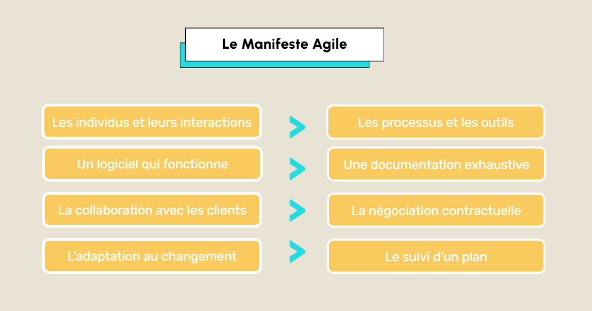

## AGILITÉ

# Les Méthodes AGILE

Face aux transformations rapides et aux besoins évolutifs, les organisations adoptent les méthodes agiles pour gagner en réactivité et maximiser la valeur apportée aux utilisateurs. Apparues en 2001 avec le Manifeste pour le développement agile de logiciels, ces méthodes misent sur la collaboration, l'adaptabilité et des cycles d'amélioration continue pour répondre efficacement aux projets complexes.

L’agilité repose sur la coordination flexible des ressources, compétences et outils, permettant d’atteindre les objectifs tout en intégrant des ajustements continus. Ce module, s'appuyant sur les bases de la gestion de projet vues précédemment, se concentre sur l’application de ces méthodes à travers un projet fil rouge : le développement d’une plateforme d’analyse prédictive pour la gestion des stocks dans un entrepôt.

Avant de poursuivre, voici quelques termes que vous rencontrerez fréquemment :

Itération : Répétition d’un cycle de développement.
Sprint : Cycle court de développement, généralement de 1 à 4 semaines.
User Story : Description concise d’un besoin ou d’une fonctionnalité.
Le module est structuré en quatre parties principales :

Les Méthodes AGILE : Fondements, principes clés et outils de structuration.
Les Méthodes AGILE Data : Adaptation des méthodes aux projets data.
Les Concepts Clés : Approches itérative, incrémentale et collaborative, permettant de structurer efficacement les projets.
L'Organisation et l’Humain : Compétences humaines et transformations organisationnelles.

# Les Principes de la Méthode AGILE

La méthode agile repose sur une philosophie centrée sur l'amélioration constante et la capacité à s’adapter rapidement aux imprévus. Elle encourage la collaboration au sein des équipes ainsi qu'avec les parties prenantes, tout en privilégiant des cycles de développement courts et itératifs. Ces principes visent à garantir la satisfaction client et à assurer une livraison continue de valeur.

Satisfaction du client : Répondre rapidement aux besoins avec des livraisons fréquentes de versions fonctionnelles.
Accueillir le changement : Accepter les modifications, même tardives, pour mieux s’adapter au contexte.
Livraisons fréquentes : Diviser les projets en cycles courts avec des améliorations visibles.
Collaboration renforcée : Maintenir des interactions constantes entre parties prenantes pour aligner les objectifs.
Valorisation des individus : Développer des projets autour d’équipes motivées et autonomes.
Amélioration continue : Intégrer des retours à chaque itération pour ajuster les processus.
Pour notre plateforme de gestion des stocks, l’équipe commence par un modèle simple basé sur des données historiques. Testé sur un sous-ensemble de produits, le modèle est ensuite ajusté en fonction des retours utilisateurs pour les prévisions suivantes.

# Les Outils pour Implémenter la Méthode AGILE

Pour mettre en œuvre efficacement les principes agiles, les équipes s'appuient sur divers outils qui peuvent être classés en deux grandes catégories :

Outils collaboratifs : Facilitent la gestion des tâches, la communication et la coordination entre les équipes.
Outils techniques : Supportent le développement, la gestion de version (versioning), et la planification technique des projets.
Outils Collaboratifs
JIRA est un outil de gestion agile qui permet de gérer les users stories et de créer des sprints. Il offre également des rapports personnalisés pour suivre l’avancement des projets.
Dans notre exemple, l’équipe utilise JIRA pour structurer les sprints et suivre le développement de la plateforme. Chaque user story représente une fonctionnalité à développer.

Trello permet d’organiser les tâches sous forme de tableaux et de listes, facilitant la gestion des projets pour les petites équipes avec des options gratuites ou payantes.
Outils Techniques
Github est un outil de gestion de version qui permet de suivre les modifications, d’organiser des workflows personnalisés et de lier les users stories.
Dans notre exemple, les développeurs utilise GitHub pour versionner leur code. Chaque modification est associée à une user story, assurant une traçabilité des modifications.

Gantt Project est un outil de planification visuelle qui utilise des diagrammes de Gantt pour suivre les étapes d’un projet et établir un échéancier structuré.
Bien que ces outils soient fréquemment utilisés dans les projets agiles, il en existe de nombreux autres adaptés à différents contextes et besoins. Chaque équipe doit choisir les outils les plus adaptés à ses objectifs et à sa manière de travailler.

# Les Différents Frameworks AGILE

Les pratiques agiles peuvent se structurer selon différents cadres méthodologiques, appelés frameworks. Ces frameworks adaptent les principes agiles à divers besoins organisationnels.

Certains frameworks se concentrent sur des cycles courts (sprints), tandis que d’autres favorisent des flux de travail continus. La vidéo suivante présente les principaux frameworks, leurs caractéristiques et leurs avantages.

Pour mesurer l’avancement et le succès des projets agiles, plusieurs indicateurs clés sont couramment utilisés :

Vélocité : Mesure le volume de travail accompli par l’équipe au cours d’un sprint
Taux de réalisation : Évalue le travail planifié par rapport au travail réellement achevé
Lead Time : Temps écoulé entre la création d’une tâche et sa finalisation
Cycle Time : Durée nécessaire pour qu’une tâche passe de l’état "en cours" à "terminé"
Satisfaction : Mesurée via des retours réguliers des clients et des équipes

# Conclusion

Vous avez maintenant découvert les principes, outils et frameworks fondamentaux des méthodes agiles. Ces éléments vous permettront de piloter vos projets de manière structurée et adaptable.

Dans le prochain notebook, nous approfondirons l’application de ces méthodes au domaine de la data. Vous apprendrez comment les méthodes agiles peuvent optimiser les projets de développement de modèles prédictifs et de gestion des données.

Pour renforcer vos compétences et votre attractivité professionnelle, plusieurs certifications reconnues peuvent être envisagées en complément de cette formation :

Certified ScrumMaster (CSM)
PMI Agile Certified Practitioner (PMI-ACP)
Professional Agile Leadership (PAL)
