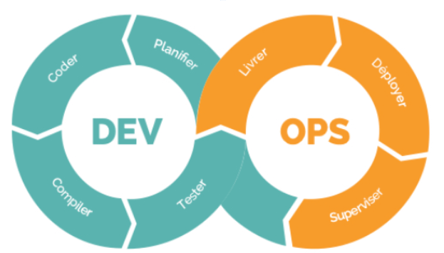

## AGILITÉ

# Les Méthodes AGILE dans la Data

Dans ce module, nous explorons l’application des méthodes agiles au domaine du développement logiciel et des projets data. Parmi les frameworks les plus utilisés, DevOps et DataOps se distinguent par leur capacité à améliorer la collaboration entre équipes et à automatiser les processus pour gagner en efficacité et en réactivité.

Ces méthodes, tout en reprenant les principes fondamentaux de l’agilité, répondent à des besoins spécifiques des projets de développement informatique et data.

# DevOps : Réconcilier Développement et Opérations

Le terme DevOps désigne un ensemble de pratiques, de concepts et de méthodes visant à améliorer la collaboration entre les équipes de développement (Dev) et de production (Ops). Ces deux équipes, bien que complémentaires, poursuivent souvent des objectifs divergents. Tandis que l'équipe de développement est responsable de la création, du test et de la correction du code, l’équipe de production s'occupe du déploiement, du suivi des performances et du maintien en production.

Cette séparation peut engendrer des tensions : retards de livraison, initiatives non alignées, manque de communication et problèmes de sécurité.

Principes clés du DevOps
Les pratiques DevOps s’articulent autour des éléments suivants :

Vision commune : Les parties prenantes doivent partager les mêmes objectifs et participer aux décisions.
Livraison rapide : L’élimination des frictions permet de livrer fréquemment des versions fonctionnelles.
Retour d'information continu : Tests rigoureux et automatisés pour garantir la qualité à chaque itération.
Ce cadre peut être vu comme une extension des pratiques agiles. Si l’agilité se concentre sur la relation entre développement et clients, DevOps assure la coordination entre développement et opérations.

Certains principes d’agilité ne se concrétisent pleinement qu’à travers l’implémentation des pratiques DevOps :

Développement itératif et incrémental : Créer d’abord une version fonctionnelle minimale, puis l’améliorer.
Adaptabilité : Les changements doivent être perçus comme des opportunités.
Boucles de feedback : Une communication constante permet de détecter et résoudre rapidement les problèmes.
Phases du DevOps : Intégration et Déploiement Continus
Le DevOps repose sur deux grandes phases complémentaires : l’intégration continue (Continuous Integration) et le déploiement continu (Continuous Deployment).

Phase DEV - Intégration Continue (CI)
Cette phase vise à automatiser l’intégration des contributions de plusieurs développeurs dans un dépôt central, en réduisant les erreurs humaines. Elle comprend :

Planification : Adapter les pratiques agiles aux objectifs du projet.
Codage : Développer en collaborant via des outils partagés.
Compilation : Préparer le code pour une mise en production éventuelle.
Test : Utiliser des tests automatiques ou manuels pour détecter les erreurs.
Dans notre projet exemple, l’équipe utilise l’intégration continue pour tester automatiquement chaque modification du code de l’algorithme de prévision.

Phase OPS – Déploiement et Exploitation (CD)
Cette phase se concentre sur la gestion du cycle de vie en production :

Déploiement : Automatisation et supervision des mises en production.
Exploitation : Gestion des logiciels déployés en production.
Supervision : Identification des incidents pour maintenir la stabilité. Une sous-phase de livraison continue peut nécessiter une validation manuelle avant le déploiement complet.
Dans notre exemple, les mises à jour de l’algorithme sont suivies en production grâce à des outils de supervision pour garantir des performances optimales.

# DataOps : Agilité au service des projets Data

S'inspirant du DevOps, le DataOps est une méthodologie adaptée aux projets de science des données. Alors que les projets de développement classiques se concentrent principalement sur le code, les projets data sont marqués par une forte part d’incertitude liée à la gestion des données et des modèles mathématiques.

Cette méthodologie vise à améliorer la collaboration entre les équipes data, IT et développement, tout en intégrant des processus de gestion et d’automatisation spécifiques.

Pourquoi le DataOps ?
Avec l'intensification de la collecte et de l’analyse des données, les approches traditionnelles comme le DevOps montrent leurs limites lorsqu’il s’agit de gérer efficacement les projets data. Le DataOps reprend les principes fondamentaux du DevOps tout en tenant compte des spécificités suivantes :

Collaboration inter-équipes : Faciliter la communication entre développeurs, équipes IT et experts data.
Évolution des données : Gérer des jeux de données dont les caractéristiques évoluent constamment.
Suivi des modèles mathématiques : Comparer, ajuster et suivre l'évolution des modèles en production.
Contrôle des performances : Définir des indicateurs pour surveiller les algorithmes en production.
Axes d’amélioration dans un projet Data grâce au DataOps
La mise en place du DataOps permet de :

Adopter une méthode agile pour gérer les projets de manière plus réactive.
Améliorer la communication entre les différentes équipes.
Intégrer et automatiser les pipelines (chaîne d’étapes) de données, accélérant ainsi les analyses et les déploiements.
Bonnes pratiques pour un projet DevOps ou DataOps
Certaines pratiques sont essentielles pour garantir le succès des projets utilisant ces méthodologies :

Centraliser le code source dans un dépôt unique pour faciliter le suivi.
Suivre et réviser les modifications via un outil de versioning (ex. GitHub).
Automatiser les tests après chaque modification de code pour valider rapidement les changements.
Encapsuler le code dans des APIs afin de standardiser son utilisation et de faciliter son intégration.
Dans notre exemple d’analyse prédictive, l’équipe DataOps automatise l’intégration des données pour s’assurer que les algorithmes reçoivent des informations constamment mises à jour. Les tests automatisés vérifient la validité des modèles à chaque modification du pipeline.

Même si l’automatisation des flux accélère la mise en production des modèles, il faut veiller à toujours respecter les principes de gouvernance (sécurité, RGPD, contrôle d’accès, etc.). Chaque pipeline doit intégrer des vérifications minimales pour éviter tout risque de fuite ou de non-conformité.

# Métiers et indicateurs clés : Application au projet fil rouge

Dans notre projet de plateforme d'analyse prédictive pour la gestion des stocks, les équipes DevOps et DataOps collaborent pour garantir le bon fonctionnement des algorithmes et des flux de données.

Métiers impliqués :
Data Scientist : Développe et améliore l'algorithme de prévision.
Data Engineer : Automatise l’ingestion et la transformation des données de ventes et de stocks.
Ingénieur en intégration/déploiement : Met en place des tests automatisés pour vérifier la robustesse du modèle avant chaque mise en production.
Ingénieur en supervision : Suit les performances des prévisions et identifie les anomalies en production.
Indicateurs de suivi :
Le Lead Time mesure le temps nécessaire entre la demande d'amélioration et le déploiement effectif de l'algorithme.
Le taux de réussite des tests permet de vérifier que chaque nouvelle version du modèle fonctionne sans erreurs.
La disponibilité garantit que les prévisions restent accessibles en temps réel, notamment en période de forte activité.
La satisfaction des parties prenantes, comme les équipes logistiques, est évaluée grâce aux retours réguliers sur la qualité des prévisions.

# Conclusion

Dans ce module, nous avons exploré les méthodes DevOps et DataOps, ainsi que leur rôle essentiel dans l’amélioration des projets complexes. Ces méthodologies favorisent la collaboration entre les équipes, l’automatisation des processus, et l’utilisation d’indicateurs de performance pour garantir la qualité des livraisons.

Dans le prochain notebook, vous découvrirez des concepts clés complémentaires, tels que l’approche itérative (Design to Cost), l’approche incrémentale avec le concept de Minimum Viable Product (MVP), ainsi que les rôles fondamentaux dans une équipe agile.
