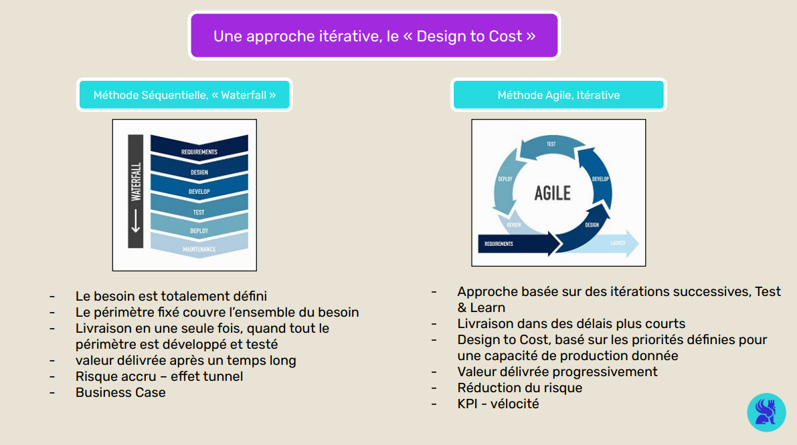
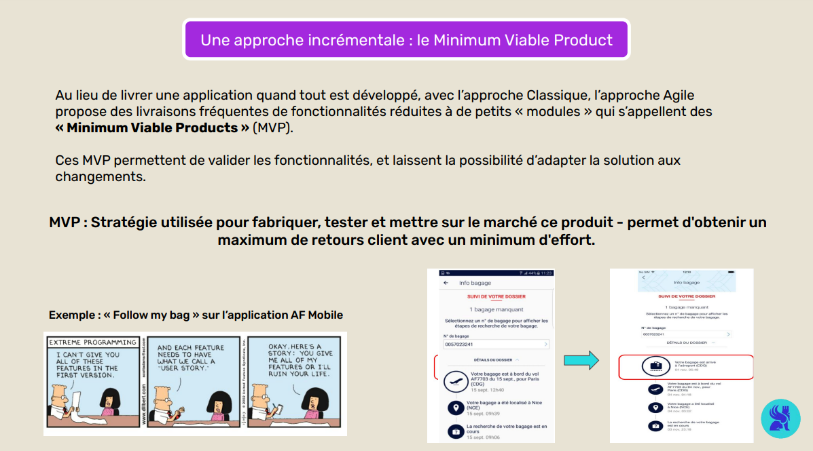
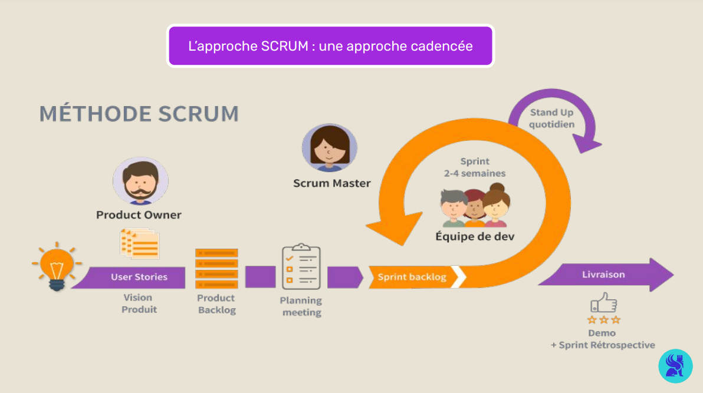

## AGILITÉ

# Les Concepts Clés

Dans ce module, nous approfondissons les bases de la gestion de projet agile, où les cycles de développement courts et l’adaptabilité priment sur la rigidité du modèle en cascade. L’objectif est d’améliorer en continu le produit grâce aux retours des utilisateurs.

Nous explorerons quatre approches fondamentales :

Itérative : intégrer la contrainte de coûts dès la conception
Incrémentale : lancer rapidement un produit minimal et itérer
Collaborative : organiser le travail en sprints autour d’une Product Team
Évolutive : déployer l’agilité à grande échelle via des frameworks adaptés

# Approche itérative : Design to Cost

Le Design to Cost consiste à prendre en compte les contraintes budgétaires dès la phase de conception. Il s’agit de maximiser la valeur en développant d’abord les fonctionnalités essentielles et en se laissant la possibilité d’ajouter des améliorations ultérieurement.

Dans notre exemple, l’équipe priorise un modèle de prévision simple pour gérer les stocks critiques. Des améliorations, comme des optimisations avancées, suivront en fonction des retours utilisateurs et des ressources disponibles.

# Approche incrémentale : le Minimum Viable Product

Après avoir vu comment intégrer les contraintes budgétaires avec l’approche Design to Cost, nous allons maintenant explorer une autre approche fondamentale de la méthode agile : le Minimum Viable Product (MVP).

Le MVP est une version minimaliste mais fonctionnelle d’un produit, destinée à accélérer sa mise sur le marché. Il permet de confronter rapidement une idée au marché pour valider si elle répond au besoin principal des utilisateurs. Cette approche vise à minimiser les coûts de développement initial en se concentrant sur les fonctionnalités essentielles.

Concept du MVP
Minimum : Un MVP ne contient que les fonctionnalités nécessaires pour répondre à un besoin clé de la cible.
Viable : Contrairement à un simple prototype, le MVP doit être techniquement stable et offrir une bonne expérience utilisateur.
Product : Le MVP doit pouvoir être utilisé par les clients réels, avec une mise sur le marché rapide.
Le MVP suit la boucle d’itération Construire-Mesurer-Apprendre (Build-Measure-Learn), issue de la méthode Lean Startup. Cette stratégie repose sur l’idée d’apprendre en faisant et en s’appuyant sur les retours utilisateurs.

Dans notre exemple, l’équipe développe un MVP avec une seule fonctionnalité clé : la gestion des stocks critiques. Cette version est testée auprès d’un groupe restreint d’utilisateurs. Les retours collectés sur la précision des prévisions et l’expérience utilisateur permettront d'orienter les prochaines itérations.

# Approche collaborative : la Product Team

Après avoir abordé l’importance de l’approche incrémentale, voyons maintenant comment une équipe agile organise sa collaboration autour de rôles clés au sein d'une Product Team.

Une Product Team est organisée autour de rôles définis, chacun ayant des responsabilités spécifiques pour assurer le bon déroulement des sprints et la livraison de valeur :

Product Owner (PO) : Il représente les utilisateurs et centralise les demandes des différentes parties prenantes. Il est responsable du backlog produit, où sont listées les user stories et valide ce qui est livré.
Scrum Master : Facilitateur de l'équipe, il veille à ce que les développeurs puissent travailler efficacement, en les protégeant des interruptions externes et en résolvant les problèmes organisationnels.
Le cadre méthodologique le plus courant est Scrum, avec des sprints itératifs et des rituels (planification, exécution, revue, rétrospective) permettant de livrer fréquemment des fonctionnalités prioritaires.

Dans notre exemple, la Product Team utilise le cycle Scrum pour structurer le développement :

Le Product Owner centralise les besoins, comme la mise en place d’alertes sur les ruptures de stock. Il ajoute ces demandes sous forme de user stories dans le backlog.
Le Scrum Master organise le sprint en sélectionnant les tâches prioritaires avec l’équipe technique, tout en veillant à limiter les interruptions extérieures.
En fin de sprint, l’équipe présente les fonctionnalités développées, telles que le tableau de bord de prévision. Le Product Owner valide ou demande des ajustements.

# Approche évolutive : Scaling Agile

Après avoir exploré le fonctionnement d'une équipe agile, nous allons voir comment cette organisation peut être adaptée à des structures plus larges grâce au Scaling Agile.

Les méthodes agiles, comme Scrum, sont très efficaces au niveau d’une seule équipe. Cependant, lorsque plusieurs équipes travaillent sur des projets interconnectés au sein d’une même organisation, la coordination globale devient complexe. C'est là qu'interviennent des frameworks de Scaling Agile, tels que SAFe (Scaled Agile Framework).

Ces frameworks offrent des mécanismes pour harmoniser les pratiques, définir des objectifs communs et faciliter la communication entre équipes. Ils instaurent un équilibre entre :

Autonomie : Chaque équipe conserve la liberté d'organiser ses sprints et ses priorités locales.
Alignement : Les équipes partagent une vision stratégique, un langage commun et des objectifs globaux.
La mise en place du Scaling Agile peut s’avérer complexe et nécessite une organisation rigoureuse pour gérer la communication entre les multiples équipes et parties prenantes.

La vidéo ci-dessous présente les points clés du Scaling Agile à l'échelle d'une entreprise.

# Conclusion

Dans ce notebook, nous avons vu comment l’agilité s’appuie sur des boucles d’amélioration continue (itératives, incrémentales), sur la coordination d’équipes autonomes (approche collaborative) et sur l’extension de ces principes à l’échelle de l’entreprise (approche évolutive).

Le prochain module abordera l’impact de l’agilité sur les dimensions organisationnelles et humaines, indispensables pour ancrer durablement ces pratiques dans la culture d’entreprise.
