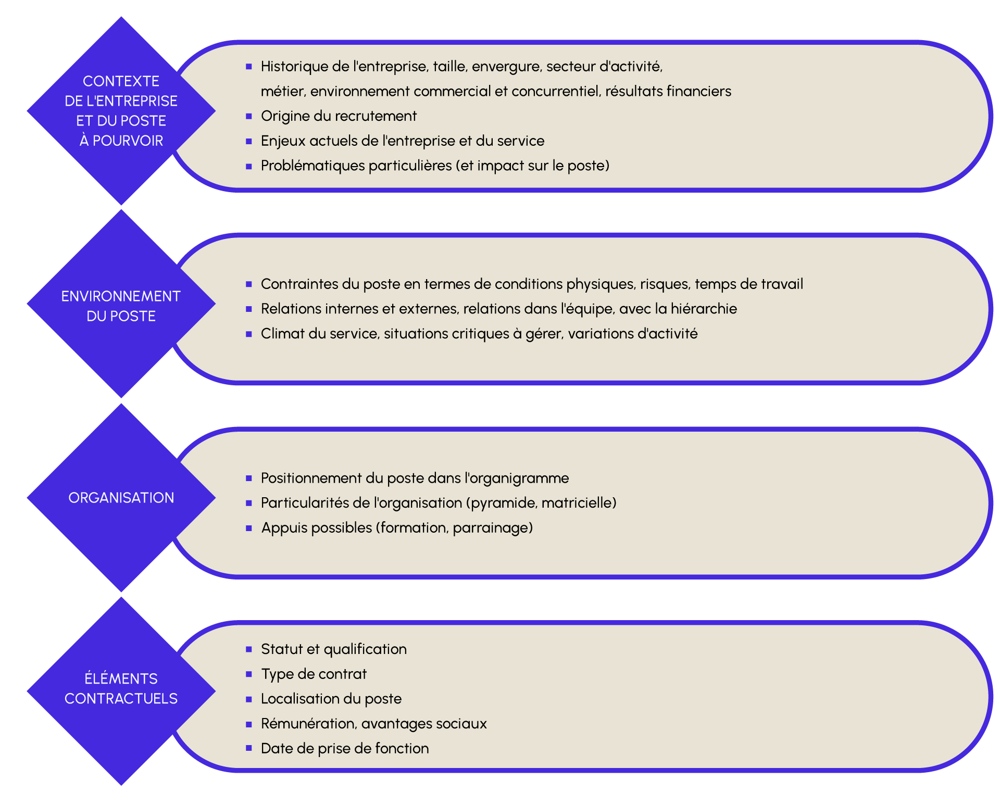
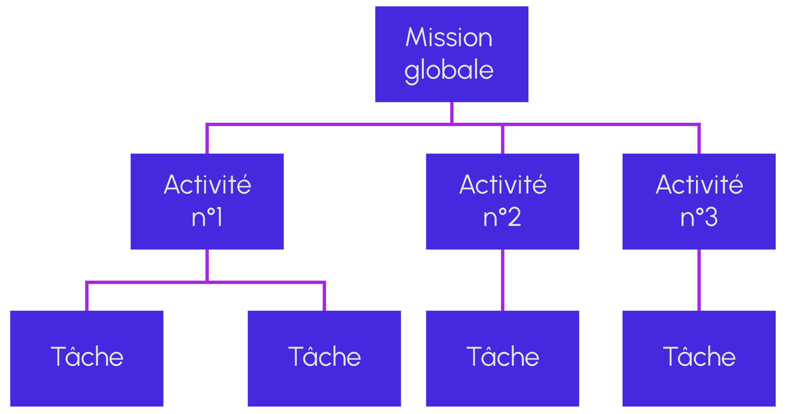
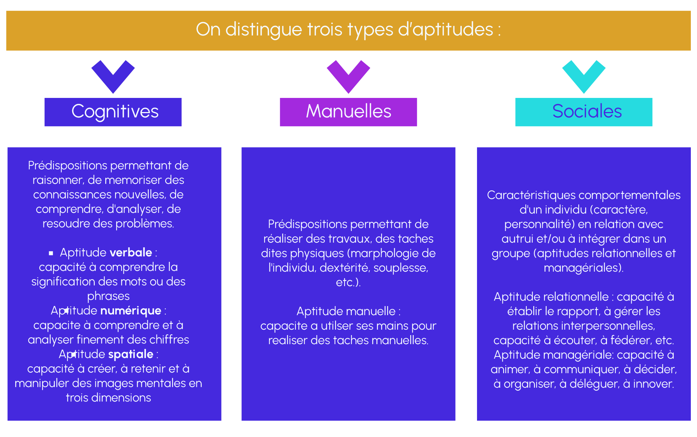
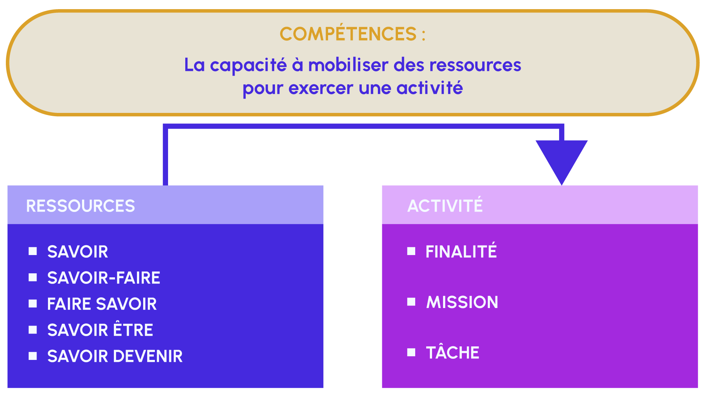

## Recrutement et Définition des Missions dans les Projets Data

Dans le cadre de la gestion de projets data, le rôle du Data Product Manager ne se limite pas à la définition des besoins et à l'élaboration de la vision produit. Pour piloter efficacement le développement, il est crucial de prendre en compte les ressources humaines et les compétences disponibles au sein de l'équipe. Parfois, cela implique également de recruter de nouveaux talents afin de combler des lacunes ou d'enrichir l'expertise collective.

Ce document vise à explorer les enjeux stratégiques du recrutement dans le domaine des projets data, en mettant l'accent sur l'importance d'identifier les profils capables d'apporter une réelle valeur ajoutée à l'équipe. Nous détaillerons également les protocoles et les meilleures pratiques à suivre pour réussir un recrutement efficace et garantir un accompagnement optimal des collaborateurs, de leur intégration à leur développement continu au sein des projets. Pour illustrer cela, nous allons nous appuyer sur un cas d'utilisation réel.

# Définir les besoins du projet

La première étape d'un recrutement consiste à définir précisément les besoins du projet, afin de sélectionner le candidat (en interne ou en externe) le plus apte à y répondre. Pour un Data Product Manager, cela implique de comprendre non seulement les compétences techniques requises, mais aussi les capacités à travailler en équipe et à contribuer à la vision produit. Cette étape passe par une description détaillée du poste à pourvoir, aboutissant à la rédaction ou à la mise à jour d'une fiche de poste.

Bien que cette étape puisse sembler simple et descriptive, elle est souvent complexe en pratique. En effet, les acteurs impliqués peuvent avoir des attentes divergentes : les équipes opérationnelles peuvent se concentrer sur des besoins immédiats en compétences techniques, tandis que la direction générale et les ressources humaines privilégient la recherche de talents capables de relever les défis stratégiques à long terme.

Dans le contexte de la gestion de produits data, cette complexité est accentuée par la nécessité de combiner des compétences en science des données, en ingénierie, en analyse métier et en gestion de projet.

Nous pouvons alors commencer par une analyse permettant de définir les caractéristiques du poste en termes de finalité, d'activités et de conditions générales d'exercice (moyens et positionnement dans l'organisation), ainsi que les aptitudes et compétences requises. Pour ce faire, nous pouvons suivre un protocole en trois étapes, décrit dans l'image ci-dessous :

# Collecter les informations essentielles

L'analyse du contexte et du poste est particulièrement importante puisqu'elle représente la base du processus de recrutement et en assure le succès. La conduite de l'analyse du contexte et du poste dépend du besoin en recrutement.

Exemple
Nous travaillons en tant que DPM chez JuniorMagazines, une entreprise spécialisée dans la création de magazines pour enfants. Composée de 45 collaborateurs, elle est située à Paris. Au sein de cette structure, l'équipe Data joue un rôle clé en soutenant les équipes métiers grâce à des données stratégiques et au développement de modèles de prédiction, notamment pour la gestion des stocks. Cette équipe est composée de Thomas, le CTO, responsable de la conception des architectures nécessaires dans une approche DevOps (mise en place de plateformes de paiement, etc.), de Malvic, Data Engineer Senior aux responsabilités élargies incluant le maintien des infrastructures, l'extraction des données pour les équipes métiers ainsi que le développement et le déploiement de modèles de prédiction, et de deux développeurs web, ainsi que nous-mêmes.

Lorsque le besoin est lié à la vacance d'un emploi, le recruteur doit :

1. Se référer à la fiche de poste déjà existante dans l'entreprise
2. Consulter les employés qui occupent déjà le poste à combler ou des postes similaires ou le superviseur du service concerné. Ces personnes connaissent bien l'entreprise et aideront à identifier les principales tâches et responsabilités.

Lorsque le besoin est lié à la création d'un poste, le recruteur doit :

1. Se référer à la fiche de poste des emplois types (utilisation des référentiels d'emploi type par secteur d'activité, des fiches ROME de France Travail)
   ℹ️ Précision : Les fiches ROME de France Travail répertorient les métiers selon un système de classification. Elles décrivent les activités, compétences et conditions d'exercice associées à chaque métier.

2. Procéder, avec l'aide du responsable hiérarchique, à une définition claire de la nouvelle fonction à partir des éléments qui ont motivé cette création.

Exemple
En échangeant avec le RH, nous nous sommes aperçus qu'au fil du temps, le périmètre d'intervention de Malvic s'est considérablement étendu, entraînant une surcharge de travail ayant un impact sur sa productivité et son bien-être. Lors de discussions avec le RH et le CTO, il est apparu que Malvic faisait face à une série de problèmes :

- Une dette technique croissante, freinant son avancement sur des tâches techniques cruciales.
- Une pression accrue générant une usure psychologique et posant ainsi un risque de départ.

Face à cette situation, il devient impératif d'intervenir pour alléger la charge de travail de Malvic en recrutant un nouveau collaborateur. Cette démarche vise non seulement à préserver l'efficacité opérationnelle de l'équipe Data, mais aussi à garantir le bien-être et la pérennité des talents clés de l'entreprise.

# Définir les exigences du poste

Les exigences requises font référence à l'ensemble des compétences nécessaires à la réussite de la fonction. Il convient de préciser les connaissances, aptitudes professionnelles et traits de personnalité recherchés chez les différents candidats.

Cette étape est essentielle puisqu'elle aboutit à la définition d'un certain nombre de critères de sélection qui serviront de filtres successifs lors des entretiens de recrutement.

Dans cette étape, il faut réaliser une analyse du contexte général de l'entreprise (contexte du poste, organisation et éléments contractuels). Les points d'analyse sont présentés ci-après :

# Formaliser le profil de poste

La rédaction du profil de poste consiste à définir les activités liées à l'emploi, la rémunération prévue et l'établissement du profil du candidat recherché. De même, les exigences de base doivent être clarifiées : la formation, l'expérience souhaitée, la connaissance des langues, l'utilisation des logiciels, etc.

Pour élaborer le profil de poste, le recruteur doit répondre aux questions suivantes :

- Quel est le titre du poste ?
- Quelle est la raison d'être du poste ?
- Qui est le supérieur immédiat ?
- Qui sont les subordonnés ?
- Quelles sont les responsabilités liées à ce poste ?
- Quelles sont les compétences requises pour accomplir le travail ?
- Quels sont les indicateurs de performance liés à ce poste ?
- Quelles sont les caractéristiques recherchées à l'embauche ?

Dans ce contexte, il convient de définir la finalité du poste ainsi que les activités associées. Pour ce faire, le schéma suivant peut être utilisé :

Comme le montre le schéma, la première étape consiste à définir la mission globale du poste. Ensuite, il convient de déterminer les activités spécifiques auxquelles la personne recrutée devra s'engager. Une fois ces activités identifiées, il est nécessaire de les décomposer en tâches précises, claires et empiriquement bien définies, afin d'assurer une bonne compréhension des responsabilités à assumer.

La mission du poste définit sa raison d'être et plus précisément sa finalité au sein de la structure. Elle détermine sa contribution spécifique aux objectifs du service et de l'entreprise ainsi que la performance associée.

Les principaux thèmes de l'analyse sont :

- Quelle est la mission attendue ?
- Quel objectif doit être réalisé ? Quels sont les moyens alloués pour atteindre cet objectif ?
- Quel est le niveau d'autonomie par rapport à la mission confiée ?
- Quels sont les indicateurs quantitatifs et qualitatifs définissant la réussite de la mission ? (les indicateurs de performance)

Une fois la mission définie, nous pouvons définir les activités de base et les activités spécifiques.
Les activités sont relatives à un métier et concourent à un résultat observable. La mission principale est donc déclinée en activités de base et en activités spécifiques.

Pour terminer, nous pouvons formaliser les tâches. Les tâches font référence aux opérations types d'une activité, définissant le déroulement du travail en fonction des moyens ou des procédures utilisés. Elles indiquent ce que fait réellement la personne dans son travail.

Avec ces éléments, nous pouvons rédiger notre fiche de poste. Notre fiche de poste pourrait se présenter ainsi :

Exemple
En échangeant avec le RH, le CTO et Malvic, nous avons réussi à identifier de manière explicite le profil de la personne à recruter ainsi que ses missions. Nous avons décidé de recruter une personne en alternance sur le profil d'Analytics Engineer. Les missions seront les suivantes :

- Collaborer avec les différents pôles métiers afin de comprendre leurs besoins et fournir la donnée pertinente permettant analyses, dashboards, aide à la compréhension des données et du modèle.
- Comprendre / Exploiter le Data Warehouse, la base CRM et la base applicative.
- Améliorer les data pipelines (ETLs/ELTs).
- Créer / Améliorer les dashboards et reports.
- Fournir des analyses.
- Comprendre / Participer aux modèles de forecast.
- Maintenir le suivi des KPIs de l’entreprise.
- Participer aux spécifications sur les évolutions des modèles.
- Traiter des tâches durant les sprints à destination principalement du marketing, des opérations et de la finance.
- Traiter des bugs.
- Prendre en main des sujets de bout en bout :
  - Ingestion de la donnée
  - Transformation (modélisation, développement DBT)
  - Restitution (dashboards, analyses, accompagnement dans la compréhension de la donnée)

Pour ces raisons, nous avons besoin d'un profil qui possède déjà des compétences techniques tout en étant en formation pour en acquérir de nouvelles. Un alternant représente donc le profil idéal.

Une fois les missions définies, nous pouvons détailler les tâches et la charge horaire pour les mois à venir, en formalisant une table de ce type :

Sujets 2024 : Run Mode Charge estimée
Demandes surtout marketing, finance et opérations --------------------------- Entre 1500 h et 2000 h
Finalisation migration vers DBT --------------------------------------------- 200 h
Migration Connecteurs CUSTOMS ----------------------------------------------- 50 h
Migration des modèles vers les nouvelles formules de paiements (suite à MEP Paiement V2) 150 h
Refactor des modèles analytiques afin d’améliorer les performances et faciliter la maintenance 100 h
Évolution des modèles, dashboards, etc. (liée à l’arrivée de nouvelles gammes, partenaires, etc.) 50 h

Maintenance/Nettoyage + dashboards (Tableau/Metabase) ------------------------ 50 h
Maintenance DBT (bonnes pratiques, tests, contraintes, optimisation, documentation) 75 h
Sujets SI pouvant nécessiter de nouvelles possibilités côté data (dashboards) 50 h

# Identifier le profil recherché

Nous pouvons maintenant définir le profil recherché. La première étape consiste à préciser les aptitudes et les compétences requises.

L'aptitude est une disposition naturelle ou acquise de quelqu'un à faire quelque chose.

Une compétence est un comportement ou une action observable et mesurable, reproductible au fil du temps, issue de la mise en œuvre pertinente et volontaire d'un ensemble de savoirs et d'aptitudes permettant d'atteindre un résultat dans un contexte donné.

On distingue trois catégories de savoirs :

1. Savoirs théoriques : scolaires, universitaires ou issus de la culture générale. Exemple : connaître les mécanismes du droit social.

2. Savoirs procéduraux : savoir-faire, actions mises en œuvre à partir de connaissances préalables (notions, niveau de maîtrise ou d'expertise). Exemple : être capable de coder avec plusieurs langages de programmation.

3. Savoirs liés à l'environnement professionnel : connaissances concernant l'organisation de l'entreprise, les codes sociaux, les règles de gestion, etc. Exemple : connaître l'organisation d'une équipe data.

De la même manière, on distingue trois catégories de savoir-faire :

1. Opérationnels : démarches, méthodes, instruments, procédures, techniques, normes, outils et règles appliqués dans l'activité issue de l'expérience. Exemple : savoir travailler en équipe via un répo Github.

2. Relationnels : attitudes et comportements appropriés aux situations professionnelles. Exemple : savoir dialoguer avec les collègues et encourager l'esprit de partage.

3. Cognitifs : opérations intellectuelles pour la formulation, l'analyse, la résolution de problèmes, la conception ou l'innovation.

On peut également mentionner le faire savoir (capacité à communiquer efficacement à différents niveaux), le savoir-être (compétences comportementales et traits de personnalité), ainsi que le savoir devenir (aptitude à évoluer et se remettre en question).

Un bon candidat doit démontrer sa compétence sur l'ensemble de ces dimensions.

Exemple
Dans notre contexte, nous pouvons définir un document indiquant précisément les compétences requises pour notre alternant. Ce document servira ensuite à élaborer la fiche de poste pour le recrutement. Voici un exemple :

Qualités requises / savoir-être

- Curieux
- Structuré
- Méticuleux
- Autonome
- Dynamique
- Force de proposition
- Esprit d’analyse et de synthèse

Savoir-faire

- Travail en équipe
- Gestion de projets transverses
- Capacité à faire preuve d’abstraction dans la structuration

Connaissances

- Anglais avancé
- Database engines (SQL & NoSQL)
- Langages de scripting (Python, …)
- Principes/Outils ETLs, ELTs
- Familiarité avec les logiques d’APIs
- Excellentes connaissances en modélisation
- Connaissances basiques en machine learning
- Connaissances sur les algorithmes et structures data
- Connaissances avancées en Version Control (Git, …)

# Conclusion

Le processus de recrutement dans le cadre de la gestion de projets data nécessite une réflexion approfondie pour s'assurer que les profils recrutés répondent aux besoins techniques et stratégiques de l'entreprise. Une analyse de poste rigoureuse, suivie d'une définition claire des exigences et de la formalisation des critères, garantit que les candidats sélectionnés pourront contribuer efficacement aux projets data.

Checklist pour le recrutement :

[ ] Analyse de poste
[ ] Définition des exigences
[ ] Formalisation du profil
[ ] Détermination du profil recherché
