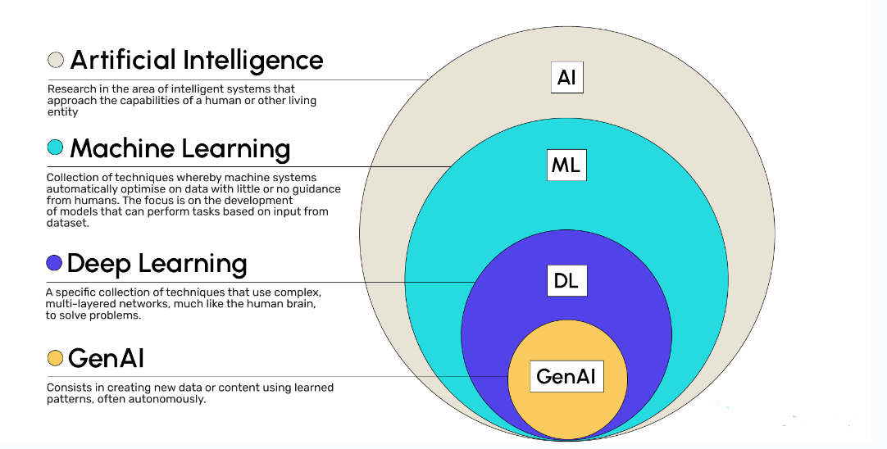
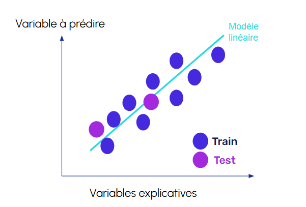
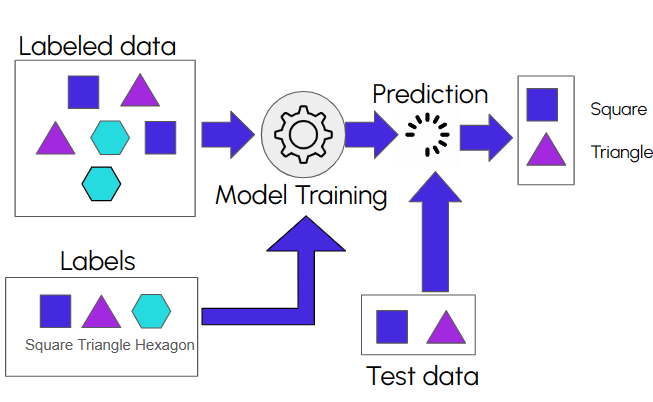
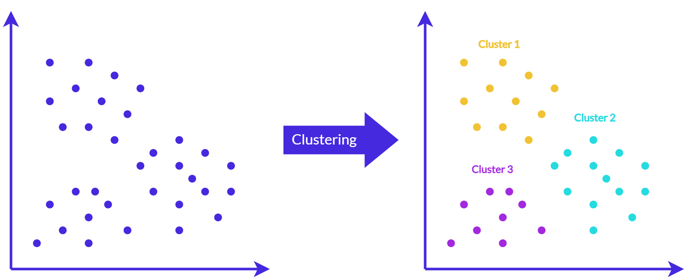
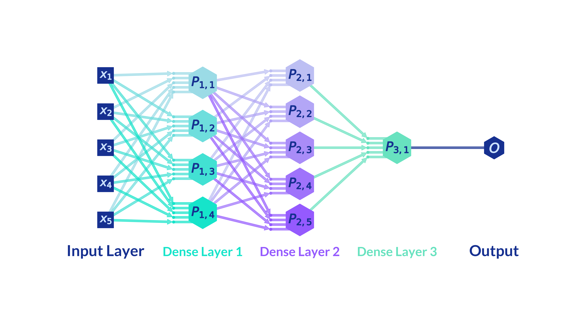
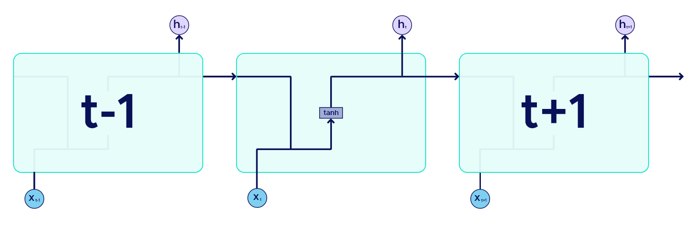
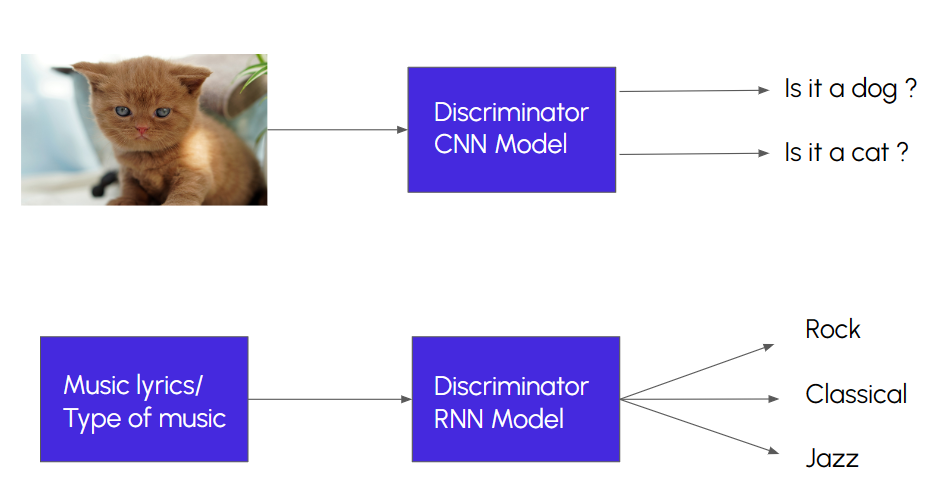
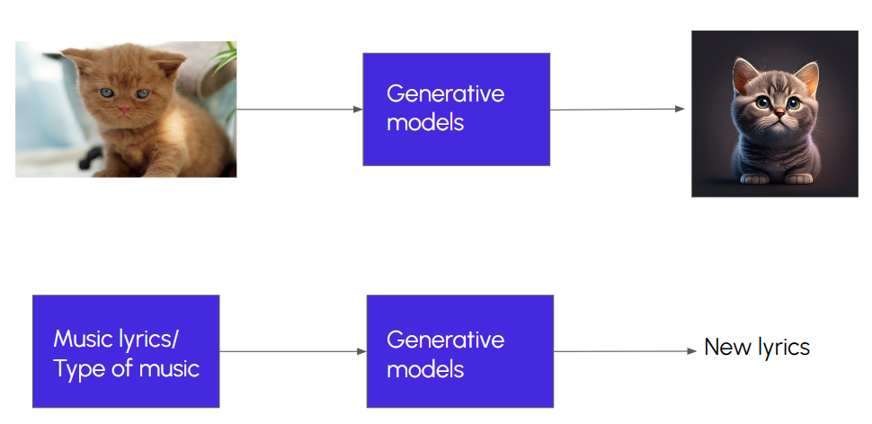
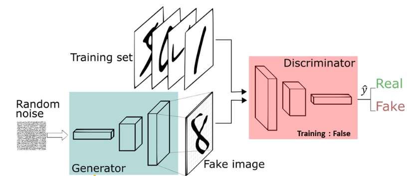
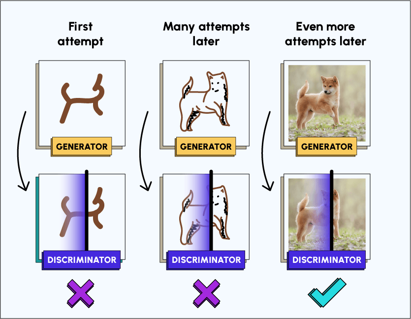

## Introduction à l'IA générative

# 1. Introduction à l'Intelligence Artificielle

L'intelligence artificielle est un domaine de l'informatique qui vise à créer des systèmes capables de simuler l'intelligence humaine. Elle englobe un large éventail de techniques et de méthodes visant à résoudre des problèmes complexes et à réaliser des tâches généralement associées à l'intelligence humaine. Les principaux sous-domaines de l'IA sont :

# L'apprentissage automatique :

L'apprentissage automatique, dit aussi apprentissage machine ou machine learning en anglais, est un type d'intelligence artificielle. Cette intelligence artificielle apprend à partir de données qui lui sont fournies et cet apprentissage va lui permettre de prendre des décisions. On aura souvent pour objectif d'utiliser ce modèle afin de réaliser des prédictions sur de nouvelles données, inconnues par le modèle.

L'apprentissage supervisé est une approche d'intelligence artificielle où un modèle est entraîné à partir d'exemples labellisés. Dans ce contexte, "supervisé" signifie que le modèle apprend à partir de données où les réponses désirées sont déjà connues. A partir de données labellisées (dites aussi étiquetées), on cherche à prédire cette variable.

Par exemple, on va chercher à prédire si un e-mail est un spam ou non. On aura à notre disposition un ensemble de données labellisées contenant des e-mails avec les labels "spam" ou "non spam". Un modèle sera alors entraîné pour faire des prédictions sur de nouveaux e-mails et identifier si ce sont des spams ou non.

Si l'on cherche à prédire une valeur numérique, nous utilisons des techniques de régression.

Si l'on cherche à prédire une classe ou une catégorie (comme l'exemple des spams), nous utilisons plutôt des techniques de classification.

L'apprentissage non supervisé est une approche où le modèle cherche à découvrir les structures sous-jacentes au sein d'une base de données. Le modèle n'a pas besoin d'exemples labellisés pour s'entraîner. Les algorithmes d'apprentissage non supervisé incluent le clustering, où les données sont regroupées en clusters basés sur des similarités.

De nombreuses situations en entreprise peuvent faire appel à l'utilisation de méthodes de clustering :

- Analyse des performances des produits : en examinant les données de ventes et de commentaires des produits, une entreprise peut utiliser un clustering pour regrouper les produits similaires en fonction de leurs caractéristiques et de leur popularité. Cela peut aider à prendre des décisions concernant les stocks, les améliorations de produits et les stratégies de tarification.

- Segmentation de la clientèle : les entreprises peuvent utiliser une méthode de clustering pour regrouper leurs clients en segments homogènes en fonction de leurs comportements d'achat, de leurs préférences et d'autres caractéristiques. Cela peut aider à personnaliser les offres et les campagnes de marketing pour chaque segment.

- Analyse des médias sociaux : les entreprises peuvent utiliser une méthode de clustering pour regrouper des utilisateurs de médias sociaux en fonction de leurs intérêts, de leurs interactions et de leurs préférences. Cela peut aider à adapter les campagnes de marketing sur les réseaux sociaux.

Le Deep Learning

Le Deep Learning est une branche de l'intelligence artificielle qui s'inspire du fonctionnement du cerveau humain pour créer des réseaux de neurones capables d'apprendre à partir de données. En utilisant des couches de neurones empilées et entraînées, le deep learning peut extraire des motifs et des caractéristiques complexes à partir de données non structurées, telles que des images, du texte ou du son.

Le deep learning, en raison de sa capacité à traiter des données complexes et non structurées, a ouvert la voie à de nombreuses applications passionnantes dans divers domaines. Voici quelques exemples d'applications de deep learning :

- Assistants virtuels : les assistants virtuels tels que Siri, Google Assistant et Alexa utilisent le deep learning pour comprendre et interpréter le langage naturel, répondre aux questions des utilisateurs, effectuer des tâches telles que la planification d'événements, la recherche sur Internet, et bien plus encore.

- Machines automatisées : dans l'industrie, le deep learning est utilisé pour automatiser divers processus de production. Par exemple, les usines peuvent utiliser des robots équipés de systèmes de vision par ordinateur basés sur le deep learning pour effectuer des tâches telles que l'inspection visuelle, la manipulation d'objets et le contrôle qualité.

- Reconnaissance faciale : la technologie de reconnaissance faciale, telle que Face ID sur les appareils Apple, utilise le deep learning pour identifier et authentifier les visages des utilisateurs. Les réseaux de neurones profonds sont utilisés pour extraire et analyser les caractéristiques faciales uniques, permettant ainsi une identification précise et sécurisée.

- Systèmes de recommandation : les entreprises comme Netflix, Amazon et Spotify utilisent le deep learning pour créer des systèmes de recommandation personnalisés. Ces systèmes analysent les préférences passées des utilisateurs, ainsi que les comportements similaires d'autres utilisateurs, pour recommander des films, des produits ou de la musique susceptibles d'intéresser chaque utilisateur.

# Les architectures de réseaux de neurones

i. Les réseaux de neurones denses

Une Dense Layer ou Fully-Connected Layer est un type de couche entièrement connectée, dans laquelle les neurones entre deux couches adjacentes sont tous reliés entre eux, mais où les neurones d'une même couche ne partagent pas de connexion. Il s'agit du type de couche le plus répandu. C'est précisément en interconnectant les neurones sous forme de couche que nous pouvons transformer notre réseau de neurones en un modèle non linéaire très complexe.

ii. Les CNN

Un réseau de neurones convolutif (CNN) est une architecture de réseau de neurones profonds largement utilisée dans le domaine de la vision par ordinateur pour traiter des données telles que des images. Son architecture se décompose en deux parties :

- La couche de convolution : elles consistent en un ensemble de filtres (ou noyaux) qui sont appliqués à l'image d'entrée pour détecter des motifs comme des bords, des textures, ou des formes. Chaque filtre glisse sur l'image en effectuant une opération de multiplication matricielle pour capturer les caractéristiques importantes de l'image.

- La couche de pooling (ou de sous-échantillonnage) : Cette couche est utilisée pour réduire la dimensionnalité spatiale des cartes de caractéristiques tout en préservant les informations importantes. Le pooling est souvent effectué en prenant la valeur maximale (max pooling) ou en moyennant les valeurs (average pooling) dans des régions spécifiques de la carte de caractéristiques.

- Les couches denses : Une fois que les caractéristiques ont été extraites par les couches de convolution et de pooling, elles sont aplaties dans un vecteur unidimensionnel et fournies à une ou plusieurs couches entièrement connectées. Ces couches sont similaires aux couches des réseaux neuronaux classiques et sont responsables de la classification finale.

iii. Les RNN

Un réseau de neurones récurrent (RNN) est une architecture de réseau de neurones conçue pour traiter des données séquentielles. Pensez aux séquences comme des données qui ont une certaine structure d'ordre, comme des phrases dans un texte, des trames dans une vidéo ou des points dans une série temporelle.

Un RNN contient des neurones récurrents qui ont une boucle de rétroaction. Cela signifie que la sortie d'un neurone à une étape de temps donnée est réinjectée dans le réseau à la prochaine étape de temps. Cette rétroaction permet au réseau de mémoriser des informations sur les étapes de temps précédentes et ainsi de mieux traiter les données séquentielles.

# 2. Modèles discriminatifs vs modèles génératifs

Les architectures de Deep Learning vues précédemment permettent de mettre en place des modèles discriminatifs. Les modèles discriminatifs visent à apprendre et à modéliser la relation entre les caractéristiques d'une entrée et ses étiquettes ou catégories associées. Ils sont principalement utilisés pour la classification, où l'objectif est de prédire une étiquette ou une catégorie donnée en fonction des caractéristiques d'entrée.

Les modèles génératifs visent à modéliser la distribution des données d'entraînement et à générer de nouvelles données qui ressemblent à celles-ci. Ils sont utilisés pour créer de nouvelles données à partir d'un ensemble d'apprentissage donné, souvent dans le but de produire des données réalistes qui semblent provenir de la même distribution que les données d'entraînement. Nous pouvons par exemple utiliser un réseau de neurones récurrents pour prédire la suite d'un texte plutôt que de le classifier.

Les modèles discriminatifs sont utilisés pour la classification et la prise de décision basée sur des caractéristiques d'entrée, tandis que les modèles génératifs sont utilisés pour créer de nouvelles données qui ressemblent à celles sur lesquelles ils ont été formés. Dans de nombreux cas, ces deux types de modèles peuvent être combinés pour des tâches complexes où la compréhension des données et la génération de nouvelles données sont nécessaires.

# 3. L'IA Générative

L'intelligence artificielle générative est une branche de l'IA qui se concentre sur la création de nouveaux contenus, tels que des images, des textes ou des sons, à partir de données existantes.

Dans le domaine de la vision par ordinateur, l'approche image-to-image consiste à entraîner des modèles pour transformer une image d'un domaine à un autre, comme la traduction d'une image en noir et blanc en couleur, ou la rénovation de vieilles photographies. Les réseaux de neurones GAN (Generative Adversarial Networks) sont une approche puissante pour générer des données réalistes, notamment des images. L'idée principale derrière les GAN est de faire concourir deux réseaux neuronaux, un générateur et un discriminateur.

# Fonctionnement d'un GAN

- Le générateur : Il prend en entrée un vecteur aléatoire, souvent appelé vecteur de bruit, et le transforme en une image. Au début de l'entraînement, le générateur produit généralement des images aléatoires qui ne ressemblent à rien de significatif.

- Le discriminateur : Il prend en entrée une image (soit une image réelle provenant de l'ensemble de données, soit une image générée par le générateur) et tente de déterminer si cette image est réelle ou synthétique (générée par le générateur).

- L'entraînement : Le générateur et le discriminateur sont entraînés de manière itérative. Pendant chaque itération, le générateur génère des images à partir du bruit, tandis que le discriminateur essaie de distinguer les vraies images des fausses. Le générateur est entraîné pour tromper le discriminateur, tandis que le discriminateur est entraîné pour devenir plus précis dans sa distinction entre les vraies et fausses images.

- La convergence : Idéalement, au fur et à mesure de l'entraînement, le générateur apprend à générer des images de plus en plus réalistes, tandis que le discriminateur devient de plus en plus difficile à tromper. Lorsque le modèle atteint un certain point, le générateur peut produire des images qui sont indiscernables des vraies images pour un observateur humain.

Le text-to-image vise à générer des images réalistes à partir de descriptions textuelles. L'approche text-to-text se concentre sur la génération de texte à partir d'autres formes de texte, comme la traduction automatique, le résumé automatique, ou encore la génération de texte créatif à partir de prompts donnés. Pour ce faire nous utilisons des LLM (Large Language Model).

Un LLM, ou Large Language Model, est un modèle de langage qui a été entraîné sur de vastes quantités de données textuelles pour comprendre et générer du langage naturel. Ces modèles sont souvent basés sur des architectures de réseaux de neurones puissantes, comme les Transformers, et peuvent être utilisés pour effectuer une variété de tâches liées au traitement du langage naturel, y compris les tâches de génération de texte.

Avant d'être utilisés, les LLM sont entraînés sur de vastes corpus de texte provenant de diverses sources telles que des livres, des articles de journaux, des pages web, etc. L'objectif est d'exposer le modèle à une grande variété de structures linguistiques et de contextes. Après l'entraînement, les LLM sont capables de prédire la probabilité d'un mot étant donné un contexte précédent. En d'autres termes, ils peuvent générer des mots ou des séquences de mots qui sont cohérents avec le langage naturel. Il existe plusieurs modèles LLM pré-entraînés disponibles, tels que GPT de OpenAI, T5 de Google, BERT de Google, etc.

# Les types de LLM

- Modèles génériques : Ces LLM sont entraînés sur de vastes ensembles de données textuelles de manière générale, sans adaptation spécifique à une tâche ou à un domaine particulier. Ces modèles peuvent être utilisés pour une variété de tâches de traitement du langage naturel telles que la génération de texte, la traduction automatique, la réponse à des questions, etc.

- Modèles ajustés (Fine-tuned) : Les modèles génériques peuvent être fine-tunés sur des ensembles de données spécifiques ou adaptés à des tâches particulières. Cette adaptation permet au modèle de mieux performer pour une tâche spécifique en ajustant ses poids et ses paramètres à partir de données d'entraînement spécifiques. Par exemple, un modèle GPT-3 générique peut être fine-tuné pour répondre à des questions médicales en utilisant des données médicales spécifiques.

- Modèles de chat : Ces LLM sont spécifiquement entraînés pour interagir avec les utilisateurs comme s'ils étaient des interlocuteurs humains dans une conversation. Ils sont souvent fine-tunés sur des ensembles de données de dialogue pour améliorer leur capacité à comprendre et à générer des réponses conversationnelles naturelles. Ces modèles sont utilisés dans les agents conversationnels, les chatbots et d'autres systèmes interactifs.

Chaque type de LLM a ses propres avantages et inconvénients en fonction de l'application spécifique. Les modèles génériques sont souvent polyvalents mais peuvent manquer de spécificité dans certaines tâches, tandis que les modèles ajustés peuvent offrir des performances supérieures pour des tâches spécifiques mais nécessitent des ensembles de données d'entraînement appropriés. Les modèles de chat sont conçus pour l'interaction humaine, mais peuvent être limités dans leur capacité à traiter des tâches plus complexes en dehors du contexte de la conversation.

# Paramètres de LLM

- Température
  La température est un paramètre crucial dans la génération de texte par les modèles de langage comme GPT. Elle contrôle la diversité et l'imprévisibilité des réponses générées. Une température plus élevée permet au modèle de produire des réponses plus variées et parfois plus créatives, car elle réduit la sensibilité aux probabilités des tokens individuels. Cela signifie que des choix de tokens moins probables peuvent être sélectionnés, introduisant ainsi une certaine dose d'imprévisibilité dans les réponses. En revanche, une température plus basse favorise des réponses plus conservatrices et conformes aux statistiques de probabilité, produisant des résultats plus prévisibles et moins variés.

- Max token
  Le paramètre max token est utilisé pour limiter la longueur maximale du texte généré par le modèle à chaque interaction. Il est essentiel pour contrôler la quantité de tokens produits, ce qui est particulièrement important pour éviter que le modèle ne dépasse les limites de capacité ou ne génère des réponses excessivement longues. En fixant une valeur pour max token, les utilisateurs peuvent ajuster précisément la longueur des réponses générées en fonction de leurs besoins spécifiques ou des contraintes d'utilisation de l'application.

- Top K
  Le paramètre top k est une technique de sampling utilisée pour restreindre les choix possibles lors de la génération de texte. Il limite la sélection des tokens aux k tokens les plus probables à chaque étape du processus de génération. En excluant les tokens moins probables, top k permet de maintenir la cohérence et la qualité des réponses générées par le modèle. Cette approche est particulièrement efficace pour améliorer la précision et la fluidité des réponses, en minimisant les risques de générer des résultats incohérents ou imprécis.

- Top P
  Le paramètre top p, également connu sous le nom de nucleus sampling, est une méthode de sampling qui sélectionne le minimum de tokens nécessaires pour cumuler une probabilité cumulée de p. Cela signifie que seuls les tokens qui représentent collectivement une probabilité de p (ou plus) sont conservés pour la sélection finale. Top p permet de contrôler la diversité des réponses en ajustant la sensibilité aux tokens moins probables tout en garantissant que les réponses restent cohérentes et pertinentes. Cette approche est particulièrement utile pour maintenir la variabilité tout en évitant les résultats extrêmes ou peu plausibles.

# Conclusion

L'intelligence artificielle représente une avancée révolutionnaire dans le domaine de l'informatique, visant à simuler et à automatiser des tâches qui nécessitent l'intervention humaine. À travers ses divers sous-domaines tels que l'apprentissage automatique et le deep learning, l'IA a permis des progrès significatifs dans des applications aussi variées que la reconnaissance d'image, la traduction automatique, et même la création de contenu artistique.

L'apprentissage automatique, en particulier, a transformé la manière dont nous utilisons les données pour prendre des décisions précises et automatisées. Des techniques comme la classification et le clustering sont devenues des outils indispensables pour l'analyse de données en entreprise et la segmentation de la clientèle, entre autres applications.

D'un autre côté, le deep learning, avec ses architectures sophistiquées comme les réseaux de neurones convolutionnels et récurrents, a ouvert de nouvelles perspectives dans des domaines allant des assistants virtuels à la reconnaissance faciale, en passant par l'automatisation industrielle.

Enfin, l'émergence de l'IA générative, exemplifiée par les GAN et les modèles de langage de grande envergure, promet de nouvelles avancées en matière de création de contenu réaliste et de compréhension du langage naturel. Ces développements ouvrent la voie à des applications innovantes telles que la traduction automatique avancée, la génération d'art visuel et la conversation intelligente.
