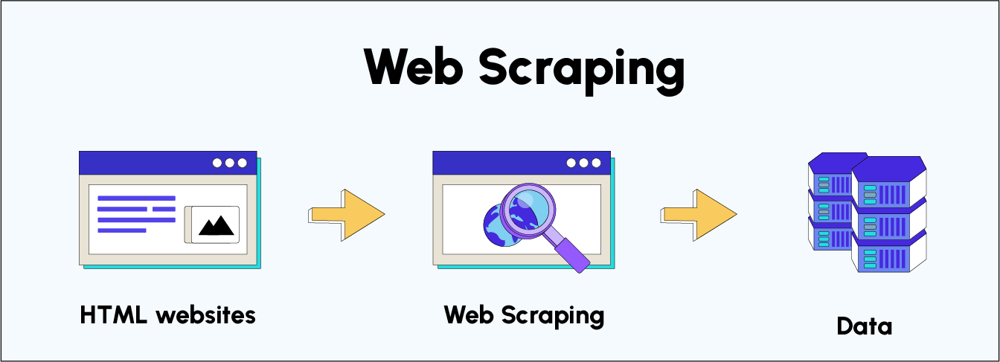

## Web Scraping avec Beautiful Soup - Qu'est-ce que le Web Scraping ?

# Objectifs

Dans ce module, nous allons vous montrer comment effectuer du Web Scraping via Python, en utilisant la librairie BeautifulSoup pour collecter des données exploitables à partir de n'importe quelle page web. Nous couvrirons principalement la librairie BeautifulSoup 4, ses outils pour naviguer, rechercher et analyser efficacement les pages web HTML, mais aussi d'autres aspects annexes au Web Scraping tels que l'introduction aux langages du Web, la notion d'éthique et la gestion d'erreurs récurrentes.

Plus précisément, ce module vous permettra de:

- découvrir les intérêts et les enjeux du Web Scraping.
- comprendre de quoi est constitué une page web.
- récupérer le code source d'un site internet.
- savoir naviguer dans ce code source.
- intercepter les données qui nous intéressent.
- appréhender les limites du Web Scraping et les moyens pour s'en protéger.
- apprendre à solutionner des erreurs courantes en Web Scraping.

# Qu'est-ce que le web ?

Lorsque nous naviguons sur internet, ce que nous voyons d'un site web, c'est à dire son contenu et son visuel, est codé dans des langages de programmation appartenant à une famille à part entière : c'est le développement web. Si aujourd'hui il existe de nombreux langages et frameworks dans ce domaine, nous pouvons simplifier son code en l'utilisation de 3 langages de programmation : le HTML, le CSS et le Javascript. C'est la combinaison de ces 3 langages qui constitue le code source des pages web accessibles depuis notre navigateur. Il sera nécessaire pour nous de maîtriser les bases du développement web pour devenir un expert en Web Scraping.

Pas de panique ! Nous n'aurons pas besoin de suivre un autre cours en parallèle sur le développement web pour comprendre les concepts clés du Web Scraping. Tout ce dont vous avez besoin sera couvert dans le prochain notebook sur l'introduction aux langages web, et nous serons en mesure de vous fournir toutes les compétences nécessaires pour réussir.

# Qu'est-ce que le Scraping ?

De l'anglais To scrape signifiant "gratter", "racler" ou "extraire", le scraping de données est le processus d'extraction automatique de données à partir de pages web. Il permet de récupérer des données structurées ou non structurées, telles que des informations clients, des commentaires, des avis de produits, des prix, des images et de manière plus générale, toute information que nous pouvons visualiser sur un site internet. C'est pourquoi les notions clés de développement web précédemment évoquées et que nous verrons dans le prochain notebook nous seront utiles. Les données extraites peuvent alors être insérées dans un DataFrame pour pouvoir alimenter de nombreuses applications comme du Machine Learning par exemple.

Le Web Scraping peut être effectué manuellement, mais cela peut prendre beaucoup de temps, en particulier pour les pages web avec de nombreuses données. C'est pourquoi le Web Scraping automatisé est devenu une technique courante pour extraire rapidement et efficacement des données à grande échelle.

En outre, il existe plusieurs outils pour faire du Web Scraping :

des extensions de navigateur comme Simple Scraper ou Web Scraper qui s'installent directement dans notre navigateur.
des logiciels no-code comme octoparse qui permettent de créer des bots de Web Scraping sans écrire de code. Ils utilisent souvent une interface graphique conviviale pour configurer le scraping et extraire les données souhaitées.
des API (Interface de programmation d'application) qui permettent d'accéder à des données spécifiques d'un site web de manière plus structurée et organisée.
des librairies Python qui permettent de récupérer l'information à l'aide de scripts personnalisés dont on dispose d'un contrôle total.
Toutefois, même si les outils sont divers, l'objectif reste strictement le même. Dans ce module, nous nous focaliserons sur l'apprentissage du Web Scraping grâce aux librairies Python.

# Principales librairies Python pour le Web Scraping

Ainsi, Python dispose de plusieurs librairies permettant la récolte d'information dans des ressources Web. Voici les trois solutions les plus couramment utilisées :

1. BeautifulSoup
   Simple et rapide à prendre en main, BeautifulSoup est la librairie idéale pour débuter dans le Web Scraping. C'est pour cette raison qu'elle vous sera introduite dans la suite du module.

En revanche, cette librairie peut être plus lente que d'autres librairies pour des cas d'utilisation très avancés.

2. Scrapy
   Permet de scraper des données à grande échelle, la librairie Scrapy donne également la possibilité d'exporter les données scrapées vers différents formats tels que JSON ou CSV.

Sa courbe d'apprentissage est cependant plus raide que BeautifulSoup. Enfin, Scrapy requiert une configuration plus complexe et plus avancée pour les cas d'utilisation les plus avancés, elle est donc plus difficile à prendre en main.

3. Selenium
   Selenium est avant tout une librairie créée pour les tests web automatisés. En raison de sa compatibilité avec JavaScript, elle est aussi utilisée pour le Web Scraping et permet de faire du scraping dynamique, contrairement aux deux librairies précédentes.

Selenium peut simuler le comportement humain pour éviter d'être détectée par les sites web. C'est un outil très efficace et rapide qui est plus ou moins aussi performant que Scrapy.

Cependant, Selenium peut être plus lent que les autres librairies pour les cas d'utilisation les plus simples et est plus difficile à utiliser que les autres librairies pour les débutants en Python.

Enfin, de plus en plus de sites détectent l'utilisation de Selenium et bloquent son utilisation.

En bref, BeautifulSoup est recommandé pour débuter avec le Web Scraping, Scrapy est recommandé pour les projets de grande envergure et Selenium est recommandé pour le scraping de pages web dynamiques avec JavaScript. Le choix de la librairie dépendra donc de votre cas d'utilisation et de votre niveau de compétences en Python.

# Quel est l'intérêt du Web Scraping ?

Si nous avons à présent compris ce qu'était le Web Scraping dans son principe général et les différents moyens à notre disposition pour l'utiliser, il n'est pas évident d'en comprendre les intérêts et les principaux avantages. Voici quelques avantages et intérêts du Web Scraping :

Accès à des données précieuses : le Web Scraping nous permet de collecter des données précieuses et des informations qui ne sont pas disponibles ailleurs. Ces données peuvent vous aider à mieux comprendre le marché, les tendances, la concurrence et les comportements des consommateurs. C'est un moyen de se constituer son propre jeu de données.
Gain de temps et d'argent : le Web Scraping automatisé peut vous faire économiser du temps et de l'argent. Plutôt que de collecter manuellement des données, qui pourrait nécessiter beaucoup de journées/main d'œuvre et donc s’avérer être une opération coûteuse, nous pouvons utiliser des outils de scraping pour le faire automatiquement, nous permettant ainsi de nous concentrer sur d'autres tâches importantes.
La précision : L’erreur humaine est souvent un facteur à prendre en compte lors de l’exécution manuelle d’une tâche (de l'ordre de 20%). Par conséquent, l’extraction de données par un outil dédié est bien plus qualitative et précise.
Gestion efficace des données : Le Web Scraping permet de sélectionner les données que nous souhaitons collecter puis d’utiliser les bons outils pour garantir la sécurité des informations insérées.

# Conclusion

Le Web Scraping est un outil puissant pour collecter des données à partir de sites web. Il ne se limite pas à la simple consultation de pages web, mais vise à extraire des données structurées de ces pages pour constituer un jeu de données. Il existe une grande diversité d'outils de Web Scraping, notamment des librairies Python comme BeautifulSoup, Scrapy ou Selenium qui permettent d'extraire des données de manière automatisée à partir de sites web.

Les avantages du Web Scraping sont nombreux, notamment la collecte de données précieuses, le gain de temps, d'argent, la précision des données récupérées et la gestion efficace des données. Le Web Scraping est donc très utile pour les entreprises qui souhaitent collecter des données pour des analyses ou des décisions commerciales.

En outre, pour réussir en Web Scraping, il est important de comprendre les langages du web tels que HTML, CSS, JavaScript, etc. Ces langages sont utilisés pour construire les pages web que l'on souhaite scraper. Il est donc utile d'avoir des compétences en programmation pour réussir en Web Scraping.
