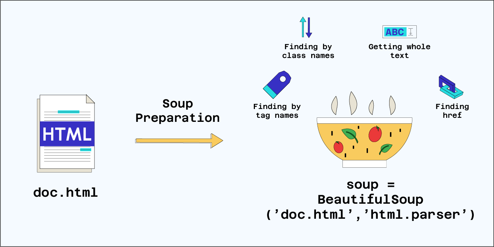

## Web Scraping avec BeautifulSoup - Collecter les données

Nous avons vu jusqu'à présent comment récupérer le code source d'une page web. Mais nous ne savons pas encore comment le parcourir pour collecter les données qui nous intéressent. Avec la complexification des sites internets, les documents HTML récupérés sont souvent verbeux et l'identification des éléments recherchés n'est pas évidente. La librairie BeautifulSoup met à disposition différentes méthodes permettant de faciliter la recherche des données. Pour éviter de se retrouver avec un code obsolète et un travail non exploitable, il est important de sauvegarder dans un fichier externe (au format csv par exemple) les données récupérées.

# La librairie BeautifulSoup

BeautifulSoup est une librairie Python qui permet d'extraire des données à partir de fichiers HTML. Elle est très utilisée dans le domaine du Web Scraping pour extraire des informations à partir de pages web et crée un arbre d'analyse à partir des documents HTML. Cette fonctionnalité rend le contenu de la page web plus lisible que ce que nous avons vu avec Requests. En pratique, pour analyser ces fichiers HTML, BeautifulSoup utilise des parseurs (ou parser en anglais) qui sont des bibliothèques logicielles utilisées pour analyser et extraire des données à partir de documents HTML. Le parseur transforme le code HTML en une représentation en arbre, appelée arbre DOM (Document Object Model), facilitant ainsi la navigation et l'extraction de données spécifiques.

Il existe plusieurs parseurs disponibles, chacun avec ses avantages et ses inconvénients. Les trois parseurs les plus couramment utilisés sont:

- html.parser : html.parser est le parseur par défaut de Python ce qui signifie qu'aucune installation supplémentaire est nécessaire. Assez simple à utiliser pour des tâches de parsing élémentaires, il est cependant plus lent que lxml et html5lib. Aussi, ce parseur n'est pas très tolérant aux erreurs de syntaxe, et il peut avoir du mal à analyser des fichiers HTML complexes. Pour utiliser html.parser, il faut le préciser en argument optionnel lors de la création de l'objet BeautifulSoup.

- html5lib: html5lib est un parseur relativement lent comparé à certains autres parseurs HTML. Cela est dû à son approche de parsing exhaustive et à sa compatibilité avec HTML5, ce qui peut entraîner des performances légèrement plus faibles. La bibliothèque html5lib peut avoir une empreinte mémoire relativement plus importante en raison de sa conception complète et de sa prise en charge de différentes fonctionnalités HTML5. C'est une librairie plus complète mais moins performante.

- lxml: lxml est un parseur plus rapide et plus tolérant aux erreurs de syntaxe que html.parser. Il est également capable d'analyser des fichiers XML, en plus des fichiers HTML. Cependant, il doit être installé séparément. C'est le parseur que nous vous recommandons d'utiliser.

Une fois que nous avons créé une instance de la classe BeautifulSoup avec le contenu de notre fichier, communément appelé soup, nous pouvons utiliser différentes méthodes pour extraire des données de la page.

(a) Grâce aux techniques énoncées dans le précédent notebook, récupérer le code source de la page web "https://fr.wikipedia.org/wiki/Alan_Turing" , puis créer la soup correspondante.

# Insérez votre code ici

​​

# Les méthodes de BeautifulSoup

Pour extraire des données à partir d'un fichier HTML, nous devons cibler dans un premier temps des éléments HTML spécifiques. Pour cela, nous pouvons utiliser les méthodes de la librairie BeautifulSoup pour sélectionner des éléments dans le code source HTML.

# La méthode find():

La méthode find() permet de rechercher la première occurrence d'un élément HTML correspondant au critère spécifié. Elle prend en paramètre le nom de la balise HTML et éventuellement un dictionnaire d'attributs. Par exemple, si vous souhaitez trouver le premier paragraphe (balise 
) de la page qui a la classe "ma-classe", vous pouvez utiliser la méthode suivante :

soup.find('p', class\_ = "ma-classe")

Vous pouvez remarquer que nous utilisons class* au lieu de class dans BeautifulSoup. class est un mot-clé réservé en Python pour définir de nouvelles classes, un type d'objet personnalisable. Ces mots ne peuvent pas être utilisés comme noms de variables, de fonctions ou d'attributs. Ainsi, class* évite tout conflit ou ambiguïté avec l'interpréteur Python.
Parfois, vous pourrez rencontrer une syntaxe différente pour la méthode find(), notamment avec l'utilisation de l'accesseur '.' . C'est une méthode abrégée pour accéder à la première balise, de manière équivalente à find() mais son utilisation dépend de la préférence personnelle et du style de codage. Ainsi, les deux codes suivants sont équivalents:

soup.div.div.a

soup.find('div').find('div').find('a')

Ils permettent d'afficher le premier lien du document HTML soup hébergé dans deux div.

De plus, nous pouvons utiliser plusieurs arguments optionnels avec cette méthode find() pour spécifier notre recherche en fonction des éléments à notre disposition. Nous pouvons spécifier des attributs tel que le nom de la classe, l'id unique ou bien tout autre attribut grâce au paramètre attrs sous la forme d'un dictionnaire qui peut prendre un ou plusieurs attributs.

(b) Exécuter la cellule de code suivante pour voir un exemple concret d'utilisation de la méthode find() avec différents arguments optionnels.
from bs4 import BeautifulSoup as bs
​
code_source =

<!-- <html>
  <body>
    <h1 id="first"> Titre 1 </h1>
    
 Contenu principal unique 

    
 Un premier contenu 

    
 Un second contenu en français 

    <h1 id="second"> Titre 2 </h1>
    <ul id="liste">
        <li class="puce"> Element 1 </li>
        <li class="puce"> Element 2 </li>
        <li class="puce"> Element 3 </li>
    </ul>
    

        
 Un nouveau paragraphe 

    

  </body>
</html> -->

​
soup = bs(code*source, 'html.parser')
element_by_id = soup.find('div', id= 'main-content')
element_by_class = soup.find('div', class*= 'content')
element_by_attrs = soup.find('div', attrs={'class': 'content', 'data-lang': 'fr'})
​
print("element_by_id : ",element_by_id.text)
print("element_by_class : ",element_by_class.text)
print("element_by_attrs : ",element_by_attrs.text)
​

# La méthode find_all():

La méthode find_all() recherche toutes les occurrences d'éléments HTML correspondant aux critères spécifiés. Elle prend en paramètre le nom de la balise HTML et éventuellement un dictionnaire d'attributs. Par exemple, pour afficher tous les liens hypertextes de la page, il est possible d'utiliser le code suivant:

soup.find_all('a')

La fonction find_all(), renvoie une liste de valeurs correspondantes que l'on pourra parcourir à l'aide d'une boucle for par exemple.

(c) En se basant sur le code HTML précédent, récupérer le contenu des deux div ayant la classe 'content' comme attribut à l'aide de la méthode find_all().

# Insérez votre code ici

​
​
​
​

# La méthode find_next():

La méthode find_next() est utilisée pour rechercher le premier élément qui se situe après l'élément courant et qui correspond aux éventuels critères spécifiés. Cette méthode ne s'appelle pas depuis la soup mais bien depuis un élément HTML qui a déjà été récupéré, notre "élément courant".

D'une manière similaire, il existe la méthode find_previous() qui permet de faire les mêmes recherches mais sur les éléments précédant l'élément courant.

Voici un exemple qui vous permettra de mieux comprendre son utilisation :

first_title = soup.find('h1', id="first")
second_title = first_title.find_next('h1') # on cherche le prochain titre de niveau 1 (balise h1) après first_title
print(first_title.text)
print(second_title.text, ", est le prochain titre de niveau 1 après first_title")
​

# La méthode find_next_sibling():

La méthode find_next_sibling() est utilisée pour rechercher le premier élément frère (sibling) qui suit immédiatement l'élément courant et qui correspond aux critères spécifiés. Cette méthode est utile pour naviguer dans le code source et pour extraire des données à partir d'éléments HTML qui sont au même niveau et partagent le même parent que l'élément actuel. Tout comme find_next(), cette méthode ne s'appelle pas depuis la soup mais bien depuis un élément HTML qui a déjà été récupéré, notre "élément courant".

D'une manière similaire, il existe la méthode find_previous_sibling() qui permet de faire les mêmes recherches mais sur les éléments précédents.

Voici un exemple qui vous permettra de mieux comprendre son utilisation :

first_item = soup.find('li')
second_item = first_item.find_next_sibling('li')
third_item = second_item.find_next_sibling('li') # équivalent à first_item.find_next_sibling('li').find_next_sibling('li')
​
print(first_item.text)
print(second_item.text, ", est le premier 'élement frère' après first_item")
print(third_item.text, ", est le premier 'élement frère' après second_item")
​

# La méthode select():

La méthode select() permet de rechercher des éléments HTML en utilisant des sélecteurs CSS. Cette méthode offre une approche flexible pour sélectionner des éléments HTML en fonction de leur position, de leur relation avec d'autres éléments ou de leurs attributs. En particulier, la méthode permet de :

sélectionner des éléments à partir de seulement leurs attributs css (class, id) grâce aux sélecteurs css '.' et '#'.
sélectionner des éléments à partir de balise d'une manière similaire à la méthode find()
sélectionner des éléments par relation parent-enfant : pour cela, on utilise l'opérateur '>' entre les sélecteurs CSS.
Cette méthode renvoie une liste contenant toutes les balises concernées par la requête. Si nous voulons directement accéder au premier élément de cette liste, c'est-à-dire au premier élément HTML qui respecte les critères, nous pouvons utiliser la méthode select_one().

Voici une explication structurée de la méthode select() et quelques exemples pour illustrer son utilisation :

elements_css_class = soup.select('.puce') # un élément HTML dont la classe ('.' en css) est "puce"
elements_css_id = soup.select('#second') # un élément HTML dont l'id ('#' en css) est "second"
elements_parent_enfant = soup.select_one('div > p') # le premier paragraphe à l'intérieur d'une div
​
​
for element in elements_css_class : # parcourt la liste des balises concernées par la classe 'puce'
print(" Element avec la class .puce : ", element.text)

print(elements_css_id[0].text) # On accède au 1er élément de la liste renvoyée
print(elements_parent_enfant.text)  
​

# Conclusion

Nous arrivons au terme de ce notebook dédié à la librairie BeautifulSoup, ses différents parseurs et ses principales méthodes qui nous permettent de naviguer, rechercher et manipuler les éléments du code source HTML.

La méthode find() permet de récupérer le premier élément correspondant à un critère donné, tandis que find_all() renvoie tous les éléments correspondants. La méthode find_next() est utilisée pour trouver le premier élément suivant qui correspond à un critère, et find_sibling() permet de trouver le premier élément frère qui correspond à un critère. Enfin, la méthode select() offre une approche flexible pour la sélection d'éléments en utilisant des sélecteurs CSS.

La maîtrise de ces méthodes nécessite de la pratique. Nous vous invitons à revoir ces méthodes et à les appliquer sur différents documents HTML pour vous les approprier. N'oubliez pas que la documentation officielle de BeautifulSoup est une ressource précieuse pour approfondir vos connaissances et résoudre les problèmes que vous pourrez rencontrer.

Dans le prochain notebook, nous passerons de la théorie à la pratique en appliquant ces méthodes dans un cas concret. Nous allons extraire des informations à partir d'une page web réelle, ce qui vous permettra de voir comment BeautifulSoup peut être utilisé pour des tâches réelles de web scraping. Vous pourrez ainsi consolider vos acquis et développer vos compétences en scraping de données.
