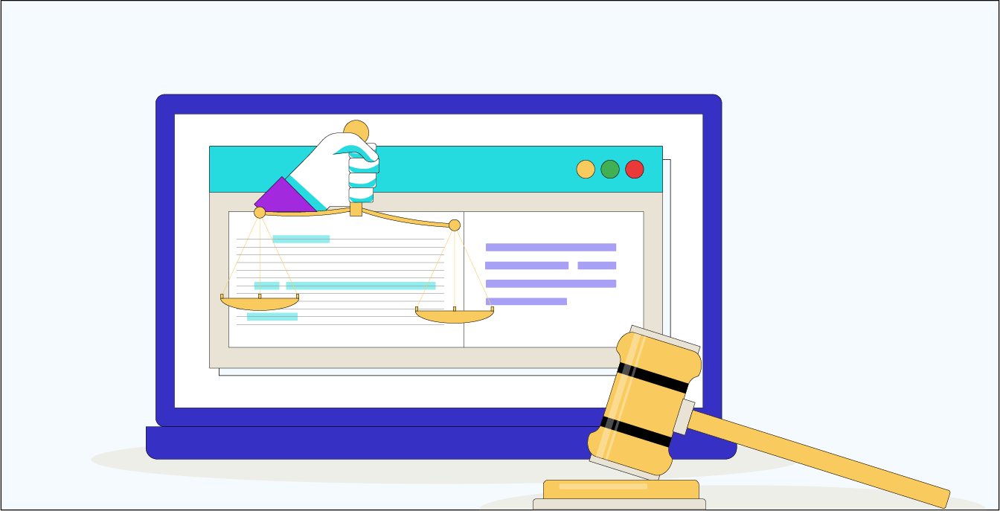

# Web Scraping avec BeautifulSoup - Les limites du Web Scraping

Dans les précédents notebooks, nous avons appris à scraper des données de n'importe quel site internet grâce à la librairie BeautifulSoup. Bien qu'il puisse être très efficace pour obtenir des données en masse, il existe des limites au Web Scraping que nous devons prendre en compte et qui peuvent nous compliquer la tâche. Dans ce notebook, nous allons examiner les principales limites du Web Scraping et les mesures que les sites Web peuvent prendre pour se protéger contre cette technique.

# Les limites du Web Scraping avec BeautifulSoup

1. Le contenu dynamique
   BeautifulSoup est une librairie parfaite pour débuter avec le Web Scraping mais ne permet pas de récolter des informations de tous les sites internet. En effet, certaines pages Web sont construites de manière complexe, ce qui peut rendre difficile l'extraction de données. Par exemple, les sites Web qui utilisent des technologies telles que Javascript pour dynamiser leur contenu peuvent être difficiles, voire impossible, à scraper avec BeautifulSoup car cette librairie se base uniquement sur le code source initial de la page tandis que ces contenus dynamiques sont par définition, des éléments qui peuvent changer ou apparaître après le chargement initial de la page, en réponse à des actions de l'utilisateur, telles que des clics sur des boutons ou des défilements.

Dans le cas où la page que nous voulons scraper contient du contenu dynamique, nous devons avoir recours à des outils plus avancés qui eux, seront capables d'interagir avec ces contenus dynamiques. La librairie Selenium par exemple, est une solution envisageable car elle permet de simuler des actions utilisateur pour charger les contenus dynamiques et en extraire les données nécessaires.

2. La fiabilité des données
   La fiabilité est une limite majeure du Web Scraping car les pages Web peuvent être mises à jour régulièrement, ce qui peut causer des erreurs dans la structure du code HTML et des données manquantes ou incorrectes dans le scraping. Lorsqu'une page Web est modifiée, les balises HTML peuvent changer, les noms des classes peuvent être modifiés, les éléments peuvent être déplacés, etc. Cela peut entraîner la collecte de données incorrectes ou manquantes et des erreurs dans le scraping. Par exemple, si nous scrapons un site Web pour obtenir des données sur les prix d'un produit, une modification dans la structure du site Web peut faire en sorte que les données ne soient plus collectées correctement et peut engendrer une erreur dans notre script.

Pour remédier à cette limite, nous pouvons utiliser des techniques avancées de monitoring qui nous permettent de suivre les modifications des pages Web. De cette façon, nous pouvons détecter rapidement les erreurs et les corriger. En pratique, cela passe par la mise en place de scripts Python de surveillance pour détecter les changements dans la structure de la page Web et alerter les développeurs en cas de problème. Ces scripts détectent les erreurs grâce à la définition d'un ensemble de règles de validation, qui vérifient si les données collectées sont correctes et cohérentes. Par exemple, les règles de validation peuvent vérifier si les prix collectés sont compris entre une certaine fourchette de prix, s'ils sont plus élevés que le prix précédent, ou s'il y a une augmentation ou une diminution significative du prix. Les règles de validation peuvent également vérifier si les données sont manquantes ou non conformes, et signaler les erreurs à l'utilisateur.

D'une manière plus généraliste, nous pouvons également comparer le contenu entier de la page avec une version antérieure en hachant ces pages, c'est à dire, en obtenant l'empreinte unique d'un fichier grâce à des calculs mathématiques complexes qui forment une fonction, dite fonction de hachage, obtenue grâce à la librairie hashlib. Ainsi, nous allons pouvoir contrôler la version de la page web, en comparant l'empreinte de hachage actuelle avec l'empreinte précédemment enregistrée. Si les deux empreintes de hachage sont identiques, cela signifie que le site web n'a pas été modifié depuis la dernière fois que vous l'avez scrapé. Si les empreintes de hachage sont différentes, cela signifie que le site web a été modifié et que vous devez corriger votre script de scraping.

En utilisant ces techniques, nous pouvons améliorer la fiabilité de notre script de scraping et nous assurer que les données collectées soient précises, valides et conformes.

3. L'aspect juridique du Web Scraping

C'est une question à laquelle on ne peut s'empêcher de penser : est-ce que le Web Scraping est légal ?

Au premier abord, la pratique du scraping semble déloyale, car une entreprise ou un individu peut récupérer du contenu produit par d'autres, sans avoir investi le temps et les efforts nécessaires pour le créer. En outre, l'auteur original n'a aucun contrôle sur la manière dont son contenu sera utilisé. Cependant, sur le plan juridique, la question est complexe et le droit n’est pas encore arrivé à maturité. La jurisprudence européenne tantôt autorise, tantôt condamne le Web Scraping et montre que l'analyse du contexte est nécessaire avant de statuer sur la légalité du Web Scraping.

En théorie, le Web Scraping est encadré en droit français par l’article L. 342-3 du Code de la propriété intellectuelle, qui autorise le scraping de données dans les cas où :

Nous utilisons les données à des fins privées.
Nous respectons les conditions générales d'utilisations du site internet.
Nous réalisons un investissement substantiel pour qu'une base de données soit protégée par le droit d'auteur.
Par conséquent, le scraping est en violation du code de la propriété intellectuelle si une de ces conditions n'est pas respectée. Par exemple, si la transformation réalisée sur les données n'est pas suffisamment importante pour justifier que la nouvelle base soit elle-même considérée comme proprement différente, alors l'action devient illégale.

En pratique, nous devons faire attention à la manière dont nous comptons utiliser ces données. Si les données sont téléchargées pour un usage personnel, alors c'est tout à fait éthique et légal. Mais si nous envisageons de les utiliser comme les nôtres, sur notre site web, d'une manière qui va totalement à l'encontre des intérêts du propriétaire des ces données, sans l'identifier, alors c'est contraire à l'éthique et c'est illégal.

Cependant, il est important de noter que dans les cas où le scraping est considéré comme illégal, c'est la publication et l'utilisation des données scrapées qui pose problème, pas l'action de scraping elle-même. Cette utilisation publique des données est soumise, comme toutes données personnelles, au RGPD (règlement européen sur la protection des données). En réalité, le scraping de données publiques consiste à se déplacer sur un site sans créer de compte ni s'être enregistré, ce qui ne viole pas les conditions d'utilisation du site en question. Par conséquent, le plus gros scraper du monde, Google, n'enfreint pas la loi en utilisant cette technique pour ses services tels que Google Shopping ou Google Actualités dans lesquelles il agrège des millions de données provenant de multiples sites internet.

En somme, l’activité de scraping n’a rien d’illégal, en revanche la réutilisation des données scrapées, telles quelles ou après transformation mineure, présente des risques plus importants et doit faire l’objet d’une étude juridique fine axée sur le niveau de transformation des données collectées pour pouvoir prouver un investissement substantiel et pour respecter les loies en vigueur.

# Comment se protéger du Web Scraping ?

Nous avons vu que le scraping de données peut être utilisé à des fins malveillantes, voire dans la totale illégalité du code de la concurrence. Malheureusement, il n'existe pas de moyen fiable d'empêcher pleinement le scraping de données sur un site internet mais il existe un ensemble de bonnes pratiques qui en limiteront l'usage tant il sera difficile de contourner toutes les sécurités mises en place.

Faisons le tour des moyens à la disposition des sites web pour limiter le Web Scraping :

1. Utilisation de Captchas : Les Captchas sont des tests qui permettent de vérifier si l'utilisateur est un humain ou un robot. Ces tests peuvent prendre différentes formes, comme la sélection d'images ou la résolution de problèmes mathématiques simples. Les Captchas peuvent décourager les bots en les empêchant d'accéder aux données et de collecter des informations.

2. Utilisation de l'authentification : Les sites web peuvent exiger que les utilisateurs s'authentifient en utilisant un nom d'utilisateur et un mot de passe avant d'accéder aux données. Cela permet de limiter l'accès aux données uniquement aux utilisateurs autorisés.

3. Limitation de la fréquence des requêtes : Les sites web peuvent limiter le nombre de requêtes qu'un utilisateur peut effectuer sur une période donnée. Cela peut aider à empêcher les bots de collecter des données en grande quantité.

4. Mise en place de protections techniques : Les sites web peuvent utiliser des protections techniques complexes telles que la surveillance des adresses IP suspectes, l'inspection des en-têtes de requête, la vérification de l'utilisateur agent, etc.

5. Conserver vos données sensibles hors de la vue de tous : La meilleure protection restera toujours de minimiser au maximum la divulgation de données sensibles, c'est-à-dire les données que vous voulez protéger, sur votre site internet. Moins on en expose, et moins on pourra en récupérer.

En somme, pour protéger leurs données, les sites web peuvent utiliser une combinaison de ces techniques pour limiter le Web Scraping. Il est important de noter que les techniques de protection peuvent également affecter les utilisateurs légitimes, il est donc important d'équilibrer la protection des données avec la convivialité du site web. Cependant, il est important de noter également qu'aucune de ces mesures n'est infaillible, et que la meilleure des protections sera toujours de faire attention à ne pas exposer à la vue de tous, les données sensibles du site internet.

# Conclusion

En résumé, le Web Scraping est une technique puissante qui possède des limites qui peuvent nuire à la culture des sites internet. Les entreprises peuvent se protéger contre le Web Scraping en mettant en place des mesures de sécurité telles que des captchas, des limites de fréquence de requête ou des outils de détection d'activité suspecte.

Comprendre les limites de cette technique et les enjeux éthiques qui en découlent permet aux entreprises de mieux protéger leur propriété intellectuelle et de maintenir la confidentialité des données.

Cependant, il est important de noter que des erreurs peuvent toujours se produire lors du Web Scraping. C'est pourquoi il est essentiel de savoir comment gérer ces erreurs pour minimiser leur impact. Il est nécessaire d'avoir toujours des plans de secours en cas d'erreur ou de problème de sécurité.

En fin de compte, apprendre les limites du Web Scraping et les moyens de se protéger contre cette technique est essentiel pour garantir l'intégrité des sites web et des données collectées. Nous nous devons de travailler de manière éthique et responsable pour maximiser les avantages du Web Scraping tout en respectant les droits de propriété intellectuelle et la confidentialité des données.
