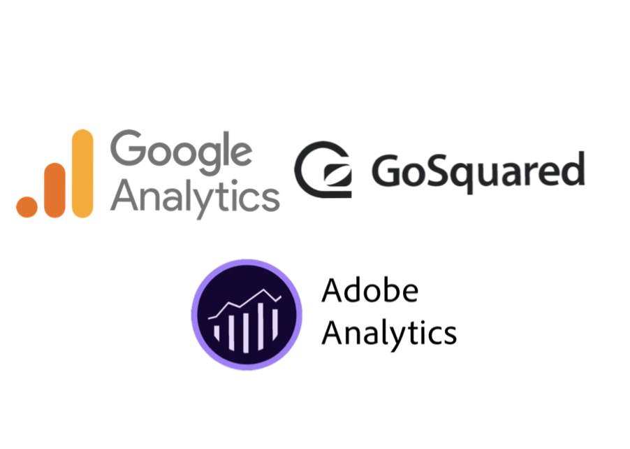
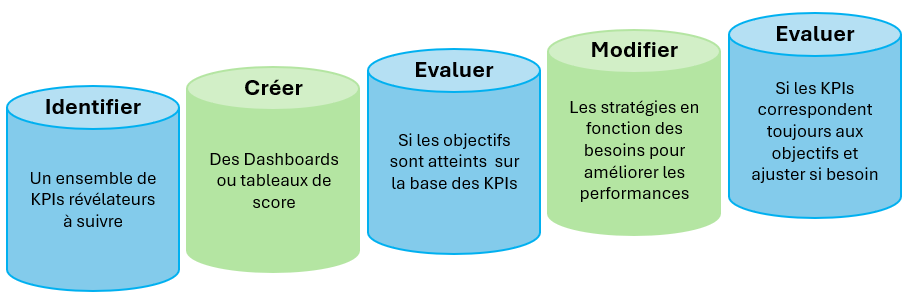

## Web Analytics

# En quoi cela consiste-t-il ?

Le Web Analytics regroupe la mesure, la collecte, l’analyse et la présentation de données provenant d’Internet, utilisées pour optimiser un site web, un site mobile ou encore une application.

C’est un ensemble d’analyses permettant d’étudier précisément les comportements et les habitudes des visiteurs sur les sites web et les applications mobiles.

Le Web Analytics (ou Digital Analytics) est aujourd’hui un des éléments clés du marketing digital et de l’optimisation des sites, notamment ceux de e-commerce.

Il se base sur les données de trafic recueillies pour en tirer des informations d'aide à la prise de décision pour l'optimisation du commerce étudié.

Il existe différents outils de Web Analytics couramment utilisés, comme :

et bien d'autres ...

Ces outils permettent essentiellement de recueillir les données de votre site internet et de les structurer, d'établir certaines statistiques et de calculer toutes sortes de scores de performance.

Vous aurez par exemple la possibilité d'agréger vos données selon certaines variables pour établir des graphiques plus parlants que des bases de données où il est difficile de tirer une information en les parcourant simplement. C'est ce que nous verrons dans un premier temps.

# Et après ?

Par la suite, vous aurez la possibilité de calculer certains indicateurs clés de performance (ICP), KPI en anglais pour Key Performance Indicator.

Un KPI est un indicateur de performance pour votre entreprise. Cet indicateur est donc chiffré et permet de suivre l’efficacité d’une action par rapport à des objectifs définis. Un KPI peut prendre différentes formes : croissance du chiffre d’affaires (CA), LifeTime Value (LTV), Coût d’acquisition client (CAC)... Parmi ces différents KPIs se distinguent deux grandes catégories :

- Une première où les KPIs sont en lien étroit avec votre entreprise. Par exemple, le nombre d'employés formés sur un nouveau poste ou le nombre de produits lancés en R&D.
- La seconde catégorie d’indicateurs concerne l’impact de vos actions sur votre marché. Par exemple, les ventes de vos produits en e-commerce ou encore le taux de désabonnement à votre service.
  Voici une liste non exhaustive des principaux KPIs qui sont utilisés aujourd'hui : <a href="https://tool-advisor.fr/blog/kpi-definition/">liste</a>

Voici une illustration de la construction des KPIs :

Avec ces outils, vous aurez la possibilité de prendre des décisions pour votre site internet. Mais qu'en est-il si vous voulez prendre une décision sur l'apparence de votre site ?

C'est à ce moment précis qu'intervient le terme d'A/B testing.

# L'A/B testing. En quoi cela consiste-t-il ?

L’A/B testing est à la base un moyen permettant de comparer deux versions de quelque chose dans le but de déterminer la plus efficace. Par conséquent, ce procédé a vu le jour bien avant l’apparition d’internet. Ronald Fisher, biologiste et statisticien britannique, est le premier à mettre en lumière cette idée grâce aux mathématiques dans les années 1920.

Ainsi, il permet d’analyser scientifiquement deux expériences différentes. Ses travaux entraînent une avancée majeure dans le monde de la science. Quelques années plus tard, le principe de l’A/B testing s’introduit dans les essais cliniques en médecine. Il faudra attendre les années 1960 pour que ce concept soit repris en marketing.

Il devient rapidement un moyen reconnu par tous les spécialistes du marketing direct pour soumettre à un échantillon de consommateurs plusieurs versions d’un message qui diffèrent sur un seul critère puis pour mesurer quelle version a produit les meilleurs résultats. Le développement du digital a offert de nouvelles perspectives en multipliant les possibilités de tests et de mesures des performances.

Appliqué à un site web, l’A/B testing permet en effet de tester un nombre quasi illimité de versions d’une page et de mesurer précisément les performances de chaque version sur des indicateurs tels que les actions de l’internaute ou son comportement d’achat. Les évolutions technologiques ont également permis le développement de solutions d’A/B testing dédiées qui facilitent la mise en place de tels tests et l’analyse des résultats.

Imaginez-vous, possédant un site de e-commerce pour lequel vous hésitez entre deux choix pour votre page au moment de payer. Certains avis vous disent que le bouton 'Buy' est plus efficace lorsqu'il est de couleur Rouge et d'autres lorsqu'il est de couleur Bleu.

Votre objectif sera de faire de l'A/B testing pour comparer ces deux designs et choisir le plus approprié à vos attentes.

L'objectif des exercices à venir va être de reproduire certaines de ces analyses, de reproduire certains scores d'aide à la décision et des indicateurs de performances grâce au langage Python et à ses nombreuses librairies.
