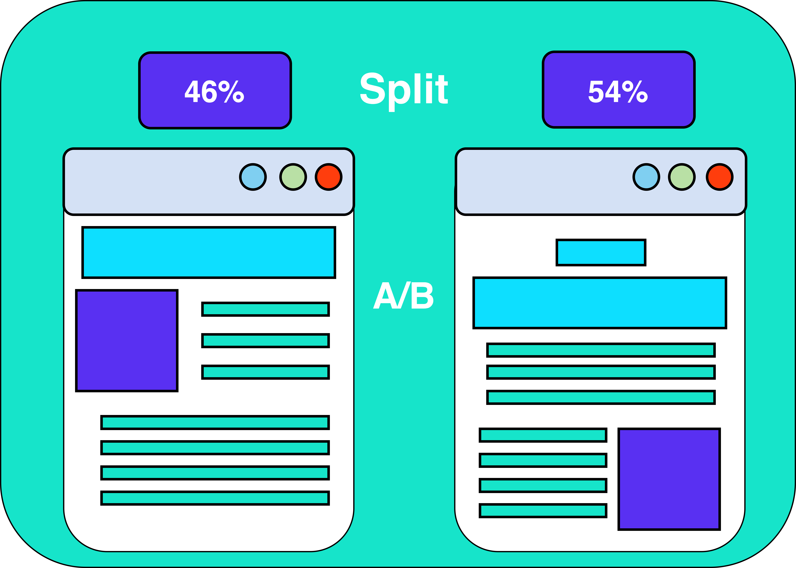
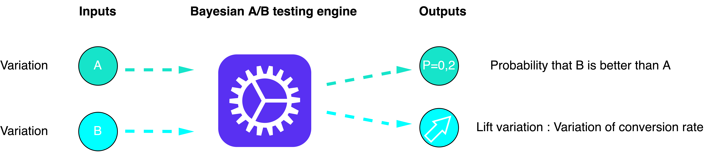

## Web Analytics - A/B testing

Depuis toujours, deux écoles statistiques s'affrontent : les fréquentistes et les bayésiens :

La statistique fréquentiste repose sur la loi des observations.

La statistique bayésienne, que l'on peut qualifier de déductive, permet de combiner l’information apportée par les observations avec les connaissances à priori provenant soit d’études antérieures soit d’avis d’experts, dans le but d'obtenir une information à posteriori.

Pour comprendre ce qui caractérise et distingue ces deux approches, voici une exemple:

Considérons un lancé de pièce que l'on répète 10 fois :

D'après l'approche fréquentiste, si l'on obtient 6 fois pile sur les 10 lancers, alors vous avez 60% de chance de tomber sur pile par la suite.
Si on se base cette fois-ci sur l'approche bayésienne. Nous n'allons pas nous intéresser à cette probabilité mais plutôt à sa loi a priori. De manière assez évidente, si la pièce est équilibrée alors, a priori, la probabilité d'obtenir pile est égale à celle d'obtenir face (1/2).
Nous pouvons tout de même remarquer que si l'on vient à répéter l'expérience un grand nombre de fois, alors la probabilité d'obtenir pile ou face convergera vers 1/2 selon l'approche fréquentiste.\*
En quoi cela s'applique-t-il à notre étude ?

Lorsque vous avez un site de e-commerce par exemple, son apparence est très importante. Un simple changement de couleur peut vous faire gagner plusieurs milliers de ventes car votre site est bien plus attractif. Pour deux produits équivalents, nous allons naturellement nous tourner vers le site ayant l'aspect le plus "attractif" et ayant le rendu le plus "professionnel".

Ces deux approches au service de l'A/B testing :

Approche fréquentiste : Cette méthode se base uniquement sur les données du test. Elle est donc assez simple à interpréter. Cependant, le niveau de trafic du site requis ne permet pas tout type de tests en toute circonstance. Il est difficile, ou très long d’obtenir des résultats significatifs lorsque l’on effectue des A/B tests sur des pages ayant un trafic faible ou pour lesquels nous n'avons pas assez de données.

Approche bayésienne : L’intérêt de l’approche bayésienne est fort quand on peut tenir compte d’expériences passées parfaitement similaires. Il est donc inutile de fixer au préalable la taille d’un échantillon nécessaire et d’un niveau de trafic pour effectuer un test : Les résultats sont consultables tout au long de l'expérience et sont plus rapides à obtenir.

C'est donc ici tout l'intérêt de l'A/B testing. Quelle version de votre site va être la plus attirante et vous rapporte le plus de clients ?

Lors du testing des différentes pages, un partie des individus navigants sur internet seront soumis à la page dîtes de Control et l'autre la page de Test. Généralement la répartition se fait de manière à peu près équivalente.

Le principe en image :

Le but sera alors par la suite d'analyser l'évolution du taux de conversion des différentes versions par une simple question : Est-elle significative ?

Dans notre étude, nous allons considérer les deux datasets suivants : df_control et df_test qui correspondent non pas à deux design différents du site en lui-même mais à deux versions de publicités lancées par un site e-commerce. Ce qui rentre parfaitement dans un cas d'A/B testing.

Voici une description des données :

Impression : Le nombre de vues sur les pubs
Click : Le nombre de clics sur les pubs.
Purchase : Le nombre de produits vendus après avoir cliqué sur les pubs.
Earning : Gains générés pas la vente de ces produits.
Exécutez la cellule suivante pour importer les packages nécessaires à l'exercice.
import pandas as pd
import matplotlib.pyplot as plt
import seaborn as sns

# I : Approche fréquentiste

(a) Lisez les deux jeux de données dans deux DataFrames portant le même nom que les fichiers .csv . Affichez les informations ainsi que les premières lignes de ces DataFrames.
Note : Il faudra utiliser le séparateur : sep = ';'.

# Insérez votre code ici

​
​
​
Les datasets ne contiennent pas de valeurs manquantes. Afin d'avoir un aperçu sur la distribution de nos données :

(b) Affichez dans un graphique en barres, la moyenne ainsi que la variance pour chaque variable des datasets.

# Insérez votre code ici

​
​
​
Les moyennes semblent à peu près équivalentes. Nous allons alors nous intéresser aux différents tests statistiques qui vont nous permettre de comparer les moyennes ainsi que les variances de ces deux groupes. C'est donc ici une approche fréquentiste du problème.

Avant de pouvoir appliquer les tests sur nos données, nous devons vérifier certaines hypothèses, notamment la distribution des données.

Dans un premier temps, concentrons-nous sur la variable 'Purchase'.

(c) Pour les deux datasets, affichez la distribution de cette variable.

# Insérez votre code ici

​
​
​
La distribution des données semble suivre une loi normale pour le jeu de données control mais semble difficile à interpréter pour le Test. Nous allons donc effectuer un test de Shapiro-Wilk afin de vérifier l'hypothèse de normalité.

Les deux hypothèses testées sont :

H0: Les données suivent une distribution normale / H1: Les données ne suivent pas une loi normale

La syntaxe pour réaliser un test de Shapiro-Wilk est la suivante :

from scipy.stats import shapiro
test_stat_control, p_value_control = shapiro(df_control['Purchase'])
(d) Effectuez ce test sur les données de control et de test et analysez les résultats. Que pouvons nous conclure ?

# Insérez votre code ici

​
​
​
Nous observons que les deux p-values sont supérieures à 5%. On ne peut ainsi pas rejeter l'hypothèse nulle (H0). On ne peut pas non plus affirmer clairement que les données suivent une distribution normale. Nous allons alors implémenter un test de Wilcoxon qui est un test non paramétrique (Nous n'avons pas besoin d'hypothèses sur la distribution des données pour l'appliquer) ainsi qu'un test de Levene afin d'analyser la différence de moyenne et de variance de ces deux datasets.

# Test de Wilcoxon - Différence de moyenne

Le test de Wilcoxon vous indique dans quelle mesure les différences entre les groupes sont significatives ; en d'autres termes, il vous permet de savoir si ces différences (mesurées en moyennes) auraient pu être dues au hasard.

Un exemple très simple : Disons que vous avez un rhume et que vous essayez un remède naturopathique. Votre rhume ne dure que quelques jours. La fois suivante, vous achetez un médicament en vente libre et votre rhume dure une semaine. Vous interrogez vos amis et ils vous disent tous que leur rhume a duré moins longtemps (en moyenne 3 jours) lorsqu'ils ont pris le remède homéopathique. Ce que vous voulez vraiment savoir, c'est si ces résultats sont reproductibles.

Un test de Wilcoxon peut vous le dire en comparant les moyennes des deux groupes et en vous indiquant la probabilité que ces résultats soient le fruit du hasard.

La statistique de test (t) :

La statistique de test est un rapport entre la différence entre deux groupes et la différence au sein des groupes :

Un rapport élevé vous indique que les groupes sont différents.

Un rapport faible vous indique que les groupes sont similaires.

La p-value (p) :

Chaque valeur t est associée à une p-value. La p-value est la probabilité que les résultats de votre échantillon de données soient le fruit du hasard. Les p-values vont de 0 à 1. Elles s'écrivent généralement sous la forme d'une décimale. Par exemple, une p-value de 5 % est de 0,05. Les p-values faibles sont bonnes ; elles indiquent que vos données ne sont pas le fruit du hasard. Par exemple, une p-value de 0,01 signifie qu'il y a seulement 1 % de probabilité que les résultats d'une expérience soient le fruit du hasard. Dans la plupart des cas, une p-value de 0,05 (5 %) est acceptée pour signifier que les données sont valides.

Les deux hypothèses testées sont :

H0: Les groupes sont similaires (en moyenne) VS H1: Les groupes ne sont pas similaires (en moyenne)

Attention : Le test que nous allons effectué n'est réalisable que sur des groupes d'individus non appariés (indépendants) Voici la syntaxe à suivre pour ce type de test :

from scipy.stats import wilcoxon
test_stat, pvalue = wilcoxon(variable_control, variable_test)
(e) Effectuez un test de wilcoxon pour la variable 'Purchase'. Que pouvez-vous en déduire ?

# Insérez votre code ici

​
​
​
La p-value étant égale à environ 0.0034, on peut donc rejeter l'hypothèse nulle H0 : Les moyennes ne sont pas significativement différentes. Ainsi, cette nouvelle campagne marketing semble impacter le nombre de ventes.

Peut-on généraliser ce résultat ?

Sur le principe, le test statistique que nous venons d'effectuer ne ment pas. Cependant, est-il suffisant pour dire que cette nouvelle campagne impact les ventes ? Il est encore un peu tôt pour le déduire, il faudrait que l'opération soit répétée plusieurs fois et observer à chaque fois une p-value inférieure 5% pour dire qu'il n'y a pas d'effet.

(f) Effectuez ce même test mais cette fois-ci sur la colonne 'Click'.

# Insérez votre code ici

​
​
​
Nous observons une p-value de 0.000219. Elle est donc significative car inférieure à 5%. Nous pouvons alors rejeter l'hypothèse nulle. Ainsi, nous pouvons considérer pour ce test que la différence des moyennes de du nombre de clics est significative. Cependant, nous pouvons ajouter la même remarque que précédemment ou il faudrait en réalité répéter le test pour pouvoir confirmer ces hypothèses.

Passons à présent sur l'anlayse de la différence de variance des différentes variables.

(g) Implémenter un test de levene sur les variables 'Purchase' et 'Click'.

# Insérez votre code ici

​
​
​
La p-value observée sur la variable 'Purchase' est supérieure à 5%. Ainsi, nous ne pouvons pas rejeter l'hypothèse nulle : Les variances des deux groupes sont différentes. Nous ne pouvons pas non plus affirmer à 100% qu'elles sont identiques mais nous pouvons affirmer qu'elles ne sont pas significativement différentes.

Pour la variable 'Click' la p-value est inférieure à 5%, nous pouvons alors rejeter l'hypothèse nulle selon laquelle les variances ne sont pas significativement différentes.

C'est aussi simple que ça lorsque l'on parle de l'approche fréquentiste de notre A/B testing. Cependant, ces résultats varient selon les différents tests que l'on implémente et nous ne pouvons pas les généraliser pour pouvoir répondre à notre problématique. C'est pour cela que nous allons aborder l'approche Bayésienne du problème.

# II. Approche Bayésienne

Initialement, le statisticien bayésien a des connaissances préalables de base qui sont supposées : par exemple, que la taille moyenne se situe entre 50 cm et 250 cm.

Ensuite, le bayésien commence à mesurer la taille de citoyens américains spécifiques et, à chaque mesure, met à jour la distribution pour devenir un peu plus «en forme de cloche» autour de la hauteur moyenne mesurée jusqu'à présent. Au fur et à mesure que plus de données sont collectées, la « cloche » devient plus nette et plus concentrée autour de la hauteur moyenne mesurée.

Pour les bayésiens, les probabilités sont fondamentalement liées à leur connaissance d'un événement. Cela signifie, par exemple, que d'un point de vue bayésien, nous pouvons parler de manière significative de la probabilité que le véritable taux de conversion se situe dans une plage donnée, et que la probabilité codifie notre connaissance de la valeur sur la base d'informations antérieures et/ou de données disponibles.

Dans un premier temps, nous allons supposer que l'évolution du nombre d'impression et de conversion suit une loi de probabilité Bêta.

Avant toutes choses, nous allons importer les packages suivants afin de réaliser un test bayésien.

from scipy.stats import beta
import numpy as np
from math import lgamma
import pandas as pd
(a) A l'aide d'un histogramme, représentez la distribution du taux de conversion pour les jeux de données Control et Test. Pour rappel, le taux de conversion n'est autre que : 𝑁𝑢𝑚𝑏𝑒𝑟𝑜𝑓𝑃𝑢𝑟𝑐ℎ𝑎𝑠𝑒𝑁𝑢𝑚𝑏𝑒𝑟𝑜𝑓𝐶𝑙𝑖𝑐𝑘+𝑁𝑢𝑚𝑏𝑒𝑟𝑜𝑓𝐼𝑚𝑝𝑟𝑒𝑠𝑠𝑖𝑜𝑛

# Insérez votre code ici

​
​
​
C'est là que la partie un peu plus complexe de ce raisonnement intervient. Certains de ces résultats seront donc admis.

Malgré tout, l'intuition reste assez simple derrière ce que nous allons faire. Nous allons supposer que nos données suivent une distribution de loi Bêta dont nous expliciterons les paramètres un peu plus tard. Voici une description d'une loi de probabilité Bêta ( 𝛽
):

𝑓(𝑥;𝛼,𝛽)=𝑥𝛼−1(1−𝑥)𝛽−1∫10𝑢𝛼−1(1−𝑢)𝛽−1𝑑𝑢0 pour 𝑥∈[0,1] sinon =Γ(𝛼+𝛽)Γ(𝛼)Γ(𝛽)𝑥𝛼−1(1−𝑥)𝛽−1𝟙[0,1](𝑥)=1 B(𝛼,𝛽)𝑥𝛼−1(1−𝑥)𝛽−1𝟙[0,1](𝑥)

où Γ
est la fonction gamma et 𝟙[0,1]
est la fonction caractéristique de [0;1]
. La fonction bêta 𝐵
apparaît comme une constante de normalisation, permettant à la densité de s'intégrer à l'unité.

A partir de ces informations, voici le schéma que nous allons tenter de reproduire :

(b) Dans un premier temps, nous allons simuler cette loi. Pour cela, exécutez la cellule suivante :
def h(a, b, c, d):
num = lgamma(a + c) + lgamma(b + d) + lgamma(a + b) + lgamma(c + d)
den = lgamma(a) + lgamma(b) + lgamma(c) + lgamma(d) + lgamma(a + b + c + d)
return np.exp(num - den)
​
def g0(a, b, c):  
 return np.exp(lgamma(a + b) + lgamma(a + c) - (lgamma(a + b + c) + lgamma(a)))
​
def hiter(a, b, c, d):
while d > 1:
d -= 1
yield h(a, b, c, d) / d
​
def g(a, b, c, d):
return g0(a, b, c) + sum(hiter(a, b, c, d))
​
def calc_prob_between(beta1, beta2):
return g(beta1.args[0], beta1.args[1], beta2.args[0], beta2.args[1])
Maintenant que nous avons une simulation de la loi de probabilité Bêta. Nous allons nous intéresser à nos données.

(c) Dans un premier temps, affectez le nombre d''Impression et de 'Purchase' pour les deux jeux de données à des variables ayant pour nom :
imps_ctrl : Correspond aux 'Impression'
convs_ctrl : Correspond aux 'Purchase'
imps_test
convs_test
Ces quantités nous permettront par la suite de définir les paramètres 𝛼
et 𝛽
de notre loi.

# Insérez votre code ici

​
​
​
(d) Affectez les valeurs suivantes à cette liste de variables :
alpha_control : convs_ctrl

alpha_test : convs_test

beta_control : imps_ctrl - convs_ctrl

beta_test : imps_test - convs_test

# Insérez votre code ici

​
​
​
(e) Stockez dans beta_Control et beta_Test les valeurs de la loi Bêta grâce à la fonction beta du module scipy.stats. Il faudra rentrer en paramètres les 𝛼
et 𝛽
calculés plus haut.

# Insérez votre code ici

​
​
​
(f) Nous pouvons ainsi afficher la distribution des lois que nous venons de définir. Pour cela, exécutez la cellule suivante.
import matplotlib.pyplot as plt
​
plt.figure(figsize = (20,8))
​
def calc_beta_mode(a, b):

    return (a-1)/(a+b-2)

​
def plot(betas, names, linf=0, lsup=0.01):

    x = np.linspace(linf,lsup, 100)

    for f, name in zip(betas,names) :

        y=f.pdf(x) # Calcul de la fonction de répartition de la loi Beta

        y_mode=calc_beta_mode(f.args[0], f.args[1])

        plt.plot(x,y, label=name+ "sample, conversion rate:" + str(y_mode.round(4)))

    plt.legend()

    plt.show()

​
plot([beta_Control, beta_Test], names=["Control", "Test"])
La prochaine étape consiste à la computation du taux d'évolution (lift).

(g) Exécutez la cellule suivante.

# Calcul du lift

​
lift = (beta_Test.mean() - beta_Control.mean()) / beta_Control.mean()
Nous voilà arrivés à la sortie de l'implémentation de ce modèle Bayésien : le calcul de la probabilité pour la version Test de la publicité d'être meilleure que la version de Control avec le taux de conversion associé.

(h) Pour cela, calculez à l'aide de la fonction calc_prob_between cette probabilité et affichez le taux de conversion attendu.

# Calcul de la probabilité pour le Test d'être meilleur que le Control

​
prob = calc_prob_between(beta_Test, beta_Control)
​
print (f"La nouvelle publicité augmente le taux de conversion de {lift*100:2.2f}% une probabilité de {prob*100:2.2f}%")
Voici les résultats de notre A/B testing. Ainsi, le détenteur de ce site e-commerce peut espérer voir ses ventes augmenter de 2.20% avec une probabilité de 99.17% s'il choisit la seconde publicité (celle de test). Ce dernier aura alors tout avantage à l'appliquer.

Bien sûr, cela va également dépendre du montant investi dans cette publicité pour par la suite calculer le retour sur investissement.

Ainsi, l'approche Bayésienne semble donner des résultats plus efficaces et surtout plus précis que l'approche fréquentiste où le seul résultat disponible est la significativité des différences entre les deux versions testées. Ce modèle nous permet en effet d'avoir la probabilité avec laquelle l'une des deux versions possède un tel lift.

L'approche fréquentiste reste néanmoins souvent utilisée car elle permet d'obtenir des résultats robustes si l'on vient à répéter l'opération plusieurs fois et reste plus simple d'accès au niveau du raisonnement. En effet, l'un des enjeux majeurs d'une approche Bayésienne réside dans la loi à priori que nous devons définir qui peut ne pas être intuitive.

Nous sommes arrivés à la fin de ce module. Vous avez maintenant toutes les clés en main pour analyser les données de votre site e-commerce ou autre.
