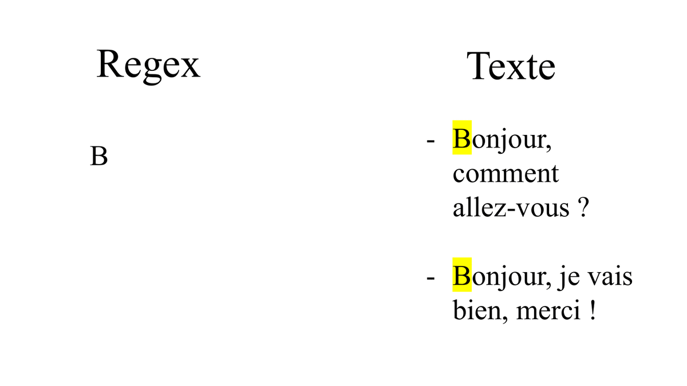
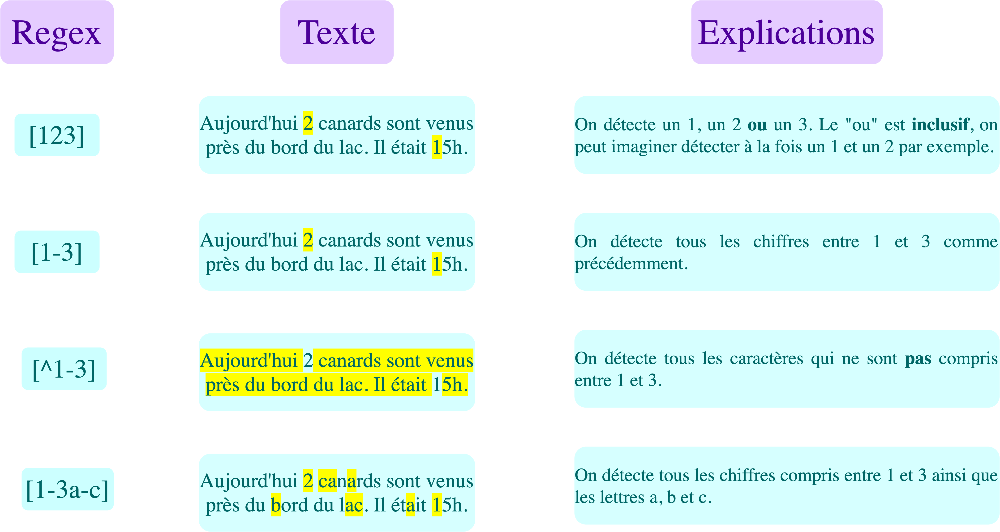
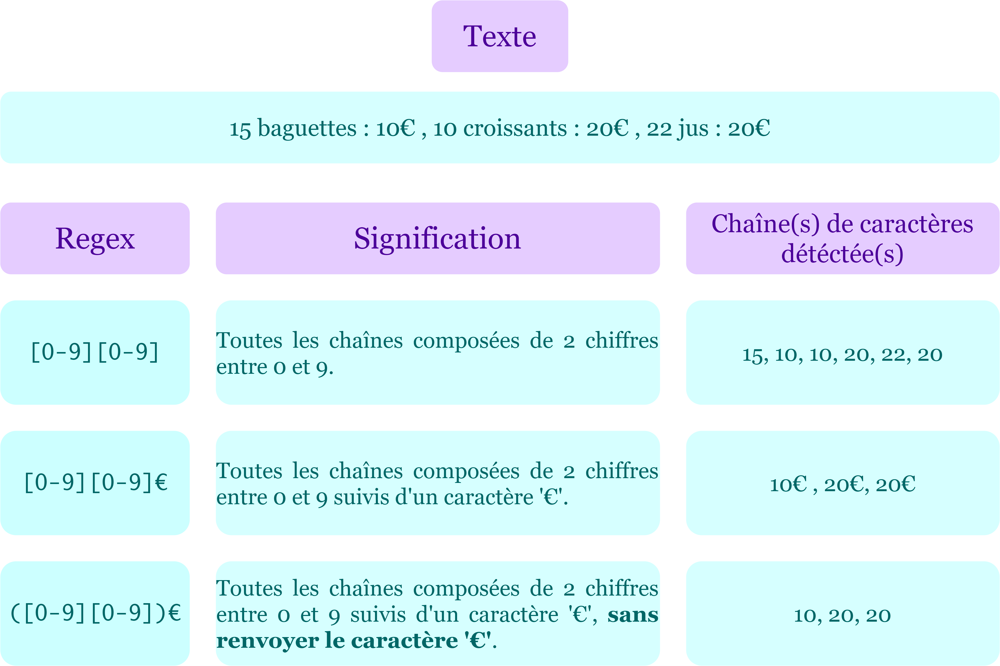
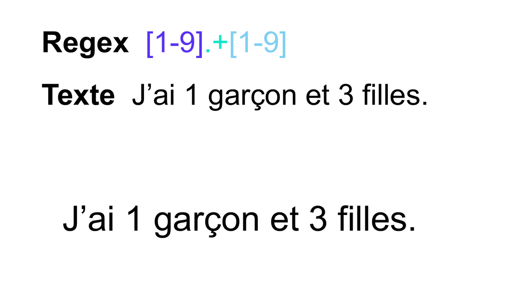
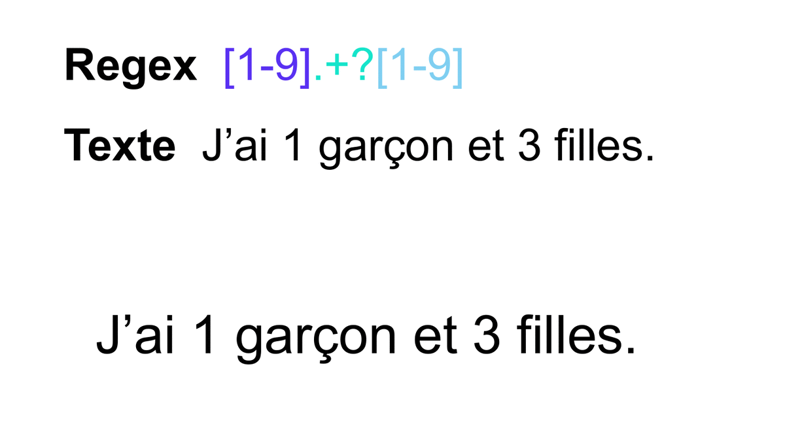

## Introduction au Text mining - Les expressions régulières

# Introduction : La librairie re

Comme dans tout domaine de Machine Learning, les données doivent être prétraitées pour pouvoir convenir à l'algorithme. En traitement de texte, une partie de ce prétraitement a pour but d'identifier ce qu'on appelle les expressions régulières.

Une expression régulière, aussi appelée regex (pour regular expression), est une séquence de caractères qui forme un motif (ou pattern en anglais) servant à décrire des chaînes de caractères dans un texte. Pour repérer ces regex, on utilise sur python la librairie re qui nous permettra de décrire le pattern que respecte la chaine de caractères à identifier, ainsi que ses fonctions usuelles pour détecter ce pattern dans un texte.

L'expression régulière la plus simple pour trouver une chaîne de caractères donnée est la chaîne de caractères elle-même. Par exemple si l'on cherche toutes les chaînes de caractères "Bonjour" dans un texte, l'expression régulière associée sera "Bonjour".

Pour des questions d'optimisation de temps de calcul, une expression régulière doit être compilée pour ensuite être exécutée par un moteur d'expressions régulières et détectée dans un fichier texte. Pour cela, on a des fonctions basiques pour détecter une expression régulière dans un texte :

- La fonction compile du module re pour compiler l'expression régulière. Elle prend en argument l'expression régulière sous forme de chaîne de caractères et renvoie un objet de type Pattern correspondant à l'expression compilée. Ex: r = re.compile("a") va chercher les a dans le texte.

Note: Pour spécifier à la fonction compile que l'on passe une chaîne de caractères brute en argument on peut accoler un r (comme raw string) avant l'expression régulière.

- Les fonctions findall, finditer, search et match pour détecter les expressions régulières. Chacune à sa spécificité, on y reviendra dans le prochain notebook. Pour l'instant, utilisons findall. Elle s'applique à l'expression régulière compilée r et prend en argument le texte dans lequel on cherche la chaîne de caractères décrite par l'expression régulière. Ex: regex = r.findall("txt"). Cette fonction produit en sortie une liste des mots du texte correspondants à l'expression régulière construite.

Exécuter la cellule suivante pour importer la librairie re.
import re
​

- Attribuer à r une regex qui détecte le mot 'nous'.
- Attribuer à txt la phrase 'A la maison, nous avons une télévision. Nous sommes heureux'.
- Utiliser r.findall(txt) pour détecter la regex nous.

Rappelez-vous qu'avant de regarder la solution, vous avez toujours accès à l'aide officielle de Python en tapant help(nom_fonction) dans la console.

### Insérez votre code

​
​
​
On note deux choses :

- La librairie fait la différence entre les majuscules et les minuscules. Seulement 'nous' a été détécté et non le 'Nous'.
- On est très vite limité si nous devons taper à la main toutes les expressions à trouver dans un texte
  On va donc introduire des outils qui permettent de simplifier cette tâche. Ces outils sont:

- Les classes de caractères.
- Les quantificateur.
- Les métacaractères.
- Les groupes de capture.
  Ces outils permettent d'écrire des expressions régulières plus compactes pour trouver une plus grande diversité d'information.

# Classes de caractères

Les classes de caractères sont utilisées pour représenter des ensembles de caractères de manière concise. Une expression régulière qui définit une classe de caractères commence et se termine par des crochets: [pattern de la regex].

Une classe de caractères peut être définie:

- De manière extensive: on liste tous les caractères à retrouver dans un texte entre crochets. Ex: [aZ6] détecte un a, un Z ou un 6.
- De manière intensive: si l'on souhaite retrouver une séquence ordonnée de caractères on spécifie le premier et le dernier caractère de la séquence entrecoupés du signe -. Ex: [a-d] détecte les lettres minuscules de l'alphabet entre a et d.
- De manière négative: pour exclure des caractères, il suffit de placer le signe ^ en amont des caractères placés entre cochets. Ex: [^aZ] détecte tout caractère qui ne soit pas a ou Z.

On peut aussi imaginer des unions de classes de caractères simplement en concaténant les classes de caractères correspondantes. Par exemple [a-zA-Z] détecte toutes les lettres minuscules et majuscules de l'alphabet.

Créons par exemple une regex capable de détecter toutes les lettres en majuscule. Pour se faire :

- r = re.compile(r"[A-Z]") permet de détecter toutes les majuscules.
- Utiliser findall() sur la variable txt précédente pour repérer ce qu'elle détecte.

### Insérez votre code

​
​
​
Voici un tableau récapitulatif des expression régulières que l'on peut construire grâce à des classes de caractères:

Expression régulière | Détecté par l'expression régulière
[ensemble] | Tous les caractères dans l'ensemble ensemble
[^ensemble] | Tous les caractères hors de l'ensemble ensemble
[a-z] | Toutes les lettres entre a et z
[^a-z] | Tous les caractères hormis les lettres entre a et z
[a-zA-Zé] | Toutes les lettres minuscules et majuscules et le caractère é
[0-9]| Toutes les chiffres

# Les quantificateurs

Les quantificateurs sont des symboles qui permettent de spécifier un certain nombre de répétition de caractères, groupe ou classe de caractères à retrouver dans une chaîne de caractères.

- permet de détecter si une expression est présente 0, 1 ou plusieurs fois.
  Exemple : "cha\*t" détecte cht, chat, chaat, chaaat,...

* permet de détecter si une expression est présente 1 ou plusieurs fois.
  Exemple : "cha+t" détecte chat, chaat, chaaat,...

? permet de détecter si une expression est présente 0 ou 1 fois.
Exemple : "cha?t" détecte cht ou chat.

{n} permet de détecter la répétition d'un nombre exacte d'une expression.
Exemple : "cha{2}t" détecte chaat.

{n,} permet de détecter la répétition d'une expression au moins n fois.
Exemple : "cha{2,}t" détecte chaat, chaaat,...

{n,m} permet de détecter la répétition d'une expression au moins n fois mais au plus m fois.
Exemple : "cha{2,4}t" détecte chaat, chaaat ou chaaaat. \

Attention à ne pas mettre d'espace après la virgule\* : L'expression régulière "cha{2, 4}t" ne fonctionnera pas.

Note : \*= {0,}, += {1,} et ? = {0,1}.

Tous ces quantificateurs peuvent aussi être évalués sur une classe de caractères. Par exemple, l'expression régulière "ch[a-z]?t" va détecter les mots "cht" et "chat", mais aussi "chbt", "chct", ..., "chzt".

Compiler une regex capable de détecter les nombres de txt.
txt = "J'habite au 137 bd Auguste Blanqui, au 12ème étage"
​

### Insérez votre code

​
​
​
Attention à ne pas confondre le + et le \*.

Exécuter la cellule ci-dessous.
txt = "J'habite au 137 bd Auguste Blanqui, au 12ème étage"
​
#détection de nombres et de chiffres
r = re.compile("[0-9]_")
nombres = r.findall(txt)
print("nombres détectés ",nombres)
​
La différence est que _ va détecter la chaîne même si le caractère le précédant n'est pas présent. A chaque fois qu'il n'y a pas de chiffre, le compilateur va identifier cette absence et va détecter tout le string.

Compiler une regex capable de détecter les nombres d'au moins 3 chiffres.

### Insérez votre code

​
​
​
Il existe aussi des raccourcis qui permettent d'appeler les regex les plus utilisées :

Raccourcis | Regex ou significations
\d | [0-9]
\D | [^0-9]
\w | [a-zA-Z0-9_]
\W | [^a-zA-Z0-9_]
\t | tabulation
\n | saut à la ligne
\s | ' ' (ie un espace)
\S | [^' ']

- Identifier les adverbes en -ment en utilisant les raccourcis.

txt = "Apparemment, Philippe n'est chez lui. Mais, étonnamment, il n'est pas en chemin non plus. Il roule vers une autre destination"
​

### Insérez votre code

​- Identifier un pattern commun aux adresses mails valides ci-dessous.

- Compiler une regex capable de les détecter.
- Afficher les sorties pour vérifier.

txt = 'Georges98@yahoo.com \n coucou.com \n grégoire.richon@apple.com\n constitution@justice \n sarkozy@élysée.fr'
​

### Insérez votre code

​
​
​

# Les métacaractères

Les métacaractères sont des symboles qui ont une signification particulière dans la construction d'une expression régulière.

Voici la liste des métacaractères les plus utilisés avec leurs significations:

Métacaractère | Signification
'.' | Tous les caractères sauf le retour à la ligne
'|' | "ou" inclusif Ex : "soleil|pluie" pour détecter "soleil" ou "pluie"
'^' | Détecte une expression en début de chaîne, ou exprimer le contraire d'un champs de caractères lorsqu'il est utilisé à l'intérieur de crochet (dans une classe de caractères).
'$' | Détecte une expression en fin de chaîne. Ce métacaractère doit se placer après l'expression à retrouver.

Note : Pour faire appel à ces caractères, et non leur fonctionnalité, on les précède d'un \. Par exemple l'expression régulière \$ détectera tous les symboles $ d'un texte.

A l'aide de métacaractère dans votre expression régulière, trouver les liens html dans la variable txt. Attention à bien faire attention aux détails des liens et aux points communs qui les lient.
txt = 'https://www.google.com/ \n http://www.safari.fr/data-science'
​

### Insérez votre code

​
​
​
Pour identifier les liens html, il faut noter que chaque lien commence par la chaîne de caractère http:// ou https:// nécessairement. Cette chaîne de caractère spéciale est la plupart du temps suivie de plusieurs caractères, minuscules et/ou majuscules, chiffres et caractères spéciaux comme -, . et / (c'est le cas pour l'adresse http://www.safari.fr/data-science). C'est pourquoi, pour décrire le pattern d'un lien html on utilise :

- https?:// pour couvrir les liens commençant par http:// ou https://. En effet, l'action du quantificateur ? pour décrire une ou aucune répétition ne s'applique que sur la lettre s
- [A-Za-z0-9\.\-/]+ pour décrire tous les caractères, minuscules et/ou majuscules, chiffres et caractères spéciaux sur une répétition de plus d'une fois grâce au quantificateur +

# Groupes de capture

Le groupe de capture forme des groupes et des sous-groupes de caractères et permet de vérifier la présence d'un pattern particulier. Il est défini entre parenthèse : (pattern à identifier).

Ex: (ab)+ va détecter ab, abab, ababab,...

Attention : (ab) va détecter la présence du pattern ab tandis que [ab] recherche les lettres a et b.

Comme avec [...], on peut utiliser les quantifieurs pour les groupes.

Reprenons l'exemple précédent en insérant le sous-groupe pour détecter la différence entre les deux liens, qui se trouvent au niveau du http et https. Ainsi, on aimerait détecter le groupe s.

- Modifier le compilateur précédent en notant r = re.compile(r"http(s)?://[a-zA-z0-9\.\-/]+") et regarder le résultat.

### Insérez vote code

​
​
​
Ici, findall ne détecte pas la même chose que précédemment. L'attention est porté sur la vérification de la présence ou non du groupe s.

# Pour résumer

On a pu voir qu'il existait ainsi de nombreux schémas différents pour décrire une regex :

[a-zA-Z0-9] détecte l'ensemble des lettres majuscules ou minuscules et les chiffres
[abc145] détecte les caractères a, b, c, 1,4 ou 5.
On peut aussi intégrer des caractères spéciaux, mais pour cela on doit les introduire avec un '\', comme par exemple

[a-zA-Z0-9\.\?] détecte, en plus des lettres et chiffres, les '.' et les '?'.
On peut également utiliser des métacaractères pour pouvoir identifier plus précisémment ce que nous voulons, comme :

[^A-Z] détecte TOUT à l'exception des lettres majuscules.
tion$ détecte les tion en fin de chaine, i.e fin de string ou avant un renvoi à la ligne.
^je détecte les chaines de caractères commençant par je (comme jeux, jeudi...).
Les groupes de captures servent quant à eux à capturer les éléments entre parenthèse selon leur présence ou non dans le texte :

o([a-z]) détecte uniquement la lettre suivant la lettre 'o'.
Pour les patterns de 1 à 7,

- Deviner les sorties sur la variable txt.
- Compiler chaque pattern et regarder le résultat. Aviez-vous bien prédit ?
  txt = 'A a - § é 8 1 attraction. Potion'
  ​

### Insérez votre code

​
​

Des sites existent pour tester et expliquer tous les formats d'expression régulière, comme <a href="https://regex101.com/">regex101.com</a>

# Comportements des quantificateurs : Greedy vs Lazy

Maintenant que vous avez appris les bases, il faut faire attention au mode de fonctionnement des quantificateurs.

Les quantificateurs gourmands (greedy en anglais) vont essayer de capter le plus grand pattern possible tandis que les quantificateurs paresseux (lazy en anglais) vont essayer de capturer le plus petit. Autrement dit, le greedy va continuer de chercher tant que la condition est satisfaite alors que le lazy va s'arrêter une fois la condition satisfaite.

À cause de l'élément ".+", la détection gourmande doit aller jusqu'au bout de la chaîne et revenir pour trouver la fin du schéma à détecter. Cette opération peut être très lente si le texte est long.

On distingue ces deux types de quantificateurs en accolant le métacaractère '?' à un quantificateur gourmand pour obtenir sa version paresseuse.

Par défaut, les quantificateurs '+', '\*', '{n,}', '{,m}' et '{n,m}' ont un comportement gourmand.

Voici un tableau des quantificateurs usuels selon qu'ils soient greedy ou lazy :

Greedy | Lazy | Description

- | \*? | 0, 1 ou plus

* | +? | au moins 1
  ? | ?? | 0, 1
  {n} | {n}? | n fois exactement
  {n,} {n,}? n fois au moins
  {,m} {,m}? m fois au plus
  {n,m} {n,m}? entre n et m fois
  Sur l'exemple ci dessous de stackoverflow, on cherche à identifier un pattern commençant par s et finissant par o avec n'importe quel caractère entre les deux.

- Greedy : associer à r1 le compilateur suivant : re.findall(r"s.\_o", 'stackoverflow').
- Lazy : associer à r2 le compilateur suivant : re.findall(r"s.\_?o", 'stackoverflow').
- Observer la différence des deux résultats.

### Insérez votre code

​
​
​
Le greedy va, une fois le s identifié, aller à la fin du string et remonter caractère par caractère jusqu'à trouver un o. Pour le lazy, une fois le s identifié, il va avancer de caractère en caractère en respectant la condition . (ie n'importe quel caractère) jusqu'à trouver un o.

- Identifier chaque balise de la variable txt.
  txt = '<html><head><title>Title<\title>'
  ​

### Insérez votre code ici

​
​
​
ATTENTION car si nous prenons l'équivalent greedy , nous avons :

print("les balises identifiées par l'opérateur greedy sont :", re.findall(r"<.\*>", txt))
​
Ce qui est normal car il va détecter le premier < correspondant à celui de html. A partir de là, il va à la fin du string. A ce moment, il identifie la dernière > correspondant à la balise \title. Entre ces deux balises, il n'y a que des caractères tolérés par la condition '.'. Ainsi, il va prendre l'ensemble du lien html.

# Conclusion

Dans ce module nous avons introduit en détail le concept d'expression régulière.

Nous avons vu que cet outil utilisé pour la recherche d'informations dans un texte peut se définir à l'aide de différentes briques qui peuvent être également combinées:

- Les classes de caractères.
- Les métacaractères.
- Les quantificateurs.
- Les groupes de capture.

La combinaison habile de ces éléments permet de construire des expressions régulières robustes et adaptées à une variété de scénarios. Il ne nous reste plus qu'à aborder les outils pour les repérer, à savoir les méthodes usuelles de re.
