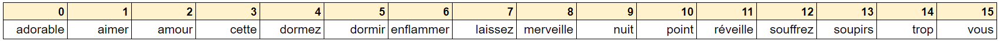
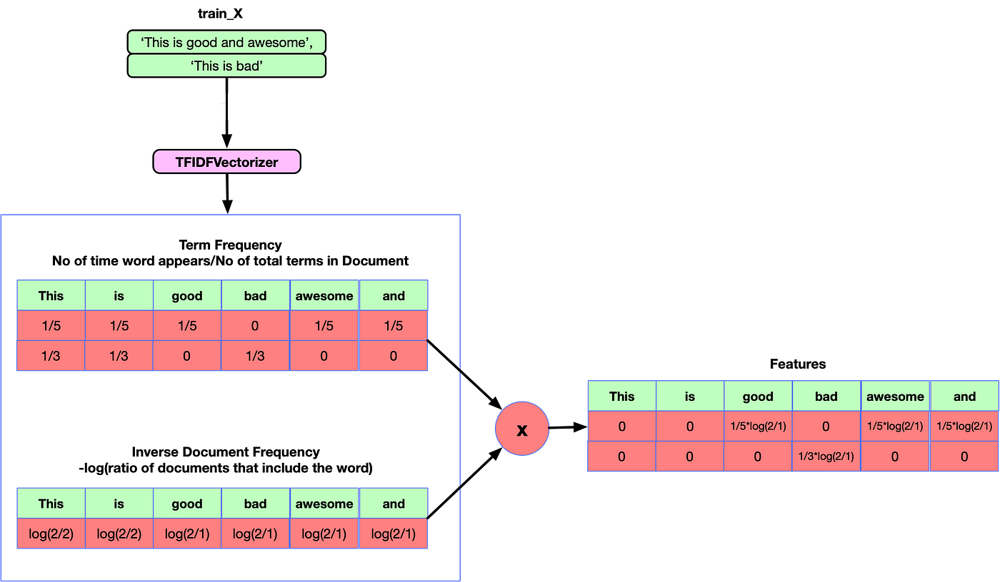

## Introduction au Text mining - Prétraitement

Après avoir saisi les expressions régulières, l'objectif de cet exercice est de présenter les outils fondamentaux du text mining, avec notamment : la tokenisation, la technique Bag of words, le filtrage Stop words, la racinisation et la lemmatisation. Ce sont des techniques très utilisées pour les travaux préliminaires nécessaires à toute analyse se basant sur des données de type texte.

# La tokenization

La tokenization est une tâche très courante en linguistique, celle-ci consiste à segmenter des textes en unités plus petites. Par exemple une phrase est "tokenizée" en mot ou un paragraphe est tokenizé en phrase. Le découpage le plus courant est celui dans lequel les unités de base sont des tokens (mots, chiffres ou ponctuations) et pour un même texte il existe plusieurs tokenizations possibles.

Une tokenisation possible de la phrase suivante : "La science des données est l'extraction de connaissances." sera alors : ['la', 'science', 'des', 'données', 'est', 'l'extraction', 'de', 'connaissances'].

Le package Scikit-learn et la boîte-à-outil : Natural Language Toolkit (NLTK) sont deux bibliothèques qui vont permettre de créer des programmes pour l'analyse de texte.

Assigner à la variable txt le célèbre couplet de Molière suivant :
"Souffrez qu'Amour cette nuit vous réveille. Par mes soupirs laissez-vous enflammer. Vous dormez trop, adorable merveille. Car c'est dormir que de ne point aimer."

Importer la classe PunktSentenceTokenizer du package nltk.tokenize.

Initialiser tokenizer, une instance de la classe PunktSentenceTokenizer.

À l'aide de la méthode tokenize de l'objet tokenizer, découper txt en tokens. .

Rappelez-vous qu'avant de regarder la solution, vous avez toujours accès à l'aide officielle de Python en tapant help(nom_fonction) dans la console.

### Insérez votre code ici

​
​
​
La technique de tokenisation implémentée ci-dessus, consiste à découper un paragraphe en plusieurs phrases. Selon les situations il peut être également intéressant de découper les phrases en mots. Le sous package nltk.tokenize implémente la fonction word_tokenize permettant d'effectuer le découpage des données textes en mots.

Importer la fonction word_tokenize du sous package nltk.tokenize.
Appliquer la méthode word_tokenize à la phrase : txt, en précisant que le langage utilisé est le français (french).
Stocker les tokens dans la variable mots.
  La méthode word_tokenize s'utilise comme suit : mots = word_tokenize(phrase, language = 'french'). Elle permet de découper le paragraphe txt en une liste de mots.
  Si une erreur apparait concernant le téléchargement des packages utilisés dans ce notebook, veuillez effectuer la commande suivante :  
 import nltk
nltk.download('package_name')

### Insérez votre code ici

​
​

# Le filtrage Stop Words

Après avoir découpé la phrase en mots, nous pouvons remarquer que la variable mots contient des mots dont certains sont très fréquemment rencontrés, il s'agit de "mots vides". Un mot vide (ou stop word, en anglais) est un mot qui est tellement commun qu'il est inutile de l'indexer ou de l'utiliser dans une recherche. En français, des mots vides évidents pourraient être : "le", "la", "de", "du", "ce", ...

La librairie NLTK contient quelques mots vides, pour les connaître :

Exécuter la cellule de code ci-dessous.

# Importer stopwords de la classe nltk.corpus

from nltk.corpus import stopwords
​

# Initialiser la variable des mots vides

stop_words = set(stopwords.words('french'))
print(stop_words)
​
La variable stop_words est de type set. Il est possible d'ajouter un mot vide au set stop_words en exécutant la commande suivante : stop_words.add("mot_vide").

Et pour ajouter plusieurs mots vides en utilisant la méthode update comme suit : stop_words.update([word1, word2]).

Ajouter au set stop_words les deux mots vides suivants : "." et ",".

Définir la fonction stop_words_filtering qui permet de supprimer les mots vides d'une liste passée en paramètre.

Mettre à jour la liste mots en supprimant les mots vides du set stop_words.

### Insérez votre code ici

​
​
Les mots vides ne sont plus présents dans le corpus : "vous", "mes", "que", "de", "ne", "," et ".". Cependant, nous pouvons toujours remarquer que les tokens contiennent toujours des mots composés : "laissez-vous" et "c'est". Ainsi, la bibliothèque NLTK offre la possibilité de découper un corpus en gardant que des tokens particuliers par le biais des expressions régulières.

Importer la classe RegexpTokenizer du package nltk.tokenize.regexp.

Initialiser un tokeniseur, tokenizer, à l'aide de la fonction RegexpTokenizer.

Convertir les chaînes de caractères, à l'aide de la méthode tokenize de l'objet tokenizer, en ne conservant que les mots contenant plus de quatre caractères.

Affecter la sortie de la méthode RegexpTokenizer à la variable tokens. Penser également à convertir la phrase txt en minuscules en utilisant la méthode lower.

### Insérez votre code ici

​
​
L'avantage de cette méthode est qu'elle permet d'appliquer une tokenisation personnalisée. Il est possible de cibler des tokens particuliers lors de la fouille de textes. En pratique, la tokenization et le filtrage stop words est une étape préliminaire à la vectorisation Bag of Words qui est un algorithme de "vectorisation" des mots.

# Algorithme Bag of Words

1. CountVectorizer
   L'algorithme Bag of Words consiste à "vectoriser" un document. La représentation en sac de mot consiste à représenter un document par le nombre d'occurrences des mots qu'il contient. Cette méthode "naive" de représentation de document peut être implémentée par la classe CountVectorizer du package sklearn.feature_extraction.text qui peut produire une représentation en sac de mots d'une chaîne ou d'un fichier.

Cet algorithme est très utilisé en pratique car il est simple à implémenter et donne des résultats satisfaisants malgré sa représentation "pauvre" en signification. De nos jours, la vectorisation de texte est plus sophistiquée et se fait à l'aide des réseaux de neurones récurrents (deep learning).

Pour vous aider à retenir l'essentiel, en voici un aperçu d'utilisation :

#Initialiser un vectorisateur vectorizer
vectorizer = CountVectorizer()

#Appliquer l'algorithme de numérotation
tokens = vectorizer.fit_transform(string)

#Récupérer les _tokens_ numérotés</code>
vectorizer.vocabulary\_

#Pour afficher la représentation vectorielle d'une nouvelle phrase
vectorizer.transform(["une nouvelle phrase"]).toarray()

Importer la classe CountVectorizer du package sklearn.feature_extraction.text.

Initialiser vectorizer, en utilisant la méthode CountVectorizer.

Convertir les chaînes de caractères, à l'aide de la méthode fit_transform de l'objet vectorizer, en tokens.

Récupérer les tokens numérotés.

### Insérez votre code ici

​
​
​
Cette représentation vectorielle peut s'apparenter à un tableau dont les numéros affichés sont les indices de chaque mot :

Afficher la représentation vectorielle de la phrase "laissez-vous enflammer" et "dormez vous cette nuit ?"

### Insérez votre code ici

​
​
La première liste correspond à l'application du vecteur vectorizer sur la première phrase : "laissez-vous enflammer".

En reprennant le tableau de notre vectorisation, on observe que notre liste contient un 1 lorsque l'un des mot de la phrase est bien présent dans notre tableau, et 0 si ce n'est pas le cas. En effet, le 7ème élément de la liste vaut 1 car la phrase comporte le mot "laissez", présent dans le tableau à l'indice 7. On obtient ainsi la fréquence de chaque mot de notre phrase sur leur indice dans la liste.

La deuxième liste effectue la même manipulation avec la deuxième phrase : "Dormez vous cette nuit ?"

Executer la cellule suivante
print(vectorizer.transform(["Dormez vous vous cette nuit ?"]).toarray())
Ce dernier exemple illustre bien l'obtention de la fréquence d'un mot à l'aide de cette méthode.

2. TF-IDF
   Alors que CountVectorizer se concentre uniquement sur la fréquence brute des mots, le score TF-IDF introduit une notion de pertinence en attribuant des poids qui tiennent compte de la fréquence dans le document et de la rareté dans l'ensemble du corpus.

Le TF-IDF peut se définir comme le produit de deux scores mesurant l'importance d'un mot d'un texte :

TF-IDF(𝑖,𝑗) = TF(𝑖,𝑗) × IDF(𝑖)
avec

- TF (Term Frequency), le score représentant la fréquence d'apparition d'un mot dans une phrase.
- IDF (Inverse Document Frequency), le score représentant la spécificité d'un mot dans un corpus de textes.

Cette méthode est implémentée par la classe TfidfVectorizer du package sklearn.feature_extraction.text permet d'implémenter la formule ci_dessus.

Voici un aperçu d'utilisation :

#Initialiser un vectorisateur vectorizer
vectorizer = TfidfVectorizer()

#Appliquer l'algorithme de numérotation
tokens = vectorizer.fit_transform(string)

#Récupérer les _tokens_ numérotés</code>
vectorizer.vocabulary\_

#Pour afficher la représentation vectorielle d'une nouvelle phrase
vectorizer.transform(["une nouvelle phrase"]).toarray()

- Importer la classe TfidfVectorizer du package sklearn.feature_extraction.text.
- Initialiser vectorizer_tfidf, en utilisant la méthode TfidfVectorizer.
- Convertir les chaînes de caractères, à l'aide de la méthode fit_transform de l'objet vectorizer_tfidf, en tokens.
- Récupérer les tokens numérotés.

### Insérez votre code ici

​
​
Cette représentation vectorielle est la même que celle effectuée précédemment avec le CountVectorizer :

Afficher la représentation vectorielle de la phrase "laissez-vous enflammer" et "dormez vous cette nuit ?"

### Insérez votre code ici

​
​
De la même façon que pour la vectorisation avec CountVectorizer, les listes comportent des numéros lorsque qu'un mot de chaque phrase est bien présent dans notre tableau. En plus de repérer la présence de chaque mot, les valeurs que l'on peut voir dans la liste correspondent au score de spécificité du mot (le paramètre IDF). Plus ce score est haut et plus le mot est spécifique à cette phrase au vue du corpus de texte, c'est à dire qu'il est peut courant dans le corpus et a donc une plus grande importance dans la phrase.

Limitations du Bag of Words : L'ordre des mots n'est pas pris en compte dans la représentation Bag of Words, ainsi cette représentation ne peut être utilisée pour des approches de type syntaxiques.

Afin de finir notre prétraitement textuel, il est d'usage de normaliser les mots obtenus, afin de les regrouper pour les rendre plus facilement comparables ou analysables. On utilise ainsi deux techniques de prétraitement de données textuelles :

# Normalisation lexicale

1. La racinisation
   La racinisation ou la désuffixation (stemming en anglais) est une technique de transformation des mots en leur radical ou racine (stem en anglais). La racine d'un mot correspond à la partie du mot restante une fois que l’on a supprimé ses préfixes et suffixes. Ainsi, il est parfois pertinent de rassembler tous les mots d'une même famille autour de la racine pour des analyses de textes.

La bibliothèque NLTK implémente l'algorithme de stemming. Pour vous aider à retenir l'essentiel, en voici un aperçu d'utilisation :

# Initialiser un racinisateur porter_stemmer

porter_stemmer = FrenchStemmer()

# Calculer la racine du mot **word**

racine = porter_stemmer.stem(word)

- Importer la classe FrenchStemmer du package nltk.stem.snowball.
- Initialiser un objet stemmer en utilisant l'application FrenchStemmer.
- Retrouver la racine du mot : sérieusement.

### Insérez votre code ici

​
​
​
L'analyse de sentiment est une application qui découle des méthodes de text mining. Cela consiste à définir les opinions, sentiments ou attitudes présents dans un texte ou un ensemble de texte. La racine des mots contiennent souvent l'opinion et le sentiment dégagé, c'est la raison pour laquelle le plus souvent les analyses de sentiments sont menées à l'aide d'algorithmes de stemming.

- Définir une fonction stemming qui retrouve la racine pour chaque mot de mots, une liste (de mots) passée en paramètre.
- Faire en sorte que la fonction ne renvoie aucun doublon.
- Appliquer la fonction stemming à la variable tokens.

### Insérez votre code ici

​
​
​ 2. La lemmatisation
La lemmatisation (lemmatisation en anglais) est une technique similaire à la racinisation mais plus avancée. Elle consiste à transformer des mots en leur lemme (lemma en anglais), c'est-à-dire en un terme issu de l’usage ordinaire des locuteurs de la langue (forme dans le dictionnaire). Contrairement à la racinisation, la lemmatisation tient compte du sens sémantique des mots et peut produire des formes qui sont des mots valides.

La bibliothèque NLTK implémente l'algortithme de lemmatisation. Pour vous aider à retenir l'essentiel, en voici un aperçu d'utilisation

# Initialiser un lemmatiseur wordnet_lemmatizer

wordnet_lemmatizer = WordNetLemmatizer()

#Calcul le lemme
wordnet_lemmatizer.lemmatize('meeting', pos='v')

- Exécuter la cellule de code ci-dessous, qui calcule le lemme du mot meeting en supposant qu'il s'agit d'un verbe.
- Même instruction en supposant qu'il s'agit d'un nom.

La méthode lemmatize a un deuxième attribut (paramètre) optionnel : pos. Il permet de préciser si le mot à lemmatiser est considéré comme un verbe pos = 'v' ou un nom pos = 'n'.

### Insérez votre code ici

​
​
​
La lemmatisation est généralement plus complexe et prend plus de temps que la racinisation en raison de sa sophistication linguistique, mais elle fournit des résultats plus précis.

# Conclusion

Dans ce notebook, nous avons vu des outils très important pour le Text Mining, à savoir :

- la tokenisation, c'est-à-dire la segmentation d'un texte en tokens
- le filtrage des stopwords, les mots trop communs utilisés dans les textes (mots de liaisons, article défini, etc..)
- l'algorithme Bag of Words, qui représente de manière vectorielle des documents à l'aide soit d'un CountVectorizer ou d'un TF-IDF pour calculer la fréquence des mots
- la normalisation lexicale, pour harmoniser et regrouper les mots avec leurs origines, que ce soit leur racine pour la racinisation, ou leur lemme pour la lemmatisation.
  L'objectif du prochain notebook est de pouvoir les appliquer pour calculer la fréquence des mots et de faire une représentation visuelle des mots clefs repérés à l'aide d'un nuage de mots. N'hésitez pas à revenir à cet exercice pour se rappeler des notions importantes de ce chapitre.
