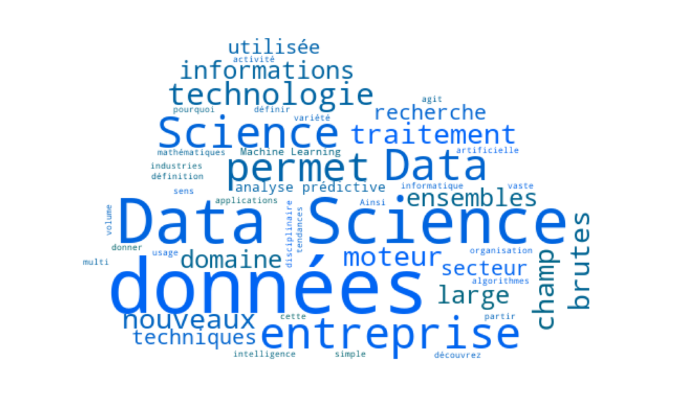

# Introduction au Text mining - Dataviz' : Création d'un nuage de mots

Dans cet exercice, nous allons mettre en application les techniques de text mining vues dans le dernier cours afin de créer un nuage de mots. Pour y arriver, il faut pouvoir calculer la fréquence des mots d'un corpus. Les packages utilisés seront notamment pandas, NLTK, wordcloud.

Le jeu de données étudié est un ensemble de données contenant des commentaires cinématographiques donnant des avis à propos des films 'The Da Vinci code', 'Brokeback Mountain', 'Mission Impossible' et 'Harry Potter'.

- Importer la bibliothèque pandas sous le nom pd.
- Lire dans un DataFrame df le fichier movies_comments.csv.
- Afficher les cinq premières lignes de df et la taille du dataset.

Rappelez-vous qu'avant de regarder la solution, vous avez toujours accès à l'aide officielle de Python en tapant help(nom_fonction) dans la console.

### Insérez votre code ici

​
​
​
La base de données df est composé de deux colonnes : Text et Sentiment. La première contient le commentaire et la deuxième le sentiment général qui se dégage de la phrase (1 : positif, 0 : négatif). df contient 1371 commentaires.

- Compiler tous les commentaires de df dans une variable text de type string.
- Importer la classe stopwords du package nltk.corpus.
- Initialiser une variable stop_words contenant des mots vides anglais.
- Afficher stop_words.

### Insérez votre code ici

​
​
La bibliothèque wordcloud implémente un algorithme permettant d'afficher un nuage de mots d'un texte. Cet algorithme regroupe les étapes suivantes :

- Tokeniser le texte passé en paramètre
- Filtrer les mots vides
- Calculer la fréquence des mots
- Représenter visuellement les mots-clefs les plus fréquents sous forme de nuage de mots, en voici un exemple :

Afin de générer un nuage de mots, il faut définir un calque en utilisant la méthode WordCloud et générer le nuage de mots du corpus par le biais de la méthode generate(corpus).

La méthode WordCloud à plusieurs paramètres :

- Le paramètre background_color permet de préciser la couleur de l'arrière-plan.
- Le paramètre max_words permet de fixer le nombre maximal de mots dans le nuage de mots.
- Le paramètre stopwords est une chaîne qui précise les mots à filtrer du corpus.

- Importer la classe WordCloud de la bibliothèque wordcloud
- Instancier le calque du nuage de mot wc à partir de la classe WordCloud, en prenant pour paramètres :
  - Une couleur de fond noire.
  - Un maximum de mots à afficher égal à 100.
  - Les stop-words de la langue anglaise.
  - Une police de taille maximale égale à 50.

### Insérez votre code ici

​

- Afficher le wordcloud en éxecutant la case de code suivante.
  import matplotlib.pyplot as plt
  ​

# Générer et afficher le nuage de mots

​
plt.figure(figsize= (8,6)) # Initialisation d'une figure
wc.generate(text) # "Calcul" du wordcloud
plt.imshow(wc) # Affichage
plt.show()
​
Il est possible d'afficher le nuage de mots en lui appliquant un masque. C'est une façon de tracer le nuage de mots en respectant la forme du masque.

La case de code ci-dessous définit la fonction plot_word_cloud qui permet d'afficher un nuage de mots à partir de la chaîne de caractères text passée en paramètre. Elle a également pour paramètre le masque : masque. La couleur par défaut de l'arrière-plan est noire.

Exécuter la cellule de code ci-dessous, pour voir s'afficher le nuage contenant les mêmes mots que précédement mais qui sont écrit à l'aide du masque iron.jpg
#Importer les packages nécessaires
from PIL import Image
import numpy as np
​
def plot_word_cloud(text, masque, background_color = "black") : # Définir un masque
mask_coloring = np.array(Image.open(str(masque)))
​ # Définir le calque du nuage des mots
wc = WordCloud(width=800, height=400, background_color=background_color, max_words=200, stopwords=stop_words, mask = mask_coloring, max_font_size=70, random_state=42)
​ # Générer et afficher le nuage de mots
plt.figure(figsize= (10,5))
wc.generate(text)
plt.imshow(wc)
plt.show()
​
plot_word_cloud(text, "iron.jpg")
​

# Code d'affichage du masque

import matplotlib.image as mpimg
img = mpimg.imread("iron.jpg")
plt.imshow(img)
plt.show()
​
​
Il est évident que le nuage de mots ci-dessus considèrent les noms de films comme les mots clés les plus fréquents. Pour pallier ce problème, nous allons ajouter les noms de film à la liste des mots vides, stockées dans la variable : stop_words.

- Ajouter au set stop_words les mots suivants : "mission", "impossible", "harry", "potter", "Da", "Vinci", "Mountain", "Brokeback", "Code".
- Séparer le jeu de données df en deux DataFrames : df_pos et df_neg. Le premier contient les commentaires positifs et le deuxième ceux négatifs.
- Afficher les quatre premières lignes de df_pos.

### Insérez votre code ici

​
​
​
​
Après avoir mis à jour la valeur de stop_words, nous allons affecter tous les commentaires de df_pos et df_neg dans les variables text_pos et text_neg de type string pour pouvoir tracer le nuage de mots par le biais de la fonction plot_word_cloud.

- Créer les variables : text_pos et text_neg.
- Tracer le nuage de mots des commentaires positifs en utilisant la fonction plot_word_cloud avec le masque coeur.png et une couleur d'arrière-plan blanche.
- Tracer le nuage de mots des commentaires negatifs en utilisant la fonction plot_word_cloud avec le masque : "mal.jpg" et une couleur d'arrière-plan noire.

### Insérez votre code ici

​
​
​

# Création d'un histogramme

Une autre façon de visualiser les mots les plus fréquemment utilisés par les internautes consiste à créer un histogramme indiquant le nombre de fois où le mot a été utilisé. Intuitivement, la construction de ce diagramme nécessite d'abord de compter le nombre d'occurrences des mots.

La classe Counter du module des collections transforme une liste en un dictionnaire où un élément de la liste (clé) est associé à son nombre d'occurrences.

La méthode .most_common(int) pour un dictionnaire retourne une liste des premiers mots int les plus utilisés avec leur nombre d'occurrences.

La fonction barplot(x,y) du module seaborn permet de construire un histogramme où la paire (x,y) représente respectivement les abscisses et les hauteurs de bâton de l'histogramme.

- Dans une variable nommé chaine, fusionner tous les commentaires négatifs dans une chaine de caractère.
- Créer dico une instance de Counter.
- Grâce à la méthode .most_common(int) afficher l'histogramme des 15 mots les plus fréquents chez les internautes ayant laissé un mauvais commentaire.

### Insérer votre code ici

​
​
​

# Conclusion

L'utilisation des nuages de mots est un moyen simple et exhaustif de représenter un travail effectué sur la pertinence d'un corpus de texte et son usage est largement répandu aujourd'hui. Les aspects concernants l'esthétique d'un nuage de mots, comme le masque et les couleurs, ont été abordés dans ce notebook et viennent compléter la liste d'outil de représentation graphique dont vous disposez, pour l'analyse de texte en particulier.

Pour reproduire ces notions en situation, la fonction suivante pourra vous être utile.

def plot_word_cloud(text, masque, background_color = "black"): # Définir un masque
mask_coloring = np.array(Image.open(str(masque))) # Définir le calque du nuage des mots
wc = WordCloud(width=800, height=400, background_color=background_color,
max_words=200, stopwords=stop_words, mask = mask_coloring,
max_font_size=70, random_state=42) # Générer et afficher le nuage de mots
plt.figure(figsize= (20,10))
wc.generate(text)
plt.imshow(wc)
plt.show()

plot_word_cloud(text, "photo.jpg")
Le prochain notebook sera dédié à la mise en application de tout ce que vous avez appris jusqu'à présent pour élaborer un modèle de Machine Learning afin de faire de la prédiction de sentiment à partir d'un corpus de texte.
