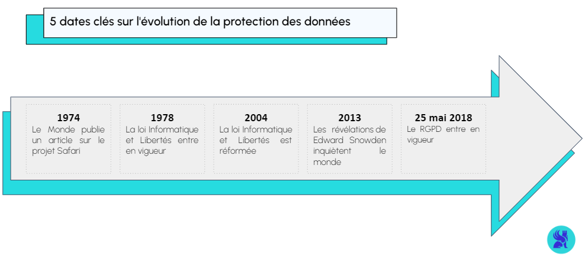
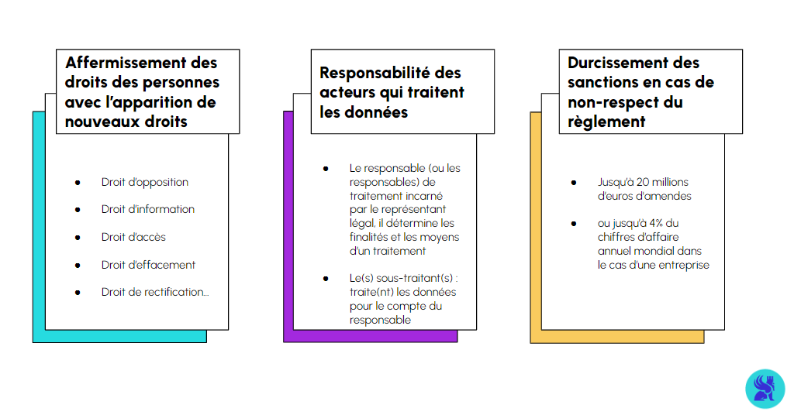
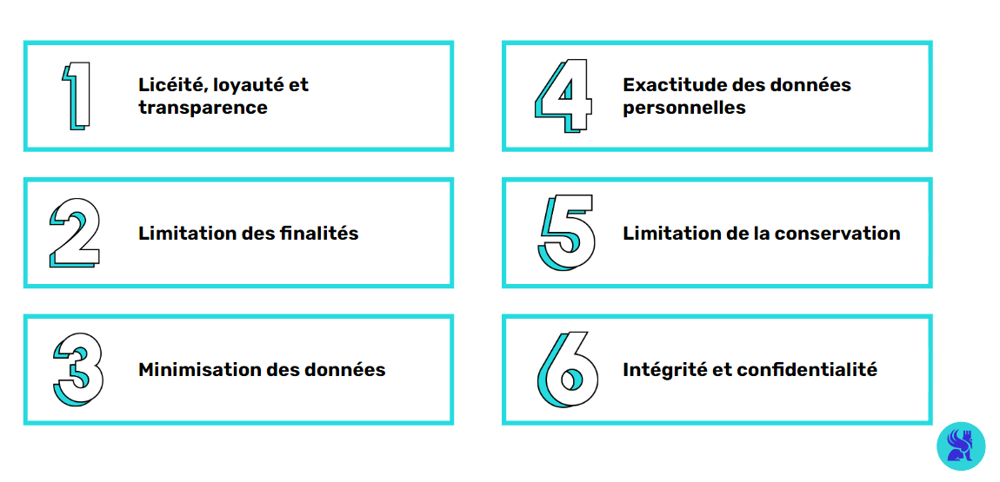
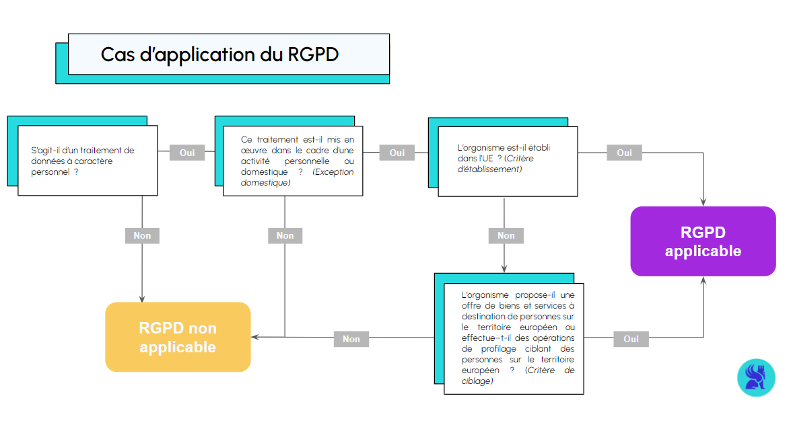
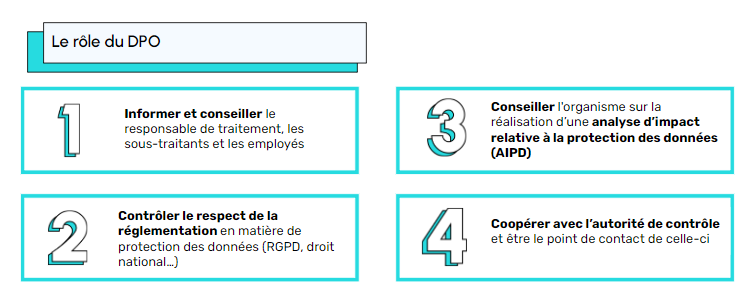
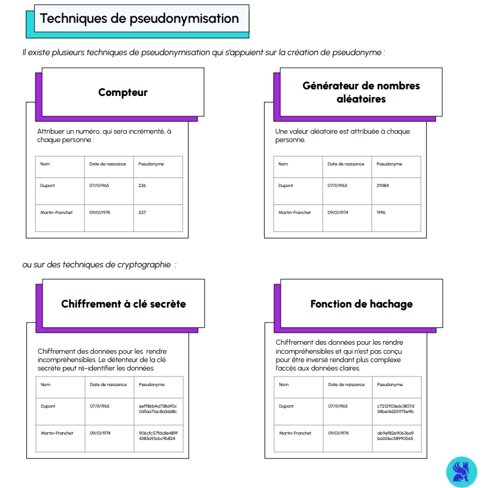
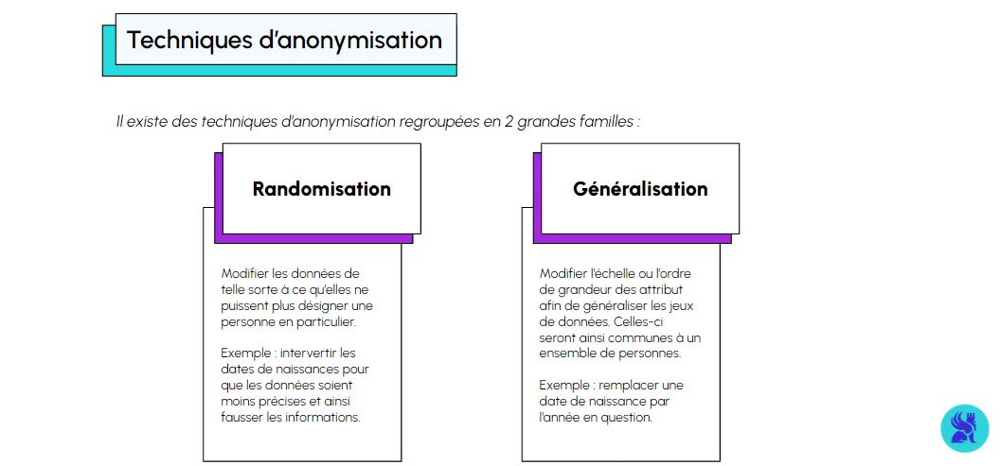
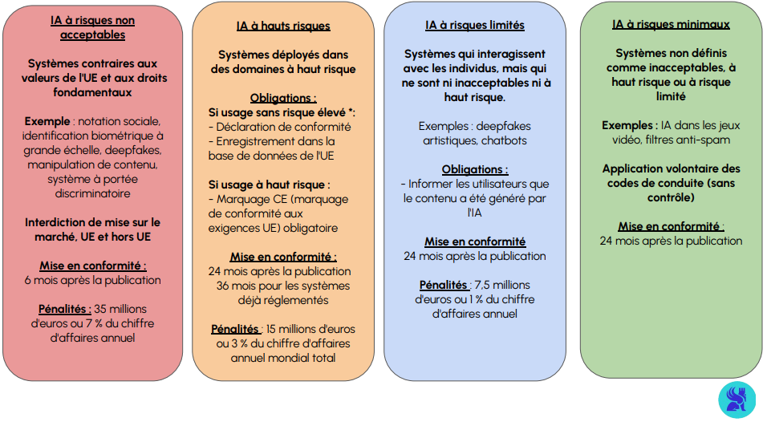

RGPD et éthique de l'intelligence artificielle
Aujourd'hui, un grand nombre d'entreprises nous propose des services gratuitement, allant même parfois jusqu'à nous rémunérer pour utiliser leurs services. Comme le dit le dicton "Si c'est gratuit, c'est vous le produit". Certaines entreprises développent ainsi des modèles économiques reposant sur l'exploitation et la vente de données personnelles sous différentes formes. Cela pose inévitablement une question de régulation de l'usage des données.

A l'heure du big data et de l'économie numérique, il s'agit donc de trouver un équilibre entre exploitation des données et protection de la vie privée.

C'est dans ce contexte que le Règlement Général sur la Protection des Données (RGPD) est entré en vigueur le 25 mai 2018. Ses dispositions sont directement applicables dans l'ensemble des 27 États membres de l'Union européenne à n’importe quelle entité (collectivité, association, entreprise), à n’importe quel type d'organisme (public, privé), quel que soit son secteur d’activité ou sa taille.

Il établit un nouveau cadre juridique en matière de protection des données personnelles des citoyens européens. Il s'agit de la loi sur la protection de la vie privée la plus stricte au monde. Obligatoire pour tous les organismes de l’Union européenne, ce règlement impose de lourdes amendes à quiconque enfreindrait ses normes de sécurité et de protection de la vie privée, et permet aux individus un meilleur contrôle de leurs données personnelles.

Avoir des connaissances en RGPD et éthique de la donnée est essentiel pour tous les professionnels de la data.

Contexte et concepts clés du RGPD
Historique

Données sensibles et données personnelles
Qu’est ce qu’une donnée personnelle ?

Toute information se rapportant à une personne physique identifiée ou identifiable directement (nom, prénom, photographie) ou indirectement (numéro de téléphone, numéro client…), à partir d’une seule donnée ou par croisement de plusieurs données. (Article 4, alinéa 1 du RGPD)

Qu’est ce qu’une donnée sensible ?

Une donnée à caractère personnel faisant apparaître, directement ou indirectement une opinion politique, une sensibilité religieuse, un engagement syndical, une appartenance ethnique, une orientation sexuelle, une situation médicale, des idées philosophiques, des données génétiques ou biométriques. Ces données bénéficient d’un cadre juridique particulier, qui interdit toute collecte préalable sans consentement écrit, clair et explicite ou une validation par la CNIL lorsque la collecte est justifiée par un intérêt public avéré. (Article 9, alinéa 2 du RGPD)

Qu'est-ce qu'un traitement de données à caractère personnel ?

Toute opération effectuée ou non à l'aide de procédés automatisés et appliquées à des données ou des ensembles de données à caractère personnel, telles que la collecte, l'enregistrement, l'organisation, la structuration, la conservation, l'adaptation ou la modification, l'extraction, la consultation, l'utilisation, la communication par transmission, la diffusion ou toute autre forme de mise à disposition, le rapprochement ou l'interconnexion, la limitation, l'effacement ou la destruction (Article 4, alinéa 2 du RGPD).

En 2020, H&M a dû payer 35M€ pour surveillance illégale de ses employés en Allemagne. Selon le régulateur allemand, la firme dérogeait à la règle de minimisation des données en ayant créé des profils renseignant des données sensibles sur son personnel (informations médicales, croyance religieuse, problèmes personnels).
  Erreur classique : considérer à tort que certaines données ne sont pas personnelles.
Le caractère personnel de la donnée est plus lié à la possibilité d’identifier une personne qu’au simple fait que son nom ou son mail soient stockés. Imaginons une équipe de 10 personnes avec 1 seule femme à laquelle est envoyée une enquête anonyme pour faire un feedback sur son manager. Si le manager a accès au bilan des retours par sexe, on considérera que l’enquête n’est pas anonyme et que le sexe est une donnée personnelle, car la personne peut facilement être identifiée grâce au contexte.
Les objectifs du RGPD

Les principes du RGPD

Le concept de Privacy By Design
Le principe de privacy by design est établi par l’Article 25 du RGPD, son objectif est de protéger les données personnelles de l’utilisateur dès la conception d'un produit ou d'un service afin de minimiser les risques de non-respect de la vie privée. Les particuliers n'ont pas d'action à mettre en place pour bénéficier de cette protection.

La mise en oeuvre du Privacy by Design

Le principe du Privacy By Design doit être pris en compte à chaque étape du processus de traitement des données. Il donne l'obligation aux responsables de traitement de s’interroger sur la conformité des traitements de données avec le RGPD et doivent être en mesure de prouver cette conformité. Ainsi, le responsable de traitement des données va mettre en oeuvre les mesures et techniques appropriées comme par exemple :

La pseudonymisation des données qui permet de rendre impossible l'identification directe d'un individu.
La minimisation de la collecte des données : on ne collectera que les données nécessaires au projet en cours.

En 2020, H&M a dû payer 35M€ pour surveillance illégale de ses employés en Allemagne. Selon le régulateur allemand, la firme dérogeait à la règle de minimisation des données en ayant créé des profils renseignant des données sensibles sur son personnel (informations médicales, croyance religieuse, problèmes personnels).
La suppression des données qui ne sont pas utilisées.

Erreur classique : penser que la gestion des données personnelles, ça n’influe pas sur l’architecture du produit data.
En effet, il est souvent plus simple de mettre cela de côté en se disant qu’on va faire les développements et qu’on regardera après pour la partie RGPD. Cela pose souvent 2 problèmes. Le premier, c’est qu’il est probable de mal gérer les données personnelles et s’exposer à des poursuites dès ces prototypes de test. Le second est qu’il est aussi fréquent d’avoir énormément de modifications à faire dans l’architecture des données ou l’interface en fin de projet si les contraintes RGPD n’ont pas été intégrées avant.
Cette notion s'accompagne de celle de Privacy By Default : sans aucune intervention de la part de l’utilisateur, les mesures protégeant les données personnelles et de limitation de collecte doivent être activées.

Les 7 fondements du Privacy By Design :

Mesures préventives et non correctives permettant de prévenir les violations de la protection des données personnelles.
Protection par défaut de la vie privée, c’est-à-dire une protection implicite et automatique des donnée.
Protection de la vie privée dès la conception des systèmes informatiques et des pratiques commerciales.
Sécurité et protection de la vie privée tout au long de projet, également pendant la période de conservation des données personnelles.
Visibilité et transparence des pratiques de traitement de données.
Respect de la vie privée des utilisateurs.
Protection optimale et intégrante des données personnelles.
Droits et obligations dans le RGPD

Les cas d'application du RGPD

Le principe d’accountability
L’accountability (ou responsabilité) est l’une des notions les plus importantes du RGPD. Elle oblige les différents acteurs à mettre en place dès la conception (application du principe de privacy by default) et jusqu’à la fin du traitement tous les outils pour respecter les règles relatives à la protection des données.

Il existe plusieurs types de responsables face au RGPD :

Le ou les responsables du traitement qui ont déterminé la finalité du traitement (en pratique, ce sont les représentants légaux de l’organisme qui portent la responsabilité).
Le ou les sous-traitants qui traitent les données pour le compte du responsable.
À chaque étape du traitement des données, ces acteurs se portent garants du respect du règlement et s’assurent de la conformité et de l’adéquation de leurs processus au RGPD et à la loi Informatique et Libertés. Ils doivent également et à tout moment pouvoir fournir les preuves de cette conformité à leurs clients et à la CNIL.

Afin d'accompagner les professionnels dans leur mise en conformité, le code de conduite est un outil à vocation pratique qui les guide dans l'application des dispositions du RGPD selon leur secteur.

Les droits garantis par le RGPD
Le droit d’être informé : Toute personne a le droit de savoir quelles sont les données détenues par les entreprises à leur sujet, comment elles sont utilisées, combien de temps elles sont conservées ou si elles sont partagées avec une tierce partie (art. 15 RGPD).
Le droit d’accès : Les organismes ont l’obligation, si les personnes concernées le souhaitent, de leur fournir une copie de toutes les données détenues à leur sujet dans un délai d’un mois (art. 15 RGPD).
Le droit de rectification : Si une personne se rend compte que des informations à son sujet sont inexactes, il a le droit de demander à les modifier et à ce qu’elles soient mises à jour (art. 16 RGPD.
Le droit à l’effacement (« droit à l‘oubli ») : Toute personne a le droit de demander à ce que les données personnelles détenues à son sujet soient effacées des bases de données.(art. 17 RGPD).
Le droit à la limitation du traitement : Avant de demander un droit à l’effacement, tout individu peut demander à ce que l’utilisation de leurs données personnelles soit limitée (art. 18 RGPD).
Le droit à la portabilité des données : Il donne le droit à tout individu d’obtenir une copie de leurs données et de les réutiliser à d’autres fins (art. 20 RGPD).
Le droit d’opposition : Toute personne a le droit de s’opposer à l’utilisation de ses données personnelles par une entreprise pour un objectif précis (art. 21 RGPD).
Le droit à l’intervention humaine face au profilage ou à une décision automatisée : Si une décision automatisée est prise à l’encontre d’un individu (décision prise par un algorithme sans intervention humaine), celui-ci a le droit de contester la décision et de demander une vérification humaine (art. 22 RGPD).
Les obligations des acteurs qui traitent la donnée
Collecter le consentement des utilisateurs : Le consentement des utilisateurs de plus de 16 ans doit être recueilli lors de la collecte de leurs données. En cas de modification substantielle des modalités de traitement (nouvelle finalité, nouveaux destinataires, changement des règles d'exercice des droits), les utilisateurs devront être avertis. Pour un enfant de moins de 16 ans, le consentement doit être donné par son représentant légal.
Garantir les droits des individus: Droit d’accès, droit de rectification, droit à la portabilité…
  Carrefour a écopé d'une amende de 3M€ pour ne pas avoir garanti les droits de ses clients. Parmi les manquements du géant de la grande distribution :

⦿ Ne pas avoir facilité “l’exercice des droits” en demandant leur carte d’identité à des personnes pour faire valoir leurs droits.
⦿ Ne pas avoir donné suite aux demandes de droits d’accès et droits d’opposition des individus.
⦿ Avoir collecté des informations de manière déloyale auprès de ses clients.
Veiller à la sécurité des données : Les responsables de traitement et les sous-traitants ont l’obligation d’assurer la sécurité maximale des données de toute personne. Si l’organisation est victime d’une violation de sécurité (piratage, panne matérielle, vol de matériel, erreur de saisie...), le responsable de traitement doit le notifier à la CNIL dans les meilleurs délais, au plus tard 72 heures à compter de sa connaissance.

La condamnation de British Airways par l'équivalent britannique de la CNIL (Information Commissioner’s Office, ICO) pour ne pas avoir suffisamment sécurisé les données de ses clients suite à une cyberattaque en 2018. La compagnie aérienne n'avait pas mis en place des mesures basiques de sécurité informatique qui auraient permis de détecter l’attaque.
Tenir un registre des traitements : Les responsables de traitement et les sous-traitants sont obligés de tenir un “registre des traitements”. C’est un document dans lequel figurent tous les traitements réalisés sur les données personnelles.

Réaliser une analyse d’impact à la protection des données (AIPD): Pour tous les traitements avec un risque élevé pour les droits et libertés des personnes, les responsables de traitement doivent conduire une étude d’impact complète. L'AIPD devra faire apparaître les caractéristiques des traitements, justifier de leur nécessité et proportionnalité, évaluer leurs risques et proposer des mesures pour y faire face.
Encadrer les transferts de données hors de l’Union européenne : Les responsables de traitement doivent s'assurer que le niveau de protection des données est adéquat dans le pays tiers (exemple : Japon, Israël). Si ce niveau de protection n'est pas assuré (comme pour les Etats-Unis), le transfert est possible si des garanties existent (clauses contractuelles, règles internes d’entreprise) ou que l'utilisateur consent au transfert après avoir été informé des risques.
Nommer un DPO : Les responsables de traitement ont l’obligation de désigner un Délégué à la Protection des Données si l'organisme répond à certains critères.

# Le rôle du Délégué à la protection des données (DPO)

Anonymisation et pseudonymisation
L’anonymisation et la pseudonymisation peuvent être mises en œuvre pour assurer la protection des données personnelles. Elles se différencient dans leur méthode de mise en place et dans leurs conséquences à la fois pratiques et légales.

La pseudonymisation
Définition : "Un traitement de données personnelles réalisé de manière à ce qu'on ne puisse plus attribuer les données à une personne physique identifiée sans information supplémentaire. En pratique, la pseudonymisation consiste à remplacer les données directement identifiantes (nom, prénoms, etc.) d’un jeu de données par des données indirectement identifiantes (alias, numéro séquentiel, etc.)" (CNIL)

Elle permet de rendre impossible l’identification des données de façon directe et est réversible. Les données pseudonymisées sont considérées comme des données personnelles et leur traitement reste intégralement soumis au RGPD.

L'anonymisation
Définition : "Un traitement qui consiste à utiliser un ensemble de techniques de manière à rendre impossible, en pratique, toute identification de la personne par quelque moyen que ce soit et de manière irréversible." (CNIL)

Son objectif est d'utiliser des données sans exposer d'information identifiantes et sans qu'un lien puisse être fait avec l'individu d'origine. Il s'agit d'une opération irréversible. Si le RGPD doit être respecté pour la mise en œuvre du processus d’anonymisation, il ne s’applique plus à l’issue du processus; les données une fois anonymisées n’ont plus d'impact sur la vie privée des personnes concernées.

La réglementation de protection des données dans le monde
Le RGPD de l'Union Européenne est souvent cité comme une référence en matière de protection des données personnelles, notamment car l'UE a été pionnière dans la mise en place d'une législation aussi protectrice. Cependant, il n'est pas la seule législation en vigueur dans ce domaine. D'autres pays ont mis en place des lois qui offrent un niveau de protection élevé. Certains pays externes à l'UE, offrent des lois jugées équivalentes par l'UE en cas de transferts de données. Au Japon, en Corée du Sud ou en Israël, la réglementation est jaugée adéquate par l'UE. Le Royaume-Uni, qui a quitté l'UE depuis le Brexit le 31 janvier 2020, a intégré les principes du RGPD dans sa propre législation sur la protection des données, permettant ainsi une continuité dans les échanges de données avec les pays de l'UE.

Dans les systèmes fédéraux comme les États-Unis, la situation est plus complexe car la législation peut varier considérablement d'un État à l'autre. Un exemple notable est l'État de Californie, dont le California Consumer Privacy Act (CCPA) entré en vigueur le 1er janvier 2020, octroie des droits équivalents à ceux du RGPD aux résidents de Californie.

La carte présentée dans le lien ci-dessous illustre les différents niveaux de protection des données personnelles à travers le monde. Pour explorer en détail et de manière interactive la législation de chaque pays, cliquer sur ce lien.

Intelligence artificielle et éthique
Deepfake
Le terme Deepfake a été inventé en 2017 et vient de “deep learning” et de “fake event”. C’est une technique de synthèse multimédia qui sert à superposer des fichiers audio ou vidéo existants sur d’autres vidéos ou audio. Vous pouvez donc prendre une image et l’appliquer à une vidéo de quelqu’un qui fait des mouvements du visage. Le président Obama qui, face caméra, insulte son successeur, l'actrice américaine Scarlett Johansson apparaissant dans vidéos compromettantes ou encore le faux compte TikTok de Tom Cruise en sont des exemples.

Dilemme moral : Les voitures autonomes
Même si les voitures autonomes ont fait énormément de progrès ces dernières années, il subsiste une question fondamentale : à qui attribuer la responsabilité des conséquences lors d’un accident ?

Si une voiture autonome avec des passagers à l’intérieur a le choix entre soit foncer dans un mur et tuer les passagers, soit donner un coup de volant et sacrifier les piétons qui se trouvent sur la route. Quel est le bon choix à faire ?

Des chercheurs du CNRS et du MIT ont développé le site moralmachine pour mettre en situation une voiture autonome face à des risques imminents et recueillir l'avis des internautes sur le choix à faire.
Algorithmes de discrimination
L'intelligence artificielle est parfois utilisée dans les étapes de screening. Le profil du candidat idéal pourrait être calculé à partir des profils des salariés des entreprises. Mais si la majorité des employés sont des hommes qui sont passés par les meilleures universités, alors le logiciel va en conclure que les CV de femmes, de minorités ou de personnes au parcours universitaire moins classiques seront moins intéressants. Ainsi, une base de données biaisée et discriminante entraînera un résultat biaisé et discriminant.

Récemment, la CNIL a exigé qu’un protocole d’évaluation des intérêts et des risques soit enclenché pour encadrer les tests d’une technologie de reconnaissance faciale. Elle a ainsi demandé à l’organisme développant cette technologie de fournir :

⦿ Des métriques de performance validées par la communauté scientifique et d'estimer leurs implications (exemple : un taux de faux positif pour certaines catégories de population.
⦿ Une analyse systématique des erreurs du système.
⦿ Des preuves de la robustesse du modèle dans différentes conditions d’expérimentation (par exemple pour un système de vision par ordinateur : jour/nuit, conditions météorologiques, qualité des images utilisées).
⦿ Une réflexion sur les biais du modèles pouvant impliquer des discriminations.
Un cadre réglementaire européen pour l'intelligence artificielle : l'AI ACT
En mars 2024, le texte de l’Acte sur l’Intelligence Artificielle de l’Union européenne (EU AI Act) a été adopté à l'unanimité. Présenté le 21 avril 2021, puis révisé radicalement en réponse à la progression des IA génératives, son adoption marque une étape cruciale vers la régulation des systèmes d’intelligence artificielle (IA) à travers l’UE.

Il s'agit du premier cadre juridique au monde visant à équilibrer les avantages de l’IA avec les risques pour les droits fondamentaux. Le texte s'applique à tous les secteurs et à toutes les industries, imposant de nouvelles obligations aux fabricants de produits, aux fournisseurs, aux utilisateurs, aux distributeurs et aux importateurs de systèmes d'IA. La loi s'applique également de manière extraterritoriale, par exemple aux fournisseurs basés en dehors de l'UE qui mettent un système d'IA sur le marché de l'UE et aux fournisseurs et déployeurs basés en dehors de l'UE lorsque les résultats du système d'IA sont destinés à être utilisés dans l'UE.

Fonctionnement
L'AI Act classifie les systèmes d'IA selon plusieurs niveaux de risque : IA interdite, IA à haut risque, IA à risque limité et IA à risque minimal. Cette classification sert de base à l'application de mesures réglementaires spécifiques.

Le cas des systèmes à haut risques

L’annexe III de l’AI Act définit 8 grands domaines d’activités identifiés comme à “haut risque” :

1. Identification biométrique et catégorisation des personnes physiques : Utilisation de techniques pour identifier ou catégoriser les individus, souvent pour des raisons de sécurité ou de surveillance.

2. Infrastructures critiques : systèmes qui jouent un rôle crucial dans le maintien des infrastructures critiques, comme l'énergie, les transports, l'eau et les services de communication.

3. Éducation et formation professionnelle : Applications de l'IA dans l'éducation, y compris l'évaluation et la formation.

4. Emploi, gestion des travailleurs et accès au travail indépendant : Utilisation de l'IA pour les processus de recrutement, de gestion des performances et de surveillance des employés.

5. Accès et jouissance des services privés essentiels et des services et avantages publics : Systèmes qui influencent l'accès aux services financiers, aux soins de santé, aux logements, etc.

6. Forces de l'ordre : Applications de l'IA dans les opérations de police et de sécurité.

7. Gestion de la migration, de l'asile et du contrôle des frontières : Utilisation de l'IA pour la gestion des flux migratoires et le contrôle des frontières.

8. Administration de la justice et processus démocratiques : Systèmes utilisés dans le cadre judiciaire et pour soutenir les processus démocratiques.

Les entreprises opérant dans ces domaines doivent démontrer que leur système d'IA n'est pas à haut risque. Cela implique la fourniture de déclarations de conformité et, le cas échéant, le marquage CE.

Le cas des IA à usage général

IA générative :
systèmes capables de créer de nouveaux contenus à partir de données existantes. Utilisant des modèles comme les réseaux adverses génératifs (GAN), les auto-encodeurs variationnels (VAE) et les transformateurs, elle génère des échantillons originaux qui imitent la distribution des données d'entraînement. Ses applications incluent la génération de texte, d'images, de musique, et bien plus, avec des usages allant de l'art à la création de contenu automatisé.

IA à usage général :systèmes capables de réaliser un très grand nombre de tâches différentes. Ils ont donc un usage “général”, plutôt qu’un usage unique et spécifique (une fonction particulière, comme identifier des images de chien par exemple). Ces systèmes peuvent comprendre, apprendre, et s'adapter à de nouvelles situations de manière autonome, effectuer des raisonnements abstraits, et transférer des connaissances entre différents domaines.
Alors que l'AI Act était en cours de rédaction, l'arrivée sur le marché de modèles génératifs à usage général, comme ChatGPT en décembre 2022 basé sur GPT-3, a imposé une prise en compte de ces systèmes dans la législation.

Le terme d'IA à usage général (GPAI) fait référence dans l'AI Act à des "modèles entraînés à l'aide d'une grande quantité de données en utilisant l'auto supervision à grande échelle, qui font preuve d'une grande généralité et qui sont capables d'exécuter avec compétence un large éventail de tâches distinctes, quelle que soit la manière dont le modèle est mis sur le marché, et qui peuvent être intégrés dans une variété de systèmes ou d'applications".

Les IA génératives, définies par leur capacité à créer de nouveaux contenus à partir de données existantes, sont donc considérées comme des IA à usage général si elles ne sont pas spécialisées sur une tâche. Un exemple type est ChatGPT.

Ces systèmes, sont distingués essentiellement sur deux critères dans l'AI Act :

La puissance de calcul nécessaire à l'entraînement évalué en FLOP (nombre d'opérations en virgule flottante par seconde, Floating Points Per Second).
Le caractère open source.
Sur la base de ces critères, les obligations ci-dessous doivent être appliquées.

En termes d'application et de sanctions, l'IA prévoit des amendes substantielles pouvant atteindre jusqu'à 15% du chiffre d'affaires mondial annuel. Les entreprises disposent encore d'un délai pour se conformer aux nouvelles normes. Cependant, comme pour le RGPD à ses débuts, les modalités de contrôle des organisations restent encore peu détaillées. La CNIL, probable organe de contrôle en France, devra trouver des moyens efficaces pour assurer le respect de la législation. En janvier 2023, elle annonçait déjà la création d'un service consacré à l'IA et présentait en mai de la même année un plan d’action spécifique à ce domaine.

La mise en application de ces contrôles reste cependant un défi à relever, notamment pour des systèmes d'IA complexes et entraînés sur de très gros volumes de données. Par ailleurs, bien qu'ambitieux, l'AI Act, comme tout cadre légal, contient des principes techniques (interprétabilité, transparence, documentation technique, adversarial testing...), dont les modalités d'évaluation restent floues. Enfin, il sera nécessaire de trouver des experts techniques capables d'auditer la conformité tant au niveau des entreprises que pour l'organe régulateur.

Conclusion
L'émergence du big data et de l'intelligence artificielle soulèvent des questions éthiques liées aux finalités d'utilisation de données personnelles ou encore à la responsabilité morale et humaine derrière des algorithmes de plus en plus complexes.

Le RGPD apporte une réponse légale et un cadre juridique destiné à protéger les individus de potentiels abus et d'utilisations mal intentionnées de leurs données, en leur garantissant des droits essentiels (d'information, d'accès, de rectification, d'opposition...).

L'AI Act propose un nouveau cadre de régulation spécifique aux systèmes d'intelligence artificielle, avec des principes techniques visant à garantir un développement et une utilisation responsables. Il impose des exigences de transparence, d'interprétabilité et de documentation technique, et prévoit des sanctions en cas de non-conformité. Nous avons cependant vu que son application concrète sera un enjeu majeur de la décennie à venir.

En assurant le respect des législations et des bonnes pratiques en termes d'éthique des données, les organisations participent à l'établissement d'un contrat de confiance avec les populations.

Au delà de leurs obligations légales, les professionnels et organisations qui traitent des données se doivent de définir le cadre éthique qui permettra l'innovation mais aussi l'utilisation responsable des données afin de concilier progrès et protection des droits des individus.

L’éthique des données amène donc les Data Product Managers, Analyst, Scientist ou Engineer à se questionner sur les fondements de leurs prises de décision. Elle implique que nous interrogions nos pratiques professionnelles et leurs répercussions.
