UX & UI Design
Introduction
Bonjour à toutes et à tous et bienvenue dans ce nouveau cours sur l'Expérience Utilisateur et l'Interface Utilisateur !

Sommaire du cours
Voici les différents points que nous allons aborder :

Introduction à l'expérience utilisateur, au comportement et à la méthodologie déployée
La recherche
La définition
L'exploration
Le prototype / UI
Les tests
C’est parti !

1. Introduction à l'expérience utilisateur, au comportement et à la méthodologie déployée
   1.1 Le Design Thinking
   Afin de se différencier sur ces marchés de plus en plus concurrentiels, les marques doivent quotidiennement innover, se ré-inventer, se repenser. Pour cela, une méthode est née : le design thinking.

Qu'est-ce que le Design thinking ?
Le Design Thinking est une philosophie de travail, centré utilisateur, menée à travers des outils pluridisciplinaires. Cette dernière a pour objectif de trouver des solutions itératives dans un processus collaboratif.

Par définition, le Design Thinking « penser le design », est une méthode de gestion de l'innovation élaborée à Stanford dans les années 80.

C'est une synthèse entre pensée analytique et pensée intuitive. Une démarche globale appelée design collaboratif.

Pourquoi utiliser le Design Thinking ?
_"Certaines personnes pensent que le design se limite à un objet. Mais en creusant un peu plus, on se rend compte qu'il s'agit de la façon dont il fonctionne. "_

Steve Jobs

Cela permet de grandir plus vite : en moyenne, les sociétés faisant appel au design affichent + 219% de performance que leurs pairs.

Cela permet de travailler plus intelligemment : elles commercialisent généralement deux fois plus vite leurs produits ou leurs services.

Cela permet de saisir des opportunités : 14% des lancements de leurs nouveaux produits représentent 61% des bénéfices.

Cela permet de faire toujours plus : Combiner les pratiques Agiles et la démarche du Design Thinking améliore considérablement la productivité.

1.2 La différence entre l'UI et l'UX
La méthodologie du Design Thinking a évolué pour faire naître, depuis quelques années, une approche globalisée, appelée Expérience Utilisateur (UX).

C'est la qualité du vécu de l'utilisateur dans des environnements numériques ou physiques.

L'UX qualifie l'expérience globale ressentie par l'utilisateur lors de l'utilisation d'une interface, d'un appareil digital ou plus largement en interaction avec tout dispositif ou service. L'UX est donc à différencier de l'ergonomie et de l'utilisabilité.

Elle s'appuie aussi bien sur l'utilisabilité (la « facilité d'usage » d'une interface) que sur l'impact émotionnel ressenti.

Qui a parlé de la notion d'UX pour la première fois ?
Une notion apportée par Don Norman, en 1988 dans son livre : « The Design of Everyday Things ».
Le professeur, auteur, psychologue et chercheur, donne la définition de l'UX comme étant des « réponses et perceptions d'une personne qui résultent de l'usage ou de l'anticipation de l'usage d'un produit, d'un service ou d'un système ».

Il est indispensable de faire la différence entre l'UX (sus-évoqué) et l'UI:

UX = Expérience Utilisateur (la manière de penser l'expérience)

UI = User Interface (création visuelle de l'expérience pensée)

_Luttons contre ces idées reçues à travers ces quelques schémas : _

UI & UX

Le pot de Ketchup très esthétique & Le pot de Ketchup très fonctionnel qu'on préfère utiliser.

Utilisateur - La personne qui va être utilisateur du produit ou service. Ici, l'enfant qui apprend à faire du vélo.

UI - Le produit (ou service) qui sera utilisé. Ici, le vélo pour l'enfant.

UX - L'utilisation parfaite entre utilisateur et produit (ou service). Ici, l'enfant arrivant à faire du vélo

Généralement, l'UX est la partie cachée de l'iceberg. Celle qu'on ne voit pas mais qui est indispensable à la bonne tenue de l'expérience globale.

1.3 Le processus de l'UX
L'eco-système de l'UX
Vous devez prendre en compte 3 sujets d'étude d'après Peter Morville (président de Semantic Studios) pour se rapprocher du succès d'un projet autour de l'expérience utilisateur:

Le contenu
Tous les produits / services qui découlent de la marque.

Leur ADN, la plateforme de marque, les composants ...

L'utilisateur
Ses motivations, ses freins, ce qu'il ressent, analyser son comportement.

Le contexte
Les objectifs du projet, la culture d'entreprise, les ressources dédiées et les différentes parties prenantes.

L'utilisabilité
Afin de mettre en place une projet autour de l'UX, il faut déjà comprendre ce qu'est une utilisabilité. C'est l'élément pragmatique de l'écosystème web. Une bonne utilisabilité n'est pas facultative, elle est essentielle.

D'après Peter Morville, il y a sept facteurs d'utilisabilité qui influencent l'UX:

1. Utile (Useful)

Votre produit doit être utile en répondant aux besoins rationnels de vos clients/utilisateurs.

2. Utilisable (Usable)

Les produits et services doivent être faciles à utiliser. Ils doivent être familiers à l'utilisateur et donc simples à comprendre.

L'objectif est que la courbe d'apprentissage soit courte et sans difficultés majeures.

3. Attractif (Desirable)

L'attractivité est produite par la marque, l'identité visuelle ou d'autres éléments du design émotionnel.

4. Trouvable (Findable)

Un utilisateur doit trouver, rapidement, les informations qu'il est venu chercher sur votre expérience. 59% des utilisateurs ne reviennent pas sur un site après une mauvaise expérience.

5. Accessible

Le World Wide Web Consortium (W3C) donne cette définition suivante : « L'accessibilité du web signifie que les personnes handicapées peuvent l'utiliser. Plus spécifiquement, elle signifie que ces gens peuvent percevoir, comprendre, naviguer, interagir avec le web, et y contribuer. L'accessibilité du web bénéficie également à d'autres, notamment les personnes âgées ayant des capacités diminuées dues au vieillissement. »

6. Crédible

Tous les éléments qui apporteront de la crédibilité à votre expérience : témoignages, design, blog...

7. De valeur (Valuable)

Créer de la valeur pour ses utilisateurs en mettant en évidence les bénéfices de vos produits ou services

1.4 La méthodologie déployée
Afin de déployer une bonne expérience utilisateur, il est important de suivre une méthode qui a fait ses preuves.

L'UX peut intervenir à différents stade d'un projet.

Une bonne expérience ne s'arrête pas dans le temps, elle se travaille, s'analyse, s'améliore quotidiennement.

Voici la méthodologie à utiliser en 6 étapes:

La découverte - Découvrir et comprendre les enjeux de votre projet.

L'observation - Rencontrer les utilisateurs et s'emparer d'un problème.

Ces deux premières étapes, c'est ce qu'on appelle la recherche utilisateur.

Elles vont définir le POURQUOI.

La définition - Définir la zone d'action prioritaire.

L'exploration - Explorer les solutions potentielles afin de définir un MVP (Minimum Viable Product / Produit Minimum Viable - une version fonctionnelle et élémentaire du produit).

Ces deux étapes définissent le QUOI.

Le prototype - Opter pour la solution optimale. Prototyper !

Le testing - Tester le prototype créé à travers différentes techniques

Ces deux dernières étapes définissent le COMMENT.

Dans les prochains chapitres, nous détaillerons les différentes étapes, sous forme de boîte à outils.

2. La Recherche

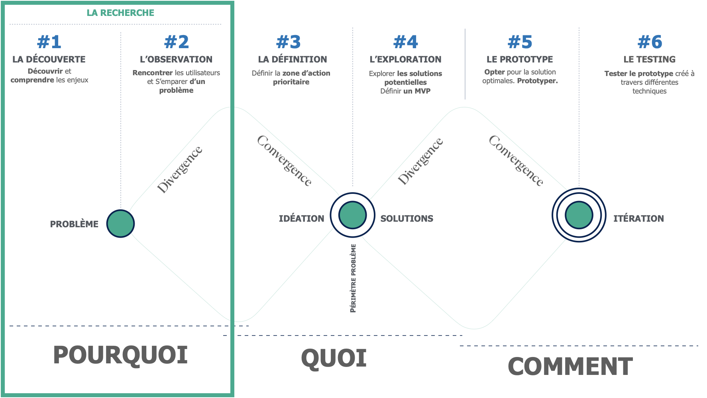

2.1 Introduction à la recherche
L'UX Research (ou recherche utilisateur) désigne les méthodes employées pour comprendre les attentes des utilisateurs d'un produit ou service.

La recherche UX -- user experience research en anglais -- fait partie du processus de conception de l'expérience utilisateur.

C'est un moyen de récolter des données qualitatives et quantitatives pour déterminer les besoins des utilisateurs.

Le Processus de la recherche
Lorsque vous mettez en place une phase de recherche, qui a pour but de comprendre les panels observés, potentiels utilisateurs de votre solution (produit ou service), Il est indispensable de suivre un processus en 4 étapes :

La méthodologie de la recherche : d'où provient la connaissance.

Quels sont les faits relevés ? : ce que nous avons appris.

Les enseignements tirés : ce que nous tirons comme enseignement.

Les recommandations : ce que nous suggérons, ce que nous allons faire.

Vous devez, pendant cette recherche, avoir un état d'esprit afin de :

Cerner les besoins de l'utilisateur : déterminez ce qui pourrait leur faciliter la vie quotidienne. Que doivent-ils accomplir ? Qu'est-ce qui est le plus difficile pour eux ?

Accepter le changement : la solution peut être très différente de votre hypothèse initiale.

Posez-vous toujours plus de questions : toujours en apprendre davantage.

Lorsque vous mettez en place une recherche utilisateur, 2 dimensions sont à prendre en compte :

La segmentation standardisée (âge, CSP, situation géographique...) : attention à ne pas se baser seulement sur cette typologie de segmentation.

Le data mining (critères comportementaux) : essayer de comprendre son état d'esprit, comprendre les comportements des utilisateurs, repérer des corrélations ou des schémas au sein d'une masse de données brutes.

Il faut coupler le data mining à la segmentation standardisée !

Voici un exemple de data mining :

Pour le compte d'un client dans la cosmétique, nous avons, grâce à notre recherche, pu observer quel était le premier besoin attendu lorsque que vous achetiez un produit cosmétique.

Nous avons repéré ces corrélations par l'intermédiaire d'une masse de données brutes récoltées dans nos études.

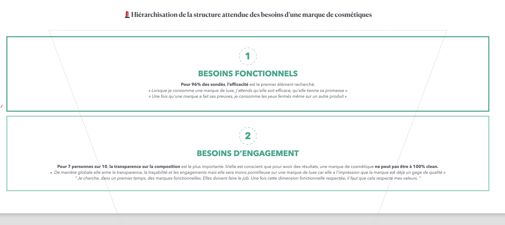

2.2 Le protocole de recherche
Le protocole de recherche est le premier document que vous allez créer. Il permet de cadrer les études que vous allez mettre en place dans le cadre de la recherche.

Les objectifs : la méthode, la rigueur et l'organisation.

POURQUOI

Permet de cadrer le travail de recherche

Cela permet de valoriser la démarche de la recherche auprès de votre client et/ou projet pour expliciter votre démarche auprès de votre client, et éventuellement impliquer.

Pour anticiper le maximum de facteurs et d'indicateurs a noter lors des observations.

COMMENT

Entrez en contact avec les utilisateurs finaux

Qui allez-vous voir et pourquoi? Où et quand ? Quelle(s) technique(s) comptez-vous mettre en œuvre?

Pendant combien de temps ? Quelles sont vos contraintes de projets (timing , budget, RH...)

Exemple de protocole de recherche : https://www.dropbox.com/s/u5snbi5ndggvhyl/Protocole.docx?dl=0

2.3 La découverte
La découverte est la première phase opérationnelle de la recherche.

C'est une phase qui va permettre de cadrer le projet et de monter en compétences via des études déjà existantes.

Dans les éléments qui suivent, vous allez découvrir un grand nombre d'ateliers.

Il s'agit d'une boîte à outils. En aucun cas, il faut mener l'ensemble des ateliers. A vous de choisir, en fonction du projet et du client, lesquels sont les plus intéressants à mettre en place.

Il faut analyser et comprendre le contexte dans lequel vous allez évoluer.

Analyse des parties prenantes d'un projet
Comprendre qui gravite autour des projets lorsque vous menez une expérience utilisateur

Voici quelques ateliers à mettre en place pour cette compréhension :

1. Cartographie des parties prenantes

Cette cartographie permet d'identifier, très tôt, les principales

parties prenantes concernées par le projet. Il peut être mené en présentiez ou à distance.\*

Objectifs : Exploration des parties prenantes

Durée : 1h à 1h30

Besoins : Post-it, feuilles et feutres

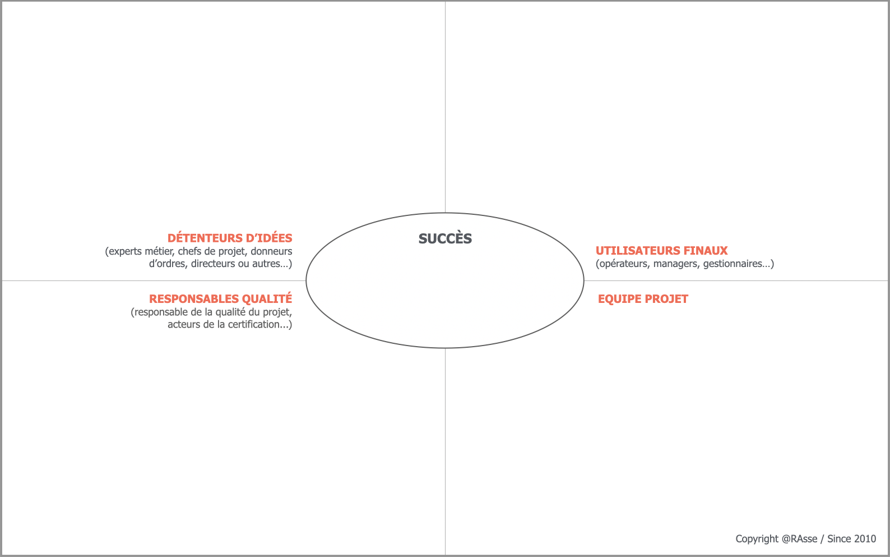

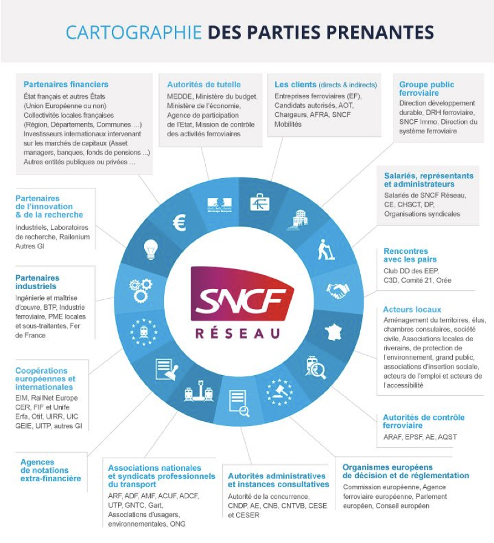

Exemple de la cartographie de la SCNF

2. Les attentes et les contributions

Permettre à tous les participants de s'exprimer, d'échanger sur leurs attentes et leurs contributions durant le projet le tout en s'exprimant

librement\*.

Objectifs : Comprendre les attentes des parties prenantes

Durée : 30 minutes

Besoins : 2 paperboards, Post-its de 2 couleurs différentes

3. Le Speedboat

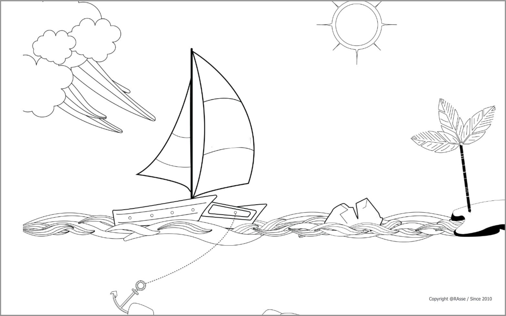

Permet d'identifier les enjeux stratégiques potentiellement divergents entre différentes personnes, services. Il clarifie les objectifs d'un projet (l'île), les problèmes auxquels les parties prenantes doivent faire face (les ancres), et d'identifier des leviers pour faire de ce dernier un succès (le vent).

Objectifs : Clarifier le périmètre projet

Durée : 30 minutes

Besoins : 2 Post-its de 3 couleurs différentes, Feuilles grand format

4. L'article de presse dans 3 ans

Cette technique permet à l'équipe de mettre en commun la vision qu'ils ont des forces du projet et de se projeter dans l'avenir sur l'articulation du projet.

Objectifs : Clarifier le périmètre projet

Durée : 30 minutes

Besoins : Feuilles grand format, Template

Exemple d'article de presse : https://docs.google.com/document/d/143db4ICEtfgJZAPp26TSJgmM0bqLiVt8wTQ4FlOvjng/edit#heading=h.pvx89d3z8vme

L'audit
Vous pouvez être amené-es, au cours d'une mission ou d'un projet, d'auditer un outil existant. Pour cela, plusieurs méthodes existent:

1. L'audit via l'analyse heuristique
   Une évaluation heuristique typique révèle entre 30 et 50 % des problèmes d'utilisabilité.

L'évaluation heuristique a pour objectif de détecter les problèmes d'utilisabilité et de design d'une interface.

2 manières de la traiter, Nielsen & Bastien/Scapin !

Exemple de déroulé : https://www.usabilis.com/heuristiques-evaluation-ux-mode-discount/

2. Diagramme en radar
   Rassemblez les fiches d'évaluation et décortiquer les données. Michael Hawley conseille d'utiliser un diagramme en radar aussi appelé en toile d'araignée. En plus de vous servir de repères visuels, ce type de graphiques offre la possibilité de superposer les éléments, ce qui facilite leur comparaison.

C'est une synthèse des éléments récoltés, notamment au cours de l'audit.

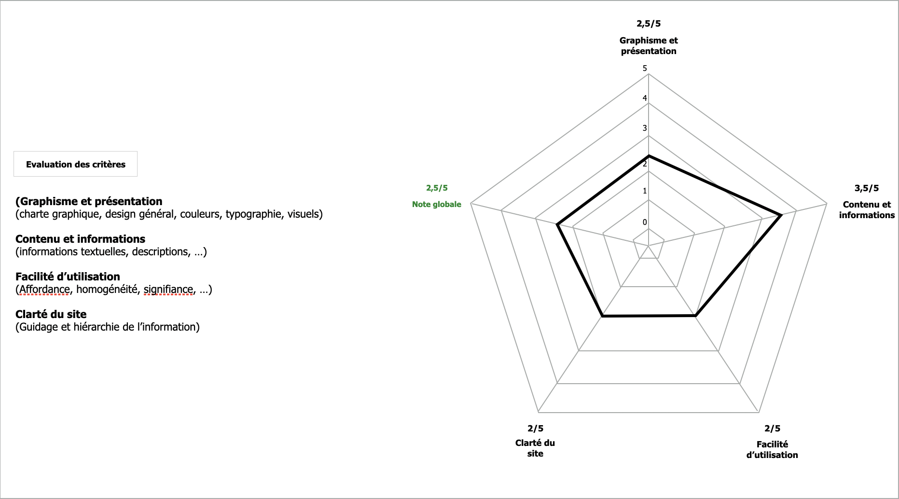

La recherche secondaire
La recherche secondaire, c'est l'ensemble des données déjà disponibles.

Lorsque que vous allez chercher des ressources sur internet, à travers des études déjà existantes, il est important de vérifier la véracité des sources.

Pour vérifier la fiabilité des sources, il faut :

Presse professionnelle ou grand public (privilégier pour veille économique, concurrentielle et technologique)

Organismes professionnels : syndicats et fédérations

Instituts nationaux (ex : INSEE, INS)

Sociétés d'études ou de sondages (ex : Eurostaf)

Où pouvez-vous aller pour aller chercher de la donnée ?

L'études existantes

Etat de l'art (benchmark concurrentiel et connexe)

Social listening (parfois appelée recherche tertiaire): réseaux sociaux.

Voici une liste non exhaustive pour aller chercher la donnée:

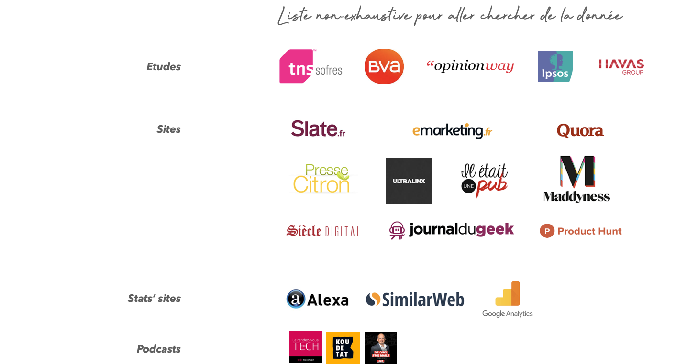

2.4 L'observation
La recherche primaire
L'Observation des utilisateurs est une méthode de terrain, elle permet de recueillir en contexte naturel d'usage des données directes sur les attitudes et comportements des usagers.

Cette méthode vise à mieux connaître les utilisateurs, objectif au cœur de la conception centrée sur l'utilisateur.

Dans les éléments qui suivent, vous allez découvrir un grand nombre d'ateliers. Encore une fois, a vous de choisir, en fonction du projet et du client, lesquels sont les plus intéressants à mettre en place.

1. Le sondage / questionnaire quantitatif

Si, dans les recherches secondaires, il manque des informations, vous pouvez mettre en place votre propre étude quantitative. Une enquête se compose d'une série de questions standardisées, elle est souvent conduite en ligne.

Objectifs : Exploration

Durée : 10aine de minutes + temps d'analyse

Besoins : Min. 50 réponses demandés, entre 15 et 25 questions environ et maximum de 3 questions ouvertes

Outils :

2. L'interview

L'interview exploratoire permet au chercheur d'avoir une idée rapide du parcours qui va être décrit, d'identifier les points de douleurs et les motivations de l'utilisateur.

On peut l'utiliser dans le cadre de projet afin d'interroger les parties prenantes du projet (métier, clients ou prospects).

Il faut vraiment les faire sous forme de discussion afin de mettre à l'aise le sujet.

Objectifs : Définition, exploration

Durée : Environ 1 heure

Besoins : Min. 5 personnes

Exemple de guide d'entretien (ce qui permet de cadrer l'interview) : https://docs.google.com/spreadsheets/d/1kVdZmXR_GuoBbFlXWXGs4jNzOBIultdkCjg23Squ-po/edit#gid=0

3. Focus group ou solo focus

Un entretien en groupe avec des participants bien choisis guidés par un facilitateur expérimenté pour identifier des enseignements sur des thèmes, motifs ou tendances.

Le groupe permet de faire émerger des observations complémentaires à l'interview.

Objectifs : Définition, exploration

Durée : 3 heures maximum

Besoins : Min. 5 personnes

4. Lettre d'amour er de rupture

Le participant écrit à la main une lettre d'amour ou rupture pour le service ou produit.

Cela nous aide à comprendre ce que la personne attend, souhaite ou ne veut pas.

Objectifs : Définition, exploration

Durée : 15 minutes par lettre + temps d'analyse

Besoins : 1 papier, 1 stylo

5. Le journal intime

Le chercheur demande aux participants de tenir un journal intime pendant un temps défini (au minimum une semaine). L'étude peut être très libre "Raconte moi ta journée..." ou structurée autour de questions spécifiques sur des tâches/activités particulières.

Une étude de journal intime permet de collecter des données à distance.

Objectifs : Définition, exploration

Durée : Préparation, suivi, analyse

Besoins : 1 papier, 1 stylo

Un exemple de journal intime : https://drive.google.com/file/d/1xtj3TvmSp8K4gbFJmPVkhnyCaFOBceLc/view

6. Le shadowing

Un type d'observation moins invisible qui permet au chercheur d'apprendre beaucoup sur les activités et motifs décisionnels en suivant le participant pendant ses activités quotidiennes.

Le chercheur peut poser quelques questions après l'observation mais évite d'interrompre l'activité du participant.

Objectifs : Définition, exploration

Durée : ½ journée

Besoins : 1 à 2 personnes

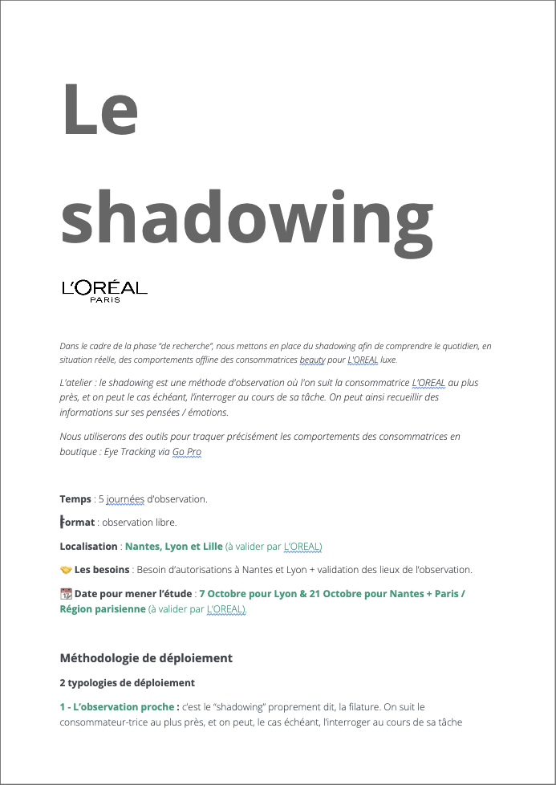

7. Le fly on the wall

Le chercheur observe les utilisateurs sur le terrain, discrètement et sans participer ou interférer avec les personnes ou comportements observés.

La discrétion permet au chercheur d'observer l'expérience réelle de sa cible.

Objectifs : Définition, exploration

Durée : En fonction des besoins

Besoins : 1 à 2 personnes

3. La Définition

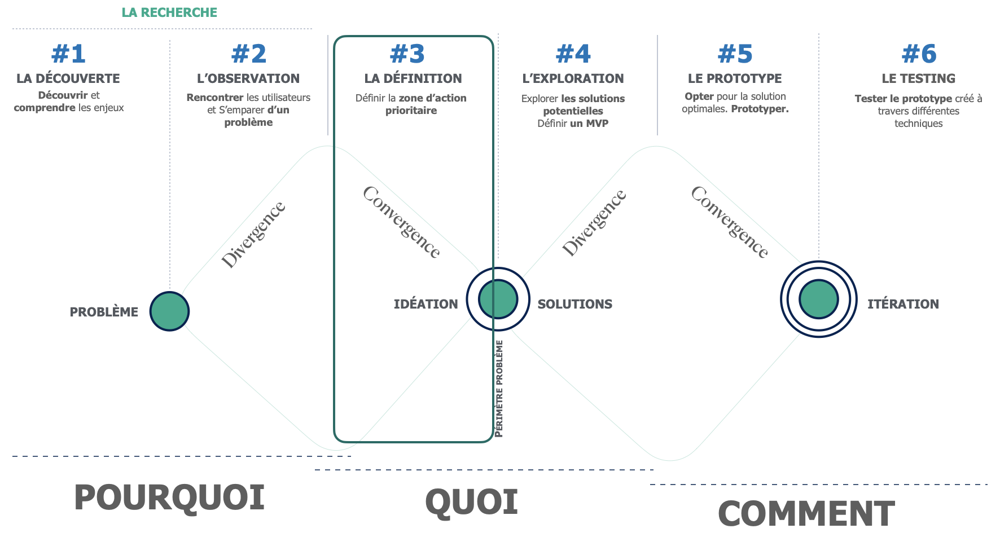

L'objectif de cette étape :

Synthétiser les informations recueillies dans les premières étapes.

Sélectionner les besoins essentiels.

Définir le bon problème.

3.1 L'empathy map
L'empathy Map est une synthèse visuelle des propos, pensées, actions et ressentis d'un utilisateur d'un produit.

Il est important de passer par cette étape pour organiser et trier les données récoltées.

Les objectifs :

Rassembler toutes les connaissances disponibles au sujet de l'utilisateur (ou du client). L'équipe multidisciplinaire partage ainsi une vision commune des besoins utilisateurs afin d'y répondre.

Définir la cible à cartographier et les objectifs de la séance collaborative.

Rassembler les recherches préalables (études ethnographiques, entretiens, etc.)

Interpréter de manière individuelle les informations, sous forme de post-it collés sur la carte.

Les lire ensemble pour les regrouper.

En discuter oralement. Peaufiner le résultat obtenu et en déduire les décisions à prendre en priorité. Elles peuvent être résumées dans un espace libre de la carte..

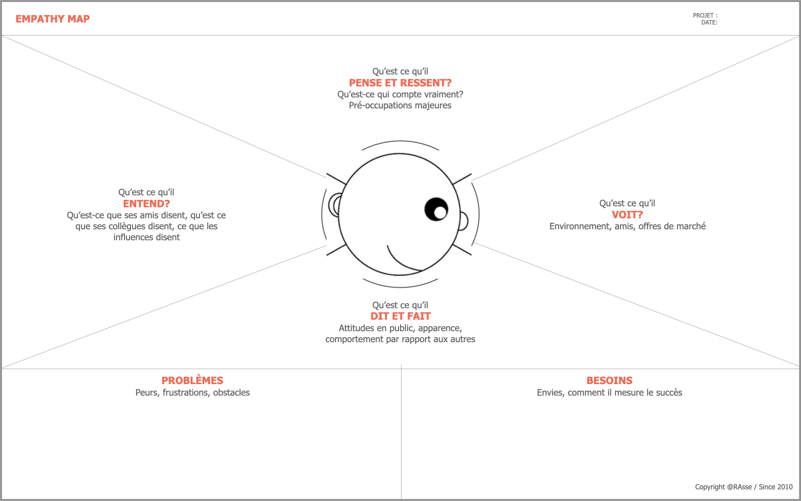

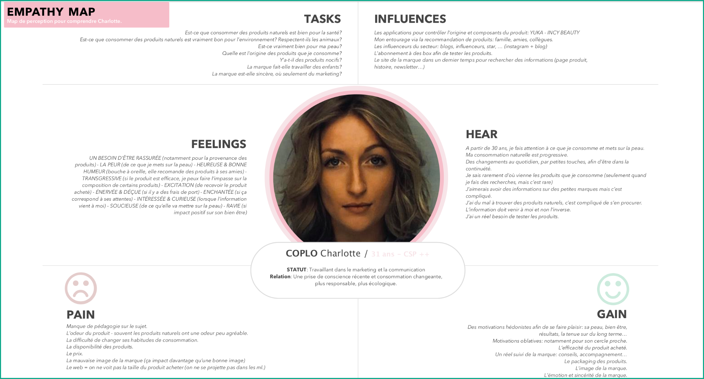

3.2 Les personae
Les personae sont des archétypes d'utilisateurs.
Ils sont créés à partir de données réelles recueillies pendant la phase d'exploration.

Les personas sont des personnages fictifs, construits à partir de données réelles en vue de modéliser les utilisateurs cibles.

3 dimensions sont pris en compte pour la création d'un personae :

Identité du personas : son prénom et nom, sa photographie, son descriptif de sa vie, sa devise et sa classe sociale

Comportements et attitudes : les besoins, les attentes, les compétences technologiques, les craintes et les croyances.

Contexte d'usage : Le contexte, la fréquence, son environnement, la perception du produit.

Types de personae:

1 - Personas Primaire

Représente l'utilisateur principal du futur produit / service.

Ses besoins et objectifs seront entièrement satisfaits.

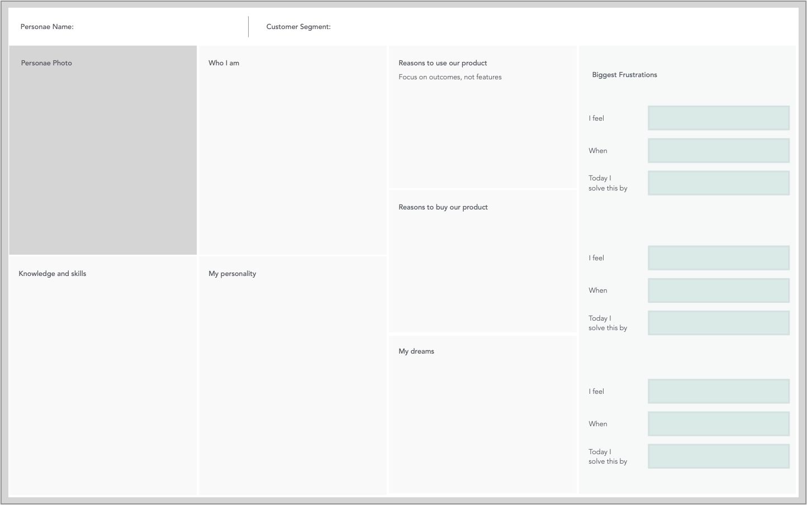

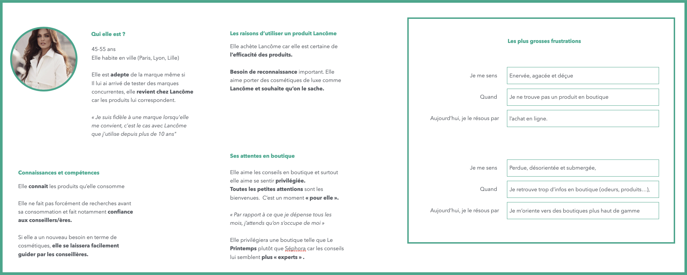

2 - Personas Secondaire

Représente l'utilisateur secondaire du futur produit / service.

Ses besoins et objectifs seront entièrement satisfaits dans une second temps.

3 - Personas Exclu ou Négatif

Représente l'utilisateur qui n'est pas cible de votre système.

Il permet de garder à l'esprit pour qui le produit ne doit pas être conçu.

4 - Personas Achteur

Celui qui achètera le produit mais sans en être l'utilisateur.

Ses besoins en tant qu'acheteur peuvent être pris en compte tant qu'ils n'entrent pas en conflit avec ceux du personae prioritaire.

3.3 L'experience map
Une expérience map est une visualisation de toute une expérience de bout en bout qu'une personne "générique" traverse pour atteindre un objectif.

Elle est utilisée pour comprendre un comportement humain général.

Le template ci-après vous permet de créer votre expérience map:

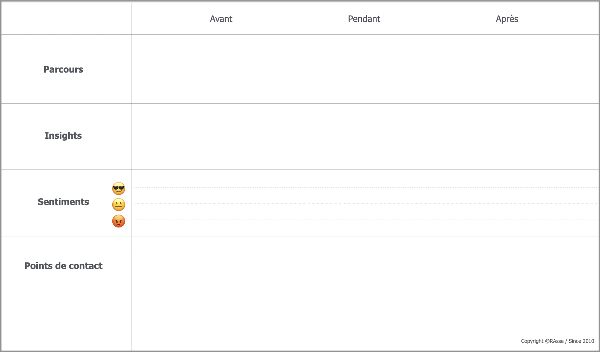

Un exemple d'expérience map ci-après :

https://www.figma.com/file/jj01EzaScfzBUy8nrsBTyO/Luxtop_Map?node-id=0:1

3.4 La customer journey map
La Customer Journey Map est la cartographie du parcours client lors de l'achat d'un produit ou service.

Centré sur l'interaction d'un utilisateur particulier avec un produit ou un service. L'entreprise a ainsi une vision globale de l'expérience client avec: les sentiments, les interactions, les canaux, et les obstacles.

Un exemple de customer journey map :

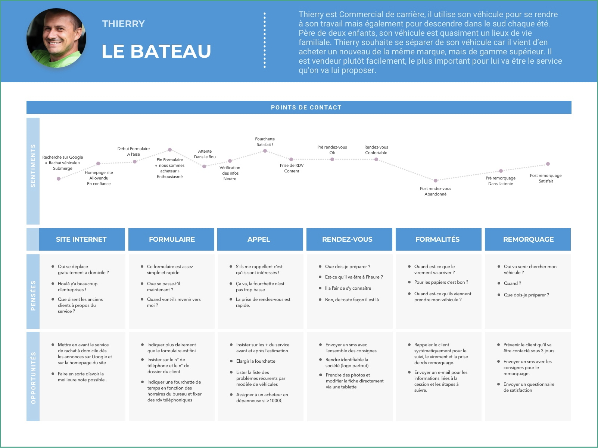

3.5 Faisons la différence
Il est important de faire la différence entre l'Expérience Map et la Customer Journey Map.

La Experience Map : Les vacances au Nicaragua

La Customer Journey Map : L'achat des billets en ligne

La Experience Map : Picnic au bois de Vincennes

La Customer Journey Map : Les courses à Franprix

La Experience Map : Soirée avec des amis

La Customer Journey Map : Post de stories sur instagram

3.6 Le service Blueprint
Cet outil, sous forme de plan, décrit la nature et les caractéristiques des interactions entre les clients et l'entreprise. Grâce à cette cartographie à la fois détaillée et globale, il devient facile de démontrer à chaque département, à quel moment et de quelle manière, son service a un impact sur l'expérience client.

Ci-après, les différentes étapes du Blueprint :

Identifier le service ou produit

Évidences physiques à chaque étape d'interaction entre consommateur et entreprise : évidences tangibles auxquelles les consommateurs sont exposés: site internet, application, e-mailing.

Définir les actions des utilisateurs : décrire les actions en imaginant la meilleure expérience possible.

Les points de contact frontstage : les actions visibles de l'employer (interface vendeur, SI interne...)

Identifier les actions des employés backstage : L'ensemble des tâches invisibles de l'employé.

Lister les processus de soutien : Il s'agit des activités internes à l'entreprise nécessaires pour offrir la meilleure expérience au client sur les différents points de contact.

Un exemple de Service Blueprint :

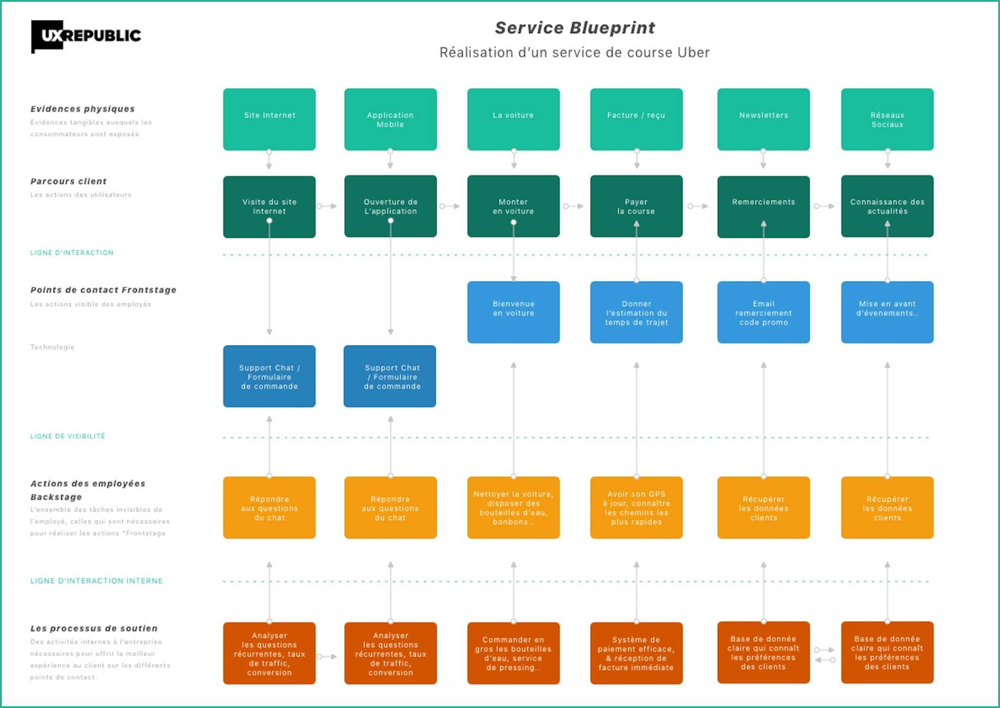

En synthèse, voici un schéma qui récapitule les différentes méthodes :

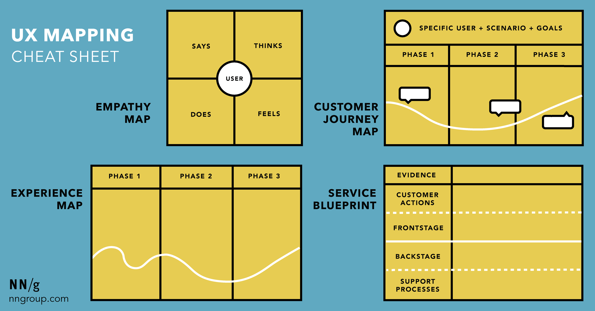

4. L'exploration

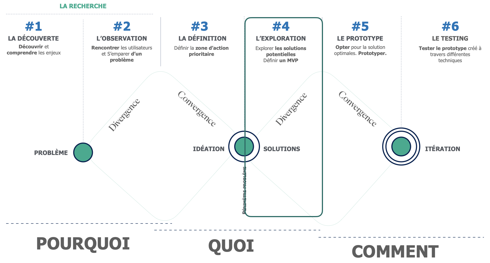

L'objectif de cette étape :

Apporter un maximum d'idées au problème soulevé : produire des idées en quantité.

Mettre au cœur de l'idéation les éléments observés et analysés.

Associer les idées à une expérience globale.

Différencier les idées de l'existant.

4.1 La reformulation du problème
Il est important de reformuler le problème observé dans les premières étapes d'analyse.

Le contexte : quand le problème survient ?

Les utilisateurs / clients : qui endure le problème ?

Le problème : L'origine du problème

L'impact émotionnel : comment se sent-on avec ce problème ?

Les alternatives : Comment les utilisateurs / clients répondent à ce problème actuellement ?

Les inconvénients des alternatives : quels sont les inconvénients des alternatives actuelles ?

4.2 Le brainstorming
Une fois le problème cadré, nous entamons l'étape appelée : brainstorming.

Le brainstorming permet de trouver des solutions au problème soulevé à travers différents ateliers, qui seront détaillés par la suite.

Depuis le COVID, il est possible que vous soyez amené-es à réaliser des ateliers à distance. Voici quelques outils pour ce faire : Miro - Mural - FIgma - XD

Les différentes techniques de brainstorming (liste non exhaustive):

Le brainstorming négatif

Il s'agit d'un brainstorming sur tous les aspects négatifs du concept, sur tous ses défauts, ses points faible. On recherche la version négative du problème : comment être certain d'arriver à un échec à ce sujet, comment faire pour que cela ne marche pas.

Ensuite, il faut reprendre un à un les idées négatives pour

positiver\*.

La question inversée

Cet outil s'utilise pour sortir du contenu et imaginer des idées plus folles, des solutions plus créatives.

Ce problème extravagant devrait théoriquement conduire à des réponses démesurées ou originales.

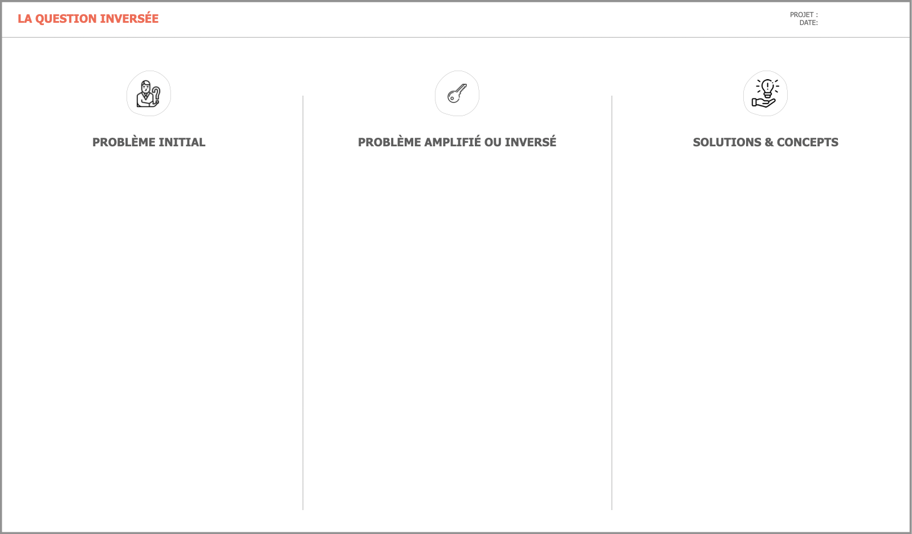

How might we ("comment pourrait-on" ?)

Consiste à verbaliser des hypothèses à partir des pain points identifiés à l'aide de la formule "comment pourrait-on...?", et les transformer en opportunités.

Cette tournure / formulation permet également de se mettre dans un bon mindset: Solution-oriented (How), optimistic (Might), and collaborative (We).

Un exemple de cet atelier ci après :

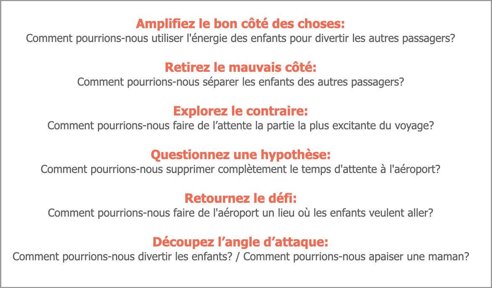

Le lotus blossom

On part d'une problématique centrale à partir de laquelle on va générer

un maximum de nouvelles idées.\*

_Un exemple de cet atelier ci après :_

    
Un miro

Un atelier de brainstorming sous forme d'un miro avec des étapes détaillées et définies.

Un exemple de cet atelier ci après : https://miro.com/app/board/o9J_lmYtAGk=/

4.3 Le testing des idées
Sous la sortie des ateliers d'idéation, un grand nombre d'idées naît. Il est temps de les tester afin de consolider leur intérêt. Quelques exemples d'ateliers pour structurer ces tests:

La question sans réponse

Vous êtes amené à pitcher devant un panel d'utilisateur cible recruté.

A la suite de celui-ci, le panel pose des questions, évoque les zones d'ombre de votre projet. Vous ne pouvez pas y répondre (le jour où l'user utilise/consomme votre produit, vous n'êtes pas là pour l'aider)

Ça vous permet d'être en confrontation directe avec de potentielles questions.

Objectifs : Exploration, tester les idées

Durée : 30 minutes + temps d'analyse

Besoins : Min. 8 testeurs

Les chapeaux de Bono

La méthode des 6 chapeaux (application de la maïeutique de Socrate) extraite de l'ouvrage Six chapeaux est une méthode de management personnel ou de groupe, développée par Edward de Bono, permettant de traiter les problèmes dont une des conséquences est d'éviter la censure des idées nouvelles, dérangeantes, inhabituelles.

Objectifs : Exploration, tester les idées

Durée : 60 minutes + temps d'analyse

Besoins : Min. 5 groupes testeurs ou 5 personnes

Ci après les rôles et détails des 6 chapeaux :

Chapeau blanc : Le penseur énonce des faites purement et simplement. Il donne au groupe des informations objectifs. Il représente la neutralité et répond à la question suivante : quels sont les faits ?

Chapeau vert : Le penseur est à la recherche de solutions créatives, en dehors des sentiers battus, répondant au chapeau noir. Il représente la créativité sans limite. Quelles sont les solutions possibles, y compris les plus farfelues.

Chapeau rouge : Le penseur apporte des informations teintées d'émotion, de sentiments, d'intuitions. Il n'a pas à se justifier (à l'inverse des autres chapeaux). Il représente la passion et répond à : que ressentez-vous ?

Chapeau noir : Le penseur s'indigne auprès de autres chapeaux en insistant sur les dangers et les risques, la prudence. Sa réflexion, toujours logique, aide à repérer les éventuels freins et obstacles. Il est l'avocat du diable.

Chapeau bleu : Le penseur est l'animateur de la réunion, le meneur de jeu. Il représente l'organisation et la canalisation des idées. Il est très important car il maintient la discipline et veille à ce que les participants utilisent leurs chapeaux. Quelle est la solution à retenir ? Comment organiser sa mise en œuvre ? ...

Chapeau jaune : Le penseur se confie sur ses rêves et ses espoirs. A l'instar du chapeau noir, ses commentaires sont constructifs, positifs, et tentent de rendre les idées des autres membres concrètes. Il représente l'optimisme et répond aux questions suivantes : « pour chacune de ces solutions, que mettre en œuvre ?

5. Le Prototype / UI

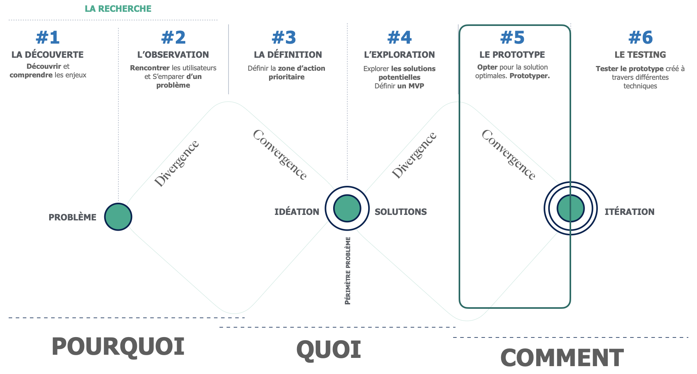

_" Si j'avais demandé aux gens ce qu'ils voulaient, ils m'auraient répondu des chevaux rapides. "_ Henry Ford.

L'objectif de cette phase là est de :

De créer l'user interface : éléments visuels de votre expérience.

La mise en place visuelle de l'ensemble de l'UX.

Il va être important de trouver sa personnalité et la mettre en image afin de vous différencier, créativement, sur un marché concurrentiel.

5.1 Le tri de cartes
Le tri par cartes est une méthode permettant d'organiser les pages et les sections d'un site Web ou d'un logiciel. L'utilisateur regroupe les cartes qui se ressemblent.

Il organise ainsi le contenu du site selon son point de vue et retrouve plus facilement les informations qu'il cherche.

Objectifs : Préparation + Analyse

Durée : 60 minutes + temps d'analyse

Besoins : Architecture de l'information

Un exemple de cet atelier ci après :

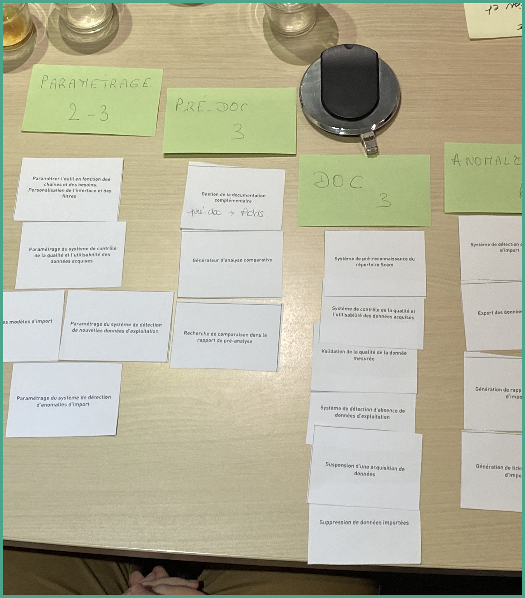

5.2 Les arborescences
Une arborescence va permettre de :

_Ranger vos fonctionnalités:_ pour structurer vos fonctionnalités et contenus, réduire le temps de recherche, faciliter l'apprentissage, pouvoir faire évoluer le contenu sans repenser l'interface.

_Comment la créer ? :_ Entrez en contact avec les utilisateurs finaux, Organiser le contenu de façon logique toujours en pensant à l'utilisateur.

Il existe plusieurs types d'arborescence:

L'arborescence hiérarchique : Organisation hiérarchique et logique des pages et des fonctionnalités

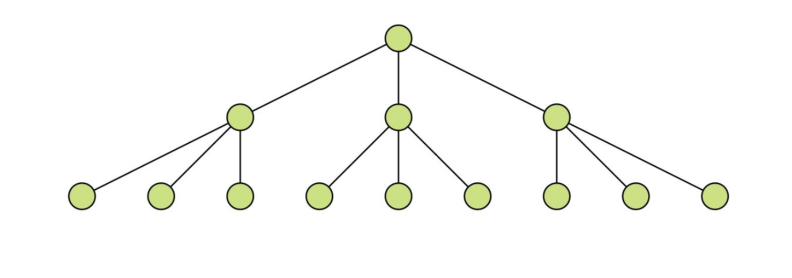

Arborescence séquentielle : C'est une arborescence étape par étape (exemple un tunnel d'achat d'un site e-commerce)

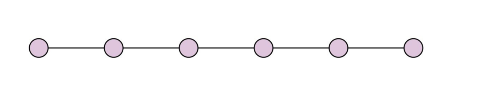

Vous avez plusieurs outils pour réaliser votre arborescence : Webflow - Miro - Mural - Figma

5.3 Les wireframes
Le wireframe ou maquette fonctionnelle est un schéma utilisé lors de la conception d'une interface utilisateur pour définir les zones et composants qu'elle doit contenir.

C'est à partir des wireframes que vous allez définir votre UI.

Des exemples ci après :

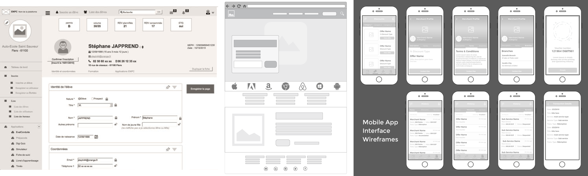

5.4 Le six to one
Cet atelier est une étape de transition entre l'idéation et la conception.

Objectifs : Définition des Wireframes

Durée : 20 minutes

Besoins : Min. 5 - Crayon papier - Feuilles A4 et A3

Un atelier de co-création en plusieurs phases:

Phase 1: 6 interfaces en 6 minutes de la page principale de votre solution

Phase 2: 2 minutes par personne pour présenter leur travail à l'ensemble de l'équipe

Phase 3: 6 minutes pour rassembler les meilleures idées de la première phase et celles de l'équipe pour fournir une seule interface\*

5.5 Trouver l'inspiration
Une fois tout le cadrage de votre solution fait, il est temps de passer à la création.

Voici quelques sites afin de trouver l'inspiration :

https://onepagelove.com/

https://saaspages.xyz/

https://www.lapa.ninja/

https://dribbble.com/

https://www.pinterest.fr/

5.6 Atomic Design
Vous pouvez maintenant créer.

L'atomic design permet de structurer votre UI (User Interface).

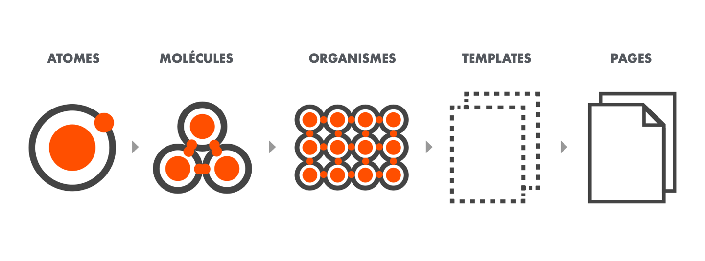

Inspirée de la chimie, l'Atomic Design est une approche de conception permettant de réduire un site à ses plus petits composants afin de créer des Design Systems (évoqué au chapitre suivant) et d'optimiser la création d'interfaces responsives (adaptées aux différents écrans).

Pendant des années, lorsque vous créez une interface, vous devez prendre en compte: Parcours Utilisateur > Wireframes > Maquettes > Développement

Pendant longtemps, nous avons donc dupliqué les maquettes afin de créer des interfaces !

Dupliquer des maquettes amène de nombreux problème pendant le développement :

Duplication de code (à éviter)

Pas adapté aux différents devices (et donc responsive pas optimisé)

Éloigné des problématiques produit

Il est donc logique que nous ayons changé notre fusil d'épaule maintenant, il est préférable de découper l'étape des maquettes !

Maquettes = Styleguide - Composants - Page

Cela permet d'optimiser la création d'interfaces responsives et fonctionnelles.

Et de ce découpage est né l'atomic design:

Un atome

C'est un élément qui, seul, n'a pas de but fonctionnel. Il est « irréductible », ne peut pas être divisé et il compose la base de tout élément graphique de l'interface.

Ex : un logo, une couleur, un style typographique, un bloc image, une icône, un champ de saisie...

Les molécules

Ce sont des collections d'atomes qui forment des composants d'interface simples.

Les molécules doivent être pensées « responsive ». Il faut définir si elles sont fixes ou fluides, et sur quelles tailles de device elles apparaitront ou non.

Les organismes

Ce sont des combinaisons plus complexes de différentes molécules ou de molécules + atomes qui forment une partie de l'interface finale.

Ex : champ de recherche + nav + logo = header

Les templates

Ils sont là pour vérifier l'organisation et la hiérarchie des divers organismes créés et de tester leurs comportements "responsive".

Les templates sont déjà développés en code. Ils peuvent être dépourvus de contenus réels.

Les pages

Ce sont des templates qui ont évolués vers ce que sera l'écran dans sa version finale. Ils sont pensés non pas en maquette mais en système.

Utiliser la méthodologie d'atomic design, cela permet :

D'accélérer le travail des designers

Faciliter les échanges avec les développeurs

Eliminer les incohérences de design

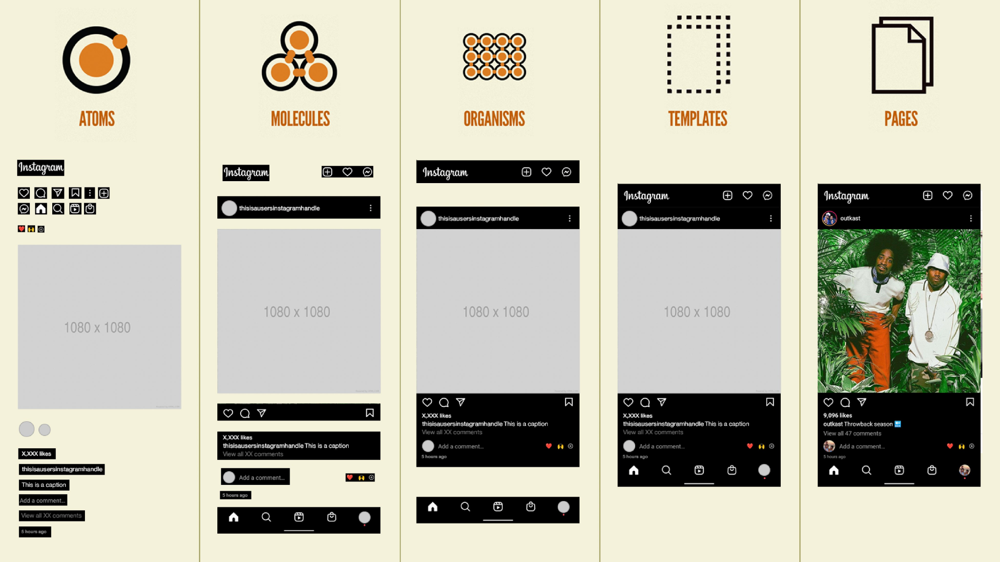

5.7 Le design system
Le Design System traduit l'identité de marque de l'entreprise. On y trouve des éléments graphiques, la typographie, des visuels, le branding. Qu'il s'agisse d'une application métier ou encore d'un site e-commerce, le Design System peut être utilisé en tant que bibliothèque de référence et de guide.

C'est une boite à outils : une bibliothèque de référence et un guide pour designer et l'ensemble de l'équipe.

A faire figurer : composants UI et patterns, principes visuels autour de la typographie, palettes des couleurs et règles associées, iconographie et imagerie, principes de communication de la marque (langage, ton...), éléments réutilisables de l'interface utilisateur, grilles pour structurer les éléments, espaces, etc. (Grid layout)

Exemples d'outils pour réaliser un design system : Zeroheight, Invision, Figma

Un exemple de Design System ci après :

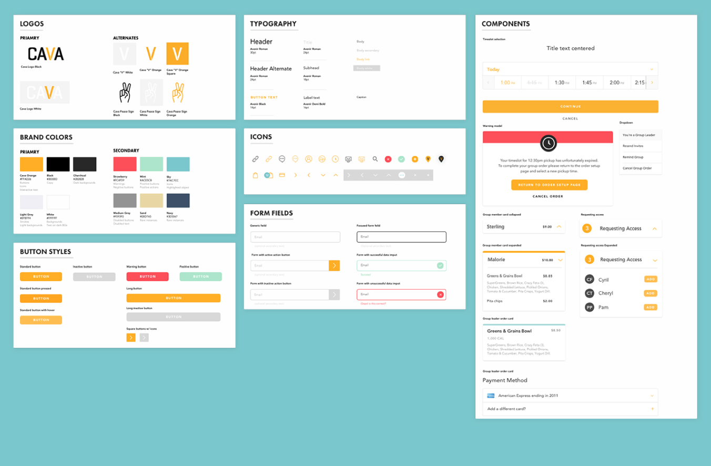

6. Les Tests

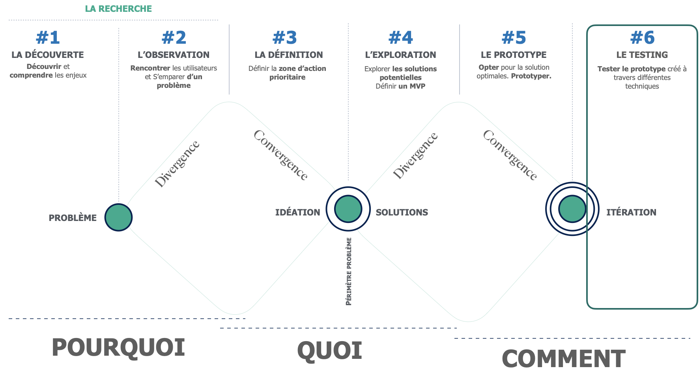

L'objectif de cette phase là est de :

Tester les interfaces et les expériences utilisateurs.

Tirer les enseignements afin d'avoir l'itération la plus performante.

Valider la création et déclencher le développement.

6.1 Le protocole de test
Afin de cadrer l'étape des tests, il faut réaliser un document, appelé protocole de test, permettant de définir les grandes lignes des tests réalisés.

Voici les informations pratiques à faire figurer sur le protocole de test:

Quand a lieu le/les test(s) ?

Définir une/des date(s)

Il faut compter (et donc recruter) 5 tests / jour

Réaliser un pré-test pour vérifier le déroulé

Ou aura lieu le/les test(s) ?

En présentiel ? A distance ?

Faudra-t-il salle neutre et équipée ?

Il faut penser au matériel d'enregistrement

Penser à un logiciel de visio ?

Penser à une invitation numérique

Comment réaliser son recrutement pour les tests ?

Vous devez vous baser sur vos personae afin d'avoir des tests les plus concluants possibles.

=> Où les trouver ?

Via les réseaux sociaux

L'entourage

Votre client peut être amené à vous fournir des profils

Via des organisations, des agences ou entreprises (voire ci après):

https://www.forumetudes.com/

https://www.updatefrance.fr/

http://www.ava-marketing.com/

https://www.testingtime.com/fr/

http://profils-conso.com/

https://www.avenirfocus.com/

Lorsque vous passez par des organisations, des agences ou entreprises, il est important de fournir les informations ci-après :

Type de profil à recruter

Nombre de personnes

Date du test

Lieu avec adresse

Éviter de mentionner le dédommagement (sinon il y en a qui viennent que pour ça et c'est moins riche)

Eviter de parler en détails de quoi parle la séance (sinon les personnes vont se renseigner et avoir des retours biaisés)

Expliquer en quelques mots le sujet de l'étude

Expliquer le déroulé de la séance

Dire en amont que la séance sera enregistrée de façon audio/vidéo : il faut le dire en avance pour respecter la charte de déontologie et ne pas avoir de personnes prises au dépourvu (un document sera à faire signer)

Pendant votre test, il y a 5 pièges à éviter :

1 - Orienter les questions

2 - Trop interrompre l'user

3 - Laisser transparaître son avis

4 - Donner des informations et trop aider l'user (laissez-le se tromper)

5 - Vouloir suivre à tout prix les parcours dans l'ordre (laissez l'user libre !)

6.2 Les questions à se poser post test
Voici des exemples de questionnaire post-test.

Questionnaire N°1

Quelle est votre première réaction ?

Qu'est-ce qui vous passe par la tête quand vous regardez votre site web ?

Est-ce qu'il correspond à vos attentes ?

Quelle est la première chose que vous feriez ?

Que pouvez-vous faire sur cette page ?

À quoi ça sert ?

Pourquoi quelqu'un utiliserait-il cela ?

Comment pensez-vous que cela va vous aider ?

Avez-vous des questions ?

Questionnaire N°2

J'utilise ce service fréquemment

Je trouve ce service inutilement complexe

Je trouve ce service facile à utiliser

J'ai régulièrement besoin de l'aide d'un support technique pour être capable d'utiliser ce service

Je trouve que mes différentes fonction de ce service ont été bien intégrées

Je trouve qu'il y a trop d'incohérences dans ce service

J'imagine que la plupart des gens apprendraient très rapidement à utiliser ce service

Je trouve ce service très contraignant à utiliser

Je me sens très en confiance en utilisant ce service

J'ai eu besoin d'apprendre beaucoup de choses avant de pouvoir utiliser ce service efficacement

6.3 Le testing des prototypes
Ci-après des exemples de test :

EYE TRACKING

Observer ce que les utilisateurs font et pas uniquement ce qu'ils disent.

Un test utilisateur peut avoir beaucoup de formats différents.

L'eye tracking consiste à suivre et tracer le regard d'un utilisateur sur une interface.

Objectifs : Exploration, Conceptualisation, Évaluation

Durée : 45 à 60 minutes par participants

Besoins : Matériel adapté

LE TEST SCRIPTÉ

Le testing scripté, dans un lab, avec un miroir sans tain pour avoir la possibilité d'observer le test sans perturbation.

Objectifs : Exploration, Conceptualisation, Évaluation

Durée : 45 à 60 minutes par participants

Besoins : Un animateur Et un observateur

LE TEST À DISTANCE

Envoi d'un prototype clicable à l'utilisateur (via Figma par exemple). L'utilisateur a plusieurs missions à accomplir sur l'interface. Le logiciel enregistre toutes les données et les traduit sous forme de statistiques.

Objectifs : Exploration, Conceptualisation, Évaluation

Durée : 5 à 15 minutes

Besoins : Logiciel : Maze ou Hotjar

6.4 L'analyse des tests
Une fois toutes les données récoltées, vous êtes amenés à rédiger un reporting de test.

Cela va permettre de trier les données (des verbatims, les usages, les ressentis, les difficultés rencontrés...), de mener des observations (compter le nombre de personnes qui ont (ou pas) réussi à effectuer une tâche, regarder les éléments qui ont été vu/cliqués en premier, ...)

Comment rédige-t-on un protocole de test ?

1 : Rappel des objectifs et hypothèses : description du protocole, nombre d'usagers et profils, le lieu, les dates et le déroulement du test.

2 : Synthèse des enseignements majeurs obtenus : résultats positifs, axes d'améliorations, verbatims représentatifs du test, ...

3 : Résultats détaillés : description du problème, impact sur l'user (criticité)

4 : Recommandation(s) : synthèse des recommandations

Conclusion
Vous avez désormais les outils nécessaires pour façonner des expériences numériques significatives et intuitives.

En comprenant les besoins des utilisateurs, en concevant des interfaces centrées sur l'utilisateur et en itérant sur vos créations, vous êtes prêts à relever les défis du design dans le monde numérique en constante évolution. Continuez à explorer, à expérimenter et à perfectionner vos compétences pour créer des produits qui font une réelle différence dans la vie des utilisateurs.

Souvenez-vous toujours de mettre l'utilisateur au cœur de votre processus de conception, car c'est là que réside le véritable pouvoir du design UX/UI.
